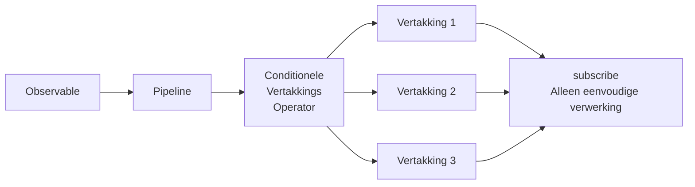
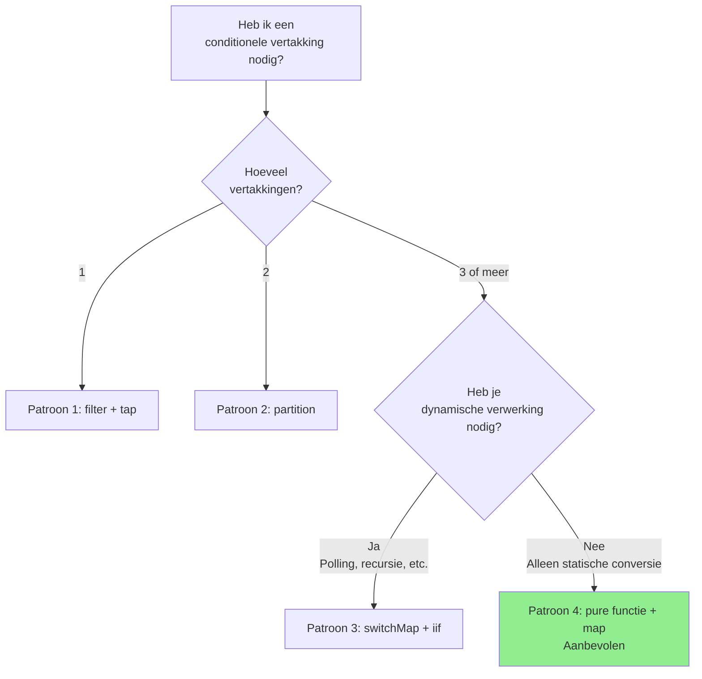

# Conditionele vertakkingspatronen binnen subscribe

Een van de problemen waar ontwikkelaars die RxJS beginnen te gebruiken vaak tegenaan lopen, is complexe conditionele vertakking binnen de `subscribe()` callback. Dit artikel legt uit waarom dit een probleem is en hoe het moet worden verholpen, samen met praktische patronen.

> [!NOTE] Publieke API's gebruikt in dit artikel
> Dit artikel gebruikt een gratis REST API genaamd [JSONPlaceholder](https://jsonplaceholder.typicode.com/). De code werkt daadwerkelijk, dus u kunt deze kopiëren en plakken en uitproberen in uw browser.
>
> De conversiepatronen naar aangepaste API-responstypen (inclusief `status`, `errorCode`, enz.) worden ook getoond om u te helpen externe API-responsen om te zetten naar interne typen in een echt project.

## Probleem: Complexe conditionele vertakking binnen subscribe

Conditionele vertakking binnen subscribe vermindert de leesbaarheid van de code en maakt testen moeilijk. Laten we het volgende voorbeeld bekijken.

### Voorbereiding: Hulpfunctie om JSONPlaceholder API in te pakken

Definieer eerst een hulpfunctie die de JSONPlaceholder API-respons omzet naar een aangepast type. Dit patroon kan ook worden gebruikt om een externe API om te zetten naar een intern type in een echt project.

```typescript
import { Observable, from, of, map, catchError } from 'rxjs';

/**
 * JSONPlaceholder API Response Type
 */
interface Post {
  userId: number;
  id: number;
  title: string;
  body: string;
}

/**
 * Aangepast API Response Type
 */
interface ApiResponse<T = any> {
  status: 'success' | 'error' | 'pending';
  data?: T;
  errorCode?: string;
  message?: string;
}

/**
 * Verpak JSONPlaceholder API en converteer naar aangepast API response type
 *
 * Het patroon van het converteren van externe API-responsen naar interne typen wordt vaak gebruikt in echte projecten.
 * Hierdoor kunt u de impact van API-wijzigingen lokaliseren en consistente typen binnen uw applicatie gebruiken.
 */
function fetchPost(postId: number = 1): Observable<ApiResponse<Post>> {
  return from(
    fetch(`https://jsonplaceholder.typicode.com/posts/${postId}`)
      .then(response => {
        if (!response.ok) {
          throw new Error(`HTTP error! status: ${response.status}`);
        }
        return response.json();
      })
  ).pipe(
    map((data: Post) => ({
      status: 'success' as const,
      data
    })),
    catchError(err => {
      // Converteer fouten naar aangepaste response types
      let errorCode = 'UNKNOWN_ERROR';

      if (err.message.includes('404')) {
        errorCode = 'NOT_FOUND';
      } else if (err.message.includes('500')) {
        errorCode = 'SERVER_ERROR';
      } else if (err.message.includes('Failed to fetch')) {
        errorCode = 'NETWORK_ERROR';
      }

      return of({
        status: 'error' as const,
        errorCode,
        message: err.message
      });
    })
  );
}
```

### Voorbeelden van anti-patronen

Het volgende voorbeeld gebruikt de bovenstaande hulpfunctie (`fetchPost`), maar het heeft een gecompliceerde conditionele vertakking uitgevoerd binnen `subscribe()`.

```typescript
/**
 * ❌ Voorbeeld van problematische code
 * Complexe conditionele vertakking in subscribe
 */
class BadExampleManager {
  loading = false;
  data: Post | null = null;
  errorMessage = '';
  successMessage = '';

  // Callbacks voor UI-updates (optioneel)
  onStateChange?: (state: { loading: boolean; data: Post | null; errorMessage: string; successMessage: string }) => void;

  init(): void {
    this.fetchData();
  }

  fetchData(): void {
    this.loading = true;
    this.updateUI();

    // Haal post data op van JSONPlaceholder API
    fetchPost(1).subscribe({
      next: response => {
        this.loading = false;

        // ❌ Probleem: Complexe conditionele vertakking binnen subscribe
        if (response.status === 'success') {
          if (response.data) {
            // Data validatie
            if (response.data.title && response.data.body) {
              this.data = response.data;
              this.successMessage = `Post geladen "${response.data.title}"`;
            } else {
              this.errorMessage = 'Data formaat is ongeldig';
            }
          } else {
            this.errorMessage = 'Geen data beschikbaar';
          }
        } else if (response.status === 'error') {
          if (response.errorCode === 'NOT_FOUND') {
            this.errorMessage = 'Data niet gevonden (niet-bestaand post ID)';
          } else if (response.errorCode === 'NETWORK_ERROR') {
            this.errorMessage = 'Netwerkfout. Controleer de verbinding.';
            // Opnieuw proberen
            setTimeout(() => this.fetchData(), 5000);
          } else if (response.errorCode === 'SERVER_ERROR') {
            this.errorMessage = 'Er is een serverfout opgetreden';
          } else {
            this.errorMessage = 'Er is een fout opgetreden';
          }
        } else if (response.status === 'pending') {
          this.errorMessage = 'Verwerking is bezig. Even geduld a.u.b.';
          // Polling
          setTimeout(() => this.fetchData(), 3000);
        }
        this.updateUI();
      }
    });
  }

  private updateUI(): void {
    if (this.onStateChange) {
      this.onStateChange({
        loading: this.loading,
        data: this.data,
        errorMessage: this.errorMessage,
        successMessage: this.successMessage
      });
    }
  }
}

// Gebruiksvoorbeeld (kan worden uitgevoerd in een browser console)
const badExample = new BadExampleManager();
badExample.onStateChange = (state) => {
  if (state.loading) console.log('Laden...');
  if (state.errorMessage) console.error(state.errorMessage);
  if (state.successMessage) console.log(state.successMessage);
  if (state.data) console.log('Data:', state.data);
};
badExample.init();

// Voorbeeld uitvoer:
// Laden...
// Post geladen "sunt aut facere repellat provident occaecati excepturi optio reprehenderit"
// Data: {userId: 1, id: 1, title: "...", body: "..."}
```

### Problemen met deze implementatie

> [!WARNING] Problemen veroorzaakt door conditionele vertakkingen in subscribe
> 1. **Verminderde leesbaarheid** - diepe nesting maakt het moeilijk om de verwerkingsstroom te volgen
> 2. **Moeilijk testen** - logica in subscribe is moeilijk om unit tests voor te schrijven
> 3. **Gebrek aan herbruikbaarheid** - dezelfde logica kan niet elders worden gebruikt
> 4. **Niet-declaratief** - wijkt af van de declaratieve stijl van RxJS
> 5. **Beheren van Side Effects** - meerdere statuswijzigingen zijn verspreid en moeilijk te volgen

## Samenvatting van de oplossing

Conditionele vertakkingen in subscribe worden afgehandeld in de pipeline met behulp van RxJS operators. Dit maakt de code declaratief en gemakkelijker te testen.



Dit artikel beschrijft vier patronen:

1. **Patroon 1**: vertakking door filter + tap
2. **Patroon 2**: vertakking door partition
3. **Patroon 3**: dynamische vertakking met switchMap + iif
4. **Patroon 4**: Functionalisering + transformatie door map (aanbevolen)

## Patroon 1: vertakking door filter + tap

De eenvoudigste manier is om `filter` te gebruiken om alleen de waarden door te laten die aan de voorwaarden voldoen, en `tap` te gebruiken om side effects uit te voeren.

### Voorbeeldimplementatie

Dit voorbeeld gebruikt de hierboven gedefinieerde `fetchPost()` functie om data op te halen van de JSONPlaceholder API.

```typescript
class Pattern1Manager {
  private destroy$ = new Subject<void>();

  loading = false;
  data: Post | null = null;
  errorMessage = '';

  // Callbacks voor UI-updates (optioneel)
  onStateChange?: (state: { loading: boolean; data: Post | null; errorMessage: string }) => void;

  init(): void {
    this.fetchData();
  }

  fetchData(): void {
    this.loading = true;
    this.updateUI();

    fetchPost(1).pipe(
      // ✅ Laat alleen succesvolle responsen door
      filter(response => response.status === 'success'),

      // ✅ Data validatie
      filter(response => response.data !== undefined),

      // ✅ Log uitvoer (side effects)
      tap(response => console.log('Data succesvol verkregen:', response.data)),

      // Foutafhandeling
      catchError(err => {
        console.error('Fout:', err);
        this.errorMessage = 'Data ophalen mislukt';
        this.loading = false;
        this.updateUI();
        return of(null);
      }),

      takeUntil(this.destroy$)
    ).subscribe({
      next: response => {
        this.loading = false;

        // ✅ Alleen eenvoudige toewijzing
        if (response) {
          this.data = response.data;
        }
        this.updateUI();
      }
    });
  }

  private updateUI(): void {
    if (this.onStateChange) {
      this.onStateChange({
        loading: this.loading,
        data: this.data,
        errorMessage: this.errorMessage
      });
    }
  }

  destroy(): void {
    this.destroy$.next();
    this.destroy$.complete();
  }
}

// Gebruiksvoorbeeld (kan worden uitgevoerd in een browser console)
const pattern1 = new Pattern1Manager();
pattern1.onStateChange = (state) => {
  if (state.loading) console.log('Laden...');
  if (state.errorMessage) console.error(state.errorMessage);
  if (state.data) console.log('Post data:', state.data);
};
pattern1.init();

// Voorbeeld uitvoer:
// Laden...
// Data succesvol verkregen: {userId: 1, id: 1, title: "...", body: "..."}
// Post data: {userId: 1, id: 1, title: "...", body: "..."}
```

### Voor- en nadelen

> [!TIP] Kenmerken van Patroon 1
> **Voordelen:**
> - eenvoudig en gemakkelijk te begrijpen
> - stapsgewijze filtering
> - duidelijke stap-voor-stap instructies
>
> **Nadelen:**
> - niet geschikt voor meerdere vertakkingen (moet voor elke vertakking een stream maken)
> - gefilterde waarden kunnen niet in latere stappen worden gebruikt

## Patroon 2: Vertakking door partition

Met `partition` kan een Observable in twee streams worden gesplitst op basis van een voorwaarde.

### Voorbeeldimplementatie

Dit voorbeeld gebruikt ook de `fetchPost()` functie om data op te halen van de JSONPlaceholder API.

```typescript
/**
 * Type definitie van verwerkingsresultaten
 */
interface ProcessedResult {
  type: 'success' | 'error';
  data?: Post;
  message: string;
}

class Pattern2Manager {
  private destroy$ = new Subject<void>();

  loading = false;
  result: ProcessedResult | null = null;

  // Callbacks voor UI-updates (optioneel)
  onStateChange?: (state: { loading: boolean; result: ProcessedResult | null }) => void;

  init(): void {
    this.fetchData();
  }

  fetchData(): void {
    this.loading = true;
    this.updateUI();

    const response$ = fetchPost(1).pipe(
      catchError(err => {
        console.error('HTTP Fout:', err);
        return EMPTY;
      })
    );

    // ✅ Splits op succes en fout
    const [success$, error$] = partition(
      response$,
      response => response.status === 'success'
    );

    // Verwerking van succesvolle stream
    const successStream$ = success$.pipe(
      map(response => ({
        type: 'success' as const,
        data: response.data,
        message: 'Data opgehaald'
      })),
      tap(() => console.log('Succesverwerking voltooid'))
    );

    // Verwerking van foutstream
    const errorStream$ = error$.pipe(
      map(response => ({
        type: 'error' as const,
        message: this.getErrorMessage(response.errorCode)
      })),
      tap(result => console.log('Foutverwerking voltooid:', result.message))
    );

    // ✅ Voeg samen en abonneer op twee streams
    merge(successStream$, errorStream$).pipe(
      takeUntil(this.destroy$)
    ).subscribe({
      next: result => {
        this.loading = false;
        this.result = result;

        // Extra verwerking op basis van specifieke foutcode
        if (result.type === 'error') {
          this.handleError(result);
        }
        this.updateUI();
      }
    });
  }

  private getErrorMessage(errorCode?: string): string {
    const messages: Record<string, string> = {
      'NOT_FOUND': 'Data niet gevonden (niet-bestaand post ID)',
      'NETWORK_ERROR': 'Netwerkfout. Controleer de verbinding.',
      'SERVER_ERROR': 'Er is een serverfout opgetreden'
    };

    return messages[errorCode || ''] || 'Er is een fout opgetreden';
  }

  private handleError(result: ProcessedResult): void {
    // Extra verwerking op basis van fouttype (bijv. doorsturen naar inlogscherm)
  }

  private updateUI(): void {
    if (this.onStateChange) {
      this.onStateChange({
        loading: this.loading,
        result: this.result
      });
    }
  }

  destroy(): void {
    this.destroy$.next();
    this.destroy$.complete();
  }
}

// Gebruiksvoorbeeld (kan worden uitgevoerd in een browser console)
const pattern2 = new Pattern2Manager();
pattern2.onStateChange = (state) => {
  if (state.loading) console.log('Laden...');
  if (state.result) {
    console.log(`[${state.result.type}] ${state.result.message}`);
    if (state.result.data) console.log('Post data:', state.result.data);
  }
};
pattern2.init();

// Voorbeeld uitvoer:
// Laden...
// Succesverwerking voltooid
// [success] Data opgehaald
// Post data: {userId: 1, id: 1, title: "...", body: "..."}
```

### Voor- en nadelen

> [!TIP] Kenmerken van Patroon 2
> **Voordelen:**
> - Twee vertakkingen kunnen duidelijk worden gescheiden
> - Elke stream kan onafhankelijk worden verwerkt
> - Gemakkelijk te testen
>
> **Nadelen:**
> - beperkt tot 2 vertakkingen (niet geschikt voor meer dan 3 vertakkingen)
> - moet op beide streams abonneren

## Patroon 3: dynamische vertakking met switchMap + iif

Met `iif` kun je overschakelen naar verschillende Observables afhankelijk van de voorwaarde.

### Voorbeeldimplementatie

Dit voorbeeld probeert een niet-bestaand post ID (999) en toont wat er gebeurt in geval van een fout.

```typescript
class Pattern3Manager {
  private destroy$ = new Subject<void>();

  loading = false;
  data: Post | null = null;
  statusMessage = '';

  // Callbacks voor UI-updates (optioneel)
  onStateChange?: (state: { loading: boolean; data: Post | null; statusMessage: string }) => void;

  init(): void {
    // Probeer een post ID (999) dat niet bestaat
    this.fetchData(999);
  }

  fetchData(postId: number = 1): void {
    this.loading = true;
    this.updateUI();

    fetchPost(postId).pipe(
      // ✅ Vertakkingsverwerking volgens response status
      switchMap(response =>
        iif(
          // Voorwaarde 1: Succes
          () => response.status === 'success',
          // Verwerking bij succes
          of(response).pipe(
            map(r => ({ type: 'success' as const, data: r.data })),
            tap(() => console.log('Data succesvol verkregen'))
          ),
          // Voorwaarde 2: Fout
          // Geconverteerd naar foutstream met throwError in geval van fout
          throwError(() => ({
            message: this.getErrorMessage(response.errorCode),
            errorCode: response.errorCode
          }))
        )
      ),
      retry({
        count: 2,
        delay: 1000 // Wacht 1 seconde en probeer opnieuw
      }),
      catchError(err => {
        console.error('Fout:', err);
        this.statusMessage = err.message || 'Er is een fout opgetreden';
        this.loading = false;
        this.updateUI();
        return EMPTY;
      }),
      takeUntil(this.destroy$)
    ).subscribe({
      next: result => {
        this.loading = false;

        if (result.type === 'success') {
          this.data = result.data;
          this.statusMessage = '';
        }
        this.updateUI();
      }
    });
  }

  private getErrorMessage(errorCode?: string): string {
    const messages: Record<string, string> = {
      'NOT_FOUND': 'Data niet gevonden (niet-bestaand post ID)',
      'NETWORK_ERROR': 'Netwerkfout. Controleer de verbinding.',
      'SERVER_ERROR': 'Er is een serverfout opgetreden'
    };
    return messages[errorCode || ''] || 'Er is een fout opgetreden';
  }

  private updateUI(): void {
    if (this.onStateChange) {
      this.onStateChange({
        loading: this.loading,
        data: this.data,
        statusMessage: this.statusMessage
      });
    }
  }

  destroy(): void {
    this.destroy$.next();
    this.destroy$.complete();
  }
}

// Gebruiksvoorbeeld (kan worden uitgevoerd in een browser console)
const pattern3 = new Pattern3Manager();
pattern3.onStateChange = (state) => {
  if (state.loading) console.log('Laden...');
  if (state.statusMessage) console.log(state.statusMessage);
  if (state.data) console.log('Post data:', state.data);
};
pattern3.init();

// Voorbeeld uitvoer (bij poging tot niet-bestaand post ID 999):
// Laden...
// Fout: {...}
// Data niet gevonden (niet-bestaand post ID)
//
// Bij opgave van een geldig post ID (1):
// pattern3.fetchData(1);
// Laden...
// Data succesvol verkregen
// Post data: {userId: 1, id: 1, title: "...", body: "..."}
```

### Voor- en nadelen

> [!TIP] Kenmerken van Patroon 3
> **Voordelen:**
> - kan overschakelen naar verschillende Observables afhankelijk van voorwaarden
> - Gemakkelijk te combineren met retry verwerking
> - geschikt voor dynamische verwerking (polling, recursieve aanroepen, etc.)
>
> **Nadelen:**
> - diepe nesting kan de leesbaarheid verminderen
> - moeilijk te debuggen
> - Moeilijk voor beginners om te begrijpen
>
> **Opmerking:** Dit voorbeeld toont een eenvoudige succes/fout vertakking, maar kan eigenlijk complexere dynamische verwerking accommoderen, zoals polling voor asynchrone verwerking inclusief pending states.

## Patroon 4: Functionalisering + transformatie door map (aanbevolen)

Het meest aanbevolen patroon is om de conditionele vertakkingslogica uit te snijden als een pure functie en deze te transformeren met de `map` operator.

### Voorbeeldimplementatie

Dit voorbeeld definieert een pure functie die de API-respons die wordt geretourneerd door `fetchPost()` converteert naar een ViewModel voor UI-weergave.

```typescript
/**
 * View model voor UI-weergave
 */
interface ViewModel {
  loading: boolean;
  displayData: Post | null;
  messageType: 'success' | 'error' | 'info' | null;
  message: string;
  showRetryButton: boolean;
}

/**
 * ✅ Pure Functie: Converteer API Response naar ViewModel
 * Gemakkelijk te testen en herbruikbaar
 */
function mapResponseToViewModel(response: ApiResponse<Post>): ViewModel {
  // Verwerking van succesvolle responsen
  if (response.status === 'success') {
    return {
      loading: false,
      displayData: response.data || null,
      messageType: 'success',
      message: `Post geladen "${response.data?.title}"`,
      showRetryButton: false
    };
  }

  // Verwerking van foutresponsen
  if (response.status === 'error') {
    const errorMessages: Record<string, string> = {
      'NOT_FOUND': 'Data niet gevonden (niet-bestaand post ID)',
      'NETWORK_ERROR': 'Netwerkfout. Controleer de verbinding.',
      'SERVER_ERROR': 'Er is een serverfout opgetreden. Even geduld a.u.b. en probeer het opnieuw.'
    };

    const message = errorMessages[response.errorCode || ''] ||
                    response.message ||
                    'Er is een fout opgetreden';

    return {
      loading: false,
      displayData: null,
      messageType: 'error',
      message,
      showRetryButton: isRetryableError(response.errorCode)
    };
  }

  // Afhandeling van Pending responsen (niet gegenereerd door de JSONPlaceholder API, maar voor toekomstige uitbreiding)
  if (response.status === 'pending') {
    return {
      loading: true,
      displayData: null,
      messageType: 'info',
      message: 'Verwerking is bezig. Even geduld a.u.b.',
      showRetryButton: false
    };
  }

  // Fallback
  return {
    loading: false,
    displayData: null,
    messageType: 'error',
    message: 'Onbekende respons',
    showRetryButton: false
  };
}

/**
 * ✅ Pure functies: bepalen of een fout opnieuw kan worden geprobeerd
 */
function isRetryableError(errorCode?: string): boolean {
  const retryableErrors = ['NETWORK_ERROR', 'SERVER_ERROR'];
  return retryableErrors.includes(errorCode || '');
}

/**
 * ✅ Pure functies: return side effects voor specifieke fouten
 */
function getErrorSideEffect(errorCode?: string): (() => void) | null {
  const sideEffects: Record<string, () => void> = {
    'NETWORK_ERROR': () => {
      console.log('Netwerkfout: Controleer uw verbinding');
    },
    'SERVER_ERROR': () => {
      console.log('Serverfout: Wacht een moment en probeer het opnieuw');
    }
  };

  return sideEffects[errorCode || ''] || null;
}

class Pattern4Manager {
  private destroy$ = new Subject<void>();

  viewModel: ViewModel = {
    loading: false,
    displayData: null,
    messageType: null,
    message: '',
    showRetryButton: false
  };

  // Callbacks voor UI-updates (optioneel)
  onStateChange?: (viewModel: ViewModel) => void;

  init(): void {
    this.fetchData();
  }

  fetchData(postId: number = 1): void {
    // Stel initiële loading status in
    this.viewModel = {
      loading: true,
      displayData: null,
      messageType: null,
      message: '',
      showRetryButton: false
    };
    this.updateUI();

    fetchPost(postId).pipe(
      // ✅ Converteer met behulp van pure functies in pipeline
      map(response => mapResponseToViewModel(response)),

      // ✅ Side-effects worden uitgevoerd in tap (gescheiden van pure functies)
      tap(viewModel => {
        console.log('ViewModel:', viewModel);
      }),

      // Foutafhandeling
      catchError(err => {
        console.error('HTTP Fout:', err);

        const errorViewModel: ViewModel = {
          loading: false,
          displayData: null,
          messageType: 'error',
          message: 'Netwerkfout opgetreden',
          showRetryButton: true
        };

        return of(errorViewModel);
      }),

      takeUntil(this.destroy$)
    ).subscribe({
      next: viewModel => {
        // ✅ Alleen eenvoudige toewijzing in subscribe
        this.viewModel = viewModel;

        // Voer side effects uit volgens foutcode
        if (viewModel.messageType === 'error') {
          const sideEffect = getErrorSideEffect(
            // Omdat de originele errorCode hier niet wordt bewaard,
            // moet deze aan het ViewModel worden toegevoegd
          );
          sideEffect?.();
        }
        this.updateUI();
      }
    });
  }

  private updateUI(): void {
    if (this.onStateChange) {
      this.onStateChange(this.viewModel);
    }
  }

  destroy(): void {
    this.destroy$.next();
    this.destroy$.complete();
  }
}

// Gebruiksvoorbeeld (kan worden uitgevoerd in een browser console)
const pattern4 = new Pattern4Manager();
pattern4.onStateChange = (viewModel) => {
  if (viewModel.loading) console.log('Laden...');
  if (viewModel.message) console.log(`[${viewModel.messageType}] ${viewModel.message}`);
  if (viewModel.displayData) console.log('Post data:', viewModel.displayData);
  if (viewModel.showRetryButton) console.log('Toon Opnieuw proberen knop');
};
pattern4.init();

// Voorbeeld uitvoer:
// Laden...
// ViewModel: {loading: false, displayData: {...}, messageType: "success", message: "Post geladen \"...\"", showRetryButton: false}
// [success] Post geladen "sunt aut facere repellat provident occaecati excepturi optio reprehenderit"
// Post data: {userId: 1, id: 1, title: "...", body: "..."}
```

### Verdere verbetering: behoud errorCode

In het bovenstaande voorbeeld is de `errorCode` niet opgenomen in het ViewModel, dus side effects kunnen niet worden bepaald. Hier is een verbeterde versie.

```typescript
/**
 * Verbeterd ViewModel (behoudt errorCode)
 */
interface ImprovedViewModel {
  loading: boolean;
  displayData: Post | null;
  messageType: 'success' | 'error' | 'info' | null;
  message: string;
  showRetryButton: boolean;
  errorCode?: string; // ✅ Behoudt foutcodes
}

/**
 * Verbeterde mapping functie
 */
function mapResponseToImprovedViewModel(response: ApiResponse<Post>): ImprovedViewModel {
  if (response.status === 'success') {
    return {
      loading: false,
      displayData: response.data || null,
      messageType: 'success',
      message: `Post geladen "${response.data?.title}"`,
      showRetryButton: false
    };
  }

  if (response.status === 'error') {
    const errorMessages: Record<string, string> = {
      'NOT_FOUND': 'Data niet gevonden (niet-bestaand post ID)',
      'NETWORK_ERROR': 'Netwerkfout. Controleer de verbinding.',
      'SERVER_ERROR': 'Er is een serverfout opgetreden'
    };

    return {
      loading: false,
      displayData: null,
      messageType: 'error',
      message: errorMessages[response.errorCode || ''] || 'Er is een fout opgetreden',
      showRetryButton: isRetryableError(response.errorCode),
      errorCode: response.errorCode // ✅ Behoudt foutcodes
    };
  }

  if (response.status === 'pending') {
    return {
      loading: true,
      displayData: null,
      messageType: 'info',
      message: 'Verwerking',
      showRetryButton: false
    };
  }

  return {
    loading: false,
    displayData: null,
    messageType: 'error',
    message: 'Onbekende respons',
    showRetryButton: false
  };
}

class ImprovedPattern4Manager {
  private destroy$ = new Subject<void>();
  viewModel: ImprovedViewModel = {
    loading: false,
    displayData: null,
    messageType: null,
    message: '',
    showRetryButton: false
  };

  // Callbacks voor UI-updates (optioneel)
  onStateChange?: (viewModel: ImprovedViewModel) => void;

  init(): void {
    this.fetchData();
  }

  fetchData(postId: number = 1): void {
    fetchPost(postId).pipe(
      map(response => mapResponseToImprovedViewModel(response)),
      tap(viewModel => console.log('ViewModel:', viewModel)),
      catchError(err => {
        console.error('HTTP Fout:', err);
        return of({
          loading: false,
          displayData: null,
          messageType: 'error' as const,
          message: 'Netwerkfout',
          showRetryButton: true
        });
      }),
      takeUntil(this.destroy$)
    ).subscribe({
      next: viewModel => {
        this.viewModel = viewModel;

        // ✅ Voer side effects uit volgens foutcode
        if (viewModel.errorCode) {
          const sideEffect = getErrorSideEffect(viewModel.errorCode);
          sideEffect?.();
        }
        this.updateUI();
      }
    });
  }

  private updateUI(): void {
    if (this.onStateChange) {
      this.onStateChange(this.viewModel);
    }
  }

  destroy(): void {
    this.destroy$.next();
    this.destroy$.complete();
  }
}

// Gebruiksvoorbeeld (kan worden uitgevoerd in een browser console)
const improvedPattern4 = new ImprovedPattern4Manager();
improvedPattern4.onStateChange = (viewModel) => {
  if (viewModel.loading) console.log('Laden...');
  if (viewModel.message) console.log(`[${viewModel.messageType}] ${viewModel.message}`);
  if (viewModel.displayData) console.log('Post data:', viewModel.displayData);
};
improvedPattern4.init();

// Voorbeeld uitvoer:
// ViewModel: {loading: false, displayData: {...}, messageType: "success", message: "...", showRetryButton: false}
// [success] Post geladen "sunt aut facere repellat provident occaecati excepturi optio reprehenderit"
// Post data: {userId: 1, id: 1, title: "...", body: "..."}
```

### Voor- en nadelen

> [!TIP] Kenmerken van Patroon 4 (Aanbevolen)
> **Voordelen:**
> - **Gemakkelijk te testen**: pure functie, gemakkelijk om unit tests te schrijven
> - **Herbruikbaar**: Kan dezelfde logica gebruiken in andere componenten
> - **Zeer leesbaar**: Duidelijke scheiding van conversielogica
> - **Type veilig**: TypeScript type inferentie werkt
> - **Zeer onderhoudbaar**: duidelijke scope van impact wanneer logica verandert
>
> **Nadelen:**
> - Meer code (maar trade-off voor duidelijkheid)

## Praktisch voorbeeld: volledige implementatie van API response afhandeling

Hier is een praktisch voorbeeldimplementatie die de vorige patronen combineert, met gebruik van de JSONPlaceholder API.

```typescript
/**
 * View Model Type Definitie
 */
interface DataViewModel<T = any> {
  loading: boolean;
  data: T | null;
  error: {
    message: string;
    code?: string;
    retryable: boolean;
  } | null;
  info: string | null;
}

/**
 * Data Ophaal Service
 */
class DataService {

  /**
   * Data ophalen (automatische retry ondersteuning)
   */
  fetchData<T>(postId: number = 1): Observable<DataViewModel<T>> {
    return fetchPost(postId).pipe(

      // Response conversie naar ViewModel
      map(response => this.mapToViewModel<T>(response)),

      // HTTP foutafhandeling
      catchError((err: Error) =>
        of(this.createErrorViewModel<T>(err))
      ),

      // Automatische retry voor herprobeerbare fouten
      retry({
        count: 2,
        delay: 1000 // Wacht 1 seconde en probeer opnieuw
      })
    );
  }

  /**
   * Converteer API response naar ViewModel (pure functie)
   */
  private mapToViewModel<T>(response: ApiResponse<T>): DataViewModel<T> {
    if (response.status === 'success') {
      return {
        loading: false,
        data: response.data || null,
        error: null,
        info: null
      };
    }

    if (response.status === 'error') {
      return {
        loading: false,
        data: null,
        error: {
          message: this.getErrorMessage(response.errorCode, response.message),
          code: response.errorCode,
          retryable: this.isRetryableError(response.errorCode)
        },
        info: null
      };
    }

    // Pending (komt niet voor met JSONPlaceholder API, maar voor toekomstige uitbreiding)
    return {
      loading: true,
      data: null,
      error: null,
      info: 'Verwerken...'
    };
  }

  /**
   * Een ViewModel maken van een HTTP fout
   */
  private createErrorViewModel<T>(err: Error): DataViewModel<T> {
    return {
      loading: false,
      data: null,
      error: {
        message: err.message || 'Er is een fout opgetreden',
        code: 'FETCH_ERROR',
        retryable: true
      },
      info: null
    };
  }

  /**
   * Foutmeldingen verkrijgen
   */
  private getErrorMessage(errorCode?: string, fallbackMessage?: string): string {
    const messages: Record<string, string> = {
      'NOT_FOUND': 'Data niet gevonden (niet-bestaand post ID)',
      'NETWORK_ERROR': 'Netwerkfout. Controleer de verbinding.',
      'SERVER_ERROR': 'Er is een serverfout opgetreden'
    };

    return messages[errorCode || ''] || fallbackMessage || 'Er is een fout opgetreden';
  }

  /**
   * Bepalen of de fout herprobeerbaar is
   */
  private isRetryableError(errorCode?: string): boolean {
    const retryable = ['NETWORK_ERROR', 'SERVER_ERROR'];
    return retryable.includes(errorCode || '');
  }
}

/**
 * Data Weergave Manager
 */
class DataDisplayManager {
  private destroy$ = new Subject<void>();
  private dataService = new DataService();

  viewModel: DataViewModel = {
    loading: false,
    data: null,
    error: null,
    info: null
  };

  // Callbacks voor UI-updates (optioneel)
  onStateChange?: (viewModel: DataViewModel) => void;

  init(): void {
    this.loadData();
  }

  loadData(postId: number = 1): void {
    this.viewModel = {
      loading: true,
      data: null,
      error: null,
      info: null
    };
    this.updateUI();

    this.dataService.fetchData(postId).pipe(
      takeUntil(this.destroy$)
    ).subscribe({
      next: viewModel => {
        // ✅ Alleen eenvoudige toewijzing in subscribe
        this.viewModel = viewModel;
        this.updateUI();
      }
    });
  }

  private updateUI(): void {
    if (this.onStateChange) {
      this.onStateChange(this.viewModel);
    }
  }

  destroy(): void {
    this.destroy$.next();
    this.destroy$.complete();
  }
}

// Gebruiksvoorbeeld (kan worden uitgevoerd in een browser console)
const dataDisplay = new DataDisplayManager();
dataDisplay.onStateChange = (viewModel) => {
  if (viewModel.loading) console.log('Laden...');
  if (viewModel.error) {
    console.error(viewModel.error.message);
    if (viewModel.error.retryable) console.log('Kan opnieuw worden geprobeerd');
  }
  if (viewModel.info) console.log(viewModel.info);
  if (viewModel.data) console.log('Post data:', viewModel.data);
};
dataDisplay.init();

// Voorbeeld uitvoer:
// Laden...
// Post data: {userId: 1, id: 1, title: "...", body: "..."}
//
// Voorbeeld in geval van fout (opgave van niet-bestaand post ID 999):
// dataDisplay.loadData(999);
// Laden...
// Data niet gevonden (niet-bestaand post ID)
// Kan opnieuw worden geprobeerd
```

> [!IMPORTANT] Belangrijkste punten van praktische patronen
> 1. **Conversie op de Service Laag**: Converteer de API response naar het ViewModel op de service laag
> 2. **Gebruik pure functies**: Snijd conditionele vertakkingslogica uit als pure functies
> 3. **Vereenvoudig in subscribe**: doe alleen toewijzing bij abonneren
> 4. **Verenig foutafhandeling**: Voltooi foutafhandeling in de pipeline
> 5. **Zorg voor type veiligheid**: Zorg voor veiligheid in ViewModel type definities

## Selectierichtlijnen

Hier zijn enkele richtlijnen voor elk scenario om u te helpen beslissen welk patroon u moet kiezen.



### Patroon Selectiecriteria

| Scenario | Aanbevolen Patroon | Reden |
|---------|------------|------|
| Eenvoudige filtering | Patroon 1 (filter + tap) | Eenvoudig en gemakkelijk te begrijpen |
| Twee vertakkingen van succes/mislukking | Patroon 2 (partition) | Duidelijke scheiding mogelijk |
| Polling en retry | Patroon 3 (switchMap + iif) | Ondersteunt dynamische verwerking |
| Complexe conditionele vertakking | Patroon 4 (pure functie + map) | Testbaar en herbruikbaar |
| Vereist statusbeheer | Patroon 4 (pure functie + map) | Geschikt voor ViewModel patroon |

> [!TIP] Bij twijfel, kies **Patroon 4 (pure functie + map)**
> - Meest onderhoudbaar
> - Gemakkelijkst te testen
> - Geschikt voor teamontwikkeling
> - Compatibel met TypeScript's type systeem

## Samenvatting

Complexe conditionele vertakking binnen subscribe is een van de anti-patronen van RxJS. Met behulp van de vier patronen die in dit artikel worden beschreven, kunt u declaratieve en onderhoudbare code schrijven.

### Belangrijkste principes

> [!IMPORTANT] Principes voor het vermijden van conditionele vertakkingen in subscribe
> 1. **Logica wordt afgehandeld in de pipeline** - voltooi de conversie voor subscribe
> 2. **Gebruik pure functies** - snijd de conditionele vertakkingslogica uit als een functie
> 3. **Gebruik ViewModel patroon** - converteer naar een model voor UI-weergave
> 4. **Scheid side effects met tap** - scheid duidelijk pure conversie van side effects
> 5. **Zorg voor type veiligheid** - Maak optimaal gebruik van TypeScript's type systeem

### Voor / Na Vergelijking

**Voor (anti-patroon):**
```typescript
observable$.subscribe(value => {
  if (value.status === 'success') {
    if (value.data) {
      this.data = value.data;
    }
  } else if (value.status === 'error') {
    if (value.errorCode === 'AUTH_ERROR') {
      // ...
    } else if (value.errorCode === 'NOT_FOUND') {
      // ...
    }
  }
});
```

**Na (aanbevolen patroon):**
```typescript
observable$.pipe(
  map(response => mapToViewModel(response)),
  tap(viewModel => console.log('Verwerkt:', viewModel))
).subscribe(viewModel => {
  this.viewModel = viewModel;
});
```

### Gerelateerde secties

- **[RxJS Anti-Patronen](/nl/guide/anti-patterns/)** - Veel voorkomende fouten en oplossingen
- **[Foutafhandeling](/nl/guide/error-handling/strategies.md)** - Basis van foutafhandeling
- **[API Aanroeppatronen](/nl/guide/practical-patterns/api-calls.md)** - Praktische patronen van API communicatie
- **[Formulierafhandelingspatronen](/nl/guide/practical-patterns/form-handling.md)** - conditionele vertakking in formulieren

## Testcode

Hier is een voorbeeldtest voor Patroon 4 (pure functie + map).

```typescript
describe('mapResponseToViewModel', () => {
  it('should map success response correctly', () => {
    const response: ApiResponse = {
      status: 'success',
      data: { id: 1, name: 'Test' }
    };

    const result = mapResponseToViewModel(response);

    expect(result.loading).toBe(false);
    expect(result.displayData).toEqual({ id: 1, name: 'Test' });
    expect(result.messageType).toBe('success');
    expect(result.showRetryButton).toBe(false);
  });

  it('should map error response with retryable error', () => {
    const response: ApiResponse = {
      status: 'error',
      errorCode: 'RATE_LIMIT'
    };

    const result = mapResponseToViewModel(response);

    expect(result.loading).toBe(false);
    expect(result.displayData).toBeNull();
    expect(result.messageType).toBe('error');
    expect(result.showRetryButton).toBe(true); // RATE_LIMIT kan opnieuw worden geprobeerd
  });

  it('should map error response with non-retryable error', () => {
    const response: ApiResponse = {
      status: 'error',
      errorCode: 'NOT_FOUND'
    };

    const result = mapResponseToViewModel(response);

    expect(result.showRetryButton).toBe(false); // NOT_FOUND is niet herprobeerbaar
  });

  it('should map pending response', () => {
    const response: ApiResponse = {
      status: 'pending'
    };

    const result = mapResponseToViewModel(response);

    expect(result.loading).toBe(true);
    expect(result.messageType).toBe('info');
  });
});

describe('isRetryableError', () => {
  it('should identify retryable errors', () => {
    expect(isRetryableError('RATE_LIMIT')).toBe(true);
    expect(isRetryableError('TIMEOUT')).toBe(true);
    expect(isRetryableError('SERVER_ERROR')).toBe(true);
  });

  it('should identify non-retryable errors', () => {
    expect(isRetryableError('NOT_FOUND')).toBe(false);
    expect(isRetryableError('AUTH_ERROR')).toBe(false);
    expect(isRetryableError('VALIDATION_ERROR')).toBe(false);
  });
});
```

> [!TIP] Waarom testen van pure functies gemakkelijk is
> - Hangt niet af van externe status
> - Dezelfde invoer levert altijd dezelfde uitvoer
> - Geen side effects
> - Geen behoefte aan mock of spy

## Referentiebronnen

Verdere leerbronnen om conditionele vertakkingen in subscribe te vermijden.

- [Officiële RxJS Documentatie - Operators](https://rxjs.dev/guide/operators) - Hoe operators te gebruiken
- [Learn RxJS - Transformation Operators](https://www.learnrxjs.io/learn-rxjs/operators/transformation) - Meer over transformatie operators
- [Learn RxJS - Partition](https://www.learnrxjs.io/learn-rxjs/operators/transformation/partition) - Voorbeeldgebruik van partition
- [RxJS Best Practices](https://blog.angular-university.io/rxjs-best-practices/) - Best practices voor RxJS
