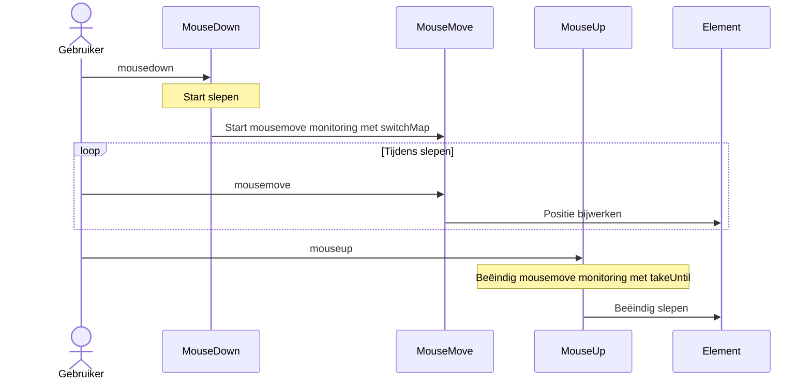

# UI-gebeurtenisafhandelingspatronen

UI-gebeurtenisafhandeling is een van de meest voorkomende uitdagingen in frontend-ontwikkeling. Door RxJS te gebruiken kunt u complexe gebeurtenisafhandeling declaratief en intuïtief implementeren.

Dit artikel legt specifieke patronen uit voor UI-gebeurtenisafhandeling die nodig zijn in praktisch werk, zoals klikken, scrollen, drag & drop en toetsenbordinvoer.

## Wat u leert in dit artikel

- Klikgebeurteniscontrole (throttle, debounce, distinct)
- Efficiënte scroll-gebeurtenisafhandeling
- Drag & drop implementatie
- Toetsenbordinvoer en autocomplete
- Multi-touch ondersteuning
- Combineren van samengestelde gebeurtenissen

> [!TIP] Vereisten
> Dit artikel veronderstelt kennis van [Hoofdstuk 4: Operators](../operators/index.md). Begrip van `debounceTime`, `throttleTime` en `distinctUntilChanged` is vooral belangrijk.

## Klikgebeurtenisafhandeling

### Probleem: Overmatige verwerking door snel klikken

Wanneer een knop herhaaldelijk wordt geklikt, wordt verwerking meerdere keren uitgevoerd, wat prestatieproblemen en bugs veroorzaakt.

### Oplossing 1: Controle met throttleTime

Verwerk alleen de eerste klik binnen een bepaalde periode.

```typescript
import { fromEvent, throttleTime } from 'rxjs';
const button = document.createElement('button');
button.id = 'submit-button';
button.innerText = 'verzenden';
document.body.appendChild(button);

if (button) {
  fromEvent(button, 'click').pipe(
    throttleTime(1000) // Verwerk slechts eenmaal per seconde
  ).subscribe(() => {
    console.log('Voer verzendingsproces uit');
    submitForm();
  });
}

function submitForm(): void {
  console.log('Formulier verzenden...');
  // API-aanroep, etc.
}
```

#### Uitvoeringsstroom

```
Gebruiker klikt:     ●    ●●●        ●  ●●
                     |    |          |  |
throttleTime(1000):  ●              ●
                     |              |
                 Verwerk        Verwerk
```

> [!NOTE] throttleTime kenmerken
> - Verwerkt de **eerste gebeurtenis** en negeert volgende gebeurtenissen voor een bepaalde periode
> - Geschikt wanneer realtime responsiviteit belangrijk is (scroll, resize, etc.)

### Oplossing 2: Controle met debounceTime

Verwerk een bepaalde tijd nadat de gebeurtenis stopt.

```typescript
import { fromEvent, debounceTime } from 'rxjs';
// Traditionele aanpak (gecommenteerd voor referentie)
// const searchInput = document.querySelector<HTMLInputElement>('#search');

// Zelfstandig: maakt invoer dynamisch aan
const searchInput = document.createElement('input');
searchInput.id = 'search';
searchInput.type = 'text';
searchInput.placeholder = 'Voer zoekwoorden in...';
searchInput.style.padding = '8px';
searchInput.style.margin = '10px';
searchInput.style.width = '300px';
document.body.appendChild(searchInput);

fromEvent(searchInput, 'input').pipe(
  debounceTime(300) // Wacht 300ms nadat invoer stopt
).subscribe((event) => {
  const value = (event.target as HTMLInputElement).value;
  console.log('Voer zoekopdracht uit:', value);
  performSearch(value);
});

function performSearch(query: string): void {
  console.log('Zoeken...', query);
  // Zoek API-aanroep
}
```

#### Uitvoeringsstroom

```
Gebruikersinvoer:     ●●●●●     ●●        ●●●●
                          |            |      |
debounceTime(300):       300ms       300ms  300ms wachten
                          |            |      |
                       Verwerk      Verwerk  Verwerk
```

> [!NOTE] debounceTime kenmerken
> - Wacht een bepaalde tijd vanaf de **laatste gebeurtenis** voordat wordt verwerkt
> - Geschikt voor zoeken, autocomplete, realtime validatie

### throttleTime vs debounceTime gebruik

| Gebruikssituatie | Te gebruiken operator | Reden |
|-----|-------------------|------|
| **Zoekinvoer** | `debounceTime` | Wil zoeken nadat invoer stopt |
| **Autocomplete** | `debounceTime` | Toon kandidaten nadat invoer stopt |
| **Scroll-gebeurtenissen** | `throttleTime` | Wil periodieke verwerking tijdens scrollen |
| **Window resize** | `throttleTime` of `debounceTime` | Hangt af van vereisten |
| **Voorkom knopspam** | `throttleTime` of `exhaustMap` | Verwerk eerste klik onmiddellijk |

### Oplossing 3: Elimineer duplicaten met distinctUntilChanged

Vergelijk met de vorige waarde en sla verwerking over als dezelfde waarde doorgaat.

```typescript
import { fromEvent, map, debounceTime, distinctUntilChanged } from 'rxjs';
const searchInput = document.createElement('input');
searchInput.id = 'search';
searchInput.type = 'text';
searchInput.placeholder = 'Voer zoekwoorden in...';
searchInput.style.padding = '8px';
searchInput.style.margin = '10px';
searchInput.style.width = '300px';
document.body.appendChild(searchInput);

fromEvent(searchInput, 'input').pipe(
  map(event => (event.target as HTMLInputElement).value.trim()),
  debounceTime(300),
  distinctUntilChanged() // Negeer als dezelfde als vorige waarde
).subscribe(query => {
  console.log('Voer zoekopdracht uit:', query);
  performSearch(query);
});
```

#### Uitvoeringsvoorbeeld

```typescript
// Gebruikersinvoer: "RxJS" → Backspace → "RxJS"
// Zonder distinctUntilChanged: Zoekopdracht wordt 2 keer uitgevoerd
// Met distinctUntilChanged: Zoekopdracht wordt slechts 1 keer uitgevoerd (2e wordt overgeslagen als dezelfde waarde)
```

> [!TIP] Best practice
> Voor het implementeren van zoeken en autocomplete wordt aanbevolen om deze drie samen te gebruiken:
> 1. `debounceTime()` - Wacht tot invoer stopt
> 2. `distinctUntilChanged()` - Elimineer duplicaten
> 3. `switchMap()` - Annuleer oude verzoeken

## Scroll-gebeurtenisafhandeling

### Probleem: Overmatige scroll-gebeurtenis firing

Scroll-gebeurtenissen worden zeer vaak afgevuurd, dus het verwerken ervan zoals ze zijn veroorzaakt prestatieproblemen.

### Oplossing: Throttle met throttleTime

```typescript
import { fromEvent, throttleTime, map } from 'rxjs';
const scrollContainer = document.createElement('div');
scrollContainer.id = 'scroll-container';
scrollContainer.style.width = '400px';
scrollContainer.style.height = '300px';
scrollContainer.style.overflow = 'auto';
scrollContainer.style.border = '1px solid #ccc';
scrollContainer.style.margin = '10px';
scrollContainer.style.padding = '10px';

// Voeg inhoud toe om scrollbaar te maken
scrollContainer.innerHTML = Array.from({ length: 100 }, (_, i) =>
  `<p>Item ${i + 1}</p>`
).join('');

document.body.appendChild(scrollContainer);

fromEvent(scrollContainer, 'scroll').pipe(
  throttleTime(100), // Verwerk slechts eenmaal per 100ms
  map(() => ({
    scrollTop: scrollContainer.scrollTop,
    scrollHeight: scrollContainer.scrollHeight,
    clientHeight: scrollContainer.clientHeight
  }))
).subscribe(({ scrollTop, scrollHeight, clientHeight }) => {
  // Bereken scrollpositie
  const scrollPercentage = (scrollTop / (scrollHeight - clientHeight)) * 100;
  console.log(`Scrollpositie: ${scrollPercentage.toFixed(1)}%`);

  // Oneindige scroll: Laad volgende pagina wanneer 90% of meer gescrolld
  if (scrollPercentage > 90) {
    console.log('Volgende pagina laden...');
    loadMoreItems();
  }
});

function loadMoreItems(): void {
  console.log('Extra gegevens ophalen');
}
```

### Praktijkvoorbeeld: Scrollrichting detecteren

```typescript
import { fromEvent, BehaviorSubject, throttleTime, map, pairwise, distinctUntilChanged } from 'rxjs';
type ScrollDirection = 'omhoog' | 'omlaag' | 'geen';

const scrollDirection$ = new BehaviorSubject<ScrollDirection>('geen');

// Maak header element dynamisch aan
const header = document.createElement('div');
header.id = 'header';
header.innerText = 'Header (tonen/verbergen bij scrollen)';
header.style.position = 'fixed';
header.style.top = '0';
header.style.left = '0';
header.style.width = '100%';
header.style.padding = '20px';
header.style.background = '#333';
header.style.color = '#fff';
header.style.transition = 'transform 0.3s';
document.body.appendChild(header);

// Voeg scroll-inhoud toe
const scrollContent = document.createElement('div');
scrollContent.style.marginTop = '80px';
scrollContent.innerHTML = Array.from({ length: 100 }, (_, i) =>
  `<p>Inhoud ${i + 1}</p>`
).join('');
document.body.appendChild(scrollContent);

fromEvent(window, 'scroll').pipe(
  throttleTime(100),
  map(() => window.scrollY),
  pairwise(), // Verkrijg vorige en huidige waarden als paren
  map(([prev, curr]) => {
    if (curr > prev) return 'omlaag';
    if (curr < prev) return 'omhoog';
    return 'geen';
  }),
  distinctUntilChanged() // Meld alleen wanneer richting verandert
).subscribe(direction => {
  scrollDirection$.next(direction);
  console.log('Scrollrichting:', direction);

  // Schakel header zichtbaarheid
  if (direction === 'omlaag') {
    header.style.transform = 'translateY(-100%)';
  } else if (direction === 'omhoog') {
    header.style.transform = 'translateY(0)';
  }
});
```

> [!TIP] pairwise gebruiken
> `pairwise()` is een nuttige operator die vorige en huidige waarden als paren kan krijgen. Het kan worden gebruikt voor scrollrichting, toename/afname bepaling, verschilberekening, etc.

## Drag & Drop implementatie

### Probleem: Complexe combinatie van muisgebeurtenissen

Drag & drop is een complexe combinatie van mousedown → mousemove → mouseup gebeurtenissen.

### Oplossing: Combineer meerdere Observables

```typescript
import { fromEvent, merge, map, switchMap, takeUntil, tap } from 'rxjs';
interface Position {
  x: number;
  y: number;
}

const draggableElement = document.createElement('div');
draggableElement.id = 'draggable';
draggableElement.innerText = 'Sleep mij';
draggableElement.style.position = 'absolute';
draggableElement.style.left = '100px';
draggableElement.style.top = '100px';
draggableElement.style.width = '150px';
draggableElement.style.height = '150px';
draggableElement.style.padding = '20px';
draggableElement.style.background = '#4CAF50';
draggableElement.style.color = '#fff';
draggableElement.style.cursor = 'move';
draggableElement.style.userSelect = 'none';
draggableElement.style.display = 'flex';
draggableElement.style.alignItems = 'center';
draggableElement.style.justifyContent = 'center';
document.body.appendChild(draggableElement);

const mouseDown$ = fromEvent<MouseEvent>(draggableElement, 'mousedown');
const mouseMove$ = fromEvent<MouseEvent>(document, 'mousemove');
const mouseUp$ = fromEvent<MouseEvent>(document, 'mouseup');

// Verkrijg elementpositie bij sleepstart
let initialX = 0;
let initialY = 0;

mouseDown$.pipe(
  tap((event: MouseEvent) => {
    event.preventDefault();
    // Registreer huidige elementpositie
    const rect = draggableElement.getBoundingClientRect();
    initialX = rect.left;
    initialY = rect.top;

    // Verschil van muispositie bij sleepstart
    initialX = rect.left - event.clientX;
    initialY = rect.top - event.clientY;

    draggableElement.style.opacity = '0.7';
  }),
  switchMap(() =>
    // Wanneer mousedown optreedt, start mousemove monitoring
    mouseMove$.pipe(
      map((event: MouseEvent): Position => ({
        x: event.clientX + initialX,
        y: event.clientY + initialY
      })),
      // Beëindig monitoring bij mouseup of mouseleave
      takeUntil(
        merge(
          mouseUp$,
          fromEvent(document, 'mouseleave')
        ).pipe(
          tap(() => {
            draggableElement.style.opacity = '1';
          })
        )
      )
    )
  )
).subscribe((position: Position) => {
  // Verplaats element
  draggableElement.style.left = `${position.x}px`;
  draggableElement.style.top = `${position.y}px`;
});
```

#### Gebeurtenisstroom



> [!IMPORTANT] Belangrijke punten voor Drag & Drop
> - Start mousemove monitoring bij mousedown → met `switchMap`
> - Beëindig monitoring bij mouseup met `takeUntil`
> - Schakel standaard sleepgedrag uit met `preventDefault()`
> - Visuele feedback met `classList.add/remove`

### Touch-apparaat ondersteuning

```typescript
import { fromEvent, merge, map, switchMap, takeUntil, tap } from 'rxjs';
const draggableElement = document.createElement('div');
draggableElement.id = 'draggable';
draggableElement.innerText = 'Sleep mij\n(Muis/Touch ondersteund)';
draggableElement.style.position = 'absolute';
draggableElement.style.left = '100px';
draggableElement.style.top = '100px';
draggableElement.style.width = '150px';
draggableElement.style.height = '150px';
draggableElement.style.padding = '20px';
draggableElement.style.background = '#2196F3';
draggableElement.style.color = '#fff';
draggableElement.style.cursor = 'move';
draggableElement.style.userSelect = 'none';
draggableElement.style.display = 'flex';
draggableElement.style.alignItems = 'center';
draggableElement.style.justifyContent = 'center';
draggableElement.style.textAlign = 'center';
draggableElement.style.whiteSpace = 'pre-line';
document.body.appendChild(draggableElement);

// Integreer muis- en touch-gebeurtenissen
const start$ = merge(
  fromEvent<MouseEvent>(draggableElement, 'mousedown').pipe(
    map(e => ({ x: e.clientX, y: e.clientY, event: e }))
  ),
  fromEvent<TouchEvent>(draggableElement, 'touchstart').pipe(
    map(e => ({
      x: e.touches[0].clientX,
      y: e.touches[0].clientY,
      event: e
    }))
  )
);

const move$ = merge(
  fromEvent<MouseEvent>(document, 'mousemove').pipe(
    map(e => ({ x: e.clientX, y: e.clientY }))
  ),
  fromEvent<TouchEvent>(document, 'touchmove').pipe(
    map(e => ({
      x: e.touches[0].clientX,
      y: e.touches[0].clientY
    }))
  )
);

const end$ = merge(
  fromEvent(document, 'mouseup'),
  fromEvent(document, 'touchend')
);

let initialOffsetX = 0;
let initialOffsetY = 0;

start$.pipe(
  tap(({ x, y, event }) => {
    event.preventDefault();
    const rect = draggableElement.getBoundingClientRect();
    initialOffsetX = rect.left - x;
    initialOffsetY = rect.top - y;
    draggableElement.style.opacity = '0.7';
  }),
  switchMap(() =>
    move$.pipe(
      map(({ x, y }) => ({
        x: x + initialOffsetX,
        y: y + initialOffsetY
      })),
      takeUntil(
        end$.pipe(
          tap(() => {
            draggableElement.style.opacity = '1';
          })
        )
      )
    )
  )
).subscribe(({ x, y }) => {
  draggableElement.style.left = `${x}px`;
  draggableElement.style.top = `${y}px`;
});
```

> [!TIP] Multi-apparaat ondersteuning
> Door `merge` te gebruiken om muis- en touch-gebeurtenissen te integreren, kunt u drag & drop implementeren die werkt op PC/tablet/smartphone.

## Toetsenbordinvoer en autocomplete

### Probleem: Overmatige API-aanroepen tijdens invoer

Wanneer API-aanroepen worden gedaan in reactie op toetsenbordinvoer zoals zoekvakken, veroorzaakt het aanroepen bij elke toetsaanslag prestatieproblemen.

Bijvoorbeeld, wanneer een gebruiker "RxJS" typt:
- `R` → API-aanroep
- `Rx` → API-aanroep
- `RxJ` → API-aanroep
- `RxJS` → API-aanroep

4 API-aanroepen voor 4 tekens invoer. Dit is verspillend en belast de server.

### Oplossing: debounceTime + switchMap

Om autocomplete efficiënt te implementeren, combineer deze drie operators:

1. **debounceTime(300)** - Wacht 300ms nadat gebruiker stopt met typen
2. **distinctUntilChanged()** - Negeer als dezelfde als vorige waarde (voorkom verspillende verzoeken)
3. **switchMap()** - Annuleer oude verzoeken wanneer nieuwe invoer arriveert

Met deze combinatie, zelfs als de gebruiker "RxJS" snel typt, wordt de API slechts eenmaal aangeroepen nadat invoer stopt.

```typescript
import { fromEvent, of, map, debounceTime, distinctUntilChanged, switchMap, catchError } from 'rxjs';
interface SearchResult {
  id: number;
  title: string;
  description: string;
}

const searchInput = document.createElement('input');
searchInput.id = 'search';
searchInput.type = 'text';
searchInput.placeholder = 'Autocomplete zoeken...';
searchInput.style.padding = '10px';
searchInput.style.margin = '10px';
searchInput.style.width = '400px';
searchInput.style.fontSize = '16px';
document.body.appendChild(searchInput);

const resultsContainer = document.createElement('div');
resultsContainer.id = 'results';
resultsContainer.style.margin = '10px';
resultsContainer.style.padding = '10px';
resultsContainer.style.border = '1px solid #ddd';
resultsContainer.style.width = '400px';
resultsContainer.style.minHeight = '100px';
document.body.appendChild(resultsContainer);

fromEvent(searchInput, 'input').pipe(
  map(event => (event.target as HTMLInputElement).value.trim()),
  debounceTime(300),           // Wacht 300ms nadat invoer stopt
  distinctUntilChanged(),      // Negeer als dezelfde als vorige waarde
  switchMap(query => {
    if (query.length < 2) {
      return of([]); // Lege array als minder dan 2 tekens
    }

    console.log('Voer zoekopdracht uit:', query);
    return searchAPI(query).pipe(
      catchError(err => {
        console.error('Zoekfout:', err);
        return of([]);
      })
    );
  })
).subscribe(results => {
  displayResults(results);
});

// Zoek API (mock)
function searchAPI(query: string) {
  return of([
    { id: 1, title: `Resultaat 1: ${query}`, description: 'Beschrijving 1' },
    { id: 2, title: `Resultaat 2: ${query}`, description: 'Beschrijving 2' },
    { id: 3, title: `Resultaat 3: ${query}`, description: 'Beschrijving 3' }
  ]);
}

function displayResults(results: SearchResult[]): void {
  if (results.length === 0) {
    resultsContainer.innerHTML = '<p>Geen resultaten gevonden</p>';
    return;
  }

  resultsContainer.innerHTML = results
    .map(
      r => `
      <div class="result-item" style="padding: 10px; border-bottom: 1px solid #eee;">
        <h3 style="margin: 0 0 5px 0;">${r.title}</h3>
        <p style="margin: 0; color: #666;">${r.description}</p>
      </div>
    `
    )
    .join('');
}
```

> [!IMPORTANT] Belang van switchMap
> Zonder `switchMap` te gebruiken en `mergeMap` in plaats daarvan te gebruiken, blijven oude verzoeken uitvoeren. Als resultaat worden langzame verzoekresultaten later weergegeven, wat onnatuurlijke UI-problemen veroorzaakt.
>
> - ❌ **mergeMap**: "Rx" (langzaam) → "RxJS" (snel) → "RxJS" resultaat → "Rx" resultaat (overschreven met oud resultaat)
> - ✅ **switchMap**: "Rx" (geannuleerd) → "RxJS" (uitgevoerd) → Alleen "RxJS" resultaat weergegeven

### Praktijkvoorbeeld: Sneltoetsen

```typescript
import { fromEvent, filter, map } from 'rxjs';
// Ctrl+S om op te slaan
fromEvent<KeyboardEvent>(document, 'keydown').pipe(
  filter(event => event.ctrlKey && event.key === 's'),
  map(event => {
    event.preventDefault();
    return event;
  })
).subscribe(() => {
  console.log('Voer opslagproces uit');
  saveDocument();
});

// Ctrl+K om opdrachtpalet te tonen
fromEvent<KeyboardEvent>(document, 'keydown').pipe(
  filter(event => event.ctrlKey && event.key === 'k'),
  map(event => {
    event.preventDefault();
    return event;
  })
).subscribe(() => {
  console.log('Toon opdrachtpalet');
  showCommandPalette();
});

function saveDocument(): void {
  console.log('Document opslaan...');
}

function showCommandPalette(): void {
  console.log('Toon opdrachtpalet');
}
```

## Multi-touch ondersteuning

### Probleem: Pinch zoom en multi-touch gebaren

Wil pinch zoom en multi-touch gebaren implementeren op tablets en smartphones.

### Oplossing: Monitor touch-gebeurtenissen

```typescript
import { fromEvent, map, pairwise } from 'rxjs';
const imageElement = document.createElement('img');
imageElement.id = 'zoomable-image';
imageElement.src = 'data:image/svg+xml,%3Csvg xmlns="http://www.w3.org/2000/svg" width="300" height="300"%3E%3Crect width="300" height="300" fill="%234CAF50"/%3E%3Ctext x="50%25" y="50%25" text-anchor="middle" dy=".3em" fill="white" font-size="20"%3EPinch Zoom%3C/text%3E%3C/svg%3E';
imageElement.style.width = '300px';
imageElement.style.height = '300px';
imageElement.style.margin = '20px';
imageElement.style.touchAction = 'none';
imageElement.style.userSelect = 'none';
imageElement.style.transition = 'transform 0.1s';
document.body.appendChild(imageElement);

let initialDistance = 0;
let currentScale = 1;

fromEvent<TouchEvent>(imageElement, 'touchstart').pipe(
  map(event => {
    if (event.touches.length === 2) {
      // Bereken afstand tussen twee punten
      const touch1 = event.touches[0];
      const touch2 = event.touches[1];
      return getDistance(touch1, touch2);
    }
    return 0;
  })
).subscribe(distance => {
  initialDistance = distance;
});

fromEvent<TouchEvent>(imageElement, 'touchmove').pipe(
  map(event => {
    event.preventDefault();
    if (event.touches.length === 2) {
      const touch1 = event.touches[0];
      const touch2 = event.touches[1];
      return getDistance(touch1, touch2);
    }
    return 0;
  }),
  pairwise()
).subscribe(([prev, curr]) => {
  if (initialDistance > 0 && curr > 0) {
    // Wijzig schaal volgens pinch-hoeveelheid
    const scaleDelta = curr / initialDistance;
    const newScale = currentScale * scaleDelta;

    // Beperk schaalbereik (0,5x tot 3x)
    const clampedScale = Math.max(0.5, Math.min(3, newScale));

    imageElement.style.transform = `scale(${clampedScale})`;
  }
});

fromEvent<TouchEvent>(imageElement, 'touchend').subscribe(() => {
  // Registreer huidige schaal
  const transform = imageElement.style.transform;
  const match = transform.match(/scale\(([^)]+)\)/);
  if (match) {
    currentScale = parseFloat(match[1]);
  }
});

// Bereken afstand tussen twee punten
function getDistance(touch1: Touch, touch2: Touch): number {
  const dx = touch2.clientX - touch1.clientX;
  const dy = touch2.clientY - touch1.clientY;
  return Math.sqrt(dx * dx + dy * dy);
}
```

## Gebeurtenisopruiming

### Probleem: Voorkom geheugenlekken

Niet correct uitschrijven van gebeurtenislisteners veroorzaakt geheugenlekken.

### Oplossing: Opruimen met takeUntil

```typescript
import { fromEvent, Subject, throttleTime, takeUntil } from 'rxjs';
class ScrollTracker {
  private destroy$ = new Subject<void>();

  init(): void {
    fromEvent(window, 'scroll').pipe(
      throttleTime(100),
      takeUntil(this.destroy$) // Auto-vrijgave bij componentvernietiging
    ).subscribe(() => {
      console.log('Scrollpositie:', window.scrollY);
    });

    fromEvent(window, 'resize').pipe(
      throttleTime(100),
      takeUntil(this.destroy$)
    ).subscribe(() => {
      console.log('Venstergrootte:', window.innerWidth, window.innerHeight);
    });
  }

  destroy(): void {
    this.destroy$.next();
    this.destroy$.complete();
    console.log('Alle gebeurtenislisteners uitgeschreven');
  }
}

// Gebruiksvoorbeeld
const tracker = new ScrollTracker();
tracker.init();

// Bij paginatransitie of componentvernietiging
// tracker.destroy();
```

> [!IMPORTANT] Geheugenlekpreventie
> - **Pas `takeUntil` toe op alle gebeurtenisabonnementen**
> - **Activeer `destroy$` bij componentvernietiging**
> - **Let vooral op globale gebeurtenissen (window, document)**
> - **Vergeet niet `unsubscribe()` wanneer Subscription expliciet wordt beheerd**

## Praktisch UI-componentvoorbeeld

### Oneindige scroll implementatie

```typescript
import { fromEvent, of, throttleTime, map, filter, exhaustMap, catchError } from 'rxjs';
interface Item {
  id: number;
  title: string;
  content: string;
}

class InfiniteScroll {
  private page = 1;
  private loading = false;
  private hasMore = true;

  init(container: HTMLElement, itemsContainer: HTMLElement): void {
    fromEvent(container, 'scroll').pipe(
      throttleTime(200),
      map(() => {
        const scrollTop = container.scrollTop;
        const scrollHeight = container.scrollHeight;
        const clientHeight = container.clientHeight;
        return (scrollTop + clientHeight) / scrollHeight;
      }),
      filter(ratio => ratio > 0.9 && !this.loading && this.hasMore),
      exhaustMap(() => {
        this.loading = true;
        console.log(`Pagina ${this.page} laden...`);

        return this.loadMoreItems(this.page).pipe(
          catchError(err => {
            console.error('Laadfout:', err);
            return of([]);
          })
        );
      })
    ).subscribe(items => {
      this.loading = false;

      if (items.length === 0) {
        this.hasMore = false;
        console.log('Alle items geladen');
        return;
      }

      this.page++;
      this.appendItems(itemsContainer, items);
    });
  }

  private loadMoreItems(page: number) {
    // Simuleer API-aanroep
    return of(
      Array.from({ length: 10 }, (_, i) => ({
        id: (page - 1) * 10 + i + 1,
        title: `Item ${(page - 1) * 10 + i + 1}`,
        content: `Dit is de inhoud van item ${(page - 1) * 10 + i + 1}`
      }))
    );
  }

  private appendItems(container: HTMLElement, items: Item[]): void {
    const html = items
      .map(
        item => `
        <div class="item">
          <h3>${item.title}</h3>
          <p>${item.content}</p>
        </div>
      `
      )
      .join('');

    container.insertAdjacentHTML('beforeend', html);
  }
}

// Gebruiksvoorbeeld
const scrollContainer = document.createElement('div');
scrollContainer.id = 'scroll-container';
scrollContainer.style.width = '500px';
scrollContainer.style.height = '400px';
scrollContainer.style.overflow = 'auto';
scrollContainer.style.border = '2px solid #333';
scrollContainer.style.margin = '10px';
scrollContainer.style.padding = '10px';
document.body.appendChild(scrollContainer);

const itemsContainer = document.createElement('div');
itemsContainer.id = 'items';
scrollContainer.appendChild(itemsContainer);

// Voeg initiële items toe
itemsContainer.innerHTML = Array.from({ length: 10 }, (_, i) => `
  <div class="item" style="padding: 15px; border-bottom: 1px solid #eee;">
    <h3 style="margin: 0 0 5px 0;">Item ${i + 1}</h3>
    <p style="margin: 0; color: #666;">Dit is de inhoud van item ${i + 1}</p>
  </div>
`).join('');

const infiniteScroll = new InfiniteScroll();
infiniteScroll.init(scrollContainer, itemsContainer);
```

> [!TIP] exhaustMap gebruiken
> Door `exhaustMap` te gebruiken kunt u nieuwe verzoeken negeren totdat het vorige verzoek is voltooid. Dit voorkomt dubbele verzoeken door snel scrollen.

## Testcode

Voorbeeldtest voor UI-gebeurtenisafhandeling.

```typescript
import { debounceTime, map } from 'rxjs';
import { TestScheduler } from 'rxjs/testing';

describe('UI-gebeurtenisafhandeling', () => {
  let testScheduler: TestScheduler;

  beforeEach(() => {
    testScheduler = new TestScheduler((actual, expected) => {
      expect(actual).toEqual(expected);
    });
  });

  it('debounceTime moet gebeurtenissen vertragen', () => {
    testScheduler.run(({ cold, expectObservable }) => {
      const input$ = cold('a-b-c----|', {
        a: 'A',
        b: 'B',
        c: 'C'
      });

      const result$ = input$.pipe(debounceTime(20, testScheduler));

      expectObservable(result$).toBe('-----c----|', { c: 'C' });
    });
  });

  it('moet zoekinvoer met debounce afhandelen', () => {
    testScheduler.run(({ cold, expectObservable }) => {
      const input$ = cold('a-bc---d--|', {
        a: 'R',
        b: 'Rx',
        c: 'RxJ',
        d: 'RxJS'
      });

      const result$ = input$.pipe(
        debounceTime(20, testScheduler),
        map(query => `Zoeken: ${query}`)
      );

      expectObservable(result$).toBe('------c---(d|)', {
        c: 'Zoeken: RxJ',
        d: 'Zoeken: RxJS'
      });
    });
  });
});
```

## Samenvatting

Het beheersen van UI-gebeurtenisafhandelingspatronen stelt u in staat om interactieve en comfortabele gebruikerservaringen te bieden.

> [!IMPORTANT] Belangrijkste punten
> - **throttleTime**: Verwerk slechts eenmaal per periode (scroll, resize)
> - **debounceTime**: Verwerk nadat gebeurtenis stopt (zoeken, autocomplete)
> - **distinctUntilChanged**: Elimineer duplicaten (negeer dezelfde waarden)
> - **switchMap**: Complexe gebeurtenisketens (drag & drop)
> - **takeUntil**: Betrouwbaar opruimen (voorkom geheugenlekken)

> [!TIP] Best practices
> - **Prestatie**: Voorkom overmatige verwerking met throttle/debounce
> - **Bruikbaarheid**: Stel geschikte vertragingstijden in (300ms, etc.)
> - **Toegankelijkheid**: Ondersteun ook toetsenbordoperaties
> - **Multi-apparaat**: Ondersteun zowel touch als muis
> - **Opruimen**: Geef geheugen betrouwbaar vrij met `takeUntil`

## Volgende stappen

Na het beheersen van UI-gebeurtenisafhandelingspatronen, ga verder met de volgende patronen:

- [Formulierafhandeling](./form-handling.md) - Realtime validatie, meerdere veldcoördinatie
- [API-aanroepen](./api-calls.md) - Integratie van UI-gebeurtenissen en API-aanroepen
- [Realtime gegevensverwerking](./real-time-data.md) - WebSocket, SSE
- [Cachingstrategieën](./caching-strategies.md) - Caching van gebeurtenisgegevens

## Gerelateerde secties

- [Hoofdstuk 4: Filteroperators](../operators/filtering/) - Details over debounceTime, throttleTime
- [Hoofdstuk 4: Transformatieoperators](../operators/transformation/) - Details over switchMap, exhaustMap
- [Hoofdstuk 2: Observable](../observables/what-is-observable.md) - Basis van fromEvent

## Referentiebronnen

- [RxJS Officieel: fromEvent](https://rxjs.dev/api/index/function/fromEvent) - Details over fromEvent()
- [MDN: Touch-gebeurtenissen](https://developer.mozilla.org/en-US/docs/Web/API/Touch_events) - Hoe touch-gebeurtenissen te gebruiken
- [Learn RxJS: debounceTime](https://www.learnrxjs.io/learn-rxjs/operators/filtering/debouncetime) - Praktische voorbeelden van debounceTime
