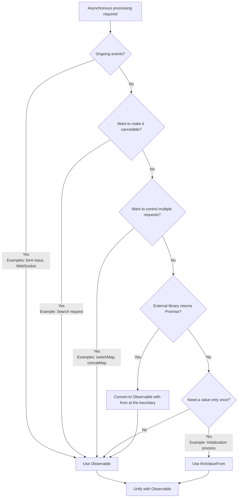

# Mixed Promise and Observable Anti-pattern

Both Promise and Observable are mechanisms for handling asynchronous processing, but **mixing them without clear design boundaries can cause various problems**. This page describes in detail the anti-pattern caused by mixing them and appropriate unification methods.

## Why is unification important?

Mixing Promise and Observable causes the following problems:

### 1. Cannot be cancelled

Observable can be interrupted by `unsubscribe` / `takeUntil`, but **Promise cannot be interrupted once started**.

```ts
import { interval, Subject } from 'rxjs';
import { takeUntil } from 'rxjs';

const destroy$ = new Subject<void>();

// ✅ Observable: cancelable
interval(1000).pipe(
  takeUntil(destroy$)
).subscribe(n => console.log(n));

// Cancel when the user leaves the screen
destroy$.next();
destroy$.complete();
```

```ts
// ❌ Promise: Non-cancelable
async function fetchData() {
  const response = await fetch('/api/data');
  // Fetch does not stop when the user leaves the screen
  return response.json();
}
```

**Impact:** Unnecessary requests during route transitions, execution of unnecessary side effects

### 2. Difficulty in controlling multiple

Observable can prevent multiple requests from serialization, cancellation, and reentry with `switchMap`/`concatMap`/`exhaustMap`, etc.

```ts
import { fromEvent } from 'rxjs';
import { switchMap, debounceTime } from 'rxjs';

const searchInput = document.getElementById('serch-input')!;

// ✅ Observable: Process only the latest request
fromEvent(searchInput, 'input').pipe(
  debounceTime(300),
  switchMap(event => searchAPI((event.target as HTMLInputElement).value))
  // Old requests are automatically canceled
).subscribe(results => displayResults(results));
function searchAPI(query: string) {
  return fetch(`/api/search?q=${query}`).then(r => r.json());
}

function displayResults(results: unknown) {
  console.log(results);
}
```

With Promise, such control must be implemented manually, which can be complex.

### 3. Multiple event support

Observable is strong for **continuous value flow processing** such as form input, WebSockets, and events.

```ts
import { fromEvent } from 'rxjs';
import { map } from 'rxjs';

// ✅ Observable: handles ongoing events
fromEvent(document, 'mousemove').pipe(
  map(event => ({ x: (event as MouseEvent).clientX, y: (event as MouseEvent).clientY }))
).subscribe(position => {
  console.log('Mouse position:', position);
});
```

Promise is specialized for "one-time" processing and is not suitable for continuous events.

### 4. Ease of testing

Observable can guarantee time and concurrency in marble testing.

```ts
import { TestScheduler } from 'rxjs/testing';

// ✅ Observable: Time can be controlled by marble test
// Note: This code is executed within the testing framework (Jasmine/Jest)
describe('Observable Test', () => {
  let scheduler: TestScheduler;

  beforeEach(() => {
    scheduler = new TestScheduler((actual, expected) => {
      expect(actual).toEqual(expected); // Using the test framework expect
    });
  });

  it('should emit values over time', () => {
    scheduler.run(({ cold, expectObservable }) => {
      const source$ = cold('a-b-c|');
      expectObservable(source$).toBe('a-b-c|');
    });
  });
});
```

Promise-based code tends to complicate asynchronous testing. See [Testing Methodology](/pt/guide/testing/unit-tests) for details.


## Typical pattern of "getting stuck" in a mixture (to be avoided)

The following is a pattern of problems often seen in actual projects.

### ❌ Anti-pattern 1: Mixing async/await and pipe()

If `await` is used in the middle of an Observable process, or if Promise and Observable processes are mixed, the process will not be cancelable.

```ts
import { ajax } from 'rxjs/ajax';
import { firstValueFrom } from 'rxjs';

// ❌ Bad example: mixing Observable → Promise → Promise
async function fetchUserData() {
  const user = await firstValueFrom(ajax.getJSON('/api/user'));

  // Uncancelable after dropping to Promise
  return fetch('/api/profile').then(response => response.json());
}
```

```ts
import { of } from 'rxjs';
import { map } from 'rxjs';

// ❌ Bad example: tries to use await in pipe() (doesn't actually work)
async function processData() {
  return of(1, 2, 3).pipe(
    map(async (value) => {
      const result = await someAsyncOperation(value);
      return result; // Becomes Observable<Promise<T>>
    })
  );
}

async function someAsyncOperation(value: number): Promise<number> {
  return value * 2;
}
```

#### Problems
- Uncancelable
- Separation of error channels (to the unhandledrejection side instead of error)
- Promise and Observable responsibilities become ambiguous
- The type becomes `Observable<Promise<T>>`

### ❌ Anti-pattern 2: Use of `toPromise()` (deprecated)

```ts
import { interval } from 'rxjs';

// ❌ Bad example: toPromise() removed in RxJS v8
interval(1000).toPromise().then(value => {
  console.log(value);
});
```

**Solution:** Use `firstValueFrom` / `lastValueFrom` (see below)

### ❌ Anti-pattern 3: `await` in subscribe

```ts
import { fromEvent } from 'rxjs';

const button = document.getElementById('btn') as HTMLButtonElement;

// ❌ Bad example
fromEvent(button, 'click').subscribe(async () => {
  const data = await fetch('/api/data').then(r => r.json());
  console.log(data);
  // Flow is unreadable and error handling is difficult
});
```

#### Problems
- Flow becomes unreadable
- Hotbed of duplicate requests
- Possible memory leak

### ❌ Anti-pattern 4: Nested subscribe

```ts
import { ajax } from 'rxjs/ajax';

// ❌ Bad example
ajax.getJSON('/api/users').subscribe(users => {
  ajax.getJSON('/api/settings').subscribe(settings => {
    console.log(users, settings);
    // Callback hell
  });
});
```

#### Problems
- Complicated error handling
- Difficult to manage unsubscriptions

### ❌ Anti-pattern 5: Get the same data in Promise and Observable in parallel

```ts
import { ajax } from 'rxjs/ajax';

// ❌ Bad example
async function loadData() {
  const userPromise = fetch('/api/user').then(r => r.json());
  const user$ = ajax.getJSON('/api/user');

  // Getting the same data twice
}
```

#### Problems
- Double execution
- Order conflicts

### ❌ Anti-pattern 6: Returning a Promise in an Observable

Using `async/await` in the constructor of an Observable makes error handling difficult.

```ts
import { Observable } from 'rxjs';

// ❌ Bad example: using async function in Observable
const data$ = new Observable(subscriber => {
  async function fetchData() {
    const response = await fetch('/api/data');
    const data = await response.json();
    subscriber.next(data);
    subscriber.complete();
  }

  fetchData(); // Promise is returned, but no errors are caught
  // If fetchData() is rejected, subscriber.error() is not called
});
```

```ts
import { Observable } from 'rxjs';

// ❌ Bad example: passing Promise to subscriber.next()
const data$ = new Observable(subscriber => {
  const promise = fetch('/api/data').then(r => r.json());
  subscriber.next(promise); // Promise object flows
  subscriber.complete();
});

// Promise is received by the subscriber
data$.subscribe(value => {
  console.log(value); // Promise { <pending> } is output
});
```

#### Problems
- Promise errors do not flow to the Observable's error channel
- Possible unhandledrejection
- Promise object passed to `subscriber.next()`
- Subscriber needs to unwrap Promise

#### Solution

```ts
import { from, defer } from 'rxjs';

// ✅ Good example: convert Promise to Observable with from()
const data$ = from(fetch('/api/data').then(r => r.json()));

// ✅ Good example: defer() for lazy evaluation
const data$ = defer(() => fetch('/api/data').then(r => r.json()));
```


## Practical guide: clean conversion at the boundary

Because it is difficult to avoid mixing altogether, it is best practice to **convert properly at the boundaries of the design**.

### Pattern 1: Promise → Observable (external SDK, etc. returns Promise)

If an external library or legacy code returns a Promise, convert it to an Observable **only once** at the boundary.

```ts
import { from } from 'rxjs';
import { switchMap } from 'rxjs';

// External SDK returns Promise
async function externalSDK(): Promise<{ userId: string }> {
  return { userId: '123' };
}

// ✅ Good example: convert at the boundary and unify with Observable thereafter
const user$ = from(externalSDK());

user$.pipe(
  switchMap(user => from(fetchProfile(user.userId)))
).subscribe(profile => {
  console.log(profile);
});

async function fetchProfile(userId: string): Promise<{ name: string }> {
  return { name: 'John' };
}
```

### Pattern 2: Observable → Promise ("I only want it once" synchronous context)

Use `firstValueFrom` / `lastValueFrom` when you **need a value only once**, such as in an initialization process or guard function.

```ts
import { ajax } from 'rxjs/ajax';
import { firstValueFrom, shareReplay } from 'rxjs';

// ✅ Good example: cache for multiple awaits
const config$ = ajax.getJSON('/api/config').pipe(
  shareReplay({ bufferSize: 1, refCount: true })
);

async function initialize() {
  const config = await firstValueFrom(config$);
  console.log('Config loaded:', config);
}

async function validate() {
  const config = await firstValueFrom(config$); // Fetch from cache
  console.log('Validating with config:', config);
}
```

**⚠️ Note:** `firstValueFrom` only retrieves the **first one**. **Never** use it for continuous events (valueChanges, WebSocket, etc.).

```ts
import { interval } from 'rxjs';
import { firstValueFrom } from 'rxjs';

// ❌ Bad example: firstValueFrom to infinite stream
const value = await firstValueFrom(interval(1000));
// It ends up getting the value only once (unintended behavior)
```

### Pattern 3: Unified error handling

Be careful not to separate the error handling channels between Promise and Observable.

```ts
import { from } from 'rxjs';
import { catchError } from 'rxjs';
import { of } from 'rxjs';

async function riskyOperation(): Promise<string> {
  throw new Error('Something went wrong');
}

// ✅ Good example: Unify with Observable error handling
from(riskyOperation()).pipe(
  catchError(error => {
    console.error('Error caught in Observable pipeline:', error);
    return of('fallback value');
  })
).subscribe(result => {
  console.log(result); // 'fallback value'
});
```


## Examples of common mixed substitutions

### Example 1: Promise is converted to Promise in the middle → then

#### ❌ Bad example

```ts
import { ajax } from 'rxjs/ajax';
import { firstValueFrom } from 'rxjs';

async function loadUser() {
  const user = await firstValueFrom(ajax.getJSON('/api/user'));

  // Drop to Promise and follow with then
  return fetch('/api/profile')
    .then(response => response.json())
    .then(profile => {
      console.log(user, profile);
    });
}
```

#### ✅ Good example A: Observable throughout

```ts
import { ajax } from 'rxjs/ajax';
import { switchMap } from 'rxjs';

// Process as Observable
ajax.getJSON('/api/user').pipe(
  switchMap(user => ajax.getJSON('/api/profile').pipe(
    // Combine user and profile
  ))
).subscribe(profile => {
  console.log(profile);
});
```

#### ✅ Good example B: Context requiring only one await

```ts
import { ajax } from 'rxjs/ajax';
import { shareReplay, firstValueFrom } from 'rxjs';

const user$ = ajax.getJSON('/api/user').pipe(
  shareReplay({ bufferSize: 1, refCount: true })
);

async function loadUserOnce() {
  const user = await firstValueFrom(user$);
  console.log('User loaded once:', user);
}
```


### Example 2: await in subscribe

#### ❌ Bad example

```ts
import { fromEvent } from 'rxjs';

const button = document.getElementById('search-btn') as HTMLButtonElement;

fromEvent(button, 'click').subscribe(async () => {
  const results = await fetch('/api/search').then(r => r.json());
  console.log(results);
});
```

#### ✅ Good example

```ts
import { fromEvent, from } from 'rxjs';
import { switchMap } from 'rxjs';

const button = document.getElementById('search-btn') as HTMLButtonElement;

fromEvent(button, 'click').pipe(
  switchMap(() => from(fetch('/api/search').then(r => r.json())))
).subscribe(results => {
  console.log(results);
});
```


## Decision flowchart (easy-to-remember guidelines)

This is a guideline for when you are not sure whether you should use Promise or Observable in your project.



### Specific Decision Criteria

| Condition | Recommended | Reason |
|---|---|---|
| **Continuous events** (form input, WebSocket) | Observable | Promise can only return a value once |
| **Want to make it cancelable** (search request) | Observable | Promise cannot be cancelled |
| **Control multiple requests** (switchMap, concatMap) | Observable | Difficult to control with Promise |
| **External library returns Promise** | Convert with `from()` | Convert only once at the boundary |
| **Need value only once** (initialization process) | `firstValueFrom` | Combine with `shareReplay(1)` if necessary |


## Summary

- **Mixing is not a bad thing**, but it is right to **clarify the "boundary" of the design** and move it to one side
- **Unify Observable as the standard** and use **firstValueFrom/from() to convert** only the minimum necessary places to minimize problems and ensure testability, readability, and cancelability
- **Never Promise continuous events (forms, WebSockets)**

## Related Sections

- **[Difference between Promise and RxJS](/pt/guide/basics/promise-vs-rxjs)** - Basic conversion methods
- **[Error Handling](/pt/guide/error-handling/strategies)** - Observable error handling strategies
- **[Common Mistakes and How to Deal with Them](/pt/guide/anti-patterns/common-mistakes)** - Other anti-patterns

## Next Steps

1. Identify existing code where Promise and Observable are mixed
2. Clarify the boundaries and unify them with Observable
3. Add `takeUntil` where cancellation is required
