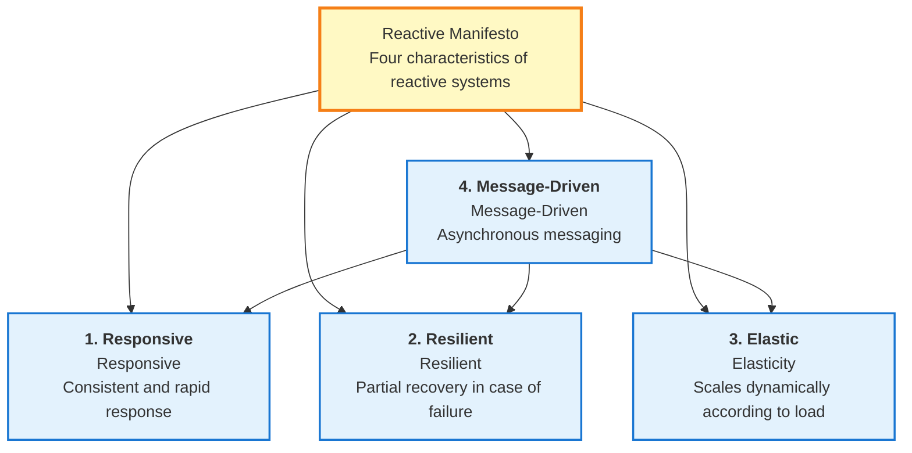
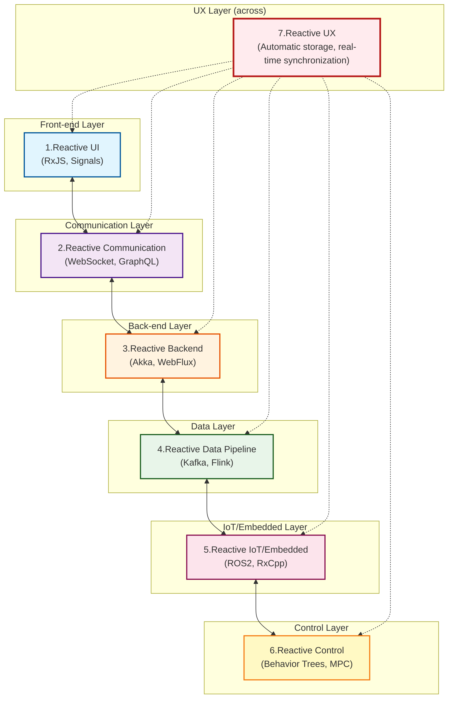
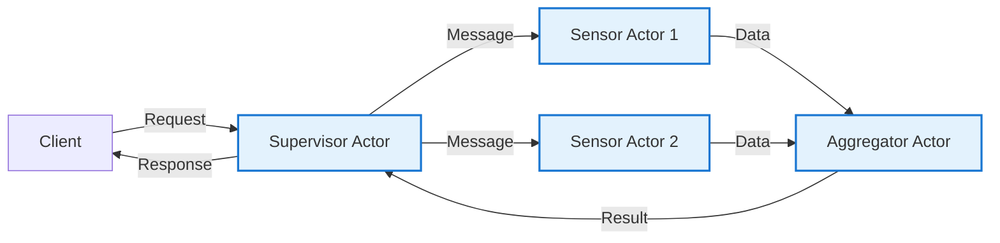
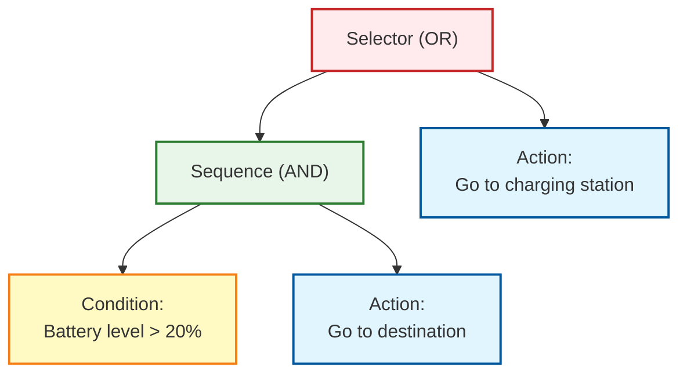
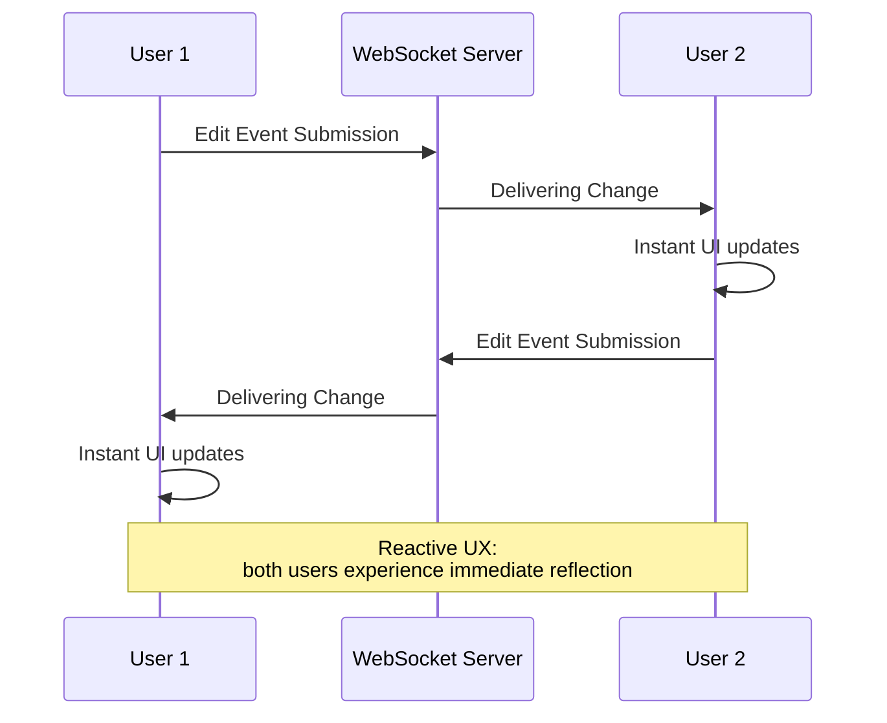
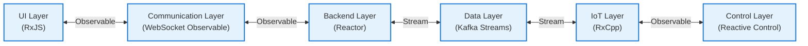

# Mapa Arquitetura Reativa

Reactive programming has evolved beyond mere libraries and frameworks to a **whole system architecture philosophy**.

This page systematically explains the **whole picture of reactive architecture** in 7 layers, from UI to backend, data pipeline, IoT, and control system.

## What is Reactive Architecture?

Reactive architecture is a system design approach that focuses on **Time-Varying Values**.

#### Core Ideas
> Everything from UI clicks to IoT sensors, data streams, and robot controls **react to values that change over time**.

To realize this ideology, the [Reactive Manifesto](https://www.reactivemanifesto.org/) defines four key characteristics.

## Four characteristics of the Reactive Manifesto

The Reactive Manifesto defines four characteristics that a reactive system should have.



### 1. Responsive

The system responds **consistently and quickly** to user input and environmental changes.

::: tip Specific examples
- Immediate feedback to UI actions
- Predictability of API response time
- Real-time data updates
:::

### 2. Resilient

In the event of a failure, **partial recovery** occurs and the entire system does not shut down.

::: tip Specific Examples
- Error handling and fallback
- Service isolation (microservices)
- Automatic retries and circuit breakers
:::

### 3. Elastic

Scales efficiently by **dynamically adjusting resources** based on load.

::: tip Specific examples
- Auto-scaling
- Load balancing
- Back pressure control
:::

### 4. Message-Driven

Components communicate via **asynchronous messages** to achieve loose coupling.

::: tip Specific examples
- Event bus
- Message queues (Kafka, RabbitMQ)
- Observable/Subscriber pattern
:::

::: info Importance of the Reactive Manifesto
These four characteristics are the **theoretical foundation** of reactive architecture; RxJS and ReactiveX are just one of the tools to realize these characteristics.
:::

## Seven layers of reactive architecture

Reactive architecture consists of the following seven layers.

| # | Layers | Overview | Typical Technologies |
|---|---|------|------------|
| 1 | **Reactive UI** | UI that responds instantly to user input | RxJS, Angular Signals, Svelte Runes, React Hooks |
| 2 | **Reactive Communication** | Client/Server Stream Communication | WebSocket, SSE, GraphQL Subscriptions |
| 3 | **Reactive Backend** | Event-driven, non-blocking server | Akka, Spring WebFlux, Vert.x, Node.js Streams |
| 4 | **Reactive Data Pipeline** | First-class data model for event streams | Kafka, Flink, Apache Beam, Reactor |
| 5 | **Reactive IoT/Embedded** | Sensor Stream Integration and Fusion | ROS2, RxCpp, RxRust, Zephyr |
| 6 | **Reactive Control** | Sensor to Control Feedback Loop | Behavior Trees, Digital Twin, MPC |
| 7 | **Reactive UX** | Closed-loop UX across all layers | Auto-save, real-time co-editing |

### Overall Architecture



## 1. Reactive UI (front end)

This is the layer that **updates screens in real time** in response to user input and asynchronous operations.

### Core Concepts

> UI is a "projection of a state that changes over time"

### Typical Technology Stack

- **RxJS** - Observable/Operator stream processing
- **Angular Signals** - Angular 19+ reactive primitives
- **Svelte Runes** - $state, $derived in Svelte 5
- **React Hooks** - state management with useState, useEffect
- **Vue Reactivity** - reactivity with ref, reactive, computed
- **SolidJS** - fine-grained reactivity on Signal infrastructure

### Implementation Example (RxJS)

```typescript
import { fromEvent } from 'rxjs';
import { debounceTime, distinctUntilChanged, map } from 'rxjs';

// Reactive UI for search box
const searchInput = document.querySelector<HTMLInputElement>('#search');
const resultsDiv = document.querySelector<HTMLDivElement>('#results');

const input$ = fromEvent(searchInput!, 'input').pipe(
  map(event => (event.target as HTMLInputElement).value),
  debounceTime(300),                    // Wait 300ms (wait for typing to complete)
  distinctUntilChanged()                // Ignore if same value as previous
);

input$.subscribe(async searchTerm => {
  if (searchTerm.length === 0) {
    resultsDiv!.innerHTML = '';
    return;
  }

  // API call
  const results = await fetch(`/api/search?q=${encodeURIComponent(searchTerm)}`)
    .then(res => res.json());

  // Update UI immediately
  resultsDiv!.innerHTML = results
    .map((r: any) => `<div class="result">${r.title}</div>`)
    .join('');
});
```

::: tip Benefits of Reactive UI
- Reduce unnecessary API calls with debounce/throttle
- Improved readability through declarative description
- Easy integration of multiple asynchronous processes
:::

## 2. Reactive Communication (communication layer)

This layer enables **bidirectional data streaming** between client/server.

### Typical technology stack

- **WebSocket** - Full-duplex communication protocol
- **Server-Sent Events (SSE)** - Unidirectional stream from server to client
- **GraphQL Subscriptions** - Real-time GraphQL subscriptions
- **tRPC** - Type-safe RPC framework
- **RxDB** - Reactive database (offline support)

### Implementation Example (WebSocket + RxJS)

```typescript
import { webSocket } from 'rxjs/webSocket';
import { retry, catchError } from 'rxjs';
import { of } from 'rxjs';

// Treat WebSocket as Observable
const socket$ = webSocket<{ type: string; data: any }>({
  url: 'wss://example.com/socket',
  openObserver: {
    next: () => console.log('✅ WebSocket connection successful')
  },
  closeObserver: {
    next: () => console.log('❌ WebSocket disconnected')
  }
});

// Receive real-time data
socket$
  .pipe(
    retry({ count: 3, delay: 1000 }),  // Automatic reconnection
    catchError(error => {
      console.error('WebSocket error:', error);
      return of({ type: 'error', data: error });
    })
  )
  .subscribe(message => {
    switch (message.type) {
      case 'stock_price':
        updateStockChart(message.data);
        break;
      case 'notification':
        showNotification(message.data);
        break;
      // ... other message types
    }
  });

// Send message to server
socket$.next({ type: 'subscribe', data: { symbol: 'AAPL' } });
```

::: info Affinity between WebSocket and Observable
WebSocket's `onmessage` event is the Observable pattern itself; RxJS's webSocket function abstracts this and makes retries and error handling easier.
:::

## 3. Reactive Backend

This layer enables scalable server architecture with **event-driven and non-blocking I/O**.

### Typical Technology Stack

- **Akka (Scala/Java)** - Actor model-based framework
- **Vert.x (JVM)** - Reactive toolkit with polyglot support
- **Spring WebFlux (Java)** - Non-blocking web framework based on Project Reactor
- **Node.js Streams** - Stream-based I/O processing
- **Elixir/Phoenix LiveView** - Real-time framework on BEAM VM

### Concept of Actor Model

The Actor model is a concurrency model that combines **isolation** and **asynchronous message passing**.



### Implementation Example (Akka - Scala)

```scala
import akka.actor.{Actor, ActorRef, Props}

// Sensor Actor
class SensorActor extends Actor {
  def receive: Receive = {
    case SensorData(value) =>
      // Process data
      val processed = transform(value)
      // Send to parent Actor
      context.parent ! ProcessedData(processed)

    case ErrorOccurred(error) =>
      // Error handling
      context.parent ! FailureReport(error)
  }

  private def transform(value: Double): Double = {
    // Data conversion logic
    value * 2.0
  }
}

// Supervisor Actor
class SupervisorActor extends Actor {
  val sensor1: ActorRef = context.actorOf(Props[SensorActor], "sensor1")
  val sensor2: ActorRef = context.actorOf(Props[SensorActor], "sensor2")

  def receive: Receive = {
    case StartMonitoring =>
      sensor1 ! SensorData(10.5)
      sensor2 ! SensorData(20.3)

    case ProcessedData(value) =>
      println(s"Received data: $value")
      // Aggregate processing, etc.
  }
}

// Message definition
case class SensorData(value: Double)
case class ProcessedData(value: Double)
case object StartMonitoring
case class ErrorOccurred(error: Throwable)
case class FailureReport(error: Throwable)
```

::: tip Advantages of the Actor Model
- **Fault isolation** - if one Actor fails, others are not affected
- **Scalability** - Actors are lightweight and can be launched in the millions
- **Message driven** - adheres to Reactive Manifesto principles
:::

## 4. Reactive Data Pipeline

This layer treats **event streams as a first-class data model**.

### Core Ideas

> "Event Stream is the new Database"

It is a paradigm shift from a traditional database-centric architecture to an **event stream-centric architecture**.

### Typical Technology Stacks

- **Apache Kafka** - Distributed event streaming platform
- **Apache Flink** - Stream processing engine
- **Apache Beam** - Unified batch/stream processing model
- **Apache NiFi** - Data flow automation
- **Project Reactor** - Reactive library on the JVM
- **Reactive Streams API** - JVM stream processing standard

### Data Pipeline Patterns

```
Event Source → Parse → Validate → Enrich → Aggregate → Store/Forward
```

### Implementation Example (Pseudocode)

```typescript
// Kafka + Flink-style stream pipeline
stream
  .map(event => parseJSON(event))           // Parsing
  .filter(data => isValid(data))            // Validation
  .map(data => enrichWithMetadata(data))    // Metadata assignment
  .groupBy(data => data.sensorId)           // Grouping by sensor ID
  .window(10.seconds)                       // Window every 10 seconds
  .reduce((acc, value) => aggregate(acc, value))  // Aggregation
  .sink(database)                           // Save to database
```

### Corresponding expressions in RxJS

```typescript
import { interval } from 'rxjs';
import { map, filter, groupBy, bufferTime, mergeMap } from 'rxjs';

interface SensorEvent {
  sensorId: string;
  value: number;
  timestamp: number;
}

// Simulation of event streams
const eventStream$ = interval(100).pipe(
  map((): SensorEvent => ({
    sensorId: `sensor-${Math.floor(Math.random() * 3)}`,
    value: Math.random() * 100,
    timestamp: Date.now()
  }))
);

// Data pipeline
eventStream$
  .pipe(
    // Validation
    filter(event => event.value >= 0 && event.value <= 100),

    // Grouping by sensor ID
    groupBy(event => event.sensorId),

    // Buffering each group every 10 seconds
    mergeMap(group$ =>
      group$.pipe(
        bufferTime(10000),
        filter(events => events.length > 0),
        map(events => ({
          sensorId: events[0].sensorId,
          avgValue: events.reduce((sum, e) => sum + e.value, 0) / events.length,
          count: events.length,
          timestamp: Date.now()
        }))
      )
    )
  )
  .subscribe(aggregated => {
    console.log('Aggregate Data:', aggregated);
    // Save to database
    saveToDatabase(aggregated);
  });

function saveToDatabase(data: any): void {
  // Database storage logic
}
```

::: warning Relation to Event Sourcing
Event Sourcing is a design pattern that records system state as a history of events; when combined with an event streaming platform such as Kafka, a powerful reactive data pipeline can be built.
:::

## 5. Reactive IoT/Embedded

This layer enables integration and real-time fusion of sensor streams.

### Typical Technology Stacks

- **ROS2 (Robot Operating System 2)** - Robot development platform
- **RxCpp** - C++ version of ReactiveX
- **RxRust** - Rust version of ReactiveX
- **Zephyr RTOS** - Real-time OS for IoT
- **TinyOS** - OS for sensor networks

### Differences from UI

| Perspectives | Reactive UI | Reactive IoT |
|------|------------|--------------|
| **Target of reactivity** | User input, API response | Sensor values, control signals |
| **Real-Time** | Milliseconds (UX-oriented) | Microseconds (control-oriented) |
| **Main processing** | Display, validation | Filtering, fusion, control |

### Implementation Example (ROS2 - Python)

```python
import rclpy
from rclpy.node import Node
from sensor_msgs.msg import LaserScan
from geometry_msgs.msg import Twist

class ObstacleAvoidance(Node):
    def __init__(self):
        super().__init__('obstacle_avoidance')

        # Subscribe to data from LiDAR sensors
        self.subscription = self.create_subscription(
            LaserScan,
            '/scan',
            self.laser_callback,
            10
        )

        # Publish speed commands
        self.velocity_publisher = self.create_publisher(
            Twist,
            '/cmd_vel',
            10
        )

    def laser_callback(self, msg: LaserScan):
        # Processes sensor data (reactive)
        min_distance = min(msg.ranges)

        # Reactive to obstacle detection
        if min_distance < 0.5:  # Obstacle within 50 cm
            self.get_logger().warn(f'⚠️ Obstacle detection: {min_distance:.2f}m')
            self.stop_robot()
        else:
            self.move_forward()

    def stop_robot(self):
        twist = Twist()
        twist.linear.x = 0.0
        twist.angular.z = 0.0
        self.velocity_publisher.publish(twist)

    def move_forward(self):
        twist = Twist()
        twist.linear.x = 0.3  # 0.3 m/s forward
        twist.angular.z = 0.0
        self.velocity_publisher.publish(twist)

def main(args=None):
    rclpy.init(args=args)
    node = ObstacleAvoidance()
    rclpy.spin(node)
    rclpy.shutdown()

if __name__ == '__main__':
    main()
```

::: info Sensor Fusion and Reactive
"Sensor fusion", which integrates data from multiple sensors (LiDAR, camera, IMU, GPS), is the same concept as `combineLatest` and `merge` in RxJS.
:::

## 6. Reactive Control

This layer realizes a feedback loop from sensor to control.

### Typical Technology Stacks

- **Behavior Trees** - Behavior selection for robot and game AI
- **Digital Twin** - Digital replicas of physical systems
- **Model Predictive Control (MPC)** - Predictive control
- **Cyber-Physical Systems (CPS)** - Cyber-physical systems

### Behavior Tree Structure



**Action:**
1. Battery level is more than 20% → Go to destination
2. Battery level is less than 20% → Go to charging station

### Reactive representation of state transitions

State transitions in the Behavior Tree can be represented by `scan` and `switchMap` in RxJS.

```typescript
import { interval, Subject } from 'rxjs';
import { map, scan, switchMap } from 'rxjs';

type BatteryLevel = number; // 0-100
type RobotState = 'IDLE' | 'MOVING_TO_GOAL' | 'MOVING_TO_CHARGER' | 'CHARGING';

interface RobotStatus {
  state: RobotState;
  batteryLevel: BatteryLevel;
}

// Battery level simulation
const batteryLevel$ = interval(1000).pipe(
  scan((level, _) => Math.max(0, level - 1), 100) // Decrease by 1% per second
);

// Behavior Tree Logic
const robotState$ = batteryLevel$.pipe(
  map((batteryLevel): RobotStatus => {
    // Selector (OR) logic
    if (batteryLevel > 20) {
      // Satisfy Sequence (AND) conditions
      return { state: 'MOVING_TO_GOAL', batteryLevel };
    } else {
      // Charging is required
      return { state: 'MOVING_TO_CHARGER', batteryLevel };
    }
  })
);

robotState$.subscribe(status => {
  console.log(`State: ${status.state}, Battery: ${status.batteryLevel}%`);

  switch (status.state) {
    case 'MOVING_TO_GOAL':
      console.log('→ Moving to destination');
      break;
    case 'MOVING_TO_CHARGER':
      console.log('⚠️ Battery is low! Moving to charging station');
      break;
  }
});
```

::: tip Control Systems and Reactivity
The "feedback loop" in control engineering is essentially the same as the "event-driven" in reactive programming. It dynamically modifies control commands in response to changes in sensor values.
:::

## 7. Reactive UX (closed-loop UX)

This is the highest level layer of **closed-loop UX** across all layers.

### Core Ideas

> Responsiveness throughout the system creates a consistent user experience

### Typical examples

| Services | Reactive UX Features |
|---------|-------------------|
| **Google Docs** | Autosave, real-time collaborative editing |
| **Figma** | Live Multi-User Collaboration |
| **Firebase** | Real-time data synchronization |
| **Slack** | Instant delivery and display of messages |
| **Notion** | Offline editing and seamless synchronization |

### Implementation Example: Auto Save Function

```typescript
import { fromEvent, Subject } from 'rxjs';
import { debounceTime, distinctUntilChanged, switchMap, catchError, map } from 'rxjs';
import { of } from 'rxjs';

// Editor content change events
const editor = document.querySelector<HTMLTextAreaElement>('#editor');
const statusDiv = document.querySelector<HTMLDivElement>('#status');

const editorChange$ = fromEvent(editor!, 'input').pipe(
  map(event => (event.target as HTMLTextAreaElement).value)
);

// Auto Save Logic
const autoSave$ = editorChange$.pipe(
  debounceTime(2000),                    // Wait for 2 seconds for input to stop
  distinctUntilChanged(),                // If content is the same as last time, do not save
  switchMap(content => {
    // Indication of saving in progress
    statusDiv!.textContent = '💾 Saving in progress...';

    // API call
    return fetch('/api/save', {
      method: 'POST',
      headers: { 'Content-Type': 'application/json' },
      body: JSON.stringify({ content })
    }).then(res => {
      if (!res.ok) throw new Error('Save Failed');
      return res.json();
    });
  }),
  catchError(error => {
    statusDiv!.textContent = '❌ Failed to save';
    return of(null);
  })
);

autoSave$.subscribe(result => {
  if (result) {
    statusDiv!.textContent = '✅ Saving completed';
    setTimeout(() => {
      statusDiv!.textContent = '';
    }, 2000);
  }
});
```

### How Real-Time Co-Editing Works



::: info Essence of Reactive UX
Reactive UX is achieved when **all layers** of the UI, communication, backend, data pipeline, IoT, and control are consistently reactive. True Reactive UX cannot be achieved if only one layer is reactive.
:::

## Integration between layers and the role of ReactiveX

Although the seven layers appear to be independent, they are seamlessly integrated with **ReactiveX acting as a common language**.

### Integration with ReactiveX



**Common Concepts:**
- **Observable/Stream** - Values that change over time
- **Operator/Transformation** - Data conversion and filtering
- **Subscribe/Consume** - Event Consumption
- **Backpressure** - Load control
- **Error Handling** - Error propagation and handling

::: tip Value of ReactiveX
ReactiveX allows **everything** from UI click events to IoT sensors, data streams, and robot control to be treated with the same concept (Observable). This allows full-stack engineers to design entire systems with a consistent thought model.
:::

## Advantages of Reactive Architecture

### 1. Consistent conceptual model

You can use the **same concept** in different domains (UI, backend, data, IoT).

**Conventional:**
- UI: Event listener
- Backend: Callback
- Data: Batch processing
- IoT: Polling

**Reactive type:**
- All: **Observable/Stream**

### 2. Uniform handling of asynchronous processing

Promises, callbacks, events, and streams can be **unified** into Observable.

```typescript
import { from, fromEvent, ajax } from 'rxjs';

// Streaming Promise
const promise$ = from(fetch('/api/data'));

// Streaming events
const click$ = fromEvent(button, 'click');

// Streaming Ajax calls
const api$ = ajax('/api/endpoint');

// All can be handled the same way.
promise$.subscribe(/*...*/);
click$.subscribe(/*...*/);
api$.subscribe(/*...*/);
```

### 3. Scalability and fault tolerance

The four characteristics of the Reactive Manifesto allow for
- **Responsive** - Consistent response time
- **Resilient** - Fault isolation and recovery
- **Elastic** - Dynamic scaling based on load
- **Message-Driven** - Loosely coupled components

### 4. Improved real-time performance

Event-driven architecture allows for **immediate propagation** of data changes.

**Conventional (polling):**
```
Client → [Regular requests] → Server
```

**Reactive type (push):**
```
Client ← [Immediate notification of changes] ← Server
```

### 5. Improved developer experience

Declarative statements make **the intent of the code clear**.

```typescript
// ❌ Imperative: Intentions are difficult to read.
let lastValue = '';
input.addEventListener('input', (e) => {
  const value = e.target.value;
  if (value !== lastValue) {
    setTimeout(() => {
      if (value.length > 0) {
        fetch(`/api/search?q=${value}`)
          .then(/*...*/);
      }
    }, 300);
    lastValue = value;
  }
});

// ✅ Declarative: Intent is clear at a glance
fromEvent(input, 'input')
  .pipe(
    map(e => e.target.value),
    debounceTime(300),
    distinctUntilChanged(),
    filter(value => value.length > 0),
    switchMap(value => ajax(`/api/search?q=${value}`))
  )
  .subscribe(/*...*/);
```

## Summary

Reactive architecture is a system-wide design philosophy that focuses on **values that change over time**.

### Role of the seven layers

| Layer | Role | Use of ReactiveX |
|----|------|----------------|
| **1. Reactive UI** | Immediate response to user input | RxJS, Signals |
| **2. Reactive Communication** | Client/Server Streaming | WebSocket Observable |
| **3. Reactive Backend** | Event driven server | Akka, Reactor |
| **4. Reactive Data Pipeline** | Event stream processing | Kafka, Flink |
| **5. Reactive IoT/Embedded** | Sensor stream integration | RxCpp, ROS2 |
| **6. Reactive Control** | Feedback loop control | Behavior Trees |
| **7. Reactive UX** | Consistent experience across all levels | Integration of all of the above |

### Importance of Reactive Manifesto

::: info Four characteristics

1. **Responsive** - Consistent and rapid response
2. **Resilient** - Partial recovery in case of failure
3. **Elastic** - Scales dynamically with load
4. **Message-Driven** - Asynchronous messaging

:::

### The Nature of ReactiveX

ReactiveX is a common language that can handle these layers **across the board**.

> From UI clicks, to IoT sensors, to data streams, to robot controls, everything **reacts to values that change over time**.

This unified concept allows the full-stack engineer to design the entire system with a consistent thought model.

### Next Steps

For a better understanding of reactive architecture

1. **Start small** - Practice from one layer (Reactive UI) first
2. **Gradual expansion** - Expand to communications and back-end layers
3. **Learn from actual service** - Observe behavior of Google Docs, Figma, etc.
4. **Read the Reactive Manifesto** - Understanding of theoretical foundations

## Related Pages

- [Embedded Development and Reactive Programming](/pt/guide/appendix/embedded-reactive-programming) - IoT/Embedded Layer Details
- [Reactive methods other than ReactiveX](/pt/guide/appendix/reactive-patterns-beyond-rxjs) - Specific implementation methods for each layer
- [Introduction to RxJS](/pt/guide/introduction) - Basic Concepts of RxJS
- [What is Observable?](/pt/guide/observables/what-is-observable) - Observable Basics
- [Combination Operators](/pt/guide/operators/combination/) - Multiple stream integration

## References

- [GitHub Discussions - Reactive Architecture Overall Map](https://github.com/shuji-bonji/RxJS-with-TypeScript/discussions/15)
- [Reactive Manifesto](https://www.reactivemanifesto.org/) - Definition of Reactive Systems
- [RxJS Official Documentation](https://rxjs.dev/)
- [Official Akka Documentation](https://doc.akka.io/)
- [Apache Kafka Official Documentation](https://kafka.apache.org/documentation/)
- [ROS2 Official Documentation](https://docs.ros.org/)
