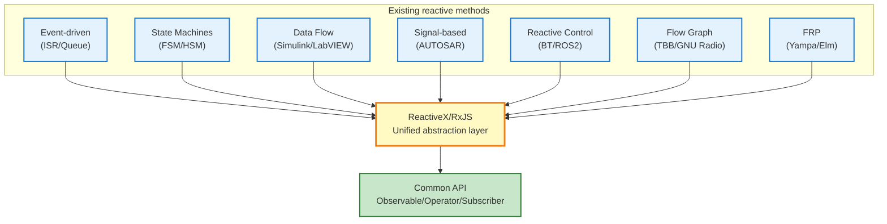

# Reactive methods other than ReactiveX (embedded perspective)

The idea of reactive programming has been widely practiced in the field of embedded systems and control engineering even before the advent of ReactiveX (RxJS).

This page systematically organizes **methods** that realize reactive programming principles without ReactiveX and clarifies their relevance to RxJS.

## The Essence of Reactive Programming

At the core of reactive programming are three principles:

1. **Data Flow** - Data is treated as a stream that changes over time
2. **Event-Driven** - Processing is automatically executed when an event occurs
3. **Declarative** - Describes "what to do"; "when and how" is abstracted

These principles are also realized in many other methods besides ReactiveX.

::: info Essence of ReactiveX
ReactiveX did not **invent** reactivity, but rather **standardized** existing practices into a unified abstraction layer.
:::

## Reactive methods other than ReactiveX

Seven typical reactive methods used in embedded systems and control engineering are presented.

| # | Technique | Summary | Typical tools/frameworks |
|---|------|------|--------------------------|
| 1 | **Event-driven architecture** | Asynchronous processing of events with ISRs/queues | RTOS (FreeRTOS, Zephyr) |
| 2 | **State machine (FSM/HSM)** | Transition state according to events | QPC, SCXML, Yakindu |
| 3 | **Data flow programming** | Drives nodes along the data flow | Simulink, LabVIEW, SCADE |
| 4 | **Signal Based Control** | Propagate value updates throughout the system | AUTOSAR COM Stack, Simulink |
| 5 | **Reactive control system** | Behavioral choices in response to environmental changes | Behavior Tree, ROS2 |
| 6 | **Flow Graph Library** | Explicitly parallelize data dependencies | Intel TBB, GNU Radio, StreamIt |
| 7 | **Functional reactive programming** | Treat time-varying values as a function | Haskell Yampa, Elm, Dunai |

## 1. Event-Driven Architecture

The interrupt service routine (ISR) captures events and notifies the task via a message queue.

### Example implementation in C

```c
// Event queue (global)
typedef struct {
    EventType type;
    void* data;
} Event;

Event eventQueue[EVENT_QUEUE_SIZE];
int queueHead = 0;
int queueTail = 0;

// Interrupt Service Routine (ISR)
void ISR_SensorUpdate() {
    // Reads data from sensors
    SensorData* data = readSensor();

    // Push to event queue
    Event e = { EVENT_SENSOR_NEW_DATA, data };
    EventQueue_push(e);
}

// Main task
void Task_MainLoop() {
    Event e;
    while (1) {
        if (EventQueue_pop(&e)) {
            switch (e.type) {
                case EVENT_SENSOR_NEW_DATA:
                    processSensorData((SensorData*)e.data);
                    break;
                case EVENT_TIMER_EXPIRED:
                    handleTimeout();
                    break;
                // ... Other event processing
            }
        }
    }
}
```

### Correspondence with RxJS

| Event driven model | RxJS |
|-----------------|------|
| `EventQueue` | `Observable` |
| `Task_MainLoop` | `subscribe()` |
| `ISR_SensorUpdate` | `next()` |
| Event Type | Stream value type |

::: tip Event-driven features
- Widely used in RTOS (Real-Time Operating System)
- Clear separation of interrupt and task processing
- Asynchronous processing with queuing
:::

## 2. State Machine (State Machine / FSM / HSM)

A Finite State Machine (FSM) or Hierarchical State Machine (HSM) is a pattern that transitions states based on event input.

### State machine example (C language)

```c
typedef enum {
    STATE_IDLE,
    STATE_RUNNING,
    STATE_ERROR,
    STATE_SHUTDOWN
} State;

typedef enum {
    EVENT_START,
    EVENT_STOP,
    EVENT_ERROR_DETECTED,
    EVENT_RESET
} Event;

State currentState = STATE_IDLE;

void stateMachine(Event event) {
    switch (currentState) {
        case STATE_IDLE:
            if (event == EVENT_START) {
                currentState = STATE_RUNNING;
                startOperation();
            }
            break;

        case STATE_RUNNING:
            if (event == EVENT_STOP) {
                currentState = STATE_IDLE;
                stopOperation();
            } else if (event == EVENT_ERROR_DETECTED) {
                currentState = STATE_ERROR;
                handleError();
            }
            break;

        case STATE_ERROR:
            if (event == EVENT_RESET) {
                currentState = STATE_IDLE;
                resetSystem();
            }
            break;

        // ... Other conditions
    }
}
```

### Typical tools
- **QPC (Quantum Platform)** - Hierarchical state machine framework
- **SCXML (State Chart XML)** - W3C standard state machine description language
- **Yakindu Statechart Tools** - State Chart Modeling Tools

### Corresponding expressions in RxJS

```typescript
import { Subject, scan } from 'rxjs';

type State = 'IDLE' | 'RUNNING' | 'ERROR' | 'SHUTDOWN';
type Event = 'START' | 'STOP' | 'ERROR_DETECTED' | 'RESET';

const events$ = new Subject<Event>();

const state$ = events$.pipe(
  scan((state: State, event: Event): State => {
    switch (state) {
      case 'IDLE':
        return event === 'START' ? 'RUNNING' : state;
      case 'RUNNING':
        if (event === 'STOP') return 'IDLE';
        if (event === 'ERROR_DETECTED') return 'ERROR';
        return state;
      case 'ERROR':
        return event === 'RESET' ? 'IDLE' : state;
      default:
        return state;
    }
  }, 'IDLE' as State)
);

state$.subscribe(state => console.log('Current state:', state));

// Event firing
events$.next('START');   // → RUNNING
events$.next('STOP');    // → IDLE
```

::: info Advantages of Hierarchical State Machines (HSM)
HSMs can group multiple states and have a structure similar to `share` and `shareReplay` in RxJS that "brings together multiple subscriptions".
:::

## 3. Dataflow Programming

A visual programming technique that drives nodes according to the flow of data.

### Typical tools
- **MATLAB Simulink** - Control System Design and Simulation
- **LabVIEW (National Instruments)** - Measurement and control system development
- **SCADE (Esterel Technologies)** - Safety-critical systems (aerospace and rail)

### Simulink data flow image

```
[Sensor] → [Low-Pass Filter] → [Threshold] → [Condition] → [Actuator]
   ↓              ↓                 ↓              ↓             ↓
Raw value   Smoothing value   Decision value  True/False    Output
```

### Corresponding expressions in RxJS

```typescript
import { interval } from 'rxjs';
import { map, filter, tap } from 'rxjs';

// Sensor Streams
const sensor$ = interval(100).pipe(
  map(() => Math.random() * 100) // Simulation of sensor values
);

// Data flow pipeline
sensor$
  .pipe(
    map(value => lowPassFilter(value)),        // Low-pass filter
    map(value => value > 50 ? value : 0),      // Thresholding
    filter(value => value > 0),                // Condition determination
    tap(value => actuate(value))               // Actuator drive
  )
  .subscribe();

function lowPassFilter(value: number): number {
  // Simple low-pass filter (moving average)
  return value * 0.3 + previousValue * 0.7;
}

function actuate(value: number): void {
  console.log('Actuator output:', value);
}
```

::: tip Features of Data Flow Programming
- Visual data flow can be grasped visually
- Widely adopted in control engineering and signal processing
- Very similar in structure to RxJS pipeline (`.pipe()`)
:::

## 4. Signal-Based Control

A pattern in which value updates are propagated throughout the system. Typical examples are AUTOSAR COM Stack and Simulink, which are standardized in the automotive industry.

### Images of the AUTOSAR COM Stack

```c
// Signal Definition
typedef struct {
    uint16_t speed;        // Speed [km/h]
    uint8_t temperature;   // Temperature [°C]
    bool doorOpen;         // Door open/close status
} VehicleSignals;

VehicleSignals currentSignals;

// Signal Update
void updateSpeed(uint16_t newSpeed) {
    currentSignals.speed = newSpeed;
    // COM Stack notifies subscribers
    Com_SendSignal(SIGNAL_ID_SPEED, &currentSignals.speed);
}

// Signal Subscription
void speedMonitor() {
    uint16_t speed;
    Com_ReceiveSignal(SIGNAL_ID_SPEED, &speed);

    if (speed > 120) {
        triggerSpeedWarning();
    }
}
```

### Support in RxJS (BehaviorSubject)

```typescript
import { BehaviorSubject } from 'rxjs';

interface VehicleSignals {
  speed: number;
  temperature: number;
  doorOpen: boolean;
}

// BehaviorSubject - Retain current value
const vehicleSignals$ = new BehaviorSubject<VehicleSignals>({
  speed: 0,
  temperature: 20,
  doorOpen: false
});

// Signal Update
function updateSpeed(newSpeed: number) {
  const current = vehicleSignals$.value;
  vehicleSignals$.next({ ...current, speed: newSpeed });
}

// Signal Subscription
vehicleSignals$.subscribe(signals => {
  if (signals.speed > 120) {
    console.log('⚠️ Overspeed Warning');
  }
});

updateSpeed(130); // → Warning triggered
```

::: info Features of Signal-Based Control
- **Current value is always retained** - Same characteristics as BehaviorSubject
- Widely used in AUTOSAR (automotive industry standard)
- Used for communication between ECUs (Electronic Control Units)
:::

## 5. Reactive Control Systems

A method to implement action selection in response to environmental changes for robotics and automated driving.

### Typical frameworks
- **Behavior Tree (BT)** - Game AI, Robot Control
- **ROS2 (Robot Operating System 2)** - Robot development platform

### Behavior Tree Structure

```
Selector (OR)
├─ Sequence (AND)
│  ├─ Condition: Battery level > 20%
│  └─ Action: Go to destination
└─ Action: Go to charging station
```

### Reactive Patterns in ROS2 (Python)

```python
import rclpy
from rclpy.node import Node
from sensor_msgs.msg import LaserScan

class ObstacleDetector(Node):
    def __init__(self):
        super().__init__('obstacle_detector')
        # Subscribe to data from LiDAR sensor
        self.subscription = self.create_subscription(
            LaserScan,
            '/scan',
            self.laser_callback,
            10
        )

    def laser_callback(self, msg):
        # Obtain minimum distance
        min_distance = min(msg.ranges)

        # Reaction to obstacle detection
        if min_distance < 0.5:  # Within 50 cm
            self.get_logger().warn('Obstacle detected! Stops')
            self.stop_robot()
```

### Corresponding expressions in RxJS

```typescript
import { fromEvent } from 'rxjs';
import { map, filter } from 'rxjs';

// LiDAR Sensor Data Stream
const lidarData$ = fromEvent<LaserScan>(lidarSensor, 'scan');

lidarData$
  .pipe(
    map(scan => Math.min(...scan.ranges)),  // Get minimum distance
    filter(minDistance => minDistance < 0.5) // Within 50 cm
  )
  .subscribe(() => {
    console.warn('⚠️ Obstacle detection! Stop.');
    stopRobot();
  });
```

::: tip Reactive Control Applications
- Obstacle avoidance for self-driving cars
- Autonomous drone flight
- Safety control of industrial robots
:::

## 6. Flow Graph Libraries

Libraries that explicitly handle data dependencies in a multi-threaded environment.

### Typical Libraries
- **Intel TBB (Threading Building Blocks) Flow Graph**
- **GNU Radio** - Software Defined Radio (SDR)
- **StreamIt (MIT)** - Stream Processing Language

### Intel TBB Flow Graph example (C++)

```cpp
#include <tbb/flow_graph.h>
#include <iostream>

int main() {
    tbb::flow::graph g;

    // Broadcast Node (Observable role)
    tbb::flow::broadcast_node<int> source(g);

    // Conversion Node (map-like role)
    tbb::flow::function_node<int, int> multiply(
        g,
        tbb::flow::unlimited,
        [](int x) { return x * 2; }
    );

    tbb::flow::function_node<int, int> add(
        g,
        tbb::flow::unlimited,
        [](int x) { return x + 10; }
    );

    // Output Node (subscribe-like role)
    tbb::flow::function_node<int> output(
        g,
        tbb::flow::unlimited,
        [](int x) { std::cout << "Result: " << x << std::endl; }
    );

    // Edge connection
    tbb::flow::make_edge(source, multiply);
    tbb::flow::make_edge(multiply, add);
    tbb::flow::make_edge(add, output);

    // Data Injection
    source.try_put(5);  // → Result: 20 (5 * 2 + 10)
    g.wait_for_all();

    return 0;
}
```

### Corresponding expressions in RxJS

```typescript
import { of } from 'rxjs';
import { map } from 'rxjs';

of(5)
  .pipe(
    map(x => x * 2),      // multiply
    map(x => x + 10)      // add
  )
  .subscribe(result => {
    console.log('Result:', result); // → Result: 20
  });
```

::: info Flow Graph Features
- **Optimization of parallel execution** - Explicitly manages data dependencies
- Efficiently utilizes CPU multi-cores
- Widely used in signal processing, image processing, and communication systems
:::

## 7. Functional Reactive Programming (FRP)

Functional Reactive Programming (FRP) is the theoretical foundation of reactive programming.

### Representative Languages and Libraries
- **Haskell Yampa** - Game development, robotics
- **Elm** - Web front-end (type-safe React-like framework)
- **Dunai** - Generic FRP libraries

### Haskell Yampa Example

```haskell
import FRP.Yampa

-- Defining a Signal Function
-- Time-dependent conversion from Input to Output
simpleSF :: SF Double Double
simpleSF = arr (\x -> x * 2)       -- Double the value
       >>> integral                -- Integral (cumulative in time)
       >>> arr (\x -> x + 10)      -- Add 10

-- Execution example
-- Input: value changing over time (e.g. sensor value)
-- Output: stream of converted values
```

### Corresponding expressions in RxJS

```typescript
import { interval } from 'rxjs';
import { map, scan } from 'rxjs';

const simpleSF$ = interval(100).pipe(
  map(x => x * 2),                         // arr (\x -> x * 2)
  scan((acc, value) => acc + value, 0),    // integral (integral = accumulated)
  map(x => x + 10)                         // arr (\x -> x + 10)
);

simpleSF$.subscribe(result => console.log(result));
```

### FRP Key Concepts

| FRP Concept | Description | RxJS Correspondence |
|--------|------|----------|
| **Signal** | Values that change with time | `Observable` |
| **Event** | Discrete events | `Subject` |
| **Signal Function (SF)** | Signal transformation functions | `pipe()` + Operator |
| **Behavior** | Time-varying always with value | `BehaviorSubject` |

::: info Importance of FRP
FRP is the **theoretical foundation** of ReactiveX; concepts developed in pure functional languages such as Haskell are carried over to RxJS and ReactiveX.
:::

## Positioning of ReactiveX

The essence of ReactiveX becomes clear when we consider the seven methods we have looked at so far.

### The Role of ReactiveX



ReactiveX serves as a **common language** that can work across these existing methods.

### Advantages of ReactiveX

| Perspective | Conventional Methods | ReactiveX/RxJS |
|------|-----------|---------------|
| **Learning costs** | Different concepts and tools for different fields | Unified API (Observable/Operator) |
| **Portability** | Strong platform dependence | Concepts common across languages (RxJava, RxSwift, etc.) |
| **Composability** | Difficult to combine between methods | Flexible synthesizability with operators |
| **Debugging** | Requires field-specific tools | Common tools such as RxJS DevTools, tap, etc. |
| **Testing** | Complex testing of asynchronous processes | TestScheduler, Marble Testing |

::: tip The Nature of ReactiveX
ReactiveX is not an **invention, but an integration**. It is important to learn about existing reactive methods and understand them as layers of abstraction that can be handled in a unified manner.
:::

## How to use it in practice

Each method has a suitable application area.

### Comparison of Application Areas

| Method | Optimal Application | Learning cost | Portability |
|------|----------|-----------|--------|
| **Event driven (ISR/Queue)** | RTOS-based embedded control | Low | Low (platform dependent) |
| **State Machine (FSM/HSM)** | Control requiring complex state transitions | Medium | Medium (can be abstracted by QPC, etc.) |
| **Data Flow (Simulink)** | Control system design and simulation | High | Low (tool-dependent) |
| **Signal-based (AUTOSAR)** | Communication between automotive ECUs | High | Low (industry standard but specialized) |
| **Reactive Control (ROS2)** | Robotics, automated driving | Medium | Medium (ROS2 ecosystem) |
| **Flow Graph (TBB)** | Parallel processing, signal processing | Medium | Medium (C++ environment) |
| **FRP (Haskell)** | Type safety-oriented, academic research | High | Low (functional language) |
| **ReactiveX (RxJS)** | Web apps, IoT edge processing, general purpose | Medium | **High (multilingual support)** |

### Selection Guidelines

::: warning Hard real-time control (in microseconds)
→ **Event driven (ISR/Queue)** or **Dedicated RTOS**

ReactiveX is not suitable (large overhead)
:::

::: tip Soft real-time control (in milliseconds)
→ **ReactiveX/RxJS** is optimal

Sensor integration, event correlation detection, anomaly detection, etc.
:::

::: info If there is an existing tool chain
→ **Prefer standard tools in the field**

E.g.: Automotive industry → AUTOSAR, Robotics → ROS2
:::

## Summary

The idea of reactive programming has been practiced in many fields before the advent of ReactiveX.

### Important Points

1. **ReactiveX is an integrator** - a common language that can work across existing methods
2. **Optimal solution for each field** - each method has a suitable application domain
3. **Conceptual commonality** - event-driven, dataflow, declarative descriptions are common
4. **Learning synergy** - deep understanding of one method facilitates understanding of other methods

### Significance of learning ReactiveX

::: info What you get by learning ReactiveX

1. **Cross-cutting understanding** - concepts common across embedded, web, and mobile
2. **Portability skills** - multi-language support including RxJava, RxSwift, RxKotlin, etc.
3. **Unified debugging and testing methodologies** - RxJS DevTools, Marble Testing
4. **Understand the nature of existing methodologies** - theoretical foundations such as event-driven, state machines, etc.

:::

Whether embedded systems or web applications, **the essence of reactive programming remains the same**, and ReactiveX is a powerful tool that integrates these insights and provides modern abstractions.

## Related Pages

- [Embedded Development and Reactive Programming](/pt/guide/appendix/embedded-reactive-programming) - Using RxJS in Embedded Systems
- [Introduction to RxJS](/pt/guide/introduction) - Basic Concepts of RxJS
- [What is Observable](/pt/guide/observables/what-is-observable) - The Basics of Observable
- [What is Subject](/pt/guide/subjects/what-is-subject) - Details of BehaviorSubject, etc.
- [Overview of Operators](/pt/guide/operators/) - Data Conversion and Filtering

## References

- [GitHub Discussions - Reactive methods other than ReactiveX (embedded perspective)](https://github.com/shuji-bonji/RxJS-with-TypeScript/discussions/14)
- [QPC (Quantum Platform)](https://www.state-machine.com/qpc/) - Hierarchical State Machine Framework
- [Intel TBB Flow Graph](https://www.intel.com/content/www/us/en/docs/onetbb/developer-guide-api-reference/2021-14/flow-graph.html)
- [ROS2 Documentation](https://docs.ros.org/en/rolling/)
- [AUTOSAR Classic Platform](https://www.autosar.org/standards/classic-platform/)
- [Functional Reactive Programming (FRP)](https://wiki.haskell.org/Functional_Reactive_Programming)
