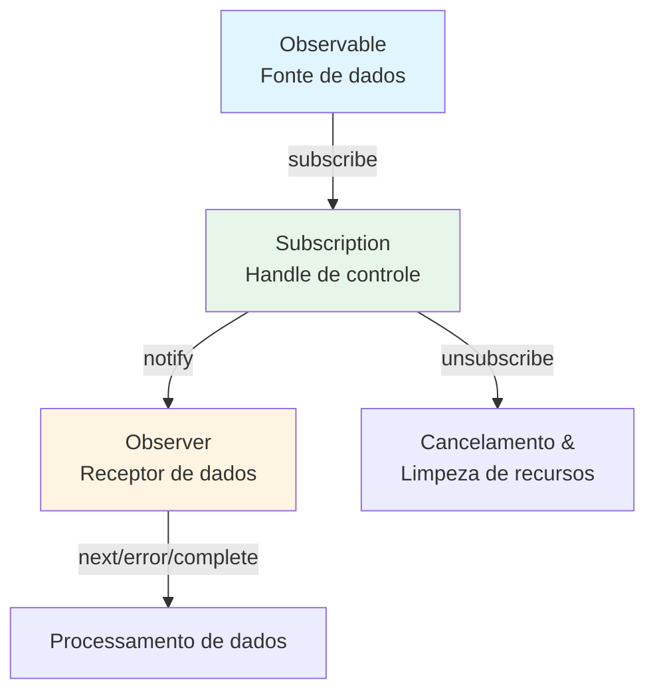

# O que é um Stream?

## Definição de Stream

Um "stream" refere-se a **um fluxo de dados que ocorre sequencialmente ao longo do tempo**. Ele pode ser visto como uma coleção de dados que aparecem um após o outro em uma determinada ordem.

### Exemplos de Streams Típicos na Programação Tradicional
- Dados de leituras de arquivos (por exemplo, ReadableStream no Node.js)
- Comunicações de rede (por exemplo, respostas HTTP)
- Entrada e eventos do usuário (movimentos do mouse, cliques, entradas do teclado)

## Streams no RxJS

O RxJS usa **Observable** para tratar esses dados que ocorrem ao longo do tempo como um stream. Observable é um mecanismo para abstrair dados assíncronos, dados síncronos, eventos e processamento baseado em tempo como "streams".

### Vantagens do Observable
- Pode ser descrito de maneira segura para tipos (afinidade com TypeScript)
- Expressão declarativa do fluxo de dados
- Encadeamento de operações com `pipe()` é possível
- Pode se inscrever explicitamente com `subscribe()`
- Cancelável com `unsubscribe()`

## Comparação com Streams Convencionais

| Característica | Streams Convencionais | RxJS Observable |
|------|------------------|-------------------|
| Alvo | Tende a ser limitado a arquivos/redes, etc. | Qualquer mudança assíncrona/evento/estado |
| Manipulação de eventos | Manipulado por event listeners caso a caso | Streaming com `fromEvent` |
| Cancelamento | Métodos diferentes | Gerenciamento unificado com `unsubscribe()` |
| Composição/Conversão | Implementação separada com código procedural | Descrição concisa com operadores (`map`, `filter`, etc.) |

## Relacionamento com Observer & Subscription

- **Observable**: Fonte de dados (origem do stream)
- **Observer**: Receptor de dados (com next, error, complete)
- **Subscription**: Handle de controle para subscription (subscribe, unsubscribe, gerenciamento de recursos)

Observable e Observer são conectados através de callbacks e controlados pela Subscription.

### Diagrama de Relacionamento Básico

## Resumo

O conceito de "streams", que está no centro do RxJS, é uma ferramenta poderosa ao lidar com processamento assíncrono. O Observable permite que você manipule várias fontes de dados de forma unificada e descreva fluxos de dados de maneira declarativa e flexível.

## Relação com o Processamento de Eventos

No RxJS, eventos DOM também podem ser tratados como streams usando `fromEvent`.
O conceito de stream fica mais claro ao comparar as diferenças com event listeners convencionais.

> [!TIP]
> Consulte [Streaming de Eventos](/pt/guide/observables/events.md#comparison-between-traditional-event-processing-and-rxjs) para uma comparação entre o processamento de eventos tradicional e RxJS com código real.
