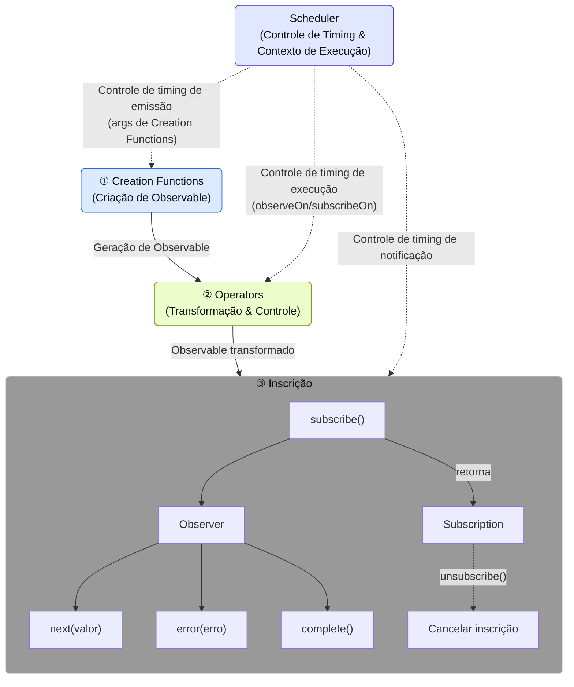
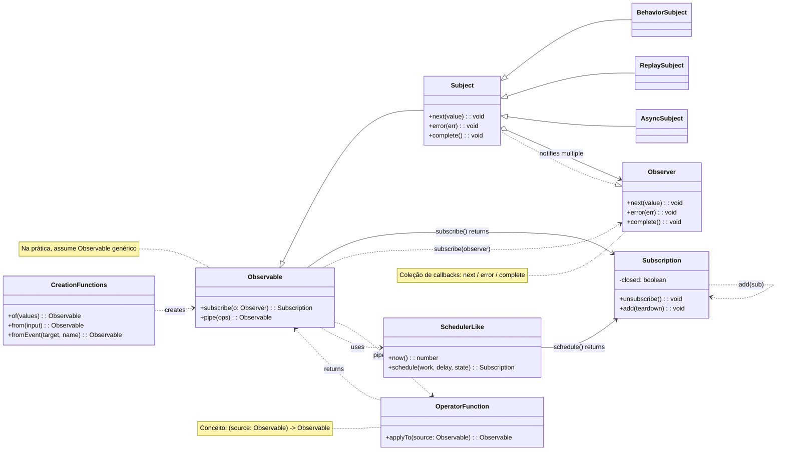

# O que é RxJS?

## Visão Geral
[RxJS (Reactive Extensions for JavaScript)](https://rxjs.dev) é uma biblioteca para "programação reativa" em JavaScript.

> ### O que é programação reativa?
> Programação reativa é um método de criar programas que são atualizados automaticamente em resposta a mudanças nos dados.
> É um tipo de programação orientada a eventos, com foco particular no tratamento de streams de dados assíncronos. Ela se concentra no fluxo (stream) de dados e constrói programas que reagem a esse fluxo.

Em outras palavras, RxJS é uma biblioteca para lidar com eventos e streams de dados assíncronos em um estilo funcional, fornecendo ferramentas poderosas para manipular streams de dados assíncronos usando o padrão Observable.

> Observable é o bloco de construção central do RxJS para representar eventos e streams de dados assíncronos. É uma fonte de valores que "fluem" e podem ser recebidos através de inscrição. Um Observable é um "stream de dados" que publica valores ao longo do tempo, e você pode receber esses valores inscrevendo-se nele.


> [!TIP]
> Se você está se perguntando, "Afinal, o que é um stream?" Por favor, consulte [O que é um Stream?](/pt/guide/basics/what-is-a-stream).


## Exemplo de Uso Simples

```ts
import { fromEvent } from 'rxjs';

fromEvent(document, 'click').subscribe(event => {
  console.log('Clicado:', event);
});
```

## Componentes Básicos do RxJS

Para dominar o RxJS, é importante entender os seguintes componentes centrais.

| Componente | Visão Geral |
|------|------|
| [`Observable`](../observables/what-is-observable.md) | A fonte do stream, que representa dados que ocorrem de forma assíncrona ou ao longo do tempo. |
| [`Observer`](../observables/observable-lifecycle.md#observer)[^observer]| A entidade que se inscreve e recebe dados do Observable. |
| [`Subscription`](../observables/observable-lifecycle.md#subscription) | Gerencia a inscrição e cancelamento da inscrição do Observable. |
| [`Creation Functions`](../creation-functions/index.md) | Um conjunto de funções para criar e combinar Observables. |
| [`Operator`](../operators/index.md) | Um conjunto de funções para converter e controlar um Observable. |
| [`Subject`](../subjects/what-is-subject.md)[^1] | É um relé que possui propriedades tanto de Observable quanto de Observer. |
| [`Scheduler`](../schedulers/async-control.md)[^2]| Um mecanismo para controlar o timing de execução do Observable. |

[^observer]: A classe Subscriber é usada como implementação. Para detalhes, consulte [Diferença entre Observer e Subscriber](../observables/observer-vs-subscriber.md).
[^1]: Um Subject é uma entidade especial que pode atuar tanto como um Observable que emite valores quanto como um Observer que recebe valores.
[^2]: Scheduler é usado para controlar o timing e contexto de execução do processamento assíncrono e também é útil para depuração e gerenciamento de desempenho.

Eles têm suas próprias funções independentes, mas trabalham juntos.
Por exemplo, Creation Functions criam e combinam Observables, Operators os transformam e controlam, Observers se inscrevem neles, e Schedulers controlam o timing de execução, constituindo assim o processamento de streams como um todo.

#### Componentes do RxJS e Fluxo de Dados


※ O uso detalhado e exemplos de cada componente são explicados separadamente em seus próprios capítulos dedicados.

### Diagrama de Classes dos Componentes



## Vantagens do RxJS

| Vantagem | Conteúdo |
|---|---|
| Código declarativo[^3] | Descreve "o que você quer fazer" com `map`, `filter`, etc. e evita descrições procedurais como loops for |
| Simplificar processamento assíncrono | Evita aninhamento de `Promise` e callbacks, escrevendo em um fluxo intuitivo |
| Tratamento de erros | Tratamento uniforme de erros em streams com `.pipe(catchError(...))`, etc. |
| Cancelável | O stream pode ser suspenso por `Subscription.unsubscribe()` |
| Diversos operadores | Muitos operadores como `debounceTime`, `mergeMap`, `combineLatest`, etc. podem ser usados para conversão e composição |

[^3]: > - Código declarativo: código direto que diz "que tipo de resultado você quer?"
      > - Código procedural: código que descreve "que tipo de cálculo deve ser realizado para obter o resultado desejado"


## Casos de Uso

O RxJS pode ser usado em qualquer situação em que você esteja lidando com "dados que mudam ao longo do tempo". Abaixo estão alguns dos principais casos de uso.

### Comunicação em Tempo Real e Streaming

O RxJS é especialmente poderoso ao lidar com comunicações em tempo real, como WebSockets e Server-Sent Events (SSE).

| Caso de Uso | Descrição | Operadores Principais |
|------|------|-------------------|
| Comunicação WebSocket | Chat, notificações, atualizações de preços de ações, etc. | [`webSocket`](../observables/creation.md#websocket), [`filter`](../operators/filtering/filter.md), [`map`](../operators/transformation/map.md) |
| Server-Sent Events | Notificações push de servidores | [`fromEvent`](../observables/events.md), [`retry`](../operators/utility/retry.md) |
| Monitoramento de Sensores IoT | Processamento contínuo de dados de sensores | [`debounceTime`](../operators/filtering/debounceTime.md), [`distinctUntilChanged`](../operators/filtering/distinctUntilChanged.md) |

#### Exemplo Simples
```ts
import { webSocket } from 'rxjs/webSocket';
import { filter } from 'rxjs';

const socket$ = webSocket('wss://example.com/chat');

socket$.pipe(
  filter(msg => msg.type === 'message')
).subscribe(msg => console.log('Nova mensagem:', msg.text));
```

### Gerenciamento de UI/Estado e Controle de Formulários

Tratamento reativo de entrada do usuário e mudanças de estado.

> [!NOTE] Relação com frameworks
> Frameworks front-end modernos (Angular Signals, React hooks, Vue Composition API, Svelte Runes, etc.) fornecem seus próprios sistemas reativos. RxJS é uma biblioteca independente de framework que pode ser usada em conjunto com ou separadamente destes. A integração do RxJS com mecanismos específicos de framework será discutida em detalhes no Capítulo 15, "Integração com Frameworks" (em preparação).

| Caso de Uso | Descrição | Operadores Principais |
|------|------|-------------------|
| Controle de formulário de entrada | Conclusão de pesquisa, validação em tempo real | [`debounceTime`](../operators/filtering/debounceTime.md), [`distinctUntilChanged`](../operators/filtering/distinctUntilChanged.md), [`switchMap`](../operators/transformation/switchMap.md) |
| Vinculação de múltiplos itens de formulário | Atualização de itens de entrada dependentes | [`combineLatest`](../creation-functions/combination/combineLatest.md), [`withLatestFrom`](../operators/combination/withLatestFrom.md) |
| Comunicação entre componentes | Event bus e gerenciamento de estado personalizado | [`Subject`](../subjects/what-is-subject.md), [`share`](../operators/multicasting/share.md) |
| Processamento de eventos de UI | Click, scroll, drag & drop | [`fromEvent`](../observables/events.md), [`takeUntil`](../operators/utility/takeUntil.md) |

#### Exemplo Simples
```ts
import { fromEvent, combineLatest } from 'rxjs';
import { debounceTime, map, switchMap } from 'rxjs';

const searchInput = document.querySelector('#search') as HTMLInputElement;
const sortSelect = document.querySelector('#sort') as HTMLInputElement;

const search$ = fromEvent(searchInput, 'input').pipe(
  map(e => (e.target as HTMLInputElement).value)
);

const sort$ = fromEvent(sortSelect, 'change').pipe(
  map(e => (e.target as HTMLSelectElement).value)
);

combineLatest([search$, sort$]).pipe(
  debounceTime(300),
  switchMap(([query, order]) =>
    fetch(`/api/search?q=${query}&sort=${order}`).then(r => r.json())
  )
).subscribe(results => console.log(results));
```

### Suporte Offline e PWA

Pode ser usado para suporte offline e gerenciamento de status de rede em Progressive Web App (PWA).

| Caso de Uso | Descrição | Operadores Principais |
|------|------|-------------------|
| Monitoramento de Condição de Rede | Detecção online/offline | [`fromEvent`](../observables/events.md), [`merge`](../creation-functions/combination/merge.md) |
| Tentar novamente quando offline | Ressincronização automática quando a conexão é restaurada | [`retry`](../operators/utility/retry.md), [`retryWhen`](../error-handling/retry-catch.md) |
| Controle de cache | Integração com Service Worker | [`switchMap`](../operators/transformation/switchMap.md), [`catchError`](../error-handling/retry-catch.md) |

#### Exemplo Simples
```ts
import { fromEvent, merge } from 'rxjs';
import { map, startWith } from 'rxjs';

const online$ = fromEvent(window, 'online').pipe(map(() => true));
const offline$ = fromEvent(window, 'offline').pipe(map(() => false));

merge(online$, offline$).pipe(
  startWith(navigator.onLine)
).subscribe(isOnline => {
  console.log(isOnline ? 'Online' : 'Offline');
});
```

### API de IA/Streaming

Isso também é ideal para lidar com respostas de API de streaming, como OpenAI.

| Caso de Uso | Descrição | Operadores Principais |
|------|------|-------------------|
| Saída sequencial de tokens | Exibição em tempo real de respostas de IA | [`concatMap`](../operators/transformation/concatMap.md), [`scan`](../operators/transformation/scan.md) |
| Processamento de streaming | Processamento de Server-Sent Events | [`fromEvent`](../observables/events.md), [`map`](../operators/transformation/map.md) |
| Integração de back-end | Uso com NestJS (padrão RxJS) | Vários operadores |

### Comunicação HTTP e Tratamento de Erros

A comunicação HTTP assíncrona pode ser tratada de forma elegante.

| Caso de Uso | Descrição | Operadores Principais |
|------|------|-------------------|
| Requisições de API | Comunicação com APIs RESTful | [`switchMap`](../operators/transformation/switchMap.md), [`mergeMap`](../operators/transformation/mergeMap.md) |
| Tratamento de erros | Tentativas e fallbacks | [`catchError`](../error-handling/retry-catch.md), [`retry`](../operators/utility/retry.md) |
| Controle de timeout | Limites de tempo de resposta | [`timeout`](../operators/utility/timeout.md) |
| Cancelamento | Interrupção de requisições desnecessárias | [`takeUntil`](../operators/utility/takeUntil.md), `unsubscribe()` |

### Gerenciamento de Estado e Arquitetura

Também pode ser usado para projetar a arquitetura geral da aplicação.

| Caso de Uso | Descrição | Operadores Principais |
|------|------|-------------------|
| Bibliotecas de Gerenciamento de Estado | NgRx, Redux-Observable, etc. | [`scan`](../operators/transformation/scan.md), [`share`](../operators/multicasting/share.md) |
| Gerenciamento de fluxo de eventos | Utilização em DDD (Domain Driven Design) | [`Subject`](../subjects/what-is-subject.md), [`shareReplay`](../operators/multicasting/shareReplay.md) |
| Separação de camada de dados | Clean architecture | Vários operadores |

---

> [!TIP]
> Veja também [a diferença entre Promise e RxJS](./promise-vs-rxjs.md) para mais informações sobre o uso de Promise e RxJS.

## Resumo

O RxJS oferece uma abordagem poderosa para programação assíncrona e baseada em eventos, e sua filosofia de fluxo de dados centrada em Observable é particularmente útil ao lidar com processamento assíncrono complexo.
