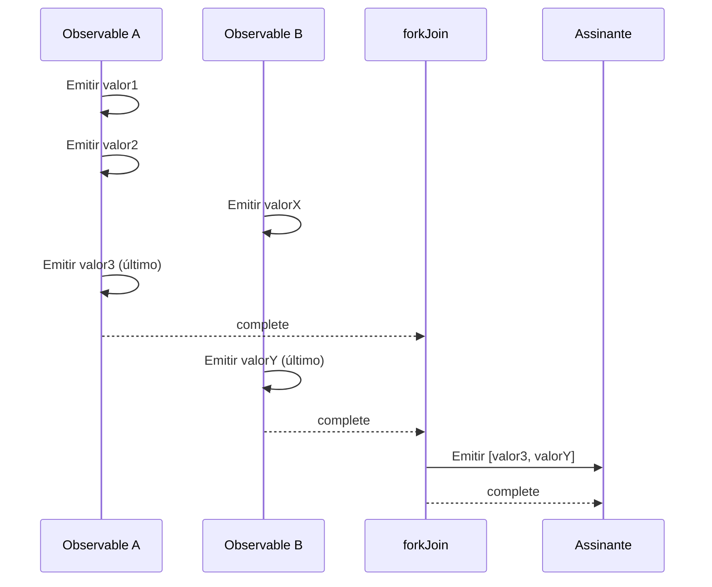
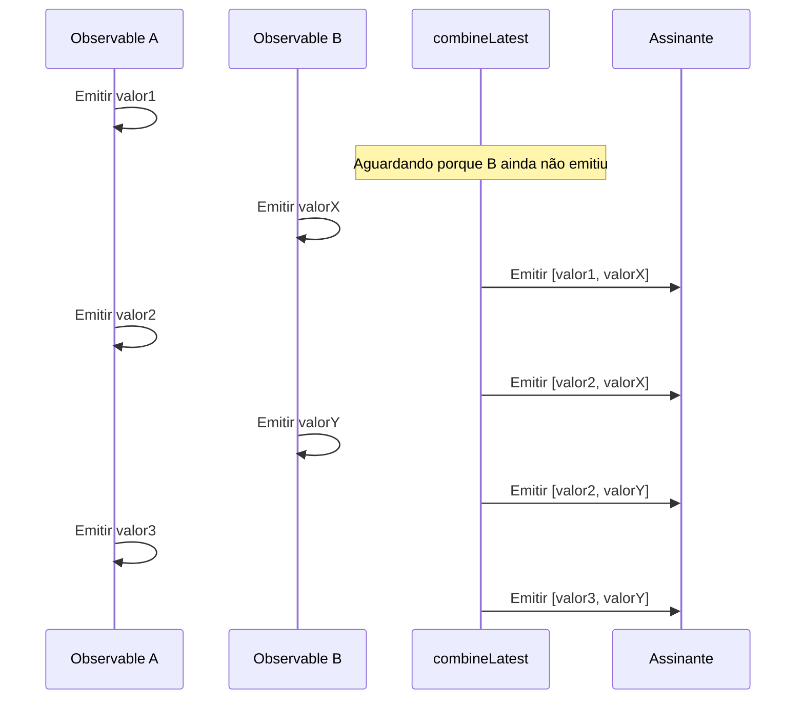
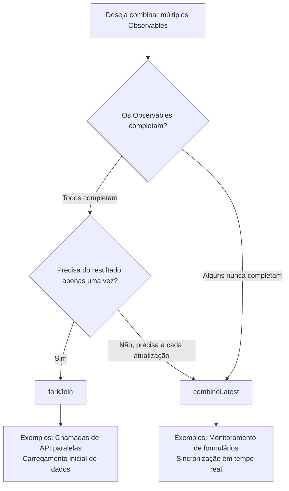

# Diferença Entre forkJoin e combineLatest

Ao combinar múltiplos Observables no RxJS, `forkJoin` e `combineLatest` são as Creation Functions mais comumente usadas. No entanto, essas duas têm **comportamentos significativamente diferentes**, e usá-las incorretamente não produzirá os resultados esperados.

Esta página compara minuciosamente ambas usando diagramas e exemplos práticos, deixando claro "qual usar".

## Conclusão: Diferença Entre forkJoin e combineLatest

| Característica | forkJoin | combineLatest |
|---------|----------|---------------|
| **Momento de Emissão** | **Uma vez** após todos completarem | **Toda vez** que um valor é atualizado |
| **Valor Emitido** | **Último valor** de cada Observable | **Valor mais recente** de cada Observable |
| **Condição de Conclusão** | Todos os Observables completam | Todos os Observables completam |
| **Principais Casos de Uso** | Chamadas de API paralelas, carregamento inicial de dados | Monitoramento de formulários, sincronização em tempo real |
| **Fluxos Infinitos** | ❌ Não pode usar (nunca completa) | ✅ Pode usar (emite valores mesmo sem conclusão) |

> [!TIP]
> **Maneira fácil de lembrar**
> - `forkJoin` = "Uma vez que todos estejam prontos, **partir uma vez**" (similar ao Promise.all)
> - `combineLatest` = "**Relatar o status mais recente** toda vez que alguém se move"

## Compreendendo Diferenças de Comportamento com Diagramas

### Comportamento do forkJoin



**Ponto-Chave**: Aguarda até que todos os Observables façam `complete`, então emite **apenas os últimos valores** uma vez.

### Comportamento do combineLatest



**Ponto-Chave**: Após todos os Observables emitirem seu primeiro valor, **emite a combinação mais recente toda vez que qualquer um atualiza**.

## Visualização em Linha do Tempo das Diferenças

```mermaid
gantt
    title Momento de Emissão forkJoin vs combineLatest
    dateFormat X
    axisFormat %s

    section Observable A
    valor1 :a1, 0, 1
    valor2 :a2, 2, 1
    valor3 :a3, 4, 1
    complete :milestone, a_done, 5, 0

    section Observable B
    valorX :b1, 1, 1
    valorY :b2, 3, 1
    complete :milestone, b_done, 4, 0

    section Emissão forkJoin
    [valor3,valorY] :crit, fork_out, 5, 1

    section Emissão combineLatest
    [valor1,valorX] :c1, 1, 1
    [valor2,valorX] :c2, 2, 1
    [valor2,valorY] :c3, 3, 1
    [valor3,valorY] :c4, 4, 1
```



## Comparação Prática: Verificar Comportamento com a Mesma Fonte de Dados

Aplique tanto `forkJoin` quanto `combineLatest` aos mesmos Observables e verifique as diferenças de saída.

```ts
import { forkJoin, combineLatest, interval, take, map } from 'rxjs';

// Criar área de saída
const output = document.createElement('div');
output.innerHTML = '<h3>Comparação forkJoin vs combineLatest:</h3>';
document.body.appendChild(output);

// Criar dois Observables
const obs1$ = interval(1000).pipe(
  take(3),
  map(i => `A${i}`)
);

const obs2$ = interval(1500).pipe(
  take(2),
  map(i => `B${i}`)
);

// Área de exibição de resultado forkJoin
const forkJoinResult = document.createElement('div');
forkJoinResult.innerHTML = '<h4>forkJoin:</h4><div id="forkjoin-output">Aguardando...</div>';
output.appendChild(forkJoinResult);

// Área de exibição de resultado combineLatest
const combineLatestResult = document.createElement('div');
combineLatestResult.innerHTML = '<h4>combineLatest:</h4><div id="combinelatest-output"></div>';
output.appendChild(combineLatestResult);

// forkJoin: Emite uma vez após todos completarem
forkJoin([obs1$, obs2$]).subscribe(result => {
  const el = document.getElementById('forkjoin-output');
  if (el) {
    el.textContent = `Emissão: [${result.join(', ')}]`;
    el.style.color = 'green';
    el.style.fontWeight = 'bold';
  }
});

// combineLatest: Emite toda vez que valores atualizam
const combineOutput = document.getElementById('combinelatest-output');
combineLatest([obs1$, obs2$]).subscribe(result => {
  if (combineOutput) {
    const item = document.createElement('div');
    item.textContent = `Emissão: [${result.join(', ')}]`;
    combineOutput.appendChild(item);
  }
});
```

**Resultados da Execução**:
- `forkJoin`: Emite `[A2, B1]` **uma vez** após cerca de 3 segundos
- `combineLatest`: Emite **4 vezes** começando de cerca de 1.5 segundos (por exemplo, `[A0, B0]` → `[A1, B0]` → `[A2, B0]` → `[A2, B1]`)

> [!NOTE]
> A ordem de emissão do `combineLatest` depende do agendamento do timer e pode variar por ambiente. O ponto-chave é "ele emite toda vez que qualquer valor é atualizado". Neste exemplo, 4 emissões ocorrem, mas a ordem pode mudar como `[A1, B0]` → `[A1, B1]`.

## Quando Usar Qual (Guia Caso a Caso)

### Casos para Usar forkJoin

#### 1. Chamadas de API Paralelas

Quando você deseja processar apenas após todos os dados estarem prontos.

```ts
import { forkJoin } from 'rxjs';
import { ajax } from 'rxjs/ajax';

// Buscar informações de usuário e configurações simultaneamente
forkJoin({
  user: ajax.getJSON('/api/user/123'),
  settings: ajax.getJSON('/api/settings'),
  notifications: ajax.getJSON('/api/notifications')
}).subscribe(({ user, settings, notifications }) => {
  // Renderizar painel após todos os dados estarem prontos
  renderDashboard(user, settings, notifications);
});
```

#### 2. Busca em Massa de Dados no Carregamento Inicial

Buscar dados mestres necessários na inicialização do aplicativo todos de uma vez.

```ts
import { forkJoin } from 'rxjs';
import { ajax } from 'rxjs/ajax';

function loadInitialData() {
  return forkJoin({
    categories: ajax.getJSON('/api/categories'),
    countries: ajax.getJSON('/api/countries'),
    currencies: ajax.getJSON('/api/currencies')
  });
}
```

> [!WARNING]
> `forkJoin` não pode ser usado com **Observables que nunca completam** (`interval`, WebSocket, fluxos de eventos, etc.). Ele aguardará para sempre se não completarem.

### Casos para Usar combineLatest

#### 1. Monitoramento de Entrada de Formulário em Tempo Real

Combine múltiplos valores de entrada para validação ou atualizações de exibição.

```ts
import { combineLatest, fromEvent } from 'rxjs';
import { map, startWith } from 'rxjs';

const name$ = fromEvent(nameInput, 'input').pipe(
  map(e => (e.target as HTMLInputElement).value),
  startWith('')
);

const email$ = fromEvent(emailInput, 'input').pipe(
  map(e => (e.target as HTMLInputElement).value),
  startWith('')
);

const age$ = fromEvent(ageInput, 'input').pipe(
  map(e => parseInt((e.target as HTMLInputElement).value) || 0),
  startWith(0)
);

// Executar validação sempre que qualquer entrada mudar
combineLatest([name$, email$, age$]).subscribe(([name, email, age]) => {
  const isValid = name.length > 0 && email.includes('@') && age >= 18;
  submitButton.disabled = !isValid;
});
```

#### 2. Sincronização em Tempo Real de Múltiplos Fluxos

Exibição integrada de dados de sensores ou status.

```ts
import { combineLatest, interval } from 'rxjs';
import { map } from 'rxjs';

const temperature$ = interval(2000).pipe(map(() => 20 + Math.random() * 10));
const humidity$ = interval(3000).pipe(map(() => 40 + Math.random() * 30));
const pressure$ = interval(2500).pipe(map(() => 1000 + Math.random() * 50));

combineLatest([temperature$, humidity$, pressure$]).subscribe(
  ([temp, humidity, pressure]) => {
    updateDashboard({ temp, humidity, pressure });
  }
);
```

#### 3. Combinando Condições de Filtro

Execute busca sempre que qualquer condição de filtro mudar.

```ts
import { combineLatest, BehaviorSubject } from 'rxjs';
import { debounceTime, switchMap } from 'rxjs';

const searchText$ = new BehaviorSubject('');
const category$ = new BehaviorSubject('all');
const sortOrder$ = new BehaviorSubject('asc');

combineLatest([searchText$, category$, sortOrder$]).pipe(
  debounceTime(300),
  switchMap(([text, category, sort]) =>
    fetchProducts({ text, category, sort })
  )
).subscribe(products => {
  renderProductList(products);
});
```

## Fluxograma de Decisão



## Erros Comuns e Soluções

### Erro 1: Usar forkJoin com Observables que Não Completam

```ts
// ❌ Isso nunca emitirá
forkJoin([
  interval(1000),  // Nunca completa
  ajax.getJSON('/api/data')
]).subscribe(console.log);

// ✅ Faça completar com take, ou use combineLatest
forkJoin([
  interval(1000).pipe(take(5)),  // Completa após 5
  ajax.getJSON('/api/data')
]).subscribe(console.log);
```

### Erro 2: combineLatest Sem Valores Iniciais

```ts
// ❌ Não emitirá mesmo se email$ tiver valor até name$ emitir primeiro
combineLatest([name$, email$]).subscribe(console.log);

// ✅ Definir valores iniciais com startWith
combineLatest([
  name$.pipe(startWith('')),
  email$.pipe(startWith(''))
]).subscribe(console.log);
```

## Resumo

| Critério de Seleção | forkJoin | combineLatest |
|-------------------|----------|---------------|
| Processar uma vez quando todos estiverem prontos | ✅ | ❌ |
| Processar toda vez que valores mudam | ❌ | ✅ |
| Fluxos que não completam | ❌ | ✅ |
| Uso similar ao Promise.all | ✅ | ❌ |
| Sincronização em tempo real | ❌ | ✅ |

> [!IMPORTANT]
> **Princípios para escolher**
> - **forkJoin**: "Uma vez quando todos estiverem prontos" → Chamadas de API paralelas, carregamento inicial
> - **combineLatest**: "Atualizar toda vez que alguém se move" → Monitoramento de formulários, UI em tempo real

## Páginas Relacionadas

- **[forkJoin](/pt/guide/creation-functions/combination/forkJoin)** - Explicação detalhada de forkJoin
- **[combineLatest](/pt/guide/creation-functions/combination/combineLatest)** - Explicação detalhada de combineLatest
- **[zip](/pt/guide/creation-functions/combination/zip)** - Emparelhar valores correspondentes
- **[merge](/pt/guide/creation-functions/combination/merge)** - Executar múltiplos Observables em paralelo
- **[withLatestFrom](/pt/guide/operators/combination/withLatestFrom)** - Apenas o fluxo principal dispara
