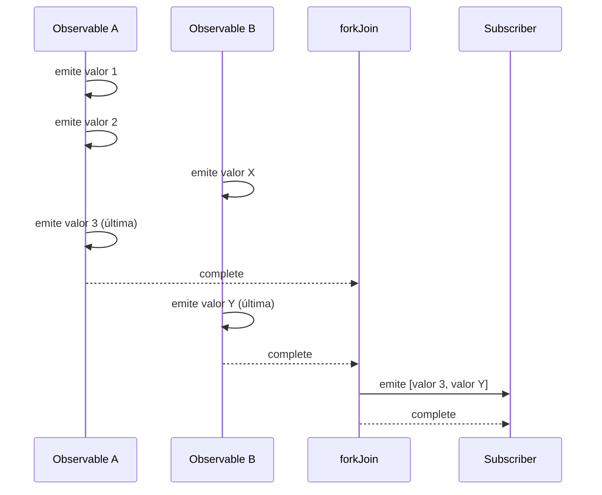
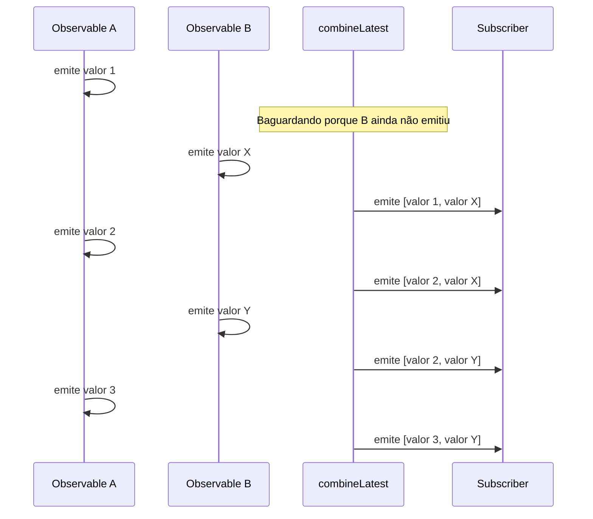
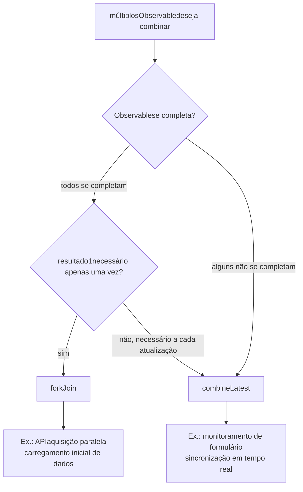

# Diferença entre forkJoin e combineLatest

Ao combinar vários Observables no RxJS, `forkJoin` e `combineLatest` são as Creation Functions mais comumente usadas. No entanto, as duas **se comportam de forma muito diferente** e, se não forem usadas corretamente, não produzirão os resultados esperados.

Esta página compara detalhadamente as diferenças entre elas com ilustrações e exemplos práticos para deixar claro qual delas você deve usar.

## Conclusão: a diferença entre forkJoin e combineLatest

| Característica | forkJoin | combineLatest |
|---|---|---|
| **Timing de emissão** | **Apenas uma vez** após conclusão de todos | **A cada atualização** de um valor |
| **Valor emitido** | O **último valor** de cada Observable | O **valor mais recente** de cada Observable |
| **Condição de conclusão** | Todos os Observables concluídos | Todos os Observables concluídos |
| **Uso principal** | Aquisição paralela de APIs, carregamento inicial | Monitoramento de formulário, sincronização em tempo real |
| **Stream infinito** | ❌ Não utilizável (não conclui) | ✅ Utilizável (emite valores sem concluir) |

> [!TIP]

> **Fácil de lembrar**
> - `forkJoin` = «partir **apenas uma vez** quando todos estiverem presentes» (semelhante a Promise.all)
> - `combineLatest` = «**reportar o estado mais recente** sempre que alguém se mover»

## Entendendo as diferenças de comportamento com ilustrações

### Comportamento do forkJoin


```mermaid
sequenceDiagram
    participant A as Observable A
    participant B as Observable B
    participant F as forkJoin
    participant S as Subscriber

    A->>A: emite valor 1
    A->>A: emite valor 2
    B->>B: emite valor X
    A->>A: emite valor 3 (última)
    A-->>F: complete
    B->>B: emite valor Y (última)
    B-->>F: complete
    F->>S: emite [valor 3, valor Y]
    F-->>S: complete
```

**Ponto**: aguarde até que todos os Observables estejam `complete` e emita **apenas o último valor** uma vez.

### Comportamento do combineLatest


```mermaid
sequenceDiagram
    participant A as Observable A
    participant B as Observable B
    participant C as combineLatest
    participant S as Subscriber

    A->>A: emite valor 1
    Note over C: Baguardando porque B ainda não emitiu
    B->>B: emite valor X
    C->>S: emite [valor 1, valor X]
    A->>A: emite valor 2
    C->>S: emite [valor 2, valor X]
    B->>B: emite valor Y
    C->>S: emite [valor 2, valor Y]
    A->>A: emite valor 3
    C->>S: emite [valor 3, valor Y]
```

**Ponto**: depois que todos os Observables tiverem emitido seu primeiro valor, eles continuarão a emitir a combinação mais recente **sempre que qualquer um deles for atualizado**.

## Diferenças na linha do tempo


```mermaid
gantt
    title forkJoin vs Timing de emissão de combineLatest
    dateFormat X
    axisFormat %s

    section Observable A
    valor1 :a1, 0, 1
    valor2 :a2, 2, 1
    valor3 :a3, 4, 1
    complete :milestone, a_done, 5, 0

    section Observable B
    valorX :b1, 1, 1
    valorY :b2, 3, 1
    complete :milestone, b_done, 4, 0

    section forkJoinemissão
    [valor3,valorY] :crit, fork_out, 5, 1

    section combineLatestemissão
    [valor1,valorX] :c1, 1, 1
    [valor2,valorX] :c2, 2, 1
    [valor2,valorY] :c3, 3, 1
    [valor3,valorY] :c4, 4, 1
```

## Comparação prática: verificar o comportamento com a mesma fonte de dados

Aplicamos `forkJoin` e `combineLatest` ao mesmo Observable e verificamos as diferenças na saída.

```ts
import { forkJoin, combineLatest, interval, take, map } from 'rxjs';

// criar área de saída
const output = document.createElement('div');
output.innerHTML = '<h3>Comparação forkJoin vs combineLatest:</h3>';
document.body.appendChild(output);

// Criar 2 Observables
const obs1$ = interval(1000).pipe(
  take(3),
  map(i => `A${i}`)
);

const obs2$ = interval(1500).pipe(
  take(2),
  map(i => `B${i}`)
);

// Área de exibição do resultado de forkJoin
const forkJoinResult = document.createElement('div');
forkJoinResult.innerHTML = '<h4>forkJoin:</h4><div id="forkjoin-output">aguardando...</div>';
output.appendChild(forkJoinResult);

// Área de exibição do resultado de combineLatest
const combineLatestResult = document.createElement('div');
combineLatestResult.innerHTML = '<h4>combineLatest:</h4><div id="combinelatest-output"></div>';
output.appendChild(combineLatestResult);

// forkJoin：após conclusão de todos1emite apenas uma vez
forkJoin([obs1$, obs2$]).subscribe(result => {
  const el = document.getElementById('forkjoin-output');
  if (el) {
    el.textContent = `emissão: [${result.join(', ')}]`;
    el.style.color = 'green';
    el.style.fontWeight = 'bold';
  }
});

// combineLatest：emite a cada atualização de valor
const combineOutput = document.getElementById('combinelatest-output');
combineLatest([obs1$, obs2$]).subscribe(result => {
  if (combineOutput) {
    const item = document.createElement('div');
    item.textContent = `emissão: [${result.join(', ')}]`;
    combineOutput.appendChild(item);
  }
});
```

**Resultado da execução**:
- `forkJoin`: emite `[A2, B1]` **apenas uma vez** após cerca de 3 segundos
- `combineLatest`: emite **4 vezes** a partir de aproximadamente 1,5 s (por exemplo, `[A0, B0]` → `[A1, B0]` → `[A2, B0]` → `[A2, B1]`)

> [!NOTE]

> A ordem de emissão do `combineLatest` depende do agendamento do timer e pode variar de acordo com o ambiente. O ponto importante é que «um valor é emitido sempre que um deles é atualizado». No exemplo acima a emissão ocorre 4 vezes, mas a ordem pode mudar, por exemplo `[A1, B0]` → `[A1, B1]`.

## Qual usar (guia por caso)

### Casos em que usar forkJoin

#### 1. Aquisição paralela de várias APIs

Quando você quer processar os dados depois que todos os dados estiverem disponíveis.

```ts
import { forkJoin } from 'rxjs';
import { ajax } from 'rxjs/ajax';

// obter info do usuário e configurações simultaneamente
forkJoin({
  user: ajax.getJSON('/api/user/123'),
  settings: ajax.getJSON('/api/settings'),
  notifications: ajax.getJSON('/api/notifications')
}).subscribe(({ user, settings, notifications }) => {
  // renderizar a tela após todos os dados estarem prontos
  renderDashboard(user, settings, notifications);
});
```

#### 2. Aquisição de dados em lote durante o carregamento inicial

Adquira em bloco os dados mestres necessários no início do aplicativo.

```ts
import { forkJoin } from 'rxjs';
import { ajax } from 'rxjs/ajax';

function loadInitialData() {
  return forkJoin({
    categories: ajax.getJSON('/api/categories'),
    countries: ajax.getJSON('/api/countries'),
    currencies: ajax.getJSON('/api/currencies')
  });
}
```

> [!WARNING]

> `forkJoin` não pode ser usado com **Observables que não se completam** (por exemplo, `interval`, WebSocket, fluxos de eventos). Se não se completar, continuará aguardando indefinidamente.

### Casos em que usar combineLatest

#### 1. Monitoramento em tempo real da entrada do formulário

Combine vários valores de entrada para atualizar a validação e a exibição.

```ts
import { combineLatest, fromEvent } from 'rxjs';
import { map, startWith } from 'rxjs';

const name$ = fromEvent(nameInput, 'input').pipe(
  map(e => (e.target as HTMLInputElement).value),
  startWith('')
);

const email$ = fromEvent(emailInput, 'input').pipe(
  map(e => (e.target as HTMLInputElement).value),
  startWith('')
);

const age$ = fromEvent(ageInput, 'input').pipe(
  map(e => parseInt((e.target as HTMLInputElement).value) || 0),
  startWith(0)
);

// executar validação a cada mudança de entrada
combineLatest([name$, email$, age$]).subscribe(([name, email, age]) => {
  const isValid = name.length > 0 && email.includes('@') && age >= 18;
  submitButton.disabled = !isValid;
});
```

#### 2. Sincronização em tempo real de vários streams

Exibição integrada de dados e status de sensores.

```ts
import { combineLatest, interval } from 'rxjs';
import { map } from 'rxjs';

const temperature$ = interval(2000).pipe(map(() => 20 + Math.random() * 10));
const humidity$ = interval(3000).pipe(map(() => 40 + Math.random() * 30));
const pressure$ = interval(2500).pipe(map(() => 1000 + Math.random() * 50));

combineLatest([temperature$, humidity$, pressure$]).subscribe(
  ([temp, humidity, pressure]) => {
    updateDashboard({ temp, humidity, pressure });
  }
);
```

#### 3. Combinação de condições de filtro

Realizar uma busca sempre que várias condições de filtro mudarem.

```ts
import { combineLatest, BehaviorSubject } from 'rxjs';
import { debounceTime, switchMap } from 'rxjs';

const searchText$ = new BehaviorSubject('');
const category$ = new BehaviorSubject('all');
const sortOrder$ = new BehaviorSubject('asc');

combineLatest([searchText$, category$, sortOrder$]).pipe(
  debounceTime(300),
  switchMap(([text, category, sort]) =>
    fetchProducts({ text, category, sort })
  )
).subscribe(products => {
  renderProductList(products);
});
```

## Fluxograma de uso


```mermaid
flowchart TD
    A[múltiplosObservabledeseja combinar] --> B{Observablese completa?}
    B -->|todos se completam| C{resultado1necessário apenas uma vez?}
    B -->|alguns não se completam| D[combineLatest]
    C -->|sim| E[forkJoin]
    C -->|não, necessário a cada atualização| D

    E --> E1[Ex.: APIaquisição paralela<br>carregamento inicial de dados]
    D --> D1[Ex.: monitoramento de formulário<br>sincronização em tempo real]
```

## Erros comuns e soluções

### Erro 1: usar forkJoin com um Observable que não se completa

```ts
// ❌ isso nunca será emitido
forkJoin([
  interval(1000),  // não se completa
  ajax.getJSON('/api/data')
]).subscribe(console.log);

// ✅ takecompletar com combineLatestusar
forkJoin([
  interval(1000).pipe(take(5)),  // 5se completa em
  ajax.getJSON('/api/data')
]).subscribe(console.log);
```

### Erro 2: sem valor inicial em combineLatest

```ts
// ❌ name$até a primeira emissão de Bemail$mesmo com valores, nada é emitido
combineLatest([name$, email$]).subscribe(console.log);

// ✅ startWithdefinir valor inicial com
combineLatest([
  name$.pipe(startWith('')),
  email$.pipe(startWith(''))
]).subscribe(console.log);
```

## Resumo

| Critério de seleção | forkJoin | combineLatest |
|---|---|---|
| Processamento único quando todos estão prontos | ✅ | ❌ |
| Processamento a cada mudança de valor | ❌ | ✅ |
| Stream que não conclui | ❌ | ✅ |
| Uso tipo Promise.all | ✅ | ❌ |
| Sincronização em tempo real | ❌ | ✅ |

> [!IMPORTANT]

> **Princípio de uso**
> - **forkJoin**: «apenas uma vez quando todos estiverem presentes» → aquisição paralela de APIs, carregamento inicial
> - **combineLatest**: «atualizar sempre que alguém se mover» → monitoramento de formulário, UI em tempo real

## Páginas relacionadas

- **[forkJoin](/pt/guide/creation-functions/combination/forkJoin)** - Explicação detalhada do forkJoin
- **[combineLatest](/pt/guide/creation-functions/combination/combineLatest)** - Explicação detalhada do combineLatest
- **[zip](/pt/guide/creation-functions/combination/zip)** - Emparelhar valores correspondentes
- **[merge](/pt/guide/creation-functions/combination/merge)** - Executar vários Observables em paralelo
- **[withLatestFrom](/pt/guide/operators/combination/withLatestFrom)** - Apenas o fluxo principal é trigger
