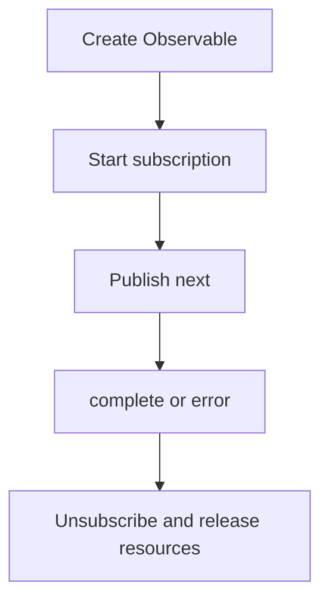

# Observable Lifecycle

This section provides a step-by-step description of the Observable lifecycle in RxJS, from creation, subscription, data publishing, completion and error notification, unsubscription, and resource management.
Understanding this lifecycle is the foundation for effective use of RxJS.

## Observable Lifecycle Overview

The Observable lifecycle refers to the sequence of how an Observable is created, when it publishes data, how it is terminated or notified of errors, and finally when resources are released. By understanding this, it is possible to correctly understand RxJS behavior, unsubscribe at the intended timing, control side effects, and handle errors properly.

### 🔄 Observable Lifecycle Diagram (State Transitions)



## Structure of the Observable Lifecycle

The Observable lifecycle consists of the following phases:

| Order | Phase | Content |
|---|---|---|
| 1 | Creation | Creating an Observable instance |
| 2 | Subscription | Starting subscription with `subscribe()` method |
| 3 | Execution | <li>`next()`: Publishing data</li><li>`error()`: Error notification</li><li>`complete()`: Completion notification</li> |
| 4 | Disposal | Unsubscription with `unsubscribe()` method |

Observable is "lazy", meaning that no stream is issued until `subscribe()` is called. Also, the stream terminates when `complete()` or `error()` is called, and any further `next()` calls are ignored.

> [!CAUTION]
> No "processing" of any kind is directly performed by `subscribe()`.
> The expression "It will not be executed until you call `subscribe()`" is often used,
> but to be precise, "Observable's internal logic (notification process)" is triggered for the first time by `subscribe()`.
>
> Operators such as `pipe()` only build the evaluation chain; execution is initiated by Observer callbacks.

### Observable Lifecycle Example

```ts
import { Observable } from 'rxjs';

// 1. Observable creation
const observable$ = new Observable<number>(subscriber => {
  console.log('Observable execution started');

  // 3. Execution: Data publishing
  subscriber.next(1);
  subscriber.next(2);

  // Timer setup
  const timerId = setTimeout(() => {
    subscriber.next(3);
    subscriber.complete(); // 3. Execution: Completion notification
    console.log('Observable completed');
  }, 1000);

  // Return cleanup function (called on unsubscribe)
  return () => {
    console.log('Cleanup executed');
    clearTimeout(timerId);
  };
});

// 2. Subscription
const subscription = observable$.subscribe({
  next: value => console.log('Next value:', value),
  error: err => console.error('Error:', err),
  complete: () => console.log('Received completion notification')
});

// 4. Unsubscription (manual or on completion)
setTimeout(() => {
  console.log('Manual unsubscription');
  subscription.unsubscribe();
}, 500); // Unsubscribe at 500ms (before completion notification)

// Output:
// Observable execution started
// Next value: 1
// Next value: 2
// Manual unsubscription
// Cleanup executed
```

## Observer {#observer}

Observer is an object that acts as the receiver for notifications from Observable. When subscribing to an Observable, you pass an Observer to process the emitted data, errors, and completion notifications.

### Observer's Three Callback Functions

Observer is an interface for receiving notifications from Observable.
It has three callback functions:
- `next`: Data publishing
- `error`: Error notification
- `complete`: Completion notification

#### Example

```ts
import { Observer, of } from 'rxjs';

// Complete Observer object
const observer: Observer<number> = {
  next: value => console.log('Value:', value), // Data publishing
  error: err => console.error('Error:', err),  // Error notification
  complete: () => console.log('Complete')      // Completion notification
};

const observable$ = of(1, 2, 3); // Create Observable easily

// Using Observer object
observable$.subscribe(observer);

// Partial Observer is also possible
observable$.subscribe({
  next: value => console.log('Value only:', value)
});

// Object format (recommended)
observable$.subscribe({
  next: value => console.log('Value::', value),
  error: err => console.error('Error:', err),
  complete: () => console.log('Complete::')
});

// Output:
// Value: 1
// Value: 2
// Value: 3
// Complete
// Value only: 1
// Value only: 2
// Value only: 3
// Value:: 1
// Value:: 2
// Value:: 3
// Complete::
```

## Subscription {#subscription}

Subscription represents the execution of Observable and is primarily used for unsubscription with `unsubscribe()`.

#### Example

```ts
import { interval } from 'rxjs';
import { take } from 'rxjs';

const numbers$ = interval(1000).pipe(take(5));

// Hold subscription
const subscription = numbers$.subscribe({
  next: value => console.log('Value:', value),
  complete: () => console.log('Complete')
});

// Manual unsubscription after 3 seconds
setTimeout(() => {
  subscription.unsubscribe(); // Unsubscribe
  console.log('Unsubscribed');
}, 3000);

// Output:
// Value: 0
// Value: 1
// Value: 2
// Unsubscribed
```

## Error Handling

In the Observable lifecycle, calling `error()` immediately terminates the stream, and `complete()` is not called. This is why the use of `catchError` and the design of `retry` are important.

#### Example

```ts
import { Observable, of } from 'rxjs';
import { catchError, retry } from 'rxjs';

// Observable that generates an error
const failingObservable$ = new Observable<number>(subscriber => {
  subscriber.next(1);
  subscriber.next(2);
  subscriber.error(new Error('Intentional error'));
  // Note that complete is not called after error
});

// Error handling example
failingObservable$.pipe(
  // Retry 3 times when error occurs
  retry(3),
  // If error still occurs, switch to alternative Observable
  catchError(error => {
    console.error('Caught error:', error.message);
    return of('Alternative value after error');
  })
).subscribe({
  next: value => console.log('Value:', value),
  error: err => console.error('Unhandled error:', err),
  complete: () => console.log('Complete')
});

// Output:
// Value: 1
// Value: 2
// Value: 1
// Value: 2
// Value: 1
// Value: 2
// Value: 1
// Value: 2
// Caught error: Intentional error
// Value: Alternative value after error
// Complete
```

## Completion Lifecycle

Completion of an Observable occurs when `complete()` is explicitly called or when a finite stream is terminated.

#### Example

```ts
import { of, interval, Observable } from 'rxjs';
import { take } from 'rxjs';

// Finite Observable (completes automatically)
const finite$ = of(1, 2, 3);
finite$.subscribe({
  next: value => console.log('Finite value:', value),
  complete: () => console.log('Finite Observable completed')
});

// Convert infinite Observable to finite
const limited$ = interval(1000).pipe(take(3));
limited$.subscribe({
  next: value => console.log('Limited value:', value),
  complete: () => console.log('Limited Observable completed')
});

// Observable completed manually
const manual$ = new Observable<number>(subscriber => {
  subscriber.next(1);

  setTimeout(() => {
    subscriber.next(2);
    subscriber.complete(); // Explicitly complete
  }, 2000);
});

manual$.subscribe({
  next: value => console.log('Manual value:', value),
  complete: () => console.log('Manual Observable completed')
});

// Output:
// Finite value: 1
// Finite value: 2
// Finite value: 3
// Finite Observable completed
// Manual value: 1
// Limited value: 0
// Limited value: 1
// Manual value: 2
// Manual Observable completed
// Limited value: 2
// Limited Observable completed
```

## Resource Management and Memory Leak Prevention

Unsubscription at the appropriate time is important to prevent memory leaks.

#### Example

```ts
import { interval, Subject } from 'rxjs';
import { takeUntil } from 'rxjs';

// Mimicking component lifecycle
class Component {
  private destroy$ = new Subject<void>();

  constructor() {
    // Interval every 1 second (potential cause of memory leak)
    interval(1000).pipe(
      // Automatically unsubscribe when component is destroyed
      takeUntil(this.destroy$)
    ).subscribe(value => {
      console.log('Value in component:', value);
    });
  }

  // Component destruction
  ngOnDestroy() {
    console.log('Component destroyed');
    this.destroy$.next();
    this.destroy$.complete();
  }
}

// Usage example
const component = new Component();

// Destroy component after 5 seconds
setTimeout(() => {
  (component as any).ngOnDestroy();
}, 5000);

// Output:
// Value in component: 0
// Value in component: 1
// Value in component: 2
// Value in component: 3
// Value in component: 4
// Component destroyed
```

## Summary

Understanding the Observable lifecycle enables you to:

- Release resources at the appropriate time
- Implement error handling and recovery strategies
- Differentiate between cold and hot Observables
- Manage side effects

In particular, component-based frameworks such as Angular and React require subscription management along the lifecycle, leveraging `takeUntil`, `unsubscribe`, `finalize`, etc.
