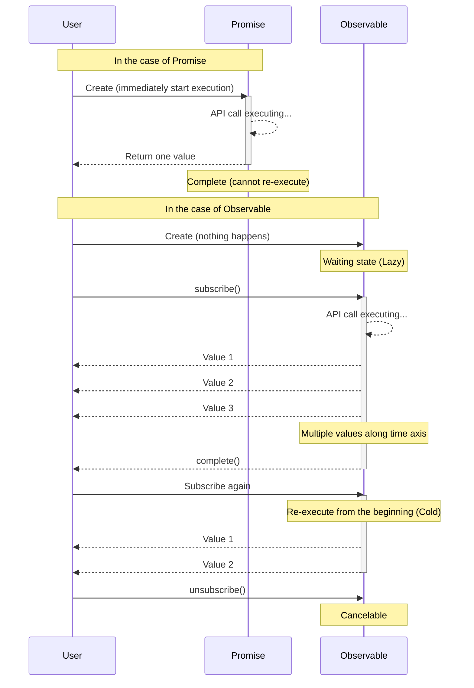

# Barriers to Conceptual Understanding

The first barrier to RxJS is **understanding concepts**. Especially for developers accustomed to Promise, Observable's behavior can be counter-intuitive.

## Essential Differences Between Observable vs Promise

### Promise: One-Shot Asynchronous Processing

```typescript
// Promise: return value only once
const userPromise = fetch('/api/user/1').then(res => res.json());

userPromise.then(user => console.log(user)); // fetch user information only once
userPromise.then(user => console.log(user)); // same result cached
```

> [!TIP] Features
> - **Eager (immediate execution)** - processing starts at the point of Promise creation
> - **Completes only once** - only once, either success or failure
> - **Not Cancelable** - once started, cannot be stopped
> - **Always Hot** - multiple then share the same result

### Observable: Stream (Flow of Data with Time Axis)

```typescript
import { Observable } from 'rxjs';

// Observable: multiple values flowing along a time axis
const user$ = new Observable<User>(subscriber => {
  console.log('Observable execution started!');
  fetch('/api/user/1')
    .then(res => res.json())
    .then(user => {
      subscriber.next(user);
      subscriber.complete();
    });
});

// ❌ Nothing happens yet at this point (Lazy)
console.log('Observable creation complete');

// ✅ Only after subscribe is it executed
user$.subscribe(user => console.log('Subscribe 1:', user));
user$.subscribe(user => console.log('Subscribe 2:', user));
// → API call is executed twice (Cold Observable)
```

#### Output
```
Observable creation complete
Observable execution started!
Subscribe 1: { id: 1, name: 'Alice' }
Observable execution started!
Subscribe 2: { id: 1, name: 'Alice' }
```

> [!TIP] Features
> - **Lazy (delayed execution)** - nothing happens until subscribe
> - **Multiple values can be passed** - next() can be called multiple times
> - **Cancelable** - can be stopped by unsubscribe
> - **Cold or Hot** - can choose to run per subscription or share

### Comparison Chart

| Feature | Promise | Observable |
|---|---|---|
| **Execution timing** | Immediately (Eager) | When subscribed (Lazy) |
| **Number of Values** | Once Only | 0 or More (multiple) |
| **Cancel** | Not allowed | Possible (unsubscribe) |
| **Reuse** | Cached results | Rerun per subscription (Cold) |
| **After Error** | Terminated | Terminated (retry possible) |

### Visualize Differences in Behavior

The following sequence diagram shows the difference in execution flow between Promise and Observable.



### Common Misconceptions

#### ❌ Misconception 1: "Observable is asynchronous-only"

```typescript
// Observable can also handle synchronous processing
import { of } from 'rxjs';

const sync$ = of(1, 2, 3);

console.log('Before subscribe');
sync$.subscribe(value => console.log(value));
console.log('After subscribe');

// Output (executed synchronously):
// Before subscribe
// 1
// 2
// 3
// After subscribe
```

#### ❌ Misconception 2: "subscribe returns a value"

```typescript
import { map, of } from "rxjs";

const observable$ = of(1, 2, 3);

// ❌ Bad example: Promise-like thinking
const value = observable$.subscribe(x => x); // value is Subscription object
console.log(value); // Subscription { ... } ← not the expected value

// ✅ Good example: Observable-like thinking
observable$.pipe(
  map(x => x * 2)
).subscribe(value => {
  console.log(value); // use value here
});
```

## Intuitive Understanding of Cold vs Hot

### Cold Observable: Independent Streams Per Subscription

```typescript
import { interval } from 'rxjs';
import { take } from 'rxjs';

// Cold: each subscriber has an independent timer
const cold$ = interval(1000).pipe(take(3));

console.log('Subscription 1 started');
cold$.subscribe(x => console.log('Subscription 1:', x));

setTimeout(() => {
  console.log('Subscription 2 started (2 seconds later)');
  cold$.subscribe(x => console.log('Subscription 2:', x));
}, 2000);

// Output:
// Subscription 1 started
// Subscription 1: 0        (after 1 second)
// Subscription 1: 1        (after 2 seconds)
// Subscription 2 started (after 2 seconds)
// Subscription 1: 2        (after 3 seconds)
// Subscription 2: 0        (after 3 seconds) ← Subscription 2 starts from the beginning
// Subscription 2: 1        (after 4 seconds)
// Subscription 2: 2        (after 5 seconds)
```

> [!TIP] Cold Features
> - **Independent execution** per subscription
> - Keeps a "blueprint" of the data
> - Examples: HTTP API calls, timers, file reads

### Hot Observable: All Subscribers Share the Same Stream

```typescript
import { interval } from 'rxjs';
import { take, share } from 'rxjs';

// Hot: shared by share()
const hot$ = interval(1000).pipe(
  take(3),
  share() // this makes it Hot
);

console.log('Subscription 1 started');
hot$.subscribe(x => console.log('Subscribe 1:', x));

setTimeout(() => {
  console.log('Subscription 2 started (2 seconds later)');
  hot$.subscribe(x => console.log('Subscribe 2:', x));
}, 2000);

// Output:
// Subscription 1 started
// Subscribe 1: 0        (after 1 second)
// Subscribe 1: 1        (after 2 seconds)
// Subscription 2 started (2 seconds later)
// Subscribe 1: 2        (after 3 seconds)
// Subscribe 2: 2        (after 3 seconds) ← Subscription 2 joins in the middle
```

> [!TIP] Hot Features
> - All subscribers **share** the same execution
> - Data is being "broadcast"
> - Examples: Click Event, WebSocket, Subject

### How to Identify Cold/Hot

```typescript
import { fromEvent, interval, of, Subject } from 'rxjs';
import { share } from 'rxjs';

// Cold (independent execution per subscription)
const cold1$ = of(1, 2, 3);
const cold2$ = interval(1000);
const cold3$ = ajax('/api/data');
const cold4$ = fromEvent(button, 'click'); // Cold but special

// Hot (shared among subscribers)
const hot1$ = new Subject<number>();
const hot2$ = interval(1000).pipe(share()); // convert Cold to Hot
```

> [!IMPORTANT] How to Tell Them Apart
> - **Creation Functions (of, from, fromEvent, interval, ajax, etc.)** → Cold
> - **Subject-based** → Hot
> - **share(), shareReplay() use** → Convert Cold to Hot

## Shift in Thinking to Declarative Programming

### Imperative vs. Declarative

RxJS is a paradigm of **declarative programming**.

#### ❌ Imperative Thinking (Promise/async-await)

```typescript
// Imperative: describe "how" to process
async function processUsers() {
  const response = await fetch('/api/users');
  const users = await response.json();

  const activeUsers = [];
  for (const user of users) {
    if (user.isActive) {
      activeUsers.push(user);
    }
  }

  const userNames = [];
  for (const user of activeUsers) {
    userNames.push(user.name.toUpperCase());
  }

  return userNames;
}
```

#### ✅ Declarative Thinking (RxJS)

```typescript
import { from } from 'rxjs';
import { mergeMap, filter, map, toArray } from 'rxjs';

// Declarative: describe "what" to convert
const processUsers$ = from(fetch('/api/users')).pipe(
  mergeMap(res => res.json()),
  mergeMap(users => users), // expand array
  filter(user => user.isActive),
  map(user => user.name.toUpperCase()),
  toArray()
);

processUsers$.subscribe(userNames => console.log(userNames));
```


::: tip Differences
- **Imperative**: Describes a procedure (loop, conditional branch, variable assignment)
- **Declarative**: Describes a pipeline of conversions (data flow)
:::

### Key Points of Thought Transformation

#### Point 1: No Data Processing Within Subscribe

Data transformation should be done within pipe, and subscribe should be side effects only.

```typescript
import { filter, map, of } from "rxjs";

const observable$ = of(1, 2, 3);
// ❌ Bad example: processing in subscribe
observable$.subscribe(value => {
  const doubled = value * 2;           // 👈 compute within subscribe
  const filtered = doubled > 4 ? doubled : null;  // 👈 conditional in subscribe
  if (filtered) {                      // 👈 if statement within subscribe
    console.log(filtered);
  }
});

// ✅ Good example: conversion within pipe
observable$.pipe(
  map(value => value * 2),       // calculation is done in pipe
  filter(value => value > 4)     // filtering also in pipe
).subscribe(value => console.log(value));  // subscribe is only a side effect
```

#### Point 2: Do Not Use Intermediate Variables

```typescript
import { filter, map, Observable, of } from "rxjs";

const source$ = of(1, 2, 3, 4, 5);

// ❌ Bad example: store in intermediate variable
let doubled$: Observable<number>;      // 👈 declare intermediate variable
let filtered$: Observable<number>;     // 👈 declare intermediate variable

doubled$ = source$.pipe(map(x => x * 2));    // 👈 assign to intermediate variable
filtered$ = doubled$.pipe(filter(x => x > 5)); // 👈 assign to intermediate variable
filtered$.subscribe(console.log);

// ✅ Good example: connect with pipeline
source$.pipe(
  map(x => x * 2),      // pipeline directly
  filter(x => x > 5)    // pipeline directly
).subscribe(console.log);
```

#### Point 3: Avoid Nested Subscribe

```typescript
// ❌ Bad example: nested subscribe
getUser$(userId).subscribe(user => {
  getOrders$(user.id).subscribe(orders => {  // 👈 more subscribe in subscribe (nested)
    console.log(user, orders);
  });  // 👈 Unsubscribing becomes more complicated
});

// ✅ Good example: flatten with mergeMap
getUser$(userId).pipe(
  mergeMap(user =>                // flatten inner Observable with mergeMap
    getOrders$(user.id).pipe(
      map(orders => ({ user, orders }))
    )
  )
).subscribe(({ user, orders }) => console.log(user, orders));  // only one subscription location
```

#### Point 4: Organize in 3-Step Separation Syntax

An important technique that greatly improves the readability and maintainability of RxJS code is the **stage separation syntax**.

```typescript
// ❌ Bad example: a one-liner with everything mixed in
fromEvent(document, 'click').pipe(
  map(event => (event as MouseEvent).clientX),
  filter(x => x > 100),
  throttleTime(200)
).subscribe({
  next: x => console.log('Click position:', x),
  error: err => console.error(err)
});
```

> [!IMPORTANT] Problems
> - Mixed stream definitions, conversions, and subscriptions
> - Difficult to debug (not sure where the problem is occurring)
> - Hard to test
> - Not reusable

```typescript
// ✅ Good example: separation into 3 stages

import { filter, fromEvent, map, throttleTime } from "rxjs";

// 1. Observable definition (source of stream)
const clicks$ = fromEvent(document, 'click');

// 2. Pipeline definition (data conversion process)
const processed$ = clicks$.pipe(
  map(event => (event as MouseEvent).clientX),
  filter(x => x > 100),
  throttleTime(200)
);

// 3. Subscription processing (execution of side-effects)
const subscription = processed$.subscribe({
  next: x => console.log('Click position:', x),
  error: err => console.error(err),
  complete: () => console.log('completed')
});
```

#### Advantages
- **Easy to debug** - can insert `console.log` and `tap` at each stage
- **Testable** - `processed$` can be tested independently
- **Reusability** - use `clicks$` and `processed$` elsewhere
- **Improved readability** - code intent is clear

**Stage separation syntax is one of the most practical ways to overcome RxJS difficulties.**

See **[Chapter 10: One-Liner Hell and Stage Separation Syntax](/pt/guide/anti-patterns/one-liner-hell)** for more information.

## Experiment and Understand (Using Starter Kit)

### Experiment 1: Difference Between Lazy and Eager

```typescript
import { Observable } from 'rxjs';

console.log('=== Promise (Eager) ===');
const promise = new Promise((resolve) => {
  console.log('Promise executed!');
  resolve(42);
});
console.log('Promise creation complete');
promise.then(value => console.log('Promise result:', value));

console.log('\n=== Observable (Lazy) ===');
const observable$ = new Observable(subscriber => {
  console.log('Observable executed!');
  subscriber.next(42);
  subscriber.complete();
});
console.log('Observable creation complete');
observable$.subscribe(value => console.log('Observable result:', value));

// Output:
// === Promise (Eager) ===
// Promise executed!
// Promise creation complete
// Promise result: 42
//
// === Observable (Lazy) ===
// Observable creation complete
// Observable executed!
// Observable result: 42
```

### Experiment 2: Difference Between Cold and Hot

```typescript
import { interval } from 'rxjs';
import { take, share } from 'rxjs';

// Cold: independent per subscription
const cold$ = interval(1000).pipe(take(3));

console.log('Cold Observable:');
cold$.subscribe(x => console.log('Cold Subscribe 1:', x));
setTimeout(() => {
  cold$.subscribe(x => console.log('Cold Subscribe 2:', x));
}, 2000);

// Hot: shared
const hot$ = interval(1000).pipe(take(3), share());

setTimeout(() => {
  console.log('\nHot Observable:');
  hot$.subscribe(x => console.log('Hot Subscribe 1:', x));
  setTimeout(() => {
    hot$.subscribe(x => console.log('Hot Subscribe 2:', x));
  }, 2000);
}, 6000);
```

**[Run it in the learning execution environment](/pt/guide/starter-kid) to experience the difference.**

### Experiment 3: Declarative vs. Imperative

```typescript
import { of } from 'rxjs';
import { map, filter } from 'rxjs';

const numbers = [1, 2, 3, 4, 5, 6, 7, 8, 9, 10];

// Imperative
console.log('=== Imperative ===');
const result1: number[] = [];
for (const num of numbers) {
  const doubled = num * 2;
  if (doubled > 10) {
    result1.push(doubled);
  }
}
console.log(result1);

// Declarative
console.log('\n=== Declarative ===');
of(...numbers).pipe(
  map(num => num * 2),
  filter(num => num > 10)
).subscribe(num => console.log(num));
```

## Comprehension Check

See if you can answer the following questions.

```markdown
## Basic Concepts
- [ ] Name three differences between Promise and Observable
- [ ] Explain the difference between Lazy and Eager
- [ ] Explain the difference between Cold and Hot with examples

## Practice
- [ ] Explain why processing should not be completed within a subscribe
- [ ] Understand how to modify nested subscribe
- [ ] Know how to convert Cold Observable to Hot

## Debugging
- [ ] Identify the cause when an Observable does not run
- [ ] Understand what causes a subscription to run multiple times
```

## Next Steps

Once you have a conceptual understanding, let's move on to the practical wall.

- **Lifecycle Management Wall** (in preparation) - when to subscribe/unsubscribe
- **Operator Selection Confusion** (in preparation) - Criteria to choose from 100+ operators

## Related Sections

- **[What is RxJS](/pt/guide/basics/what-is-rxjs)** - Basic concepts of RxJS
- **[Difference between Promise and RxJS](/pt/guide/basics/promise-vs-rxjs)** - Promise vs Observable
- **[Cold and Hot Observables](/pt/guide/observables/cold-and-hot-observables)** - Detailed explanation of Cold/Hot
