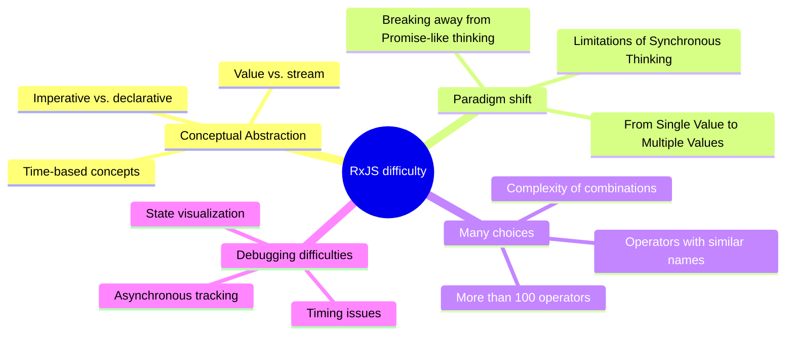
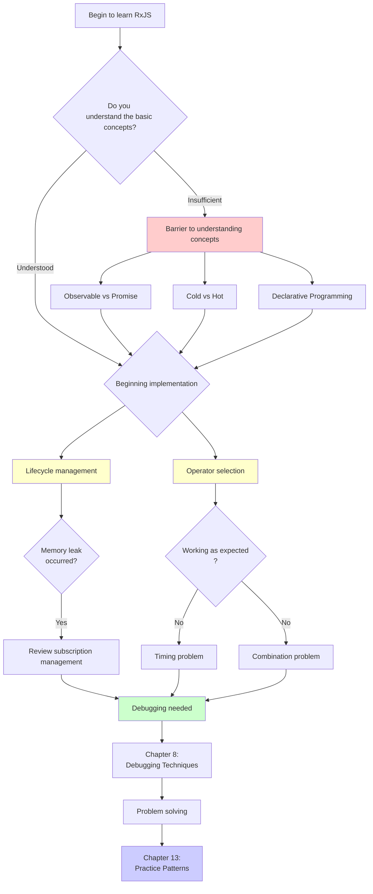
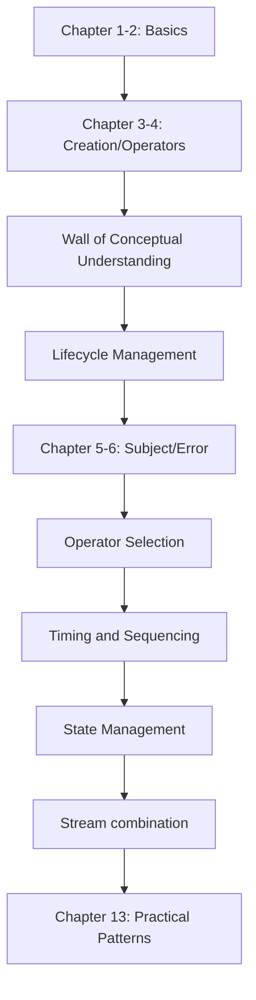
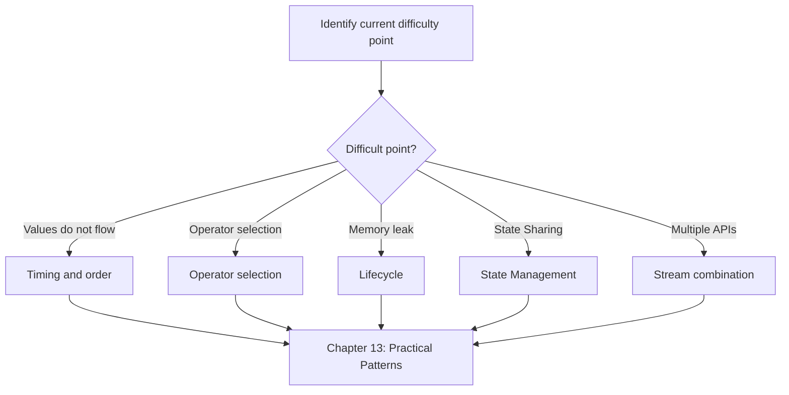
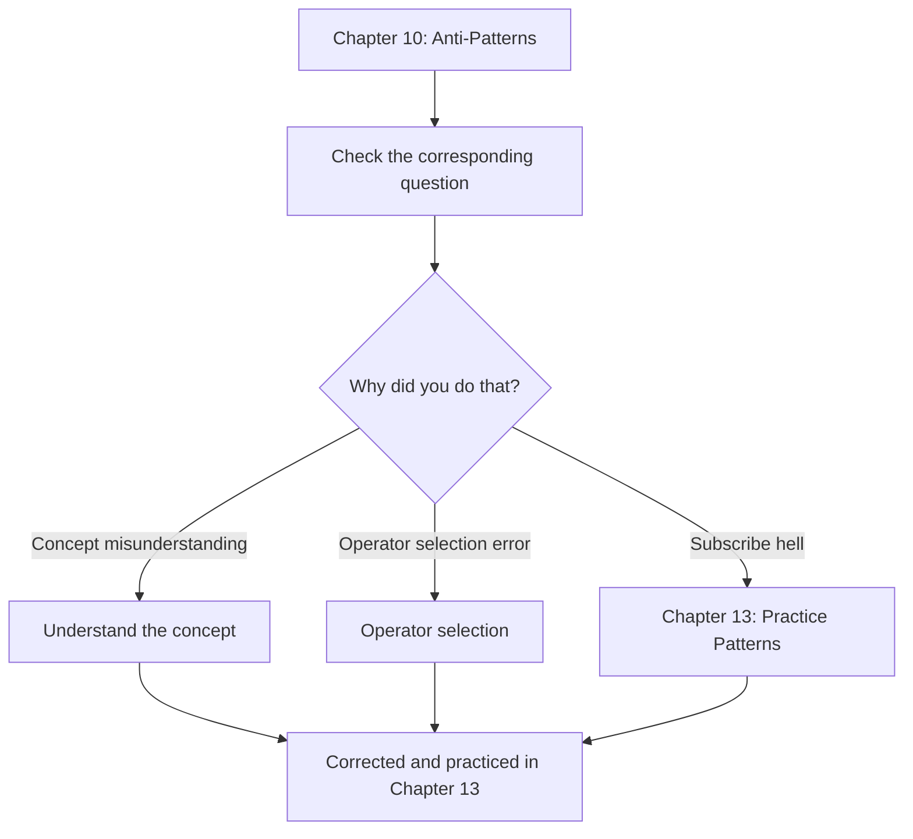

# Overcoming RxJS Difficulties

Even developers with TypeScript and business experience face many difficulties in RxJS practice. This section systematically explains the RxJS-specific difficulties and how to overcome them.

## Why is RxJS Difficult?

The difficulty of RxJS lies in the **high level of abstraction of concepts** and the **need for a paradigm shift**. Even experienced developers are confused that their knowledge and thought patterns do not work. Let's take a look at the specific points of difficulty below.

### Existing knowledge does not work

Developers who are accustomed to Promise and Async/Await are confused when they try to use RxJS in the same way.

```typescript
// ❌ Promise-like thinking: I want to get the value directly
observable.subscribe(value => {
  const result = value * 2;
  return result; // This doesn't return anything
});

// ✅ RxJS-like thinking: transform the stream
const doubled$ = observable.pipe(
  map(value => value * 2)
);
```

> [!IMPORTANT] Problems
> - Imperative programming (Promise's then/await) thinking doesn't work
> - Need to think "stream conversion" instead of values
> - Trying to complete the process in subscribe is an anti-pattern

### Add the concept of a time axis

The most significant feature of RxJS is the concept of "timeline". Promise returns a value only once, but Observable can flow multiple values over time.

```typescript
// Promise: returns a value only once
const promise = fetch('/api/data');

// Observable: multiple values flow along the time axis
const clicks$ = fromEvent(button, 'click');
//                     time axis
// clicks$:  ------click----click--click---------->
```

> [!IMPORTANT] Problems
> - You need to be constantly aware of "when values flow"
> - Synchronous/asynchronous differences affect behavior
> - Reading Marble Diagrams is essential

### Choose from over 100 operators

RxJS has more than 100 operators, and beginners are hesitant to choose among them. There are many operators with similar names, so it is difficult to determine which one to use.

> [!IMPORTANT] Common concerns
> - "map, mergeMap, switchMap, concatMap... I don't understand the difference"
> - "debounceTime and throttleTime, which one should I use?"
> - "combineLatest and zip, what's the difference?"

→ Chapter 11 provides **practical selection criteria**.

### The overall picture of RxJS difficulty

The following diagram shows what elements make up the difficulty of RxJS.



## List of Main Difficulties

We have categorized the main difficulties encountered in learning and practicing RxJS into seven categories. Each difficulty has a dedicated page with detailed solutions. First, identify the difficulty you are facing from the table below.

| Difficulties | Contents | Common Symptoms |
|---|---|---|
| **[Conceptual Understanding Barrier](/pt/guide/overcoming-difficulties/conceptual-understanding)** | Observable vs Promise, Cold vs Hot | "What's the difference from Promise?" |
| **[Lifecycle Management](/pt/guide/overcoming-difficulties/lifecycle-management)** | subscribe/unsubscribe, memory leaks | "When should I unsubscribe?" |
| **[Operator Selection](/pt/guide/overcoming-difficulties/operator-selection)** | Criteria to choose from 100+ operators | "Which operator should I use?" |
| **[Timing and Order](/pt/guide/overcoming-difficulties/timing-and-order)** | When values flow, synchronous vs. asynchronous | "Why no values?" |
| **[State Management](/pt/guide/overcoming-difficulties/state-and-sharing)** | Subject, share/shareReplay | "I want to share the state" |
| **[Multiple Stream Combination](/pt/guide/overcoming-difficulties/stream-combination)** | combineLatest, zip, withLatestFrom | "I want to combine results of two APIs" |
| **[Debugging](/pt/guide/overcoming-difficulties/debugging-guide)** | Values do not flow, different value than expected | "I don't know what is happening" |

### Relationship of Difficulties

RxJS difficulties are not independent but interrelated. The following flowchart shows in what order you encounter difficulties in the learning process and how they chain together. Check where you are currently.



## How to Use Each Section

Each article in this Chapter can be read independently. Start reading from the section you need, depending on what you are having trouble with. The following explains how to use it effectively.

### 1. Identify Your Difficulties

From the table above, select the section that corresponds to **the difficulty you are currently facing**. You can also reverse-reference from the symptoms of the difficulty.

#### Example
- API calls do not take values → [Timing and Order](/pt/guide/overcoming-difficulties/timing-and-order)
- Worried about memory leaks → [Lifecycle Management](/pt/guide/overcoming-difficulties/lifecycle-management)
- Confused between mergeMap and switchMap → [Operator Selection](/pt/guide/overcoming-difficulties/operator-selection)
- Want to share state across multiple components → [State Management](/pt/guide/overcoming-difficulties/state-and-sharing)
- Want to combine results of two APIs → [Multiple Stream Combination](/pt/guide/overcoming-difficulties/stream-combination)
- Don't know how to debug → [Debugging](/pt/guide/overcoming-difficulties/debugging-guide)

### 2. Understand with Bad Example → Good Example

Each section has the following structure:

```
❌ Bad example (common pattern to fall into)
↓
✅ Good example (recommended pattern)
↓
💡 Explanation (why it's bad, why it's good)
↓
🎯 Practice questions (understanding check)
```

### 3. Experiment with Starter Kit

All code examples can be run in a local development environment.
<!-- TODO: Add link to starter kit when available: [learning execution environment](/pt/guide/starter-kit) -->

#### Recommended Learning Flow
1. Copy and run bad example → Experience the problem
2. Copy and run good example → Feel the difference
3. Apply to your own code → Establish

## Learning Roadmap

The learning approach depends on your current skill level and objectives. Choose a roadmap that suits you from the three patterns below.

### If You Are Learning RxJS for the First Time

This is a systematic approach where you learn in order from the basics and overcome the difficulties encountered in each chapter.



### If You Understand the Basics but Have Trouble in Practice

If you have basic knowledge but are facing problems in actual projects, it is more efficient to approach directly from the difficulty point.



### If You Have Fallen into Anti-Patterns

If you are already writing RxJS code but suspect you have fallen into anti-patterns, start by identifying the problem in Chapter 10 and understanding the difficulty that caused it.



## Related Sections

Chapter 11 (Overcoming RxJS Difficulties) enhances learning effectiveness in conjunction with other Chapters. In particular, it is closely related to the following three Chapters, and reading them together will deepen your understanding.

- **[Chapter 10: RxJS Anti-Patterns](/pt/guide/anti-patterns/)** - Learn "what is bad"
- **[Chapter 13: Practical Patterns](/pt/guide/)** - Learn "how to write" (in preparation)
- **[Chapter 8: RxJS Debugging Techniques](/pt/guide/debugging/)** - Learn "how to find problems"

#### Learning Flow
1. **Chapter 11 (this chapter)** - Understand RxJS difficulties
2. **Chapter 10** - Know specific anti-patterns
3. **Chapter 13** - Master correct implementation patterns

## Comprehension Checklist

This is a checklist to check your level of understanding after studying each section. If you check all the boxes, you have reached a level where you can apply the content of that section in practice.

```markdown
## Understanding Concepts
- [ ] Explain the difference between Observable and Promise
- [ ] Explain the difference between Cold and Hot with examples
- [ ] Understand the benefits of declarative programming

## Practical Skills
- [ ] Can subscribe/unsubscribe at the appropriate timing
- [ ] Can select operators that fit the purpose
- [ ] Can read Marble Diagrams and predict behavior

## Debugging
- [ ] Can debug streams using tap
- [ ] Can identify the cause of values not flowing
- [ ] Can find signs of memory leaks
```

## Next Steps

Once you have an overall picture of the difficulties with RxJS on this page, let's move on to the specifics of learning it.

**First page to read:**

→ **[Conceptual Understanding Barrier](/pt/guide/overcoming-difficulties/conceptual-understanding)** - Understanding the essential ideas of RxJS

This page focuses on "conceptual understanding" that is at the root of all difficulties. Starting here will help you understand other difficulty points smoothly. After understanding the concepts, proceed to the page on the specific difficulty you are facing.
