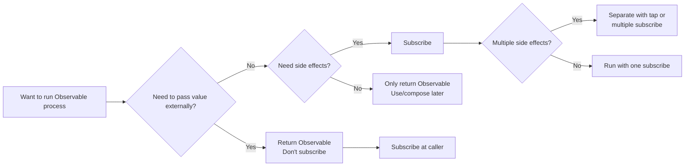
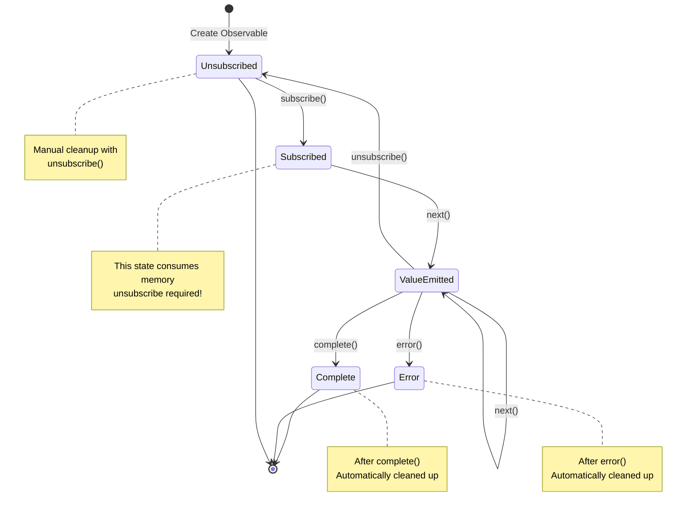
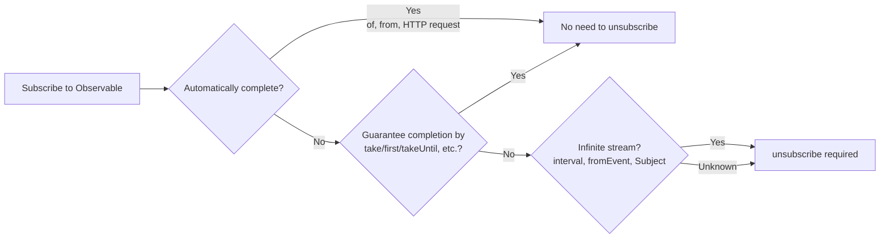

# Barriers to Lifecycle Management

One of the biggest pitfalls of RxJS is **Lifecycle Management**. Mistakes in "when to subscribe" and "when to unsubscribe" can lead to memory leaks and bugs.

## When to Subscribe

### Basic Principle: Don't Subscribe Until the Last Minute

#### ❌ Bad Example: Subscribe in the Middle

```typescript
import { interval } from 'rxjs';

function getEvenNumbers() {
  const numbers$ = interval(1000);

  // subscribe in this
  numbers$.subscribe(n => {
    if (n % 2 === 0) {
      console.log(n); // how do we pass this externally?
    }
  });
}
```

#### ✅ Good Example: Return Observable, Subscribe on Caller

```typescript
import { interval } from 'rxjs';
import { filter, take } from 'rxjs';

function getEvenNumbers() {
  return interval(1000).pipe(
    filter(n => n % 2 === 0),
    take(5)
  );
}

// subscribe on the use side
const subscription = getEvenNumbers().subscribe(n => {
  console.log(n);
});
```

::: tip 💡 Explanation
- **Bad example**: subscribe in a function loses control (cannot cancel, cannot compose)
- **Good example**: return Observable, caller can control
:::

### Subscribe Triggers "Side Effects"

#### ❌ Bad Example: Multiple Side Effects in Subscribe

```typescript
import { fromEvent } from 'rxjs';
import { map } from 'rxjs';

const button = document.querySelector('button')!;

fromEvent(button, 'click')
  .pipe(map(() => Math.random()))
  .subscribe(randomValue => {
    // Side effect 1: DOM manipulation
    document.querySelector('#result')!.textContent = randomValue.toString();

    // Side effect 2: API call
    fetch('/api/log', {
      method: 'POST',
      body: JSON.stringify({ value: randomValue })
    });

    // Side effect 3: Local storage
    localStorage.setItem('lastValue', randomValue.toString());
  });
```

#### ✅ Good Example: Isolate Side Effects and Subscribe Only to What You Need

```typescript
import { fromEvent } from 'rxjs';
import { map } from 'rxjs';

const button = document.querySelector('button')!;

const randomClicks$ = fromEvent(button, 'click').pipe(
  map(() => Math.random())
);

// if only DOM updates are needed
randomClicks$.subscribe(value => {
  document.querySelector('#result')!.textContent = value.toString();
});

// If only logging is required
randomClicks$.subscribe(value => {
  fetch('/api/log', {
    method: 'POST',
    body: JSON.stringify({ value })
  });
});
```

::: tip 💡 Explanation
- **subscribe = execution point of side effect**
- **If side effects are independent**: separate into multiple subscribe (can be controlled individually)
- **If side effects are always executed as a set**: OK to group them together in one subscribe
- **If side effects are needed in the pipeline**: use `tap` operator
:::

### When to Subscribe: Decision Flowchart



### The Entire Lifecycle of a Subscription

The following state transition diagram shows the states that an Observable subscription goes through and ends up in.



> [!IMPORTANT] Key Points for Lifecycle Management
> - **Subscribed**: State with risk of memory leakage
> - **complete/error**: Automatic cleanup (no unsubscribe required)
> - **unsubscribe**: Manual cleanup required (especially for infinite streams)

## When Should I Unsubscribe?

### Basic Principle: Always Unsubscribe After You Subscribe

#### ❌ Bad Example: Don't Unsubscribe → Memory Leak

```typescript
import { interval } from 'rxjs';

const button = document.querySelector('button')!;

function startTimer() {
  interval(1000).subscribe(n => {
    console.log(n);
  });
  // This subscription lasts forever!
}

// a new subscription is added with each button click
button.addEventListener('click', startTimer);
// 10 clicks = 10 subscriptions running simultaneously!
```

#### ✅ Good Example: Unsubscribe with unsubscribe

```typescript
import { interval } from 'rxjs';

function startTimer() {
  const subscription = interval(1000).subscribe(n => {
    console.log(n);
  });

  // Unsubscribe after 5 seconds
  setTimeout(() => {
    subscription.unsubscribe();
    console.log('Unsubscribed');
  }, 5000);
}
```

::: tip 💡 Explanation
- **Infinite streams** (interval, fromEvent, etc.) must be unsubscribe
- If not unsubscribe, memory leakage + unnecessary processing will continue
:::

### Cases Where Unsubscribe Is Not Necessary

#### ✅ Observable to Automatically Complete

```typescript
of(1, 2, 3).subscribe(n => console.log(n));
// automatically cleaned up after complete

from([1, 2, 3]).subscribe(n => console.log(n));
// automatically cleaned up after complete
```

#### ✅ Completion Is Guaranteed by take, etc.

```typescript
interval(1000).pipe(
  take(5) // automatically complete in 5 takes
).subscribe(n => console.log(n));
```

#### ✅ Exit with Error

```typescript
throwError(() => new Error('Error')).subscribe({
  error: err => console.error(err)
});
```

#### ✅ EMPTY (Immediately Complete)

```typescript
EMPTY.subscribe(() => console.log('not executed'));
```

> [!TIP] 💡 Explanation
> unsubscribe is not required if:
> 1. **Observable** called by **complete()** - automatically cleaned up
> 2. **error() is called** - automatically cleaned up as well
> 3. **Guaranteed completion by take(n), etc.** - explicitly complete
> > [!IMPORTANT] Important
> > Infinite streams (interval, fromEvent, Subject, etc.) must be unsubscribe!

### Flowchart for Determining If Unsubscribe Is Required



**When in doubt, it is safe to unsubscribe**!

## Patterns to Prevent Memory Leaks

### Pattern 1: Managed by Subscription Object

```typescript
import { interval, fromEvent } from 'rxjs';
import { Subscription } from 'rxjs';

class MyComponent {
  private subscription = new Subscription();

  ngOnInit() {
    // Add multiple subscriptions to one Subscription
    this.subscription.add(
      interval(1000).subscribe(n => console.log('Timer:', n))
    );

    this.subscription.add(
      fromEvent(document, 'click').subscribe(() => console.log('Click!'))
    );

    this.subscription.add(
      fromEvent(window, 'resize').subscribe(() => console.log('Resize!'))
    );
  }

  ngOnDestroy() {
    // Unsubscribe all subscriptions at once
    this.subscription.unsubscribe();
  }
}
```

#### 💡 Benefits

- Manage multiple subscriptions with one object
- Bulk cancel with `ngOnDestroy`
- Easy to add and delete

### Pattern 2: Manage by Array

```typescript
import { interval, fromEvent } from 'rxjs';
import { Subscription } from 'rxjs';

class MyComponent {
  private subscriptions: Subscription[] = [];

  ngOnInit() {
    this.subscriptions.push(
      interval(1000).subscribe(n => console.log('Timer:', n))
    );

    this.subscriptions.push(
      fromEvent(document, 'click').subscribe(() => console.log('Click!'))
    );
  }

  ngOnDestroy() {
    this.subscriptions.forEach(sub => sub.unsubscribe());
    this.subscriptions = [];
  }
}
```

#### 💡 Benefits

- Flexible management with array operations
- Can also be deactivated individually
- Easy to debug (check array in console.log)

### Pattern 3: takeUntil Pattern (Recommended)

```typescript
import { interval, fromEvent, Subject } from 'rxjs';
import { takeUntil } from 'rxjs';

class MyComponent {
  private destroy$ = new Subject<void>();

  ngOnInit() {
    // add takeUntil(this.destroy$) to all subscriptions
    interval(1000).pipe(
      takeUntil(this.destroy$)
    ).subscribe(n => console.log('Timer:', n));

    fromEvent(document, 'click').pipe(
      takeUntil(this.destroy$)
    ).subscribe(() => console.log('Click!'));

    fromEvent(window, 'resize').pipe(
      takeUntil(this.destroy$)
    ).subscribe(() => console.log('Resize!'));
  }

  ngOnDestroy() {
    // Unsubscribe all in one next()
    this.destroy$.next();
    this.destroy$.complete();
  }
}
```

#### 💡 Benefits

- **Most declarative** - pipeline makes completion conditions explicit
- **No Subscription object required** - memory efficient
- **Easiest to read** - code says "complete with destroy$"

## Complete Guide to the takeUntil Pattern

### Basic Pattern

```typescript
import { interval, Subject } from 'rxjs';
import { takeUntil } from 'rxjs';

const destroy$ = new Subject<void>();

// this subscription continues until destroy$ does next()
interval(1000).pipe(
  takeUntil(destroy$)
).subscribe(n => console.log(n));

// Stop all subscriptions after 5 seconds
setTimeout(() => {
  destroy$.next();
  destroy$.complete();
}, 5000);
```

#### Marble Diagram

```
interval(1000):  --0--1--2--3--4--5--6--7-->
destroy$:        ----------X
                          ↑
                       next() call

takeUntil result:   --0--1--2|
                          ↑
                       complete
```

### Apply to Multiple Observables

```typescript
import { interval, fromEvent, timer, Subject } from 'rxjs';
import { takeUntil, map } from 'rxjs';

const destroy$ = new Subject<void>();

// Pattern: use same destroy$ for all streams
interval(1000).pipe(
  takeUntil(destroy$),
  map(n => `Timer: ${n}`)
).subscribe(console.log);

fromEvent(document, 'click').pipe(
  takeUntil(destroy$),
  map(() => 'Click!')
).subscribe(console.log);

timer(2000).pipe(
  takeUntil(destroy$),
  map(() => 'Timer finished')
).subscribe(console.log);

// batch stop
function cleanup() {
  destroy$.next();
  destroy$.complete();
}

// Example: call cleanup() on page transition
window.addEventListener('beforeunload', cleanup);
```

## Common Mistakes in the takeUntil Pattern

### Mistake 1: takeUntil Is in the Wrong Position

#### ❌ Bad Example: map Before takeUntil

```typescript
import { interval, Subject } from 'rxjs';
import { map, takeUntil } from 'rxjs';

const destroy$ = new Subject<void>();

interval(1000).pipe(
  takeUntil(destroy$),  // if complete here...
  map(n => n * 2)       // map may be executed
).subscribe(console.log);
```

#### ✅ Good Example: takeUntil Placed Last

```typescript
import { interval, Subject } from 'rxjs';
import { map, takeUntil } from 'rxjs';

const destroy$ = new Subject<void>();

interval(1000).pipe(
  map(n => n * 2),
  takeUntil(destroy$)  // after all operators
).subscribe(console.log);
```

> [!TIP] 💡 Explanation
> - **takeUntil is placed last** possible
> - Exception: sometimes placed before multicast operators such as shareReplay

### Mistake 2: Not Completing destroy$

#### ❌ Bad Example: Not Calling complete()

```typescript
import { Subject } from 'rxjs';

const destroy$ = new Subject<void>();

function cleanup() {
  destroy$.next();
  // ❌ not call complete()
}

// Problem: destroy$ itself causes a memory leak
```

#### ✅ Good Example: Call Both next() and complete()

```typescript
import { Subject } from 'rxjs';

const destroy$ = new Subject<void>();

function cleanup() {
  destroy$.next();
  destroy$.complete();
}
```

> [!TIP] 💡 Explanation
> - If only `next()` is used, destroy$ itself remains subscribed
> - **Always call `complete()` too**

### Mistake 3: Trying to Reuse

#### ❌ Bad Example: Reuse a Completed Subject

```typescript
import { interval, Subject } from 'rxjs';
import { takeUntil } from 'rxjs';

const destroy$ = new Subject<void>();

function start() {
  interval(1000).pipe(
    takeUntil(destroy$)
  ).subscribe(console.log);
}

function stop() {
  destroy$.next();
  destroy$.complete();
}

start();
setTimeout(stop, 3000);

// ❌ Problem: destroy$ is already complete, so start() again will immediately terminate
setTimeout(start, 5000); // this doesn't work
```

#### ✅ Good Example: Regenerate destroy$

```typescript
import { interval, Subject } from 'rxjs';
import { takeUntil } from 'rxjs';

class MyComponent {
  private destroy$ = new Subject<void>();

  start() {
    // regenerate if already completed
    if (this.destroy$.closed) {
      this.destroy$ = new Subject<void>();
    }

    interval(1000).pipe(
      takeUntil(this.destroy$)
    ).subscribe(console.log);
  }

  stop() {
    this.destroy$.next();
    this.destroy$.complete();
  }
}
```

> [!TIP] 💡 Explanation
> - **Subject cannot be reused once complete**
> - If it needs to be reopened, create a new Subject

## Subscription Management Best Practices

### Best Practice 1: Have destroy$ Per Component/Class

```typescript
import { Subject } from 'rxjs';
import { takeUntil } from 'rxjs';

class UserProfileComponent {
  private destroy$ = new Subject<void>();

  constructor(private userService: UserService) {}

  ngOnInit() {
    this.userService.getUser().pipe(
      takeUntil(this.destroy$)
    ).subscribe(user => {
      console.log(user);
    });

    this.userService.getUserPosts().pipe(
      takeUntil(this.destroy$)
    ).subscribe(posts => {
      console.log(posts);
    });
  }

  ngOnDestroy() {
    this.destroy$.next();
    this.destroy$.complete();
  }
}
```

#### 💡 Benefits

- **Consistency** - same pattern across all components
- **Maintainability** - no ngOnDestroy changes when adding new subscriptions
- **Safety** - no unsubscribe leaks

### Best Practice 2: Leverage AsyncPipe (for Angular)

```typescript
import { Component } from '@angular/core';
import { Observable } from 'rxjs';

@Component({
  selector: 'app-user-profile',
  template: `
    <!-- AsyncPipe automatically subscribe/unsubscribe -->
    <div *ngIf="user$ | async as user">
      <h1>{{ user.name }}</h1>
      <p>{{ user.email }}</p>
    </div>

    <ul>
      <li *ngFor="let post of posts$ | async">
        {{ post.title }}
      </li>
    </ul>
  `
})
export class UserProfileComponent {
  user$: Observable<User>;
  posts$: Observable<Post[]>;

  constructor(private userService: UserService) {
    // pass the Observable directly to the template
    this.user$ = this.userService.getUser();
    this.posts$ = this.userService.getUserPosts();

    // No ngOnDestroy required! AsyncPipe will automatically release it
  }
}
```

#### 💡 Benefits

- **Automatically unsubscribe** - automatically unsubscribes when component is destroyed
- **OnPush support** - optimized change detection
- **Code simplicity** - no boilerplate subscribe/unsubscribe

### Best Practice 3: Change Strategy Based on Long vs. Short Life

```typescript
import { Injectable } from '@angular/core';
import { BehaviorSubject, interval, fromEvent } from 'rxjs';
import { takeUntil } from 'rxjs';

@Injectable({ providedIn: 'root' })
export class DataService {
  // ✅ State shared across services (long-lived)
  // → Keep subscribed until application ends
  private userState$ = new BehaviorSubject<User | null>(null);

  getUser() {
    return this.userState$.asObservable();
  }

  // ❌ do not subscribe directly in the component
  // ✅ subscribe via AsyncPipe or takeUntil
}

class MyComponent {
  private destroy$ = new Subject<void>();

  ngOnInit() {
    // ✅ Subscription tied to component lifecycle (short-lived)
    // → always unset by ngOnDestroy
    interval(1000).pipe(
      takeUntil(this.destroy$)
    ).subscribe(n => console.log(n));

    fromEvent(window, 'resize').pipe(
      takeUntil(this.destroy$)
    ).subscribe(() => console.log('Resize'));
  }

  ngOnDestroy() {
    this.destroy$.next();
    this.destroy$.complete();
  }
}
```

> [!IMPORTANT] 💡 Principle
> | Subscription Type | Lifecycle | Management Method |
> |---|---|---|
> | **Global state** | Application-wide | BehaviorSubject + AsyncPipe |
> | **Page/Route Specific** | While route is active | takeUntil(routeDestroy$) |
> | **Component specific** | While component exists | takeUntil(destroy$) or AsyncPipe |
> | **One-time API call** | Until completion | take(1) or first() |

### Best Practice 4: Set Explicit Completion Conditions

#### ❌ Bad Example: Unknown When It Will End

```typescript
import { fromEvent } from 'rxjs';

fromEvent(document, 'click').subscribe(() => {
  console.log('Click');
});
```

#### ✅ Good Example 1: Frequency Limit

```typescript
import { fromEvent } from 'rxjs';
import { take } from 'rxjs';

fromEvent(document, 'click').pipe(
  take(5) // automatically terminates after 5 takes
).subscribe(() => {
  console.log('Click (max 5 times)');
});
```

#### ✅ Good Example 2: Time Limit

```typescript
import { fromEvent, timer } from 'rxjs';
import { takeUntil } from 'rxjs';

const timeout$ = timer(10000); // after 10 seconds
fromEvent(document, 'click').pipe(
  takeUntil(timeout$)
).subscribe(() => {
  console.log('Click (within 10 seconds)');
});
```

#### ✅ Good Example 3: Multiple Exit Conditions

```typescript
import { fromEvent, Subject, merge } from 'rxjs';
import { takeUntil, take } from 'rxjs';

const destroy$ = new Subject<void>();
const maxClicks$ = fromEvent(document, 'click').pipe(take(10));

fromEvent(document, 'mousemove').pipe(
  takeUntil(merge(destroy$, maxClicks$)) // end with either
).subscribe(() => {
  console.log('Mouse move');
});
```

> [!IMPORTANT] 💡 Principles
> - **Explicitly state "when it will end"** - Avoid infinite streams
> - Set completion conditions with take, first, takeWhile, takeUntil, etc.
> - Tie it to a lifecycle (destroy$, timeout$, etc.)

## Comprehension Checklist

Check if you can answer the following questions.

```markdown
## Basic Understanding
- [ ] Explain what happens when you subscribe to an Observable
- [ ] Distinguish between cases where unsubscribe is necessary and those where it is not
- [ ] Explain the causes of memory leaks

## Applying Patterns
- [ ] Manage multiple subscriptions with the Subscription object
- [ ] Implement the takeUntil pattern
- [ ] Place destroy$ properly (last operator)

## Best Practices
- [ ] Know when to use AsyncPipe
- [ ] Can distinguish between and manage long-lived and short-lived subscriptions
- [ ] Can set explicit completion conditions

## Debugging
- [ ] Know how to detect memory leaks
- [ ] Find unsubscribe leaks
- [ ] Can check subscription count in Browser DevTools
```

## Next Steps

Once you understand lifecycle management, the next step is to learn about **Operator Selection**.

→ **[Operator Selection Difficulties](/pt/guide/overcoming-difficulties/operator-selection)** - Criteria for choosing the right one from over 100 operators

## Related Pages

- **[Chapter 2: Observable Lifecycle](/pt/guide/observables/observable-lifecycle)** - Basics of subscribe/unsubscribe
- **[Chapter 10: Common Mistakes and Solutions](/pt/guide/anti-patterns/common-mistakes)** - Nested subscribe, memory leaks, etc.
- **[Chapter 13: Form Processing Patterns](/pt/guide/)** - Practical use (in preparation)
- **[Chapter 8: Debugging Memory Leaks](/pt/guide/debugging/)** - How to debug

## 🎯 Exercises

### Exercise 1: Fix a Memory Leak

The following code has a memory leak. Please fix it.

```typescript
class ChatComponent {
  ngOnInit() {
    interval(5000).subscribe(() => {
      this.chatService.checkNewMessages().subscribe(messages => {
        console.log('New messages:', messages);
      });
    });
  }
}
```

<details>
<summary>Example solution</summary>

```typescript
class ChatComponent {
  private destroy$ = new Subject<void>();

  ngOnInit() {
    interval(5000).pipe(
      takeUntil(this.destroy$),
      switchMap(() => this.chatService.checkNewMessages())
    ).subscribe(messages => {
      console.log('New messages:', messages);
    });
  }

  ngOnDestroy() {
    this.destroy$.next();
    this.destroy$.complete();
  }
}
```

> [!NOTE] Fixes
> 1. Add `destroy$` Subject
> 2. Stop interval with `takeUntil(this.destroy$)`
> 3. Resolve nested subscribe with `switchMap`
> 4. Cleanup with `ngOnDestroy`

</details>

### Exercise 2: Choosing the Right Pattern

In the following scenario, choose the best subscription management pattern.

1. HTTP request (one time only)
2. WebSocket connection (during the existence of the component)
3. Global user state (application-wide)

<details>
<summary>Example solution</summary>

**1. HTTP request (one time only)**
```typescript
// ✅ take(1) or first() - autocomplete once
this.http.get('/api/user').pipe(
  take(1)
).subscribe(user => console.log(user));

// or AsyncPipe (for Angular)
user$ = this.http.get('/api/user');
```

**2. WebSocket connection (in the presence of a component)**
```typescript
// ✅ takeUntil pattern - disconnect when component is destroyed
private destroy$ = new Subject<void>();

ngOnInit() {
  this.websocket.connect().pipe(
    takeUntil(this.destroy$)
  ).subscribe(message => console.log(message));
}

ngOnDestroy() {
  this.destroy$.next();
  this.destroy$.complete();
}
```

**3. Global user state (application-wide)**
```typescript
// ✅ BehaviorSubject + AsyncPipe - no unsubscribe required
@Injectable({ providedIn: 'root' })
class AuthService {
  private userState$ = new BehaviorSubject<User | null>(null);

  getUser() {
    return this.userState$.asObservable();
  }
}

// used in component
user$ = this.authService.getUser(); // Subscribe with AsyncPipe
```

</details>
