# Multiple Stream Combination

There are many requirements in RxJS like **"I want to combine the results of two APIs" or "I want to monitor all fields of a form"**, but choosing the right operator is difficult. This page describes practical patterns for combining multiple streams.

## combineLatest vs zip vs withLatestFrom vs forkJoin

### Comparison of the 4 Main Combination Operators

| Operator | Firing Timing | How to Combine Values | Completion Condition | Common Use Cases |
|---|---|---|---|---|
| **combineLatest** | When any changes | Latest value of each stream | All streams complete | Form validation, combination of settings |
| **zip** | All streams produce values | Pair values at corresponding positions | Any one completes | Pagination, parallel processing synchronization |
| **withLatestFrom** | Main stream changes | Main + auxiliary latest value | Main stream completes | Event + current state |
| **forkJoin** | All streams complete | Last value of each stream | All streams complete | Multiple API parallel invocation |

### Comparison with Marble Diagram

```
A:  --1--2--------3----|
B:  ----a----b------c----|

combineLatest(A, B):
    ----[1,a]-[2,a]-[2,b]-[3,b]-[3,c]|
    (fires whenever any changes)

zip(A, B):
    ----[1,a]----[2,b]----[3,c]|
    (pairs at corresponding positions)

A.pipe(withLatestFrom(B)):
    ----[1,a]----[2,b]----[3,c]|
    (fires only when A changes)

forkJoin({ a: A, b: B }):
    ---------------------------{ a: 3, b: c }|
    (fires after both complete)
```

### Visualization of Firing Timing

The following diagram shows when each combination operator fires values.

```mermaid
sequenceDiagram
    participant A as Stream A
    participant B as Stream B
    participant CL as combineLatest
    participant Z as zip
    participant WL as withLatestFrom
    participant FJ as forkJoin

    Note over A,FJ: Time progresses →

    A->>A: Emit value 1
    Note over CL: Not fired yet<br/>(B not emitted)

    B->>B: Emit value a
    A->>CL: [1, a]
    Note over Z: Not fired yet<br/>(Waiting for next A value)
    Note over FJ: Not fired yet<br/>(Not complete)

    A->>A: Emit value 2
    A->>CL: [2, a]
    A->>WL: [2, a]
    Note over Z: Waiting for pairing

    B->>B: Emit value b
    B->>CL: [2, b]
    A->>Z: [1, a], [2, b]
    Note over FJ: Not fired yet<br/>(Not complete)

    A->>A: Emit value 3
    A->>CL: [3, b]
    A->>WL: [3, b]

    B->>B: Emit value c
    B->>CL: [3, c]
    A->>Z: [3, c]

    Note over A: Complete
    Note over B: Complete
    B->>FJ: {a: 3, b: c}

    Note right of CL: Fires whenever<br/>any changes
    Note right of Z: Pairs and fires<br/>at corresponding positions
    Note right of WL: Fires only<br/>when A changes
    Note right of FJ: Fires once<br/>after both complete
```



> [!TIP] Selection Criteria
> - **combineLatest**: Combination of reactive states (forms, settings)
> - **zip**: Pairing of corresponding values (pagination, parallel processing)
> - **withLatestFrom**: Event + current state (get settings on click)
> - **forkJoin**: Execute multiple asynchronous processes in parallel and get all results (multiple APIs)

## combineLatest: Combine Latest Values

### Features
- **After all streams have emitted at least once**, fires whenever any changes
- Combines the **latest value** of each stream
- Continues until all streams complete

### Practice Example 1: Form Validation

#### ❌ Bad Example: Subscribe individually and combine manually
```typescript
import { BehaviorSubject } from 'rxjs';

const email$ = new BehaviorSubject('');
const password$ = new BehaviorSubject('');
let isValid = false;

email$.subscribe(email => {
  // Need password$ value but cannot get it
  // Must manage with global variables
});

password$.subscribe(password => {
  // Same problem
});
```

#### ✅ Good Example: Automatically combine with combineLatest
```typescript
import { BehaviorSubject, combineLatest } from 'rxjs';
import { map } from 'rxjs';

const email$ = new BehaviorSubject('');
const password$ = new BehaviorSubject('');

const isFormValid$ = combineLatest([email$, password$]).pipe(
  map(([email, password]) => {
    const emailValid = email.includes('@') && email.length > 3;
    const passwordValid = password.length >= 8;
    return emailValid && passwordValid;
  })
);

isFormValid$.subscribe(isValid => {
  console.log('Form valid:', isValid);
});

// Value changes
email$.next('user@example.com');  // Form valid: false (password too short)
password$.next('pass1234');       // Form valid: true
```

### Practice Example 2: Combining Multiple Settings

```typescript
import { BehaviorSubject, combineLatest } from 'rxjs';
import { map } from 'rxjs';

interface Config {
  theme: 'light' | 'dark';
  language: 'ja' | 'en';
  fontSize: number;
}

const theme$ = new BehaviorSubject<'light' | 'dark'>('light');
const language$ = new BehaviorSubject<'ja' | 'en'>('ja');
const fontSize$ = new BehaviorSubject<number>(14);

const config$ = combineLatest([theme$, language$, fontSize$]).pipe(
  map(([theme, language, fontSize]): Config => ({
    theme,
    language,
    fontSize
  }))
);

config$.subscribe(config => {
  console.log('Settings updated:', config);
  // Update UI
});

theme$.next('dark');      // Settings updated: { theme: 'dark', language: 'ja', fontSize: 14 }
fontSize$.next(16);       // Settings updated: { theme: 'dark', language: 'ja', fontSize: 16 }
```

> [!TIP] When to Use combineLatest
> - **Form validation**: Combine latest values of all fields
> - **Settings monitoring**: React when multiple setting items change
> - **Dependent display**: Update UI according to multiple states
> - **Filtering**: Combine multiple conditions

## zip: Pair at Corresponding Positions

### Features
- Pairs **values at corresponding positions** of each stream
- Waits until values are available from all streams
- Completes when any stream completes

### Practice Example 1: Pair Data and Metadata in Pagination

#### ❌ Bad Example: Timing is misaligned
```typescript
import { interval } from 'rxjs';
import { map, take } from 'rxjs';

// Get page data (slow)
const pages$ = interval(1000).pipe(
  map(i => `Page ${i + 1} data`),
  take(3)
);

// Get metadata (fast)
const metadata$ = interval(100).pipe(
  map(i => `Metadata ${i + 1}`),
  take(3)
);

// Subscribing individually breaks correspondence
pages$.subscribe(page => console.log('Page:', page));
metadata$.subscribe(meta => console.log('Meta:', meta));

// Output:
// Meta: Metadata 1
// Meta: Metadata 2
// Meta: Metadata 3
// Page: Page 1 data
// Page: Page 2 data
// Page: Page 3 data
// (Correspondence is scrambled)
```

#### ✅ Good Example: Pair corresponding positions with zip
```typescript
import { interval, zip } from 'rxjs';
import { map, take } from 'rxjs';

const pages$ = interval(1000).pipe(
  map(i => `Page ${i + 1} data`),
  take(3)
);

const metadata$ = interval(100).pipe(
  map(i => `Metadata ${i + 1}`),
  take(3)
);

zip(pages$, metadata$).subscribe(([page, meta]) => {
  console.log(`${page} - ${meta}`);
});

// Output (every second):
// Page 1 data - Metadata 1
// Page 2 data - Metadata 2
// Page 3 data - Metadata 3
```

### Practice Example 2: Get Parallel Processing Results in Order

```typescript
import { of, zip } from 'rxjs';
import { delay, map } from 'rxjs';

// Call 3 APIs in parallel, but completion times vary
const api1$ = of('Result 1').pipe(delay(300));
const api2$ = of('Result 2').pipe(delay(100)); // Fastest
const api3$ = of('Result 3').pipe(delay(200));

zip(api1$, api2$, api3$).pipe(
  map(([r1, r2, r3]) => ({ r1, r2, r3 }))
).subscribe(results => {
  console.log('All results:', results);
});

// Output (after 300ms, once all are ready):
// All results: { r1: 'Result 1', r2: 'Result 2', r3: 'Result 3' }
```

> [!TIP] When to Use zip
> - **Order matters**: Pair 1st with 1st, 2nd with 2nd
> - **Data and metadata pairing**: Page data and page numbers
> - **Parallel processing synchronization**: Execute multiple processes in parallel and guarantee order

> [!WARNING] zip Cautions
> - Waits for slow streams, so **buffers can accumulate**
> - With infinite streams, slow ones can cause memory leaks

## withLatestFrom: Get Main + Auxiliary Values

### Features
- Fires only **when the main stream emits a value**
- Gets and combines the **latest value** of auxiliary streams
- Completes when the main stream completes

### Practice Example 1: Click Event + Current State

#### ❌ Bad Example: combineLatest fires unnecessarily
```typescript
import { fromEvent, BehaviorSubject, combineLatest } from 'rxjs';

const button = document.querySelector('button')!;
const clicks$ = fromEvent(button, 'click');
const counter$ = new BehaviorSubject(0);

// ❌ combineLatest also fires when counter$ changes
combineLatest([clicks$, counter$]).subscribe(([event, count]) => {
  console.log('Count at click:', count);
});

// Fires every time counter$ changes
setInterval(() => {
  counter$.next(counter$.value + 1); // Unnecessary firing
}, 1000);
```

#### ✅ Good Example: Fire only on click with withLatestFrom
```typescript
import { fromEvent, BehaviorSubject } from 'rxjs';
import { withLatestFrom } from 'rxjs';

const button = document.querySelector('button')!;
const clicks$ = fromEvent(button, 'click');
const counter$ = new BehaviorSubject(0);

clicks$.pipe(
  withLatestFrom(counter$)
).subscribe(([event, count]) => {
  console.log('Count at click:', count);
});

// Does not fire when counter$ changes
setInterval(() => {
  counter$.next(counter$.value + 1); // ✅ Does not fire
}, 1000);
```

### Practice Example 2: Form Submission + Current User Information

```typescript
import { fromEvent, BehaviorSubject } from 'rxjs';
import { withLatestFrom, map } from 'rxjs';

const submitButton = document.querySelector('#submit')!;
const submit$ = fromEvent(submitButton, 'click');

const currentUser$ = new BehaviorSubject({ id: 1, name: 'Alice' });
const formData$ = new BehaviorSubject({ title: '', content: '' });

submit$.pipe(
  withLatestFrom(currentUser$, formData$),
  map(([event, user, data]) => ({
    ...data,
    authorId: user.id,
    authorName: user.name,
    timestamp: Date.now()
  }))
).subscribe(payload => {
  console.log('Submission data:', payload);
  // Send to API...
});
```

> [!TIP] When to Use withLatestFrom
> - **Event + state**: Get current state at click
> - **Main processing + auxiliary data**: User information at form submission
> - **Trigger + settings**: Current setting values at button click

## forkJoin: Wait for All Completions

### Features
- Waits until **all streams complete**
- Gets the **last value** of each stream
- Equivalent to `Promise.all()` for Promises

### Practice Example 1: Parallel Calling of Multiple APIs

#### ❌ Bad Example: Sequential execution is slow
```typescript
import { ajax } from 'rxjs/ajax';

ajax.getJSON('/api/user').subscribe(user => {
  console.log('User fetched:', user);

  ajax.getJSON('/api/posts').subscribe(posts => {
    console.log('Posts fetched:', posts);

    ajax.getJSON('/api/comments').subscribe(comments => {
      console.log('Comments fetched:', comments);
      // Deep nesting
    });
  });
});
```

#### ✅ Good Example: Parallel execution with forkJoin
```typescript
import { forkJoin } from 'rxjs';
import { ajax } from 'rxjs/ajax';

forkJoin({
  user: ajax.getJSON('/api/user'),
  posts: ajax.getJSON('/api/posts'),
  comments: ajax.getJSON('/api/comments')
}).subscribe(({ user, posts, comments }) => {
  console.log('All data fetched:', { user, posts, comments });
  // All 3 APIs execute in parallel
});
```

### Practice Example 2: Multiple File Uploads

```typescript
import { forkJoin, Observable, of } from 'rxjs';
import { delay } from 'rxjs';

function uploadFile(file: File): Observable<string> {
  return of(`${file.name} upload complete`).pipe(
    delay(Math.random() * 2000)
  );
}

const files = [
  new File([''], 'file1.txt'),
  new File([''], 'file2.txt'),
  new File([''], 'file3.txt')
];

forkJoin(files.map(file => uploadFile(file))).subscribe(results => {
  console.log('All files uploaded:', results);
  // Display after all uploads complete
});
```

> [!TIP] When to Use forkJoin
> - **Multiple API parallel calls**: Batch retrieve initial data
> - **Batch processing**: Complete all tasks
> - **Independent parallel execution**: When each process is independent

> [!WARNING] forkJoin Cautions
> - **Cannot be used with non-completing streams** (interval, etc.)
> - If any errors, the entire stream errors
> - Cannot get intermediate values (final value only)

## Selection Flowchart


## Practical Patterns

### Pattern 1: Form Validation

```typescript
import { BehaviorSubject, combineLatest } from 'rxjs';
import { map } from 'rxjs';

interface FormState {
  email: string;
  password: string;
  agreeToTerms: boolean;
}

class RegistrationForm {
  private email$ = new BehaviorSubject('');
  private password$ = new BehaviorSubject('');
  private agreeToTerms$ = new BehaviorSubject(false);

  readonly isValid$ = combineLatest([
    this.email$,
    this.password$,
    this.agreeToTerms$
  ]).pipe(
    map(([email, password, agreed]) => {
      const emailValid = /^[^\s@]+@[^\s@]+\.[^\s@]+$/.test(email);
      const passwordValid = password.length >= 8;
      return emailValid && passwordValid && agreed;
    })
  );

  readonly formState$ = combineLatest([
    this.email$,
    this.password$,
    this.agreeToTerms$
  ]).pipe(
    map(([email, password, agreeToTerms]): FormState => ({
      email,
      password,
      agreeToTerms
    }))
  );

  updateEmail(email: string) {
    this.email$.next(email);
  }

  updatePassword(password: string) {
    this.password$.next(password);
  }

  toggleTerms() {
    this.agreeToTerms$.next(!this.agreeToTerms$.value);
  }
}

// Usage
const form = new RegistrationForm();

form.isValid$.subscribe(isValid => {
  console.log('Form valid:', isValid);
});

form.updateEmail('user@example.com');
form.updatePassword('password123');
form.toggleTerms();
```

### Pattern 2: Dependent API Calls

```typescript
import { forkJoin, of } from 'rxjs';
import { switchMap, map, catchError } from 'rxjs';
import { ajax } from 'rxjs/ajax';

interface User {
  id: number;
  name: string;
}

interface Post {
  id: number;
  userId: number;
  title: string;
}

interface Comment {
  id: number;
  postId: number;
  text: string;
}

// Get user's posts and comments in parallel
function getUserData(userId: number) {
  return ajax.getJSON<User>(`/api/users/${userId}`).pipe(
    switchMap(user =>
      forkJoin({
        user: of(user),
        posts: ajax.getJSON<Post[]>(`/api/users/${userId}/posts`),
        comments: ajax.getJSON<Comment[]>(`/api/users/${userId}/comments`)
      })
    ),
    catchError(error => {
      console.error('Error:', error);
      return of({
        user: null,
        posts: [],
        comments: []
      });
    })
  );
}

// Usage
getUserData(1).subscribe(({ user, posts, comments }) => {
  console.log('User data:', { user, posts, comments });
});
```

### Pattern 3: Real-time Filtering

```typescript
import { BehaviorSubject, combineLatest } from 'rxjs';
import { map } from 'rxjs';

interface Product {
  id: number;
  name: string;
  category: string;
  price: number;
}

class ProductFilter {
  private products$ = new BehaviorSubject<Product[]>([
    { id: 1, name: 'Laptop', category: 'electronics', price: 100000 },
    { id: 2, name: 'Mouse', category: 'electronics', price: 2000 },
    { id: 3, name: 'Book', category: 'books', price: 1500 }
  ]);

  private searchQuery$ = new BehaviorSubject('');
  private categoryFilter$ = new BehaviorSubject<string | null>(null);
  private maxPrice$ = new BehaviorSubject<number>(Infinity);

  readonly filteredProducts$ = combineLatest([
    this.products$,
    this.searchQuery$,
    this.categoryFilter$,
    this.maxPrice$
  ]).pipe(
    map(([products, query, category, maxPrice]) => {
      return products.filter(p => {
        const matchesQuery = p.name.toLowerCase().includes(query.toLowerCase());
        const matchesCategory = !category || p.category === category;
        const matchesPrice = p.price <= maxPrice;
        return matchesQuery && matchesCategory && matchesPrice;
      });
    })
  );

  updateSearch(query: string) {
    this.searchQuery$.next(query);
  }

  updateCategory(category: string | null) {
    this.categoryFilter$.next(category);
  }

  updateMaxPrice(price: number) {
    this.maxPrice$.next(price);
  }
}

// Usage
const filter = new ProductFilter();

filter.filteredProducts$.subscribe(products => {
  console.log('Filtered products:', products);
});

filter.updateSearch('Mouse');
filter.updateCategory('electronics');
filter.updateMaxPrice(50000);
```

## Common Pitfalls

### Pitfall 1: combineLatest First Firing

#### ❌ Bad Example: Streams without initial values
```typescript
import { Subject, combineLatest } from 'rxjs';

const a$ = new Subject<number>();
const b$ = new Subject<number>();

combineLatest([a$, b$]).subscribe(([a, b]) => {
  console.log('Values:', a, b);
});

a$.next(1); // Nothing output (b$ has not emitted yet)
b$.next(2); // Now outputs: Values: 1 2
```

#### ✅ Good Example: Set initial values with BehaviorSubject
```typescript
import { BehaviorSubject, combineLatest } from 'rxjs';

const a$ = new BehaviorSubject<number>(0); // Initial value
const b$ = new BehaviorSubject<number>(0);

combineLatest([a$, b$]).subscribe(([a, b]) => {
  console.log('Values:', a, b);
});

// Output: Values: 0 0 (fires immediately)

a$.next(1); // Output: Values: 1 0
b$.next(2); // Output: Values: 1 2
```

### Pitfall 2: Buffer Accumulation in zip

#### ❌ Bad Example: Buffer accumulates in slow stream
```typescript
import { interval, zip } from 'rxjs';
import { take } from 'rxjs';

const fast$ = interval(100).pipe(take(100));  // Fast
const slow$ = interval(1000).pipe(take(10));  // Slow

zip(fast$, slow$).subscribe(([f, s]) => {
  console.log('Pair:', f, s);
});

// Problem: fast$ values accumulate in buffer
// Until slow$ emits 10, fast$ consumes memory for 100 values
```

#### ✅ Good Example: Adjust speed
```typescript
import { interval, combineLatest } from 'rxjs';
import { take } from 'rxjs';

const fast$ = interval(100).pipe(take(100));
const slow$ = interval(1000).pipe(take(10));

// Use combineLatest instead of zip
combineLatest([fast$, slow$]).subscribe(([f, s]) => {
  console.log('Latest combination:', f, s);
});

// Or adjust fast$ with throttleTime
```

### Pitfall 3: Infinite Streams with forkJoin

#### ❌ Bad Example: Non-completing stream
```typescript
import { interval, forkJoin } from 'rxjs';
import { ajax } from 'rxjs/ajax';

forkJoin({
  timer: interval(1000),  // ❌ Never completes
  user: ajax.getJSON('/api/user')
}).subscribe(result => {
  console.log(result); // Never executes
});
```

#### ✅ Good Example: Limit with take
```typescript
import { interval, forkJoin } from 'rxjs';
import { ajax } from 'rxjs/ajax';
import { take } from 'rxjs';

forkJoin({
  timer: interval(1000).pipe(take(5)), // ✅ Completes after 5
  user: ajax.getJSON('/api/user')
}).subscribe(result => {
  console.log('Result:', result); // Executes after 5 seconds
});
```

## Comprehension Checklist

Check if you can answer the following questions.

```markdown
## Basic Understanding
- [ ] Explain the differences between combineLatest, zip, withLatestFrom, and forkJoin
- [ ] Understand the firing timing of each
- [ ] Explain when each operator completes

## Differentiation
- [ ] Choose the appropriate operator for form validation
- [ ] Choose the appropriate operator for multiple API parallel calls
- [ ] Choose the appropriate operator for combining events + state

## Cautions
- [ ] Understand combineLatest's first firing condition
- [ ] Explain the buffer accumulation problem in zip
- [ ] Understand why forkJoin cannot be used with infinite streams

## Practice
- [ ] Implement form validation pattern
- [ ] Implement multiple API parallel calls
- [ ] Implement real-time filtering
```

## Next Steps

Once you understand combining multiple streams, learn **debugging techniques** next.

→ **[Debugging Techniques](/pt/guide/overcoming-difficulties/debugging-guide)** - How to debug complex streams

## Related Pages

- **[Chapter 3: combineLatest](/pt/guide/creation-functions/combination/combineLatest)** - combineLatest details
- **[Chapter 3: zip](/pt/guide/creation-functions/combination/zip)** - zip details
- **[Chapter 3: forkJoin](/pt/guide/creation-functions/combination/forkJoin)** - forkJoin details
- **[withLatestFrom](/pt/guide/operators/combination/withLatestFrom)** - withLatestFrom details
- **[Chapter 4: Operator Selection](/pt/guide/overcoming-difficulties/operator-selection)** - Operator selection criteria

## 🎯 Exercises

### Problem 1: Choosing the Right Operator

Choose the best operator for the following scenarios.

1. **Enable submit button when both username and email address are entered**
2. **Send current cart contents when button is clicked**
3. **Call 3 APIs in parallel and display data when all complete**
4. **Pair page number with number of items per page**

<details>
<summary>Example Solutions</summary>

**1. Enable submit button when both username and email address are entered**
```typescript
import { BehaviorSubject, combineLatest } from 'rxjs';
import { map } from 'rxjs';

const username$ = new BehaviorSubject('');
const email$ = new BehaviorSubject('');

const isSubmitEnabled$ = combineLatest([username$, email$]).pipe(
  map(([username, email]) => username.length > 0 && email.length > 0)
);

isSubmitEnabled$.subscribe(enabled => {
  console.log('Submit enabled:', enabled);
});
```

> [!NOTE] Reason
> **combineLatest** is best because it needs to be reevaluated when either changes.

---

**2. Send current cart contents when button is clicked**
```typescript
import { fromEvent, BehaviorSubject } from 'rxjs';
import { withLatestFrom } from 'rxjs';

const submitButton = document.querySelector('#checkout')!;
const submit$ = fromEvent(submitButton, 'click');
const cart$ = new BehaviorSubject<string[]>([]);

submit$.pipe(
  withLatestFrom(cart$)
).subscribe(([event, cart]) => {
  console.log('Purchase:', cart);
  // Send to API...
});
```

> [!NOTE] Reason
> **withLatestFrom** is best because we want to fire only on click (main stream) and get the latest cart value.

---

**3. Call 3 APIs in parallel and display data when all complete**
```typescript
import { forkJoin } from 'rxjs';
import { ajax } from 'rxjs/ajax';

forkJoin({
  users: ajax.getJSON('/api/users'),
  products: ajax.getJSON('/api/products'),
  orders: ajax.getJSON('/api/orders')
}).subscribe(({ users, products, orders }) => {
  console.log('All data fetched:', { users, products, orders });
});
```

> [!NOTE] Reason
> **forkJoin** is best for executing multiple API calls in parallel and waiting for all to complete.

---

**4. Pair page number with number of items per page**
```typescript
import { BehaviorSubject, zip } from 'rxjs';

const pageNumber$ = new BehaviorSubject(1);
const itemsPerPage$ = new BehaviorSubject(10);

zip(pageNumber$, itemsPerPage$).subscribe(([page, items]) => {
  console.log(`Page ${page}: ${items} items/page`);
});

pageNumber$.next(2);
itemsPerPage$.next(20);
```

> [!NOTE] Reason
> **zip** is best for pairing page number with item count at corresponding positions.

</details>

### Problem 2: combineLatest First Firing

In the following code, when is the first value output?

```typescript
import { Subject, BehaviorSubject, combineLatest } from 'rxjs';

const a$ = new Subject<number>();
const b$ = new BehaviorSubject<number>(0);
const c$ = new Subject<number>();

combineLatest([a$, b$, c$]).subscribe(([a, b, c]) => {
  console.log('Values:', a, b, c);
});

a$.next(1);
c$.next(3);
```

<details>
<summary>Solution</summary>

**Answer: When `c$.next(3);` is executed**

Output: `Values: 1 0 3`

> [!NOTE] Reason
> `combineLatest` fires **after all streams have emitted at least once**.
> - `a$` is `Subject` with no initial value → `a$.next(1)` produces a value
> - `b$` is `BehaviorSubject` with initial value `0` → already has a value
> - `c$` is `Subject` with no initial value → `c$.next(3)` produces a value
>
> Only after `c$.next(3)` is executed do all streams have values, so it fires there.

</details>

### Problem 3: Difference between zip and combineLatest

In the following Marble Diagram, predict the output of zip and combineLatest.

```
A:  --1--2----3----|
B:  ----a----b-----|

zip(A, B) output?
combineLatest(A, B) output?
```

<details>
<summary>Solution</summary>

**zip(A, B) output:**
```
----[1,a]----[2,b]-|
```

**combineLatest(A, B) output:**
```
----[1,a]-[2,a]-[2,b]-[3,b]|
```

> [!NOTE] Reason
> - **zip**: Pairs at corresponding positions
>   - 1 and a, 2 and b, 3 has no pair so complete
> - **combineLatest**: Outputs latest combination whenever any changes
>   - a is emitted → [1,a]
>   - 2 is emitted → [2,a]
>   - b is emitted → [2,b]
>   - 3 is emitted → [3,b]

</details>

### Problem 4: forkJoin with Error Handling

Write code for multiple API calls where some may fail but you still want to retrieve other data.

<details>
<summary>Example Solution</summary>

```typescript
import { forkJoin, of } from 'rxjs';
import { catchError } from 'rxjs';
import { ajax } from 'rxjs/ajax';

forkJoin({
  users: ajax.getJSON('/api/users').pipe(
    catchError(error => {
      console.error('User fetch failed:', error);
      return of([]); // Return empty array
    })
  ),
  products: ajax.getJSON('/api/products').pipe(
    catchError(error => {
      console.error('Product fetch failed:', error);
      return of([]);
    })
  ),
  orders: ajax.getJSON('/api/orders').pipe(
    catchError(error => {
      console.error('Order fetch failed:', error);
      return of([]);
    })
  )
}).subscribe(({ users, products, orders }) => {
  console.log('Fetched data:', { users, products, orders });
  // Failed APIs become empty arrays, but other data is retrieved
});
```

> [!IMPORTANT] Key Points
> - Add `catchError` to each Observable
> - Return default value (empty array, etc.) on error
> - This allows the whole to complete even if some fail
> - Errors can be logged and users notified

</details>
