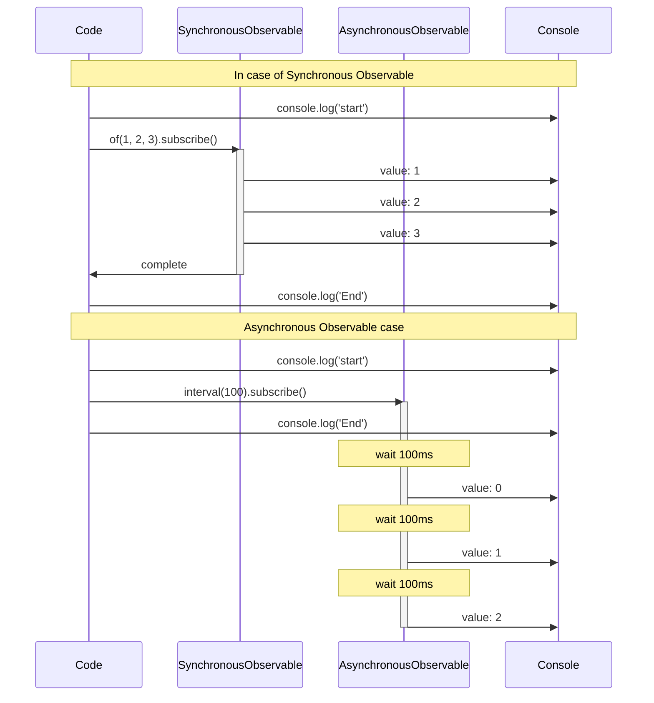
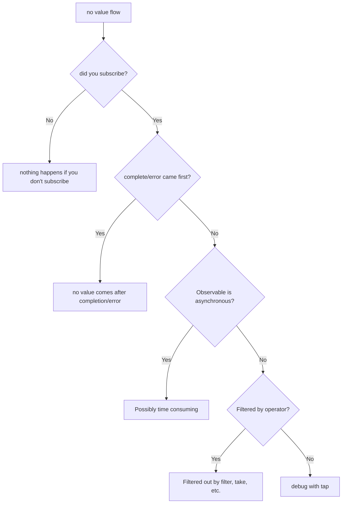

# Understanding Timing and Sequencing

In RxJS **"Why is the value not flowing?" Is the order wrong?"** It is very common to face such problems. This page describes basic knowledge and practical debugging techniques to correctly understand timing and ordering.

## When do values flow?

### Problem: You think the value will flow immediately after subscribe

A misconception that many beginners fall into is that they will get the value immediately after subscribe.

#### ❌ Bad example: expecting to get the value immediately
```typescript
import { of } from 'rxjs';
import { delay } from 'rxjs';

let result: number | undefined;

of(42).pipe(
  delay(100)
).subscribe(value => {
  result = value;
});

console.log(result); // undefined (value not yet arrived)
```

#### ✅ Good example: process within subscribe
```typescript
import { of } from 'rxjs';
import { delay } from 'rxjs';

of(42).pipe(
  delay(100)
).subscribe(value => {
  console.log(value); // 42 is output after 100ms
});
```

> [!IMPORTANT] Important principles
> - Observable can be **asynchronous**
> - Processes that use values should be done **in subscribe**
> - Do not expect values outside of subscribe

## Understanding synchronous vs. asynchronous

### Synchronous Observable vs. Asynchronous Observable

RxJS has both **synchronous** and **asynchronous** Observables.

#### Example of Synchronous Observable

```typescript
import { of } from 'rxjs';

console.log('start');

of(1, 2, 3).subscribe(value => {
  console.log('value:', value);
});

console.log('End');

// Output:
// start
// value: 1
// value: 2
// value: 3
// End
```

#### Asynchronous Observable Example

```typescript
import { interval } from 'rxjs';
import { take } from 'rxjs';

console.log('start');

interval(100).pipe(
  take(3)
).subscribe(value => {
  console.log('value:', value);
});

console.log('End');

// Output:
// start
// End
// value: 0  (after 100ms)
// value: 1  (after 200ms)
// value: 2  (after 300ms)
```

### Visualize synchronous vs. asynchronous execution flow

The following sequence diagram illustrates the difference in execution timing between synchronous Observable and Observable.



> [!TIP] Timing differences
> - **Synchronous Observable**: complete processing in subscribe before moving on to the next line
> - **Asynchronous Observable**: subscribe returns immediately, values flow later

### Criteria for synchronous/asynchronous

| Observable | Synchronous/Asynchronous | Reason |
|---|---|---|
| `of(1, 2, 3)` | Synchronous | Value is determined immediately |
| `from([1, 2, 3])` | Synchronous | Immediately available from array |
| `interval(1000)` | Asynchronous | Timer takes time |
| `fromEvent(button, 'click')` | Asynchronous | Waits for user interaction |
| `ajax('/api/data')` | Asynchronous | Wait for HTTP request |
| `timer(1000)` | Asynchronous | Fire after 1 second |
| `of(1).pipe(delay(100))` | Asynchronous | Delayed by delay |

### Common problem: mixing synchronous and asynchronous

#### ❌ Bad example: no ordering guaranteed
```typescript
import { of } from 'rxjs';
import { delay } from 'rxjs';

console.log('1: start');

of('sync').subscribe(value => {
  console.log('2:', value);
});

of('asynchronous').pipe(
  delay(0) // asynchronous even at 0ms
).subscribe(value => {
  console.log('3:', value);
});

console.log('4: end');

// Output:
// 1: start
// 2: sync
// 4: end
// 3: asynchronous  ← delay(0) also queues asynchronously
```

#### ✅ Good example: clarify intent
```typescript
import { of, concat } from 'rxjs';
import { delay } from 'rxjs';

// Use concat if you want to guarantee ordering
concat(
  of('first'),
  of('next').pipe(delay(100)),
  of('last')
).subscribe(value => {
  console.log(value);
});

// Output:
// first
// next    (after 100ms)
// last    (after 100ms)
```

## How to read a Marble Diagram

The Marble Diagram is a diagram that visualizes the behavior of Observable on a **time axis**.

### Basic Notation

```
Time axis:  ------a----b----c----|
            ↑     ↑    ↑    ↑    ↑
            start value a  value b  value c  complete

Meaning of symbols:
-  : Time elapsed (approx. 10ms)
a  : value issued (next)
|  : completion (complete)
#  : error
() : simultaneous issue (a,b)
```

### Practical example 1: map operator

```
Input:  ----1----2----3----|
        map(x => x * 10)
Output: ----10---20---30---|
```

```typescript
import { of } from 'rxjs';
import { map, delay, concatMap } from 'rxjs';

of(1, 2, 3).pipe(
  concatMap(v => of(v).pipe(delay(100))), // pipe every 100ms
  map(x => x * 10)
).subscribe(value => console.log(value));

// 100ms: 10
// 200ms: 20
// 300ms: 30
```

### Practical example 2: merge

```
A:     ----a----b----|
B:     --c----d----e----|
       merge(A, B)
Output:  --c-a--d-b--e----|
```

```typescript
import { interval, merge } from 'rxjs';
import { map, take } from 'rxjs';

const a$ = interval(200).pipe(
  map(i => `A${i}`),
  take(2)
);

const b$ = interval(150).pipe(
  map(i => `B${i}`),
  take(3)
);

merge(a$, b$).subscribe(value => console.log(value));

// 150ms: B0
// 200ms: A0
// 300ms: B1
// 400ms: A1
// 450ms: B2
```

### Practical example 3: switchMap (cancel)

```
Outside:  ----A------B----C----|
          switchMap(x => inner)
inner A:  ----1--2|  (cancel on B)
inner B:         ----3--4|  (canceled by C)
inner C:              ----5--6|
Output:   ----1------3----5--6|
```

```typescript
import { fromEvent, interval } from 'rxjs';
import { switchMap, map, take } from 'rxjs';

const button = document.querySelector('button')!;

fromEvent(button, 'click').pipe(
  switchMap(() =>
    interval(100).pipe(
      map(i => `value${i}`),
      take(3)
    )
  )
).subscribe(value => console.log(value));

// click 1 → value 0 → value 1 → (click 2 to cancel next)
// click 2 → value 0 → value 1 → value 2 → done
```

## Scheduler Role

The Scheduler controls **when/how** the Observable publishes values.

### Types of Scheduler

| Scheduler | Usage | Description |
|---|---|---|
| **queueScheduler** | Synchronous processing | Executed immediately at the current event loop |
| **asapScheduler** | Microtasks | Same timing as Promise.then() |
| **asyncScheduler** | Macro task | Same timing as setTimeout() |
| **animationFrameScheduler** | Animation | Same timing as requestAnimationFrame() |

### Practical example: controlling timing with observeOn

#### ❌ Bad example: UI blocked by synchronous process
```typescript
import { range } from 'rxjs';
import { map } from 'rxjs';

console.log('start');

range(1, 1000000).pipe(
  map(x => x * x)
).subscribe(value => {
  // 1 million calculations are executed synchronously → UI freeze
});

console.log('End'); // output after calculation is finished
```

#### ✅ Good example: asynchronous with asyncScheduler
```typescript
import { range, asyncScheduler } from 'rxjs';
import { map, observeOn } from 'rxjs';

console.log('start');

range(1, 1000000).pipe(
  map(x => x * x),
  observeOn(asyncScheduler) // put in async queue
).subscribe(value => {
  // run asynchronously → UI is not blocked
});

console.log('End'); // output immediately
```

> [!TIP] Where to use Scheduler
> - **Heavy computation processing**: asynchronize with asyncScheduler to avoid blocking the UI
> - **Animation**: Smooth drawing with animationFrameScheduler
> - **Testing**: virtualize time with TestScheduler

See **[Chapter 7: Utilizing Scheduler](/pt/guide/schedulers/async-control)** for details.

## Common problems and debugging methods

### Problem 1: Values do not flow

#### Checklist



#### Debugging technique: using tap

```typescript
import { of } from 'rxjs';
import { map, filter, tap } from 'rxjs';

console.log('start');

of(1, 2, 3, 4, 5).pipe(
  tap(v => console.log('👁️ Original value:', v)),
  filter(x => x % 2 === 0),
  tap(v => console.log('✅ Passed filter:', v)),
  map(x => x * 10),
  tap(v => console.log('🔄 After conversion by map:', v))
).subscribe(result => {
  console.log('📦 final result:', result);
});

console.log('End');

// Output:
// start
// 👁️ Original value: 1
// 👁️ Original value: 2
// ✅ Passed filter: 2
// 🔄 After conversion by map: 20
// 📦 final result: 20
// 👁️ Original value: 3
// 👁️ Original value: 4
// ✅ Passed filter: 4
// 🔄 After conversion by map: 40
// 📦 final result: 40
// 👁️ Original value: 5
// End
```

> [!NOTE] Point
> `of()` is synchronous Observable, so the "End" is output after all processing in subscribe is complete. tap can be inserted between each step to track the flow of values.

### Problem 2: Ordering is not as expected

#### ❌ Bad example: mergeMap messes up the order
```typescript
import { of } from 'rxjs';
import { mergeMap, delay } from 'rxjs';

of(1, 2, 3).pipe(
  mergeMap(x =>
    of(x * 10).pipe(
      delay(Math.random() * 100) // random delay
    )
  )
).subscribe(value => console.log(value));

// Example output: 20, 10, 30 (order not guaranteed)
```

#### ✅ Good example: order guaranteed with concatMap
```typescript
import { of } from 'rxjs';
import { concatMap, delay } from 'rxjs';

of(1, 2, 3).pipe(
  concatMap(x =>
    of(x * 10).pipe(
      delay(Math.random() * 100)
    )
  )
).subscribe(value => console.log(value));

// Output: 10, 20, 30 (always in that order)
```

### Problem 3: No completion (infinite stream)

#### ❌ Bad example: operator stuck waiting for completion
```typescript
import { interval } from 'rxjs';
import { reduce } from 'rxjs';

interval(1000).pipe(
  reduce((acc, val) => acc + val, 0) // never completes
).subscribe(total => {
  console.log(total); // this line will not be executed
});
```

#### ✅ Good example: take to separate
```typescript
import { interval } from 'rxjs';
import { reduce, take } from 'rxjs';

interval(1000).pipe(
  take(5),                            // get only 5
  reduce((acc, val) => acc + val, 0)  // sum after completion
).subscribe(total => {
  console.log('total:', total); // outputs "total: 10" after 5 seconds
});
```

## Debugging tools and techniques

### 1. Log output using tap

```typescript
import { of } from 'rxjs';
import { map, filter, tap } from 'rxjs';

const debug = <T>(label: string) => tap<T>(value =>
  console.log(`[${label}]`, value)
);

of(1, 2, 3, 4, 5).pipe(
  debug('🔵 input'),
  filter(x => x > 2),
  debug('🟢 after filter'),
  map(x => x * 10),
  debug('🟡 after map')
).subscribe();

// [🔵 input] 1
// [🔵 input] 2
// [🔵 input] 3
// [🟢 after filter] 3
// [🟡 after map] 30
// [🔵 input] 4
// [🟢 after filter] 4
// [🟡 after map] 40
// [🔵 input] 5
// [🟢 after filter] 5
// [🟡 after map] 50
```

### 2. RxJS DevTools (browser extension)

The Chrome/Edge extension "RxJS DevTools" allows you to:

- Real-time monitoring of all Observables
- Visualization in Marble Diagram
- Track subscribe/unsubscribe

#### How to install
1. Search for "RxJS DevTools" in the Chrome Web Store
2. Add the extension
3. Open the "RxJS" tab in DevTools

### 3. Custom debug operator

```typescript
import { interval, map, take, tap, timestamp } from "rxjs";
import { MonoTypeOperatorFunction } from 'rxjs';


function debugWithTime<T>(label: string): MonoTypeOperatorFunction<T> {
  return source => source.pipe(
    timestamp(),
    tap(({ value, timestamp }) => {
      console.log(`[${label}] ${new Date(timestamp).toISOString()}:`, value);
    }),
    map(({ value }) => value)
  );
}

// Usage
interval(500).pipe(
  take(3),
  debugWithTime('⏰ timer'),
  map(x => x * 10),
  debugWithTime('🔄 after conversion')
).subscribe();

// [⏰ timer] 2025-10-19T10:20:59.467Z: 0
// [🔄 after conversion] 2025-10-19T10:20:59.467Z: 0
// [⏰ timer] 2025-10-19T10:20:59.967Z: 1
// [🔄 after conversion] 2025-10-19T10:20:59.967Z: 10
// [⏰ timer] 2025-10-19T10:21:00.467Z: 2
// [🔄 after conversion] 2025-10-19T10:21:00.468Z: 20
```

### 4. Marble Testing (testing verification)

```typescript
import { TestScheduler } from 'rxjs/testing';
import { map } from 'rxjs';

describe('timing testing', () => {
  let scheduler: TestScheduler;

  beforeEach(() => {
    scheduler = new TestScheduler((actual, expected) => {
      expect(actual).toEqual(expected);
    });
  });

  it('map converts values', () => {
    scheduler.run(({ cold, expectObservable }) => {
      const input$  = cold('--a--b--c--|', { a: 1, b: 2, c: 3 });
      const expected =     '--x--y--z--|';
      const result$ = input$.pipe(map(v => v * 10));

      expectObservable(result$).toBe(expected, { x: 10, y: 20, z: 30 });
    });
  });
});
```

See **[Chapter 9: Marble Testing](/pt/guide/testing/marble-testing)** for details.

## Comprehension Checklist

Please check if you can answer the following questions.

```markdown
## Basic Understanding
- [ ] Explain the difference between synchronous and asynchronous Observable
- [ ] Read the basic notation (-, a, |, #) in the Marble Diagram
- [ ] Understand that values cannot flow without subscribe

## Timing Control
- [ ] Explain the difference between delay, debounceTime, and throttleTime
- [ ] Understand the role of Scheduler
- [ ] Explain the difference between observeOn and subscribeOn

## Debugging
- [ ] Debug the flow of values using tap
- [ ] Identify why values do not flow
- [ ] Know what to do if the order is different than expected

## Practice
- [ ] Separate an infinite Observable with take
- [ ] Implement the difference between mergeMap and concatMap order
- [ ] Can control the timing of errors with catchError
```

## Next Steps

Once you understand timing and sequencing, the next step is to learn about **state management and sharing**.

→ **[State management difficulties](/pt/guide/overcoming-difficulties/state-and-sharing)** - Subject, share/shareReplay usage

## Related Pages

- **[Chapter 7: Utilizing Scheduler](/pt/guide/schedulers/async-control)** - Details of Scheduler
- **[Chapter 9: Marble Testing](/pt/guide/testing/marble-testing)** - Testing timing with TestScheduler
- **[Chapter 8: Debugging techniques for RxJS](/pt/guide/debugging/)** - Debugging in general
- **[Operator Selection Conundrum](/pt/guide/overcoming-difficulties/operator-selection)** - How to choose the right operator

## 🎯 Practice Problems

### Problem 1: Discriminating between synchronous and asynchronous

Is the following Observable synchronous or asynchronous?

```typescript
// A
of(1, 2, 3)

// B
from([1, 2, 3])

// C
of(1, 2, 3).pipe(delay(0))

// D
Promise.resolve(42)

// E
interval(1000).pipe(take(3))
```

<details>
<summary>Solution</summary>

- **A: Synchronous** - `of` publishes the value immediately
- **B: Synchronous** - `from` expands array immediately
- **C: Asynchronous** - `delay(0)` also queues asynchronously
- **D: Asynchronous** - Promise is always asynchronous
- **E: Asynchronous** - `interval` is timer-based

> [!NOTE] Point
> `delay(0)` and `Promise` are treated as asynchronous even if the delay is 0 ms.

</details>

### Problem 2: Reading a Marble Diagram

Predict the output of the following Marble Diagram.

```typescript
import { of, zip } from 'rxjs';
import { delay } from 'rxjs';

const a$ = of(1, 2, 3);
const b$ = of('A', 'B', 'C').pipe(delay(100));

zip(a$, b$).subscribe(console.log);
```

```
Marble Diagram:
a$:  (123)|
b$:  -----(ABC)|
     zip(a$, b$)
Output: ?
```

<details>
<summary>Solution</summary>

```typescript
// output at once after 100ms:
[1, 'A']
[2, 'B']
[3, 'C']
```

> [!NOTE] Reason
> `zip` waits until values are available from both streams, so it will not output until delay(100) on `b$` is released. `a$` issues values synchronously, but waits for `b$` before making pairs.

</details>

### Problem 3: Order Guarantee

In the following code, which operator should I use if I want to guarantee the output order?

```typescript
import { of } from 'rxjs';
import { mergeMap, delay } from 'rxjs';

of('A', 'B', 'C').pipe(
  mergeMap(letter =>
    of(`${letter} complete`).pipe(
      delay(Math.random() * 100)
    )
  )
).subscribe(console.log);

// current output: random order (e.g., B complete, A complete, C complete)
// expected output: A complete, B complete, C complete
```

<details>
<summary>Solution</summary>

**Modified code:**
```typescript
import { of } from 'rxjs';
import { concatMap, delay } from 'rxjs';

of('A', 'B', 'C').pipe(
  concatMap(letter =>  // mergeMap → concatMap
    of(`${letter} complete`).pipe(
      delay(Math.random() * 100)
    )
  )
).subscribe(console.log);

// Output: A complete, B complete, C complete (always in that order)
```

> [!NOTE] Reason
> - `mergeMap`: parallel execution, so completion order is not guaranteed
> - `concatMap`: sequential execution, output in the same order as input

</details>

### Problem 4: Handling infinite streams

Please point out the problem in the following code and correct it.

```typescript
import { interval } from 'rxjs';
import { map, toArray } from 'rxjs';

interval(1000).pipe(
  map(x => x * 2),
  toArray()
).subscribe(arr => {
  console.log('Array:', arr); // will this line be executed?
});
```

<details>
<summary>Solution</summary>

**Problem:**
- `interval` issues values indefinitely, so it never completes
- `toArray()` waits for completion signal, so no value is issued forever

**Fixed code:**
```typescript
import { interval } from 'rxjs';
import { map, take, toArray } from 'rxjs';

interval(1000).pipe(
  take(5),          // get only 5 and done
  map(x => x * 2),
  toArray()
).subscribe(arr => {
  console.log('Array:', arr); // [0, 2, 4, 6, 8]
});
```

> [!IMPORTANT] Point
> When using `reduce`, `toArray`, `last`, or other "wait for completion operators" for an infinite stream, you must always separate them with `take`, `first`, `takeUntil`, etc.

</details>
