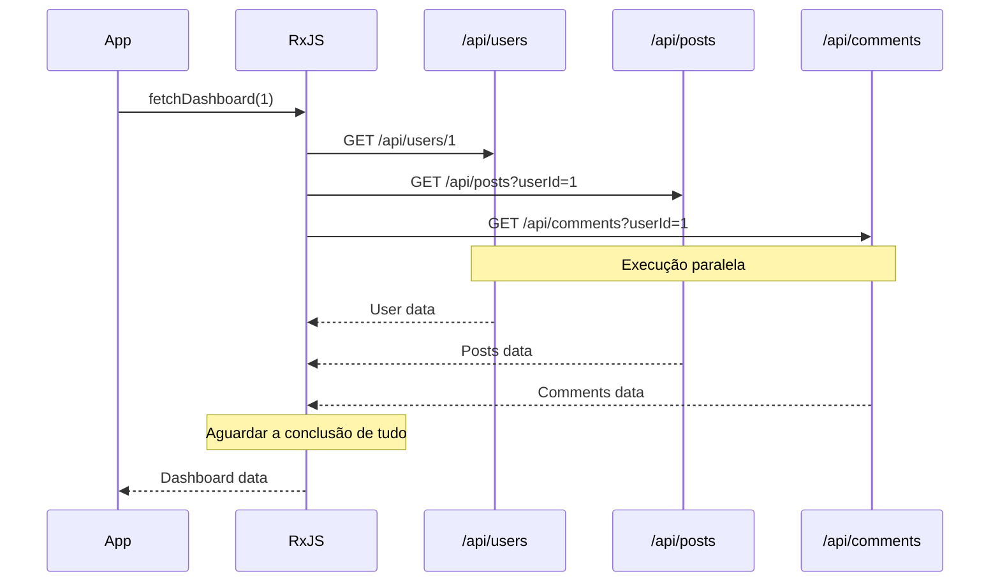
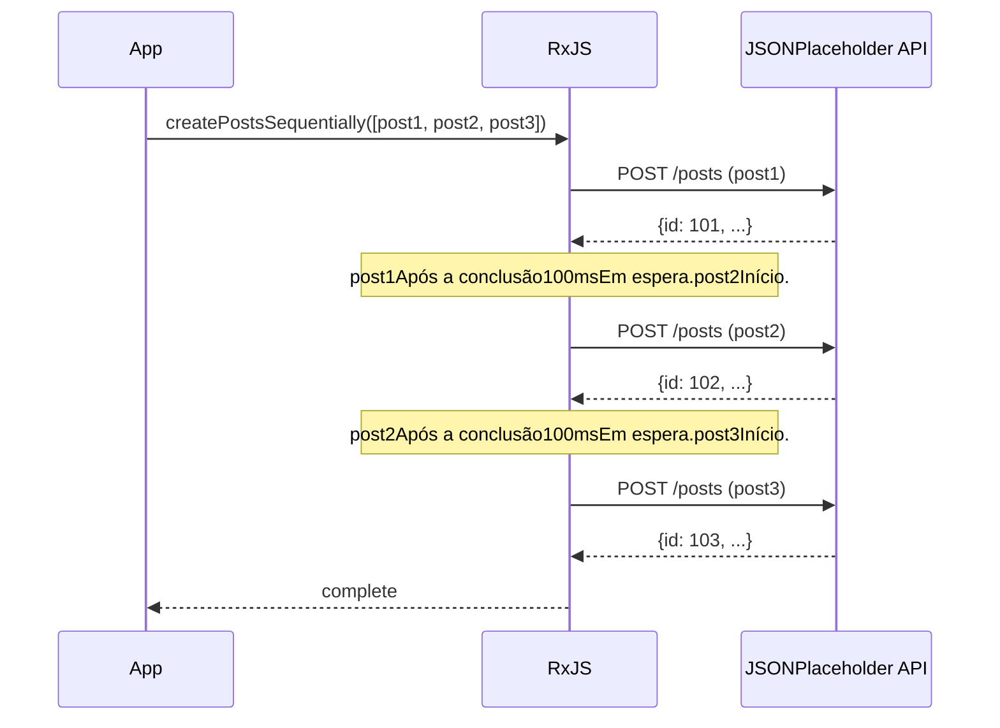

# Padrão de chamada de API.

As chamadas de API são um dos processos mais frequentemente implementados no desenvolvimento da Web, e o RxJS permite implementar chamadas de API assíncronas complexas de forma declarativa e robusta.

Este artigo descreve padrões de implementação concretos para vários cenários de chamadas de API encontrados na prática, incluindo tratamento de erros e tratamento de cancelamentos.

## O que você aprenderá neste artigo.

- Implementação básica de solicitação GET/POST
- Invocação paralela de várias APIs (forkJoin)
- Solicitações em série que exigem execução sequencial (concatMap)
- Encadeamento de solicitações com dependências (switchMap)
- Repetição e tratamento de erros
- Tratamento de tempo limite
- Cancelamento de solicitações

```typescript
import { from, Observable, catchError } from 'rxjs';

// JSONPlaceholder API(depois de um substantivo) que depende de ...Posttipo
// https://jsonplaceholder.typicode.com/posts
interface Post {
  id: number;
  userId: number;
  title: string;
  body: string;
}

interface CreatePostRequest {
  userId: number;
  title: string;
  body: string;
}

function createPost(postData: CreatePostRequest): Observable<Post> {
  return from(
    fetch('https://jsonplaceholder.typicode.com/posts', {
      method: 'POST',
      headers: {
        'Content-Type': 'application/json',
      },
      body: JSON.stringify(postData)
    }).then(response => {
      if (!response.ok) {
        throw new Error(`HTTP error! status: ${response.status}`);
      }
      return response.json();
    })
  ).pipe(
    catchError((err: unknown) => {
      console.error('Erro ao criar uma postagem:', err);
      throw err;
    })
  );
}

// Exemplo de uso
createPost({
  userId: 1,
  title: 'RxJSAprendizado de',
  body: 'RxJSusando oAPIAprendendo o padrão de chamadas para'
}).subscribe({
  next: post => {
    console.log('Postagens criadas:', post);
    console.log('Uma postagemID:', post.id); // JSONPlaceholdersão automaticamenteIDé atribuído (por exemplo: 101)
  },
  error: err => console.error('Erro:', err)
});
```

> Este artigo faz parte do [Capítulo 4: Operadores](. /operators/index.md) e [Capítulo 6: Tratamento de erros](. /error-handling/strategies.md).

## Chamadas básicas de API.

### Problema: solicitação GET simples.

O caso mais básico implementa uma única solicitação GET.

### Exemplo de implementação.


```typescript
import { from, Observable, map, catchError, timeout } from 'rxjs';

// JSONPlaceholder API(depois de um substantivo) que depende de ...Usertipo
// https://jsonplaceholder.typicode.com/users
interface User {
  id: number;
  name: string;
  username: string;
  email: string;
  address: {
    street: string;
    suite: string;
    city: string;
    zipcode: string;
    geo: {
      lat: string;
      lng: string;
    };
  };
  phone: string;
  website: string;
  company: {
    name: string;
    catchPhrase: string;
    bs: string;
  };
}

// Recuperar lista de usuários
function fetchUsers(): Observable<User[]> {
  return from(
    fetch('https://jsonplaceholder.typicode.com/users')
      .then(response => {
        if (!response.ok) {
          throw new Error(`HTTP error! status: ${response.status}`);
        }
        return response.json();
      })
  ).pipe(
    timeout(5000), // 5Tempo limite em segundos
    catchError((err: unknown) => {
      console.error('Erro de aquisição de usuário:', err);
      throw err;
    })
  );
}

// Exemplo de uso
fetchUsers().subscribe({
  next: users => {
    console.log('Lista de usuários:', users);
    console.log('Primeiro usuário:', users[0].name); // Exemplo de usuário: "Leanne Graham"
  },
  error: err => console.error('Erro:', err)
});
```

```typescript
import { from, Observable, catchError } from 'rxjs';

// JSONPlaceholder API(depois de um substantivo) que depende de ...Posttipo
// https://jsonplaceholder.typicode.com/posts
interface Post {
  id: number;
  userId: number;
  title: string;
  body: string;
}

interface CreatePostRequest {
  userId: number;
  title: string;
  body: string;
}

function createPost(postData: CreatePostRequest): Observable<Post> {
  return from(
    fetch('https://jsonplaceholder.typicode.com/posts', {
      method: 'POST',
      headers: {
        'Content-Type': 'application/json',
      },
      body: JSON.stringify(postData)
    }).then(response => {
      if (!response.ok) {
        throw new Error(`HTTP error! status: ${response.status}`);
      }
      return response.json();
    })
  ).pipe(
    catchError((err: unknown) => {
      console.error('Erro ao criar uma postagem:', err);
      throw err;
    })
  );
}

// Exemplo de uso
createPost({
  userId: 1,
  title: 'RxJSAprendizado de',
  body: 'RxJSusando oAPIAprendendo o padrão de chamadas para'
}).subscribe({
  next: post => {
    console.log('Postagens criadas:', post);
    console.log('Uma postagemID:', post.id); // JSONPlaceholdersão automaticamenteIDé atribuído (por exemplo: 101)
  },
  error: err => console.error('Erro:', err)
});
```

> Esse exemplo envolve o `fetch` padrão com `from()`, mas você também pode usar o `ajax()` oficial do RxJS. O `ajax()` é mais sofisticado e oferece suporte ao cancelamento de solicitações e ao monitoramento do progresso.

### Solicitação POST.

Padrão para criar novos dados.


```typescript
import { from, Observable, catchError } from 'rxjs';

// JSONPlaceholder API(depois de um substantivo) que depende de ...Posttipo
// https://jsonplaceholder.typicode.com/posts
interface Post {
  id: number;
  userId: number;
  title: string;
  body: string;
}

interface CreatePostRequest {
  userId: number;
  title: string;
  body: string;
}

function createPost(postData: CreatePostRequest): Observable<Post> {
  return from(
    fetch('https://jsonplaceholder.typicode.com/posts', {
      method: 'POST',
      headers: {
        'Content-Type': 'application/json',
      },
      body: JSON.stringify(postData)
    }).then(response => {
      if (!response.ok) {
        throw new Error(`HTTP error! status: ${response.status}`);
      }
      return response.json();
    })
  ).pipe(
    catchError((err: unknown) => {
      console.error('Erro ao criar uma postagem:', err);
      throw err;
    })
  );
}

// Exemplo de uso
createPost({
  userId: 1,
  title: 'RxJSAprendizado de',
  body: 'RxJSusando oAPIAprendendo o padrão de chamadas para'
}).subscribe({
  next: post => {
    console.log('Postagens criadas:', post);
    console.log('Uma postagemID:', post.id); // JSONPlaceholdersão automaticamenteIDé atribuído (por exemplo: 101)
  },
  error: err => console.error('Erro:', err)
});
```

> [!TIP] Dicas práticas

> - **Segurança do tipo**: definir claramente o tipo de resposta
> - **Tratamento de erros**: verifique adequadamente os códigos de status HTTP
> - **Timeouts**: evite longas esperas

## Solicitações paralelas (forkJoin)

### Problema: quero chamar várias APIs ao mesmo tempo.

Talvez você queira chamar várias APIs independentes em paralelo e prosseguir somente depois que todas as respostas tiverem sido recebidas.

### Solução: use forkJoin.

O forkJoin aguarda a conclusão de vários Observable e retorna todos os resultados em uma matriz (equivalente a Promise.all).

```typescript
import { forkJoin, from, Observable, map } from 'rxjs';

// JSONPlaceholder API(depois de um substantivo) que depende de ...Commenttipo
// https://jsonplaceholder.typicode.com/comments
interface Comment {
  postId: number;
  id: number;
  name: string;
  email: string;
  body: string;
}
interface Post {
  id: number;
  userId: number;
  title: string;
  body: string;
}
interface User {
  id: number;
  name: string;
  username: string;
  email: string;
  address: {
    street: string;
    suite: string;
    city: string;
    zipcode: string;
    geo: {
      lat: string;
      lng: string;
    };
  };
  phone: string;
  website: string;
  company: {
    name: string;
    catchPhrase: string;
    bs: string;
  };
}
interface Dashboard {
  user: User;
  posts: Post[];
  comments: Comment[];
}

function fetchUserById(id: number): Observable<User> {
  return from(
    fetch(`https://jsonplaceholder.typicode.com/users/${id}`).then(r => r.json())
  );
}

function fetchPostsByUserId(userId: number): Observable<Post[]> {
  return from(
    fetch(`https://jsonplaceholder.typicode.com/posts?userId=${userId}`).then(r => r.json())
  );
}

function fetchCommentsByPostId(postId: number): Observable<Comment[]> {
  return from(
    fetch(`https://jsonplaceholder.typicode.com/comments?postId=${postId}`).then(r => r.json())
  );
}

// Recuperação paralela de dados do painel
function fetchDashboard(userId: number): Observable<Dashboard> {
  return forkJoin({
    user: fetchUserById(userId),
    posts: fetchPostsByUserId(userId),
    comments: fetchCommentsByPostId(1) // Uma postagemID=1Recuperar comentários de
  }).pipe(
    map(({ user, posts, comments }) => ({
      user,
      posts,
      comments
    }))
  );
}

// Exemplo de uso
fetchDashboard(1).subscribe({
  next: dashboard => {
    console.log('Usuário:', dashboard.user.name); // Exemplo de usuário: "Leanne Graham"
    console.log('Número de postagens:', dashboard.posts.length); // Exemplo de usuário: 10Número de postagens
    console.log('Número de comentários:', dashboard.comments.length); // Exemplo de usuário: 5Número de postagens
  },
  error: err => console.error('Erro de aquisição do painel:', err)
});
```

#### Fluxo de execução



```typescript
import { from, Observable, catchError } from 'rxjs';

// JSONPlaceholder API(depois de um substantivo) que depende de ...Posttipo
// https://jsonplaceholder.typicode.com/posts
interface Post {
  id: number;
  userId: number;
  title: string;
  body: string;
}

interface CreatePostRequest {
  userId: number;
  title: string;
  body: string;
}

function createPost(postData: CreatePostRequest): Observable<Post> {
  return from(
    fetch('https://jsonplaceholder.typicode.com/posts', {
      method: 'POST',
      headers: {
        'Content-Type': 'application/json',
      },
      body: JSON.stringify(postData)
    }).then(response => {
      if (!response.ok) {
        throw new Error(`HTTP error! status: ${response.status}`);
      }
      return response.json();
    })
  ).pipe(
    catchError((err: unknown) => {
      console.error('Erro ao criar uma postagem:', err);
      throw err;
    })
  );
}

// Exemplo de uso
createPost({
  userId: 1,
  title: 'RxJSAprendizado de',
  body: 'RxJSusando oAPIAprendendo o padrão de chamadas para'
}).subscribe({
  next: post => {
    console.log('Postagens criadas:', post);
    console.log('Uma postagemID:', post.id); // JSONPlaceholdersão automaticamenteIDé atribuído (por exemplo: 101)
  },
  error: err => console.error('Erro:', err)
});
```

> - Aguarde até que todos os Observable tenham sido concluídos.
> - **Se qualquer um deles falhar, o todo falhará**
> - Todos os Observable devem emitir pelo menos um valor

### Tratamento de erros aprimorado

Em solicitações paralelas, você pode querer recuperar outros resultados mesmo que alguns deles falhem.


```typescript
import { forkJoin, of, catchError } from 'rxjs';

function fetchDashboardWithFallback(userId: number): Observable<Dashboard> {
  return forkJoin({
    user: fetchUserById(userId).pipe(
      catchError((err: unknown) => {
        console.error('Erro de aquisição de usuário:', err);
        return of(null); // Em caso de erro, retornanullRetorna
      })
    ),
    posts: fetchPostsByUserId(userId).pipe(
      catchError((err: unknown) => {
        console.error('Erro de pós-aquisição:', err);
        return of([]); // Retorna uma matriz vazia em caso de erro
      })
    ),
    comments: fetchCommentsByUserId(userId).pipe(
      catchError((err: unknown) => {
        console.error('Erro ao recuperar comentário:', err);
        return of([]); // Retorna uma matriz vazia em caso de erro
      })
    )
  }).pipe(
    map(({ user, posts, comments }) => ({
      user: user || { id: userId, name: 'Unknown', email: '' },
      posts,
      comments
    }))
  );
}
```

> [!TIP] 部分的なエラーハンドリング

> Ao aplicar o catchError a cada Observable, todo o processo pode continuar mesmo que alguns deles falhem.

## Solicitação de série (concatMap)

### Problema: quero executar as APIs em ordem.

Você deseja executar a próxima solicitação após a conclusão da anterior (por exemplo, vários uploads de arquivos em sequência).

### Solução: use concatMap.

O concatMap executa o próximo Observable após a conclusão do anterior.

```typescript
import { from, Observable, concatMap, tap, delay, catchError } from 'rxjs';

// JSONPlaceholder API(depois de um substantivo) que depende de ...Posttipo
// https://jsonplaceholder.typicode.com/posts
interface Post {
  id: number;
  userId: number;
  title: string;
  body: string;
}

interface CreatePostRequest {
  userId: number;
  title: string;
  body: string;
}

function createPost(postData: CreatePostRequest): Observable<Post> {
  return from(
    fetch('https://jsonplaceholder.typicode.com/posts', {
      method: 'POST',
      headers: {
        'Content-Type': 'application/json',
      },
      body: JSON.stringify(postData)
    }).then(response => {
      if (!response.ok) {
        throw new Error(`HTTP error! status: ${response.status}`);
      }
      return response.json();
    })
  ).pipe(
    catchError((err: unknown) => {
      console.error('Erro ao criar uma postagem:', err);
      throw err;
    })
  );
}

// Criar vários posts em sequência (emAPILimitação de taxa levada em conta)
function createPostsSequentially(posts: CreatePostRequest[]): Observable<Post> {
  return from(posts).pipe(
    concatMap((postData, index) =>
      createPost(postData).pipe(
        tap(result => console.log(`Uma postagem${index + 1}Criação concluída:`, result.title)),
        delay(100) // APIConsiderando a limitação de taxa100msAguardando
      )
    )
  );
}

// Exemplo de uso
const postsToCreate: CreatePostRequest[] = [
  {
    userId: 1,
    title: '1Segunda postagem',
    body: 'Esta é a1A segunda postagem.'
  },
  {
    userId: 1,
    title: '2Segunda postagem',
    body: 'Esta é a2A segunda postagem.'
  },
  {
    userId: 1,
    title: '3Segunda postagem',
    body: 'Esta é a3A segunda postagem.'
  }
];

const results: Post[] = [];

createPostsSequentially(postsToCreate).subscribe({
  next: post => {
    results.push(post);
    console.log(`Progresso: ${results.length}/${postsToCreate.length}`);
  },
  complete: () => {
    console.log('Todas as postagens criadas Concluídas:', results.length, 'Número de postagens');
  },
  error: err => console.error('Erro ao criar uma postagem:', err)
});
```

#### Fluxo de execução



```typescript
import { from, Observable, catchError } from 'rxjs';

// JSONPlaceholder API(depois de um substantivo) que depende de ...Posttipo
// https://jsonplaceholder.typicode.com/posts
interface Post {
  id: number;
  userId: number;
  title: string;
  body: string;
}

interface CreatePostRequest {
  userId: number;
  title: string;
  body: string;
}

function createPost(postData: CreatePostRequest): Observable<Post> {
  return from(
    fetch('https://jsonplaceholder.typicode.com/posts', {
      method: 'POST',
      headers: {
        'Content-Type': 'application/json',
      },
      body: JSON.stringify(postData)
    }).then(response => {
      if (!response.ok) {
        throw new Error(`HTTP error! status: ${response.status}`);
      }
      return response.json();
    })
  ).pipe(
    catchError((err: unknown) => {
      console.error('Erro ao criar uma postagem:', err);
      throw err;
    })
  );
}

// Exemplo de uso
createPost({
  userId: 1,
  title: 'RxJSAprendizado de',
  body: 'RxJSusando oAPIAprendendo o padrão de chamadas para'
}).subscribe({
  next: post => {
    console.log('Postagens criadas:', post);
    console.log('Uma postagemID:', post.id); // JSONPlaceholdersão automaticamenteIDé atribuído (por exemplo: 101)
  },
  error: err => console.error('Erro:', err)
});
```

> - **concatMap**: execução sequencial (a anterior é concluída, depois a próxima)
> - mergeMap**: execução paralela (várias execuções simultâneas possíveis).
>
> - `concatMap` se a ordem for importante, `mergeMap` se a ordem não for necessária e a velocidade for uma prioridade.

## Solicitações de dependência (switchMap)

### Problema: chamar a próxima API usando a resposta da API anterior.

Um dos padrões mais comuns, usando o resultado da primeira resposta da API para chamar a próxima API.

### Solução: use switchMap.

O switchMap pega o valor do Observable anterior e o converte em um novo Observable.


```typescript
import { from, Observable, switchMap, map } from 'rxjs';

interface UserProfile {
  user: User;
  posts: Post[];
}
interface Post {
  id: number;
  userId: number;
  title: string;
  body: string;
}
interface User {
  id: number;
  name: string;
  username: string;
  email: string;
  address: {
    street: string;
    suite: string;
    city: string;
    zipcode: string;
    geo: {
      lat: string;
      lng: string;
    };
  };
  phone: string;
  website: string;
  company: {
    name: string;
    catchPhrase: string;
    bs: string;
  };
}

function fetchUserById(id: number): Observable<User> {
  return from(
    fetch(`https://jsonplaceholder.typicode.com/users/${id}`).then(r => r.json())
  );
}

function fetchPostsByUserId(userId: number): Observable<Post[]> {
  return from(
    fetch(`https://jsonplaceholder.typicode.com/posts?userId=${userId}`).then(r => r.json())
  );
}

// Recuperar detalhes do usuário e suas postagens
function fetchUserProfile(userId: number): Observable<UserProfile> {
  return fetchUserById(userId).pipe(
    switchMap(user =>
      // Depois de recuperar os detalhes do usuário e suas postagens
      fetchPostsByUserId(user.id).pipe(
        map(posts => ({
          user,
          posts
        }))
      )
    )
  );
}

// Exemplo de uso
fetchUserProfile(1).subscribe({
  next: profile => {
    console.log('Usuário:', profile.user.name);
    console.log('Uma postagem:', profile.posts);
  },
  error: err => console.error('Erro:', err)
});
```

### Exemplo prático: implementação de uma função de pesquisa

Esse é um padrão usado com frequência na prática, em que a API é chamada em resposta à entrada de pesquisa do usuário.

```typescript
import { from, fromEvent, Observable, of, map, debounceTime, distinctUntilChanged, switchMap, catchError } from 'rxjs';

// JSONPlaceholder (depois de um substantivo) que depende de ... Post como resultados de pesquisa.
interface SearchResult {
  id: number;
  userId: number;
  title: string;
  body: string;
}

function searchAPI(query: string): Observable<SearchResult[]> {
  return from(
    fetch('https://jsonplaceholder.typicode.com/posts')
      .then(response => {
        if (!response.ok) {
          throw new Error(`HTTP error! status: ${response.status}`);
        }
        return response.json();
      })
  ).pipe(
    // Filtragem no lado do cliente por título
    map((posts: SearchResult[]) =>
      posts.filter(post =>
        post.title.toLowerCase().includes(query.toLowerCase())
      )
    )
  );
}

// Traditional approach (commented for reference)
// const searchInput = document.querySelector<HTMLInputElement>('#search');

// Self-contained: creates search input and results container dynamically
const searchInput = document.createElement('input');
searchInput.id = 'search';
searchInput.type = 'text';
searchInput.placeholder = 'Digite as palavras-chave da pesquisa (pelo menos2caracteres ou mais)';
searchInput.style.padding = '10px';
searchInput.style.margin = '10px';
searchInput.style.width = '400px';
searchInput.style.fontSize = '16px';
searchInput.style.border = '2px solid #ccc';
searchInput.style.borderRadius = '4px';
searchInput.style.display = 'block';
document.body.appendChild(searchInput);

const resultsContainer = document.createElement('div');
resultsContainer.id = 'results';
resultsContainer.style.padding = '10px';
resultsContainer.style.margin = '10px';
resultsContainer.style.minHeight = '100px';
resultsContainer.style.border = '1px solid #ddd';
resultsContainer.style.borderRadius = '4px';
resultsContainer.style.backgroundColor = '#f9f9f9';
document.body.appendChild(resultsContainer);

const search$ = fromEvent(searchInput, 'input').pipe(
  map(event => (event.target as HTMLInputElement).value),
  debounceTime(300),           // Após a inserção300msAguardar
  distinctUntilChanged(),      // Ignorado se o valor for o mesmo da última vez
  switchMap(query => {
    if (query.length < 2) {
      return of([]); // 2Se tiver menos de 1 caractere, matriz vazia
    }
    return searchAPI(query).pipe(
      catchError((err: unknown) => {
        console.error('Erro de pesquisa:', err);
        return of([]); // Matriz vazia em caso de erro
      })
    );
  })
);

search$.subscribe(results => {
  console.log('Resultados da pesquisa:', results);
  // UIExibir resultados em
  displayResults(results, resultsContainer);
});

function displayResults(results: SearchResult[], container: HTMLElement): void {
  // Exibe os resultados emDOMProcesso de exibição de resultados em
  container.innerHTML = results
    .map(r => `<div style="padding: 8px; margin: 4px; border-bottom: 1px solid #eee;">${r.title}</div>`)
    .join('');

  if (results.length === 0) {
    container.innerHTML = '<div style="padding: 8px; color: #999;">Nenhum resultado de pesquisa</div>';
  }
}
```

> [!TIP] クライアントサイドフィルタリング

> A API JSONPlaceholder não tem um ponto de extremidade de pesquisa, portanto, todas as publicações são recuperadas e filtradas no lado do cliente. Na prática, esse padrão é usado quando o back-end não tem uma função de pesquisa ou quando a quantidade de dados é pequena.
>
> **Exemplo de pesquisa**:
> - Pesquisar por "sunt" → várias postagens encontradas.
> - Pesquisa com "qui est esse" → resultados com títulos contendo "qui est esse"
> - Pesquisar com "zzz" → Nenhum resultado (não aplicável)

#### Fluxo de execução

```typescript
import { from, Observable, map, catchError, timeout } from 'rxjs';

// JSONPlaceholder API(depois de um substantivo) que depende de ...Usertipo
// https://jsonplaceholder.typicode.com/users
interface User {
  id: number;
  name: string;
  username: string;
  email: string;
  address: {
    street: string;
    suite: string;
    city: string;
    zipcode: string;
    geo: {
      lat: string;
      lng: string;
    };
  };
  phone: string;
  website: string;
  company: {
    name: string;
    catchPhrase: string;
    bs: string;
  };
}

// Recuperar lista de usuários
function fetchUsers(): Observable<User[]> {
  return from(
    fetch('https://jsonplaceholder.typicode.com/users')
      .then(response => {
        if (!response.ok) {
          throw new Error(`HTTP error! status: ${response.status}`);
        }
        return response.json();
      })
  ).pipe(
    timeout(5000), // 5Tempo limite em segundos
    catchError((err: unknown) => {
      console.error('Erro de aquisição de usuário:', err);
      throw err;
    })
  );
}

// Exemplo de uso
fetchUsers().subscribe({
  next: users => {
    console.log('Lista de usuários:', users);
    console.log('Primeiro usuário:', users[0].name); // Exemplo de usuário: "Leanne Graham"
  },
  error: err => console.error('Erro:', err)
});
```


```typescript
import { from, Observable, catchError } from 'rxjs';

// JSONPlaceholder API(depois de um substantivo) que depende de ...Posttipo
// https://jsonplaceholder.typicode.com/posts
interface Post {
  id: number;
  userId: number;
  title: string;
  body: string;
}

interface CreatePostRequest {
  userId: number;
  title: string;
  body: string;
}

function createPost(postData: CreatePostRequest): Observable<Post> {
  return from(
    fetch('https://jsonplaceholder.typicode.com/posts', {
      method: 'POST',
      headers: {
        'Content-Type': 'application/json',
      },
      body: JSON.stringify(postData)
    }).then(response => {
      if (!response.ok) {
        throw new Error(`HTTP error! status: ${response.status}`);
      }
      return response.json();
    })
  ).pipe(
    catchError((err: unknown) => {
      console.error('Erro ao criar uma postagem:', err);
      throw err;
    })
  );
}

// Exemplo de uso
createPost({
  userId: 1,
  title: 'RxJSAprendizado de',
  body: 'RxJSusando oAPIAprendendo o padrão de chamadas para'
}).subscribe({
  next: post => {
    console.log('Postagens criadas:', post);
    console.log('Uma postagemID:', post.id); // JSONPlaceholdersão automaticamenteIDé atribuído (por exemplo: 101)
  },
  error: err => console.error('Erro:', err)
});
```

> ** Cancela automaticamente o Observable anterior quando chega um novo valor. **
> Isso garante que as respostas a solicitações de API mais antigas sejam ignoradas, mesmo que cheguem mais tarde (prevenção de condição de corrida).

### switchMap vs mergeMap vs concatMap

O uso de operadores de mapeamento de ordem superior.


```typescript
import { from, Observable, catchError } from 'rxjs';

// JSONPlaceholder API(depois de um substantivo) que depende de ...Posttipo
// https://jsonplaceholder.typicode.com/posts
interface Post {
  id: number;
  userId: number;
  title: string;
  body: string;
}

interface CreatePostRequest {
  userId: number;
  title: string;
  body: string;
}

function createPost(postData: CreatePostRequest): Observable<Post> {
  return from(
    fetch('https://jsonplaceholder.typicode.com/posts', {
      method: 'POST',
      headers: {
        'Content-Type': 'application/json',
      },
      body: JSON.stringify(postData)
    }).then(response => {
      if (!response.ok) {
        throw new Error(`HTTP error! status: ${response.status}`);
      }
      return response.json();
    })
  ).pipe(
    catchError((err: unknown) => {
      console.error('Erro ao criar uma postagem:', err);
      throw err;
    })
  );
}

// Exemplo de uso
createPost({
  userId: 1,
  title: 'RxJSAprendizado de',
  body: 'RxJSusando oAPIAprendendo o padrão de chamadas para'
}).subscribe({
  next: post => {
    console.log('Postagens criadas:', post);
    console.log('Uma postagemID:', post.id); // JSONPlaceholdersão automaticamenteIDé atribuído (por exemplo: 101)
  },
  error: err => console.error('Erro:', err)
});
```


```typescript
import { from, Observable, map, catchError, timeout } from 'rxjs';

// JSONPlaceholder API(depois de um substantivo) que depende de ...Usertipo
// https://jsonplaceholder.typicode.com/users
interface User {
  id: number;
  name: string;
  username: string;
  email: string;
  address: {
    street: string;
    suite: string;
    city: string;
    zipcode: string;
    geo: {
      lat: string;
      lng: string;
    };
  };
  phone: string;
  website: string;
  company: {
    name: string;
    catchPhrase: string;
    bs: string;
  };
}

// Recuperar lista de usuários
function fetchUsers(): Observable<User[]> {
  return from(
    fetch('https://jsonplaceholder.typicode.com/users')
      .then(response => {
        if (!response.ok) {
          throw new Error(`HTTP error! status: ${response.status}`);
        }
        return response.json();
      })
  ).pipe(
    timeout(5000), // 5Tempo limite em segundos
    catchError((err: unknown) => {
      console.error('Erro de aquisição de usuário:', err);
      throw err;
    })
  );
}

// Exemplo de uso
fetchUsers().subscribe({
  next: users => {
    console.log('Lista de usuários:', users);
    console.log('Primeiro usuário:', users[0].name); // Exemplo de usuário: "Leanne Graham"
  },
  error: err => console.error('Erro:', err)
});
```

## Tentativas e tratamento de erros

### Problema: quero lidar com erros temporários de rede

No caso de um erro de rede ou tempo limite, talvez você queira tentar novamente de forma automática.

### Solução: use retry e retryWhen.


```typescript
import { from, Observable, map, catchError, timeout } from 'rxjs';

// JSONPlaceholder API(depois de um substantivo) que depende de ...Usertipo
// https://jsonplaceholder.typicode.com/users
interface User {
  id: number;
  name: string;
  username: string;
  email: string;
  address: {
    street: string;
    suite: string;
    city: string;
    zipcode: string;
    geo: {
      lat: string;
      lng: string;
    };
  };
  phone: string;
  website: string;
  company: {
    name: string;
    catchPhrase: string;
    bs: string;
  };
}

// Recuperar lista de usuários
function fetchUsers(): Observable<User[]> {
  return from(
    fetch('https://jsonplaceholder.typicode.com/users')
      .then(response => {
        if (!response.ok) {
          throw new Error(`HTTP error! status: ${response.status}`);
        }
        return response.json();
      })
  ).pipe(
    timeout(5000), // 5Tempo limite em segundos
    catchError((err: unknown) => {
      console.error('Erro de aquisição de usuário:', err);
      throw err;
    })
  );
}

// Exemplo de uso
fetchUsers().subscribe({
  next: users => {
    console.log('Lista de usuários:', users);
    console.log('Primeiro usuário:', users[0].name); // Exemplo de usuário: "Leanne Graham"
  },
  error: err => console.error('Erro:', err)
});
```

**Exemplo de backoff exponencial em ação:***


```typescript
import { from, Observable, map, catchError, timeout } from 'rxjs';

// JSONPlaceholder API(depois de um substantivo) que depende de ...Usertipo
// https://jsonplaceholder.typicode.com/users
interface User {
  id: number;
  name: string;
  username: string;
  email: string;
  address: {
    street: string;
    suite: string;
    city: string;
    zipcode: string;
    geo: {
      lat: string;
      lng: string;
    };
  };
  phone: string;
  website: string;
  company: {
    name: string;
    catchPhrase: string;
    bs: string;
  };
}

// Recuperar lista de usuários
function fetchUsers(): Observable<User[]> {
  return from(
    fetch('https://jsonplaceholder.typicode.com/users')
      .then(response => {
        if (!response.ok) {
          throw new Error(`HTTP error! status: ${response.status}`);
        }
        return response.json();
      })
  ).pipe(
    timeout(5000), // 5Tempo limite em segundos
    catchError((err: unknown) => {
      console.error('Erro de aquisição de usuário:', err);
      throw err;
    })
  );
}

// Exemplo de uso
fetchUsers().subscribe({
  next: users => {
    console.log('Lista de usuários:', users);
    console.log('Primeiro usuário:', users[0].name); // Exemplo de usuário: "Leanne Graham"
  },
  error: err => console.error('Erro:', err)
});
```

> [!TIP] リトライ戦略の選択

> - **Immediate retry**: `retry(3)` - simples, útil para falhas na rede
> - **Intervalo fixo**: `retryWhen` + `delay(1000)` - leva em conta a carga do servidor
> - **Exponential backoff**: `retryWhen` + `timer` - melhor prática para AWS etc.

### Repetir somente em erros específicos

Nem todos os erros devem ser tentados novamente (por exemplo, 401 Unauthorised não requer uma nova tentativa).


```typescript
import { from, Observable, map, catchError, timeout } from 'rxjs';

// JSONPlaceholder API(depois de um substantivo) que depende de ...Usertipo
// https://jsonplaceholder.typicode.com/users
interface User {
  id: number;
  name: string;
  username: string;
  email: string;
  address: {
    street: string;
    suite: string;
    city: string;
    zipcode: string;
    geo: {
      lat: string;
      lng: string;
    };
  };
  phone: string;
  website: string;
  company: {
    name: string;
    catchPhrase: string;
    bs: string;
  };
}

// Recuperar lista de usuários
function fetchUsers(): Observable<User[]> {
  return from(
    fetch('https://jsonplaceholder.typicode.com/users')
      .then(response => {
        if (!response.ok) {
          throw new Error(`HTTP error! status: ${response.status}`);
        }
        return response.json();
      })
  ).pipe(
    timeout(5000), // 5Tempo limite em segundos
    catchError((err: unknown) => {
      console.error('Erro de aquisição de usuário:', err);
      throw err;
    })
  );
}

// Exemplo de uso
fetchUsers().subscribe({
  next: users => {
    console.log('Lista de usuários:', users);
    console.log('Primeiro usuário:', users[0].name); // Exemplo de usuário: "Leanne Graham"
  },
  error: err => console.error('Erro:', err)
});
```


```typescript
import { forkJoin, from, Observable, map } from 'rxjs';

// JSONPlaceholder API(depois de um substantivo) que depende de ...Commenttipo
// https://jsonplaceholder.typicode.com/comments
interface Comment {
  postId: number;
  id: number;
  name: string;
  email: string;
  body: string;
}
interface Post {
  id: number;
  userId: number;
  title: string;
  body: string;
}
interface User {
  id: number;
  name: string;
  username: string;
  email: string;
  address: {
    street: string;
    suite: string;
    city: string;
    zipcode: string;
    geo: {
      lat: string;
      lng: string;
    };
  };
  phone: string;
  website: string;
  company: {
    name: string;
    catchPhrase: string;
    bs: string;
  };
}
interface Dashboard {
  user: User;
  posts: Post[];
  comments: Comment[];
}

function fetchUserById(id: number): Observable<User> {
  return from(
    fetch(`https://jsonplaceholder.typicode.com/users/${id}`).then(r => r.json())
  );
}

function fetchPostsByUserId(userId: number): Observable<Post[]> {
  return from(
    fetch(`https://jsonplaceholder.typicode.com/posts?userId=${userId}`).then(r => r.json())
  );
}

function fetchCommentsByPostId(postId: number): Observable<Comment[]> {
  return from(
    fetch(`https://jsonplaceholder.typicode.com/comments?postId=${postId}`).then(r => r.json())
  );
}

// Recuperação paralela de dados do painel
function fetchDashboard(userId: number): Observable<Dashboard> {
  return forkJoin({
    user: fetchUserById(userId),
    posts: fetchPostsByUserId(userId),
    comments: fetchCommentsByPostId(1) // Uma postagemID=1Recuperar comentários de
  }).pipe(
    map(({ user, posts, comments }) => ({
      user,
      posts,
      comments
    }))
  );
}

// Exemplo de uso
fetchDashboard(1).subscribe({
  next: dashboard => {
    console.log('Usuário:', dashboard.user.name); // Exemplo de usuário: "Leanne Graham"
    console.log('Número de postagens:', dashboard.posts.length); // Exemplo de usuário: 10Número de postagens
    console.log('Número de comentários:', dashboard.comments.length); // Exemplo de usuário: 5Número de postagens
  },
  error: err => console.error('Erro de aquisição do painel:', err)
});
```

> - **Solicitação POST**: risco de criação de duplicatas em uma nova tentativa se não houver igualdade
> - **Erros de autenticação**: 401/403 não repetir, solicitar novo login
> - **ERRO DE AVALIAÇÃO**: 400 não tentar novamente, solicitar que o usuário corrija

## Tratamento de tempo limite

### Problema: quero lidar com uma resposta lenta da API

Se a rede estiver lenta ou se o servidor não estiver respondendo, você deseja atingir o tempo limite após um determinado período de tempo.

### Solução: use o operador timeout.


```typescript
import { from, Observable, map, catchError, timeout } from 'rxjs';

// JSONPlaceholder API(depois de um substantivo) que depende de ...Usertipo
// https://jsonplaceholder.typicode.com/users
interface User {
  id: number;
  name: string;
  username: string;
  email: string;
  address: {
    street: string;
    suite: string;
    city: string;
    zipcode: string;
    geo: {
      lat: string;
      lng: string;
    };
  };
  phone: string;
  website: string;
  company: {
    name: string;
    catchPhrase: string;
    bs: string;
  };
}

// Recuperar lista de usuários
function fetchUsers(): Observable<User[]> {
  return from(
    fetch('https://jsonplaceholder.typicode.com/users')
      .then(response => {
        if (!response.ok) {
          throw new Error(`HTTP error! status: ${response.status}`);
        }
        return response.json();
      })
  ).pipe(
    timeout(5000), // 5Tempo limite em segundos
    catchError((err: unknown) => {
      console.error('Erro de aquisição de usuário:', err);
      throw err;
    })
  );
}

// Exemplo de uso
fetchUsers().subscribe({
  next: users => {
    console.log('Lista de usuários:', users);
    console.log('Primeiro usuário:', users[0].name); // Exemplo de usuário: "Leanne Graham"
  },
  error: err => console.error('Erro:', err)
});
```

### Combinação de retry e timeout

Na prática, os tempos limite e as novas tentativas são usados em combinação.


```typescript
import { from, Observable, map, catchError, timeout } from 'rxjs';

// JSONPlaceholder API(depois de um substantivo) que depende de ...Usertipo
// https://jsonplaceholder.typicode.com/users
interface User {
  id: number;
  name: string;
  username: string;
  email: string;
  address: {
    street: string;
    suite: string;
    city: string;
    zipcode: string;
    geo: {
      lat: string;
      lng: string;
    };
  };
  phone: string;
  website: string;
  company: {
    name: string;
    catchPhrase: string;
    bs: string;
  };
}

// Recuperar lista de usuários
function fetchUsers(): Observable<User[]> {
  return from(
    fetch('https://jsonplaceholder.typicode.com/users')
      .then(response => {
        if (!response.ok) {
          throw new Error(`HTTP error! status: ${response.status}`);
        }
        return response.json();
      })
  ).pipe(
    timeout(5000), // 5Tempo limite em segundos
    catchError((err: unknown) => {
      console.error('Erro de aquisição de usuário:', err);
      throw err;
    })
  );
}

// Exemplo de uso
fetchUsers().subscribe({
  next: users => {
    console.log('Lista de usuários:', users);
    console.log('Primeiro usuário:', users[0].name); // Exemplo de usuário: "Leanne Graham"
  },
  error: err => console.error('Erro:', err)
});
```

> [!TIP] タイムアウト値の設定

> - **API normal**: 5 a 10 segundos
> - ** API rápida**: 2 - 3 segundos
> - **Upload de arquivo**: 30 a 60 segundos
> - **Processamento em segundo plano**: mais de 60 segundos.
>
> Defina para equilibrar a experiência do usuário e a carga do servidor.

## Processo de cancelamento de solicitação.

### Problema: quero cancelar as solicitações de API que não são mais necessárias.

Quero cancelar uma solicitação de API em execução quando uma transição de página ou um componente for destruído.

### Solução: use takeUntil.


```typescript
import { from, Observable, map, catchError, timeout } from 'rxjs';

// JSONPlaceholder API(depois de um substantivo) que depende de ...Usertipo
// https://jsonplaceholder.typicode.com/users
interface User {
  id: number;
  name: string;
  username: string;
  email: string;
  address: {
    street: string;
    suite: string;
    city: string;
    zipcode: string;
    geo: {
      lat: string;
      lng: string;
    };
  };
  phone: string;
  website: string;
  company: {
    name: string;
    catchPhrase: string;
    bs: string;
  };
}

// Recuperar lista de usuários
function fetchUsers(): Observable<User[]> {
  return from(
    fetch('https://jsonplaceholder.typicode.com/users')
      .then(response => {
        if (!response.ok) {
          throw new Error(`HTTP error! status: ${response.status}`);
        }
        return response.json();
      })
  ).pipe(
    timeout(5000), // 5Tempo limite em segundos
    catchError((err: unknown) => {
      console.error('Erro de aquisição de usuário:', err);
      throw err;
    })
  );
}

// Exemplo de uso
fetchUsers().subscribe({
  next: users => {
    console.log('Lista de usuários:', users);
    console.log('Primeiro usuário:', users[0].name); // Exemplo de usuário: "Leanne Graham"
  },
  error: err => console.error('Erro:', err)
});
```

### Cancelamento controlado pelo usuário

Este é um exemplo de implementação de um botão de cancelamento explícito.


```typescript
import { from, Observable, map, catchError, timeout } from 'rxjs';

// JSONPlaceholder API(depois de um substantivo) que depende de ...Usertipo
// https://jsonplaceholder.typicode.com/users
interface User {
  id: number;
  name: string;
  username: string;
  email: string;
  address: {
    street: string;
    suite: string;
    city: string;
    zipcode: string;
    geo: {
      lat: string;
      lng: string;
    };
  };
  phone: string;
  website: string;
  company: {
    name: string;
    catchPhrase: string;
    bs: string;
  };
}

// Recuperar lista de usuários
function fetchUsers(): Observable<User[]> {
  return from(
    fetch('https://jsonplaceholder.typicode.com/users')
      .then(response => {
        if (!response.ok) {
          throw new Error(`HTTP error! status: ${response.status}`);
        }
        return response.json();
      })
  ).pipe(
    timeout(5000), // 5Tempo limite em segundos
    catchError((err: unknown) => {
      console.error('Erro de aquisição de usuário:', err);
      throw err;
    })
  );
}

// Exemplo de uso
fetchUsers().subscribe({
  next: users => {
    console.log('Lista de usuários:', users);
    console.log('Primeiro usuário:', users[0].name); // Exemplo de usuário: "Leanne Graham"
  },
  error: err => console.error('Erro:', err)
});
```

> [!IMPORTANT] キャンセルのベストプラクティス

> - **Sempre implemente um processo de cancelamento** - evita vazamentos de memória e desperdício de rede
> - **Use takeUntil** - mais declarativo e menos esquecível do que unsubscribe()
> - **Ao destruir componentes** - acione destroy$ para cancelar a assinatura de todos

## Exemplos práticos de classes de serviço

Este é um exemplo de uma classe de serviço completa que resume os padrões anteriores e pode ser usada na prática.


```typescript
import { from, Observable, map, catchError, timeout } from 'rxjs';

// JSONPlaceholder API(depois de um substantivo) que depende de ...Usertipo
// https://jsonplaceholder.typicode.com/users
interface User {
  id: number;
  name: string;
  username: string;
  email: string;
  address: {
    street: string;
    suite: string;
    city: string;
    zipcode: string;
    geo: {
      lat: string;
      lng: string;
    };
  };
  phone: string;
  website: string;
  company: {
    name: string;
    catchPhrase: string;
    bs: string;
  };
}

// Recuperar lista de usuários
function fetchUsers(): Observable<User[]> {
  return from(
    fetch('https://jsonplaceholder.typicode.com/users')
      .then(response => {
        if (!response.ok) {
          throw new Error(`HTTP error! status: ${response.status}`);
        }
        return response.json();
      })
  ).pipe(
    timeout(5000), // 5Tempo limite em segundos
    catchError((err: unknown) => {
      console.error('Erro de aquisição de usuário:', err);
      throw err;
    })
  );
}

// Exemplo de uso
fetchUsers().subscribe({
  next: users => {
    console.log('Lista de usuários:', users);
    console.log('Primeiro usuário:', users[0].name); // Exemplo de usuário: "Leanne Graham"
  },
  error: err => console.error('Erro:', err)
});
```

> [!TIP] 実践的なサービス設計

> - **Configurável**: configuração flexível de tempos limite, contagens de tentativas, etc.
> - **Funcionalidade de cache**: evita solicitações duplicadas
> - **Tratamento de erros**: tratamento uniforme de erros
> - **Limpeza automática**: destroy() garante a liberação de recursos

## Código de teste

Exemplo de teste para padrão de invocação de API.


```typescript
import { from, Observable, catchError } from 'rxjs';

// JSONPlaceholder API(depois de um substantivo) que depende de ...Posttipo
// https://jsonplaceholder.typicode.com/posts
interface Post {
  id: number;
  userId: number;
  title: string;
  body: string;
}

interface CreatePostRequest {
  userId: number;
  title: string;
  body: string;
}

function createPost(postData: CreatePostRequest): Observable<Post> {
  return from(
    fetch('https://jsonplaceholder.typicode.com/posts', {
      method: 'POST',
      headers: {
        'Content-Type': 'application/json',
      },
      body: JSON.stringify(postData)
    }).then(response => {
      if (!response.ok) {
        throw new Error(`HTTP error! status: ${response.status}`);
      }
      return response.json();
    })
  ).pipe(
    catchError((err: unknown) => {
      console.error('Erro ao criar uma postagem:', err);
      throw err;
    })
  );
}

// Exemplo de uso
createPost({
  userId: 1,
  title: 'RxJSAprendizado de',
  body: 'RxJSusando oAPIAprendendo o padrão de chamadas para'
}).subscribe({
  next: post => {
    console.log('Postagens criadas:', post);
    console.log('Uma postagemID:', post.id); // JSONPlaceholdersão automaticamenteIDé atribuído (por exemplo: 101)
  },
  error: err => console.error('Erro:', err)
});
```

## Resumo.

Ao dominar o padrão de invocação de API usando o RxJS, é possível criar aplicativos robustos e passíveis de manutenção.


```typescript
import { forkJoin, from, Observable, map } from 'rxjs';

// JSONPlaceholder API(depois de um substantivo) que depende de ...Commenttipo
// https://jsonplaceholder.typicode.com/comments
interface Comment {
  postId: number;
  id: number;
  name: string;
  email: string;
  body: string;
}
interface Post {
  id: number;
  userId: number;
  title: string;
  body: string;
}
interface User {
  id: number;
  name: string;
  username: string;
  email: string;
  address: {
    street: string;
    suite: string;
    city: string;
    zipcode: string;
    geo: {
      lat: string;
      lng: string;
    };
  };
  phone: string;
  website: string;
  company: {
    name: string;
    catchPhrase: string;
    bs: string;
  };
}
interface Dashboard {
  user: User;
  posts: Post[];
  comments: Comment[];
}

function fetchUserById(id: number): Observable<User> {
  return from(
    fetch(`https://jsonplaceholder.typicode.com/users/${id}`).then(r => r.json())
  );
}

function fetchPostsByUserId(userId: number): Observable<Post[]> {
  return from(
    fetch(`https://jsonplaceholder.typicode.com/posts?userId=${userId}`).then(r => r.json())
  );
}

function fetchCommentsByPostId(postId: number): Observable<Comment[]> {
  return from(
    fetch(`https://jsonplaceholder.typicode.com/comments?postId=${postId}`).then(r => r.json())
  );
}

// Recuperação paralela de dados do painel
function fetchDashboard(userId: number): Observable<Dashboard> {
  return forkJoin({
    user: fetchUserById(userId),
    posts: fetchPostsByUserId(userId),
    comments: fetchCommentsByPostId(1) // Uma postagemID=1Recuperar comentários de
  }).pipe(
    map(({ user, posts, comments }) => ({
      user,
      posts,
      comments
    }))
  );
}

// Exemplo de uso
fetchDashboard(1).subscribe({
  next: dashboard => {
    console.log('Usuário:', dashboard.user.name); // Exemplo de usuário: "Leanne Graham"
    console.log('Número de postagens:', dashboard.posts.length); // Exemplo de usuário: 10Número de postagens
    console.log('Número de comentários:', dashboard.comments.length); // Exemplo de usuário: 5Número de postagens
  },
  error: err => console.error('Erro de aquisição do painel:', err)
});
```

> - **forkJoin**: executa várias APIs em paralelo, todas aguardando a conclusão
> - **concatMap**: executa APIs em ordem (a anterior concluída, depois a próxima)
> - **switchMap**: ideal para solicitações dependentes, funções de pesquisa
> - **retry/retryWhen**: nova tentativa automática em caso de erro, backoff exponencial recomendado
> - **timeout**: sempre define um tempo limite
> - **takeUntil**: cancelamento automático na destruição do componente


```typescript
import { forkJoin, from, Observable, map } from 'rxjs';

// JSONPlaceholder API(depois de um substantivo) que depende de ...Commenttipo
// https://jsonplaceholder.typicode.com/comments
interface Comment {
  postId: number;
  id: number;
  name: string;
  email: string;
  body: string;
}
interface Post {
  id: number;
  userId: number;
  title: string;
  body: string;
}
interface User {
  id: number;
  name: string;
  username: string;
  email: string;
  address: {
    street: string;
    suite: string;
    city: string;
    zipcode: string;
    geo: {
      lat: string;
      lng: string;
    };
  };
  phone: string;
  website: string;
  company: {
    name: string;
    catchPhrase: string;
    bs: string;
  };
}
interface Dashboard {
  user: User;
  posts: Post[];
  comments: Comment[];
}

function fetchUserById(id: number): Observable<User> {
  return from(
    fetch(`https://jsonplaceholder.typicode.com/users/${id}`).then(r => r.json())
  );
}

function fetchPostsByUserId(userId: number): Observable<Post[]> {
  return from(
    fetch(`https://jsonplaceholder.typicode.com/posts?userId=${userId}`).then(r => r.json())
  );
}

function fetchCommentsByPostId(postId: number): Observable<Comment[]> {
  return from(
    fetch(`https://jsonplaceholder.typicode.com/comments?postId=${postId}`).then(r => r.json())
  );
}

// Recuperação paralela de dados do painel
function fetchDashboard(userId: number): Observable<Dashboard> {
  return forkJoin({
    user: fetchUserById(userId),
    posts: fetchPostsByUserId(userId),
    comments: fetchCommentsByPostId(1) // Uma postagemID=1Recuperar comentários de
  }).pipe(
    map(({ user, posts, comments }) => ({
      user,
      posts,
      comments
    }))
  );
}

// Exemplo de uso
fetchDashboard(1).subscribe({
  next: dashboard => {
    console.log('Usuário:', dashboard.user.name); // Exemplo de usuário: "Leanne Graham"
    console.log('Número de postagens:', dashboard.posts.length); // Exemplo de usuário: 10Número de postagens
    console.log('Número de comentários:', dashboard.comments.length); // Exemplo de usuário: 5Número de postagens
  },
  error: err => console.error('Erro de aquisição do painel:', err)
});
```

> - **Segurança de tipo**: definir tipos para todas as respostas da API
> - **Tratamento de erros**: implemente o catchError para todas as solicitações
> - **Tratamento de cancelamento**: garantir a limpeza com o `takeUntil`.
> - **Estratégia de repetição**: repetir adequadamente de acordo com o código de status
> - **Caching**: evite solicitações duplicadas com o `shareReplay`.

## Próximas etapas.

Depois de dominar o padrão de chamada de API, você poderá passar para os padrões a seguir.

- [form-handling](. /form-handling.md) - validação em tempo real, salvamento automático.
- [UI event handling](. /ui-events.md) - integração de eventos de UI e chamadas de API.
- [processamento de dados em tempo real](. /real-time-data.md)) - WebSocket, SSE.
- [estratégias de cache] (. /caching-strategies.md) - Cache de respostas de API
- Práticas de tratamento de erros (em preparação) - Estratégias mais avançadas de tratamento de erros

## Seções relacionadas.

- Capítulo 4: Operadores](. /operators/index.md) - mais sobre switchMap, mergeMap e concatMap.
- Capítulo 6: Tratamento de erros](. /error-handling/strategies.md)) - noções básicas de catchError, retry
- Capítulo 2: Observable frio/quente](. /observables/cold-and-hot-observables.md)) - Entendendo o shareReplay

## Recursos de referência

- [RxJS Official: ajax](https://rxjs.dev/api/ajax/ajax) - Mais informações sobre ajax().
- [MDN: Fetch API](https://developer.mozilla.org/ja/docs/Web/API/Fetch_API) - Como usar fetch()
- [Learn RxJS: Higher-order Observable](https://www.learnrxjs.io/learn-rxjs/operators) - Comparação de switchMap etc.
