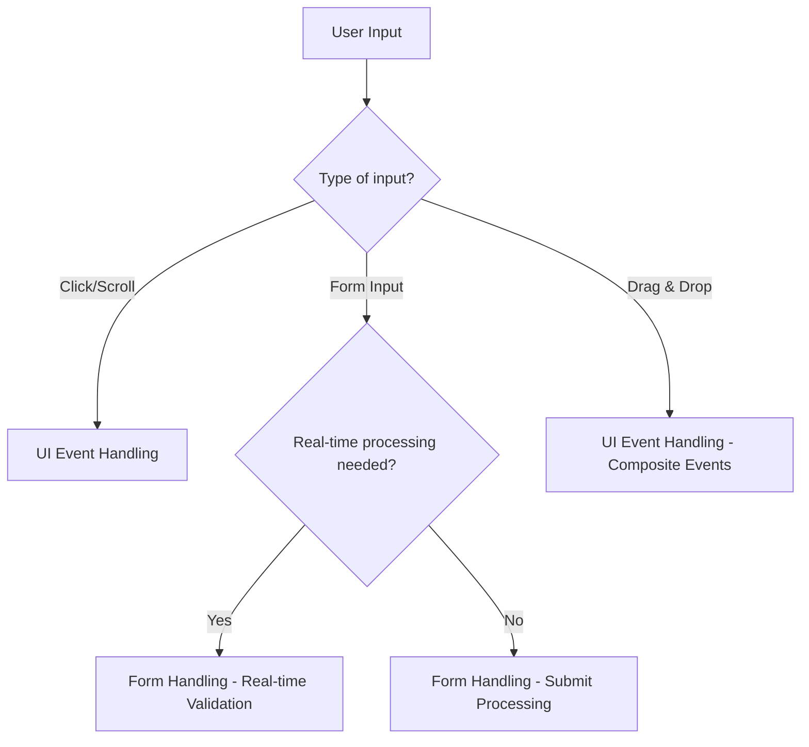
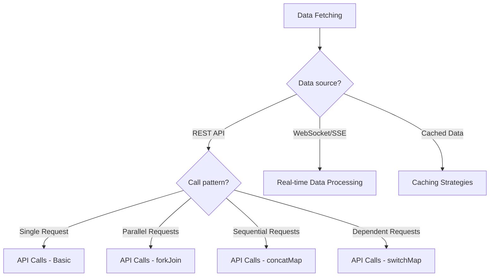
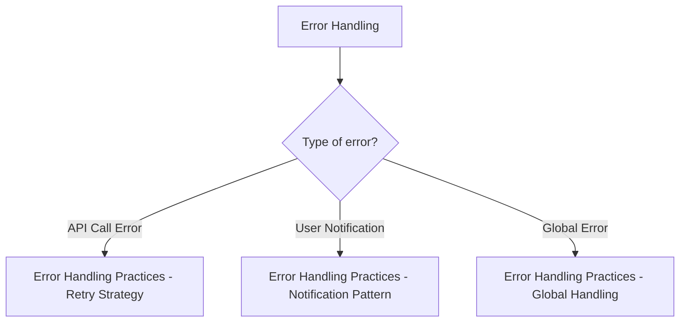

# Practical Patterns

Once you have mastered the fundamentals of RxJS, the next important step is "how to use it" in actual application development. This chapter introduces concrete implementation patterns for scenarios frequently encountered in practical work.

## Why Practical Patterns are Important

Even if you understand individual RxJS operators, combining them to solve real problems requires experience and knowledge of patterns. By learning practical patterns, you can:

- **Increase development speed** - Avoid reinventing the wheel and apply proven patterns
- **Improve quality** - Master best practices for error handling, memory leak prevention, etc.
- **Enhance maintainability** - Consistent patterns improve code readability and maintainability
- **Troubleshooting** - Identify the cause of problems and select appropriate solutions

## Structure of This Chapter

Practical patterns are explained in three phases according to difficulty and frequency of use.

### Core Patterns (Most Frequent)

These are basic patterns most frequently used in practical work. Master these first.

| Pattern | Content | Main Target |
|---------|---------|-------------|
| [UI Event Handling](./ui-events.md) | UI operations like clicks, scrolls, drag & drop | General frontend |
| [API Calls](./api-calls.md) | HTTP communication, parallel/sequential processing, error handling | Web API integration |
| [Form Handling](./form-handling.md) | Real-time validation, auto-save, multiple field coordination | Form implementation |

### Advanced Patterns

Advanced patterns for more complex scenarios.

| Pattern | Content | Main Target |
|---------|---------|-------------|
| [Advanced Form Patterns](./advanced-form-patterns.md) | JSON Patch, large-scale form auto-save, Undo/Redo, collaborative editing | Enterprise forms |
| [Real-time Data Processing](./real-time-data.md) | WebSocket, SSE, Polling, connection management | Real-time communication |
| [Caching Strategies](./caching-strategies.md) | Data caching, TTL, invalidation, offline support | Performance optimization |

### Specialized Patterns

Specialized patterns for specific challenges.

| Pattern | Content | Main Target |
|---------|---------|-------------|
| [Error Handling Practices](./error-handling-patterns.md) | API call errors, retry strategies, global error handling | Error management |
| [Conditional Branching in subscribe](./subscribe-branching.md) | Avoid branching in subscribe, branching within pipelines | Code quality |

> [!TIP] How to Learn
> For beginners, it is recommended to proceed in order from **Core Patterns**. Especially "API Calls" and "Form Handling" are essential patterns in practical work.

## Pattern Structure

Each pattern page is explained with the following structure:

1. **Problem Description** - The challenge this pattern solves
2. **Basic Implementation** - The simplest implementation example
3. **Practical Examples** - Concrete code usable in practical work
4. **Before/After Comparison** - Code comparison before and after improvement
5. **Notes and Best Practices** - Common mistakes and countermeasures
6. **TypeScript Type Definitions** - Type-safe implementation methods
7. **Test Code** - How to test the pattern
8. **Performance Considerations** - Memory leaks and performance optimization

## Pattern Selection Guidelines

Guidelines for selecting appropriate patterns according to the functionality to implement.

### When Handling User Input



### When Handling Data Fetching



### When Enhancing Error Handling



## Thinking When Implementing

Introducing the basic mindset when implementing RxJS patterns.

### 1. Think Declaratively

Express "what you want to do" declaratively and avoid procedural code.

```typescript
// ❌ Procedural (imperative)
let result = [];
source.subscribe(value => {
  if (value > 10) {
    const transformed = value * 2;
    result.push(transformed);
  }
});

// ✅ Declarative
const result$ = source.pipe(
  filter(value => value > 10),
  map(value => value * 2)
);
```

### 2. Build Processing with Pipelines

Combine small operators to build complex processing.

```typescript
const searchResults$ = searchInput$.pipe(
  debounceTime(300),           // Wait 300ms for input
  distinctUntilChanged(),      // Exclude duplicates
  filter(query => query.length >= 2), // Search with 2+ characters
  switchMap(query => searchAPI(query)), // API call
  catchError(err => of([]))    // Empty array on error
);
```

### 3. Prevent Memory Leaks

Proper subscription management is essential.

```typescript
// ✅ Auto-release with takeUntil
private destroy$ = new Subject<void>();

ngOnInit() {
  this.data$.pipe(
    takeUntil(this.destroy$)
  ).subscribe(/*...*/);
}

ngOnDestroy() {
  this.destroy$.next();
  this.destroy$.complete();
}
```

### 4. Don't Forget Error Handling

Implement error handling for all asynchronous processing.

```typescript
// ✅ Proper error handling with catchError
apiCall$.pipe(
  retry(3),
  catchError(err => {
    console.error('API error:', err);
    return of(defaultValue);
  })
).subscribe(/*...*/);
```

### 5. Utilize Type Safety

Make maximum use of TypeScript's type system.

```typescript
interface User {
  id: number;
  name: string;
  email: string;
}

// ✅ Clear type definitions
const users$: Observable<User[]> = fetchUsers();
const activeUsers$: Observable<User[]> = users$.pipe(
  map(users => users.filter(u => u.isActive))
);
```

## Relationship with Existing Knowledge

The patterns in this chapter apply knowledge learned in previous chapters to practice.

| Practical Pattern | Related Chapter | Knowledge Applied |
|------------|-----------|------------|
| UI Event Handling | [Chapter 4: Operators](../operators/index.md) | debounceTime, throttleTime, distinctUntilChanged |
| API Calls | [Chapter 6: Error Handling](../error-handling/strategies.md) | catchError, retry, timeout |
| Form Handling | [Chapter 3: Creation Functions](../creation-functions/index.md) | combineLatest, withLatestFrom |
| Advanced Form Patterns | [Chapter 4: Transformation Operators](../operators/transformation/pairwise.md) | pairwise, scan, bufferTime, concatMap |
| Real-time Data | [Chapter 5: Subject](../subjects/what-is-subject.md) | Subject, BehaviorSubject, shareReplay |
| Caching Strategies | [Chapter 2: Cold/Hot](../observables/cold-and-hot-observables.md) | shareReplay, share |
| Error Handling | [Chapter 6: Error Handling](../error-handling/strategies.md) | catchError, retry, retryWhen |
| subscribe Branching | [Chapter 10: Anti-patterns](../anti-patterns/index.md) | Avoiding anti-patterns |

> [!NOTE] When to Review
> Reviewing related chapters before learning each pattern deepens understanding.

## Frequently Asked Questions

### Q1: Which pattern should I learn first?

**A:** It is recommended to learn in order of highest usage frequency in practical work.

1. **API Calls** - Foundation of web development
2. **Form Handling** - User input processing
3. **UI Event Handling** - Interactive UI
4. **Error Handling** - Robust applications
5. Other patterns - According to project needs

### Q2: Can I use patterns as-is?

**A:** Yes. The patterns in this chapter are intended for use in practical work.
However,

- Customize according to project requirements
- Consider performance and memory usage
- Follow team coding standards

### Q3: Can I use them with Angular/React/Vue?

**A:** Yes. The patterns in this chapter are framework-independent.
However,

- For framework-specific integration methods, refer to Chapter 15: Framework Integration (in preparation)
- Unsubscription according to each framework's lifecycle is necessary

## Summary

The Practical Patterns collection is a concrete guide for utilizing RxJS in actual projects.

> [!IMPORTANT] Key Points
> - Learn from **Core Patterns** in order
> - Understand improvements through **Before/After comparisons**
> - Always implement **memory leak prevention**
> - Don't forget **error handling**
> - Utilize **type safety**

> [!TIP] Learning Tips
> - Run code to deepen understanding
> - Apply to your own projects
> - Combine patterns to build complex processing
> - Learn test code as well

As the next step, it is recommended to start with the most frequently used [API Call Pattern](./api-calls.md).

## Reference Resources

- [RxJS Official Documentation](https://rxjs.dev/) - Official API reference
- [Learn RxJS](https://www.learnrxjs.io/) - Practical examples by operator
- [RxJS Marbles](https://rxmarbles.com/) - Visual understanding of operator behavior
- [Chapter 11: Overcoming RxJS Difficulties](../overcoming-difficulties/index.md) - Common difficulties and how to overcome them
- [Chapter 10: Anti-pattern Collection](../anti-patterns/index.md) - Patterns to avoid
