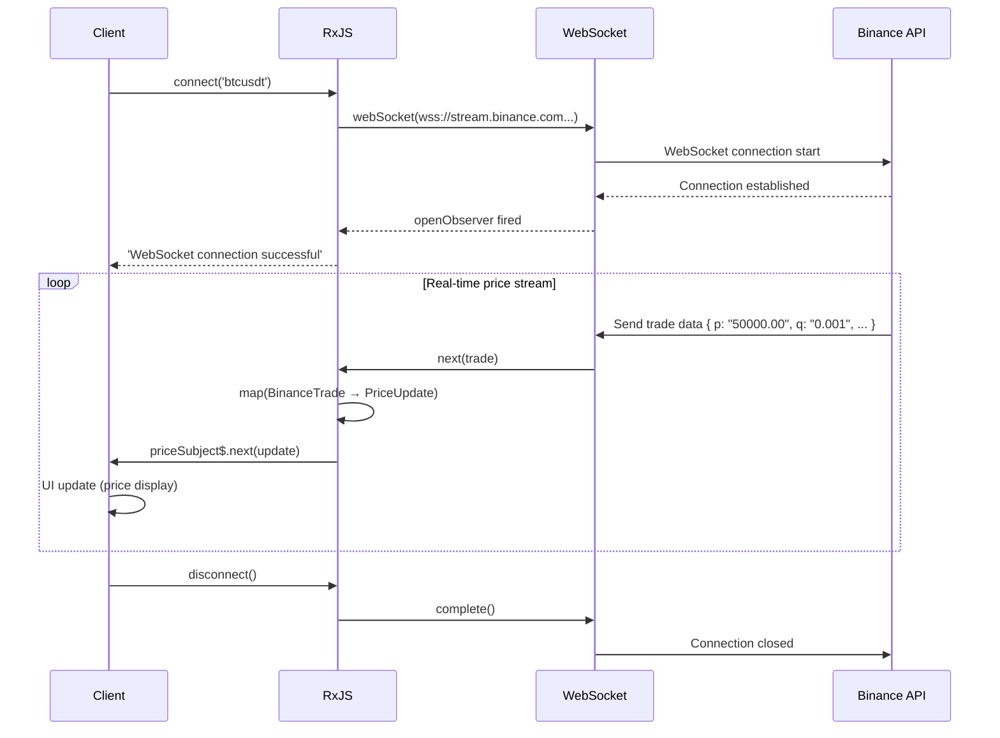

# Real-time Data Processing Patterns

Real-time data processing is an important feature in modern web applications such as chat, notifications, stock updates, IoT sensor monitoring, etc. With RxJS, you can implement complex real-time communication in a declarative and robust manner.

This article describes specific patterns of real-time data processing required in practice, including WebSockets, Server-Sent Events (SSE), and Polling.

## What you will learn in this article

- Implement and manage WebSocket communications
- Use of Server-Sent Events (SSE)
- Real-time updates via Polling
- Connection management and automatic reconnection
- Merging and updating data
- Building a Real-Time Notification System
- Error Handling and Connection Status Management

> [!TIP] Prerequisites
> This article is based on [Chapter 5: Subject](../subjects/what-is-subject.md) and [Chapter 4: Operators](../operators/index.md). An understanding of `Subject`, `shareReplay`, `retry`, and `retryWhen` is especially important.

## WebSocket Communication

### Problem: I want to implement bidirectional real-time communication

Cryptocurrency prices, stock price updates, chat applications, etc. require two-way real-time communication between server and client. In this example, we will monitor cryptocurrency prices in real-time using a public WebSocket API that actually works.

### Solution: use RxJS webSocket

Use the **Binance public WebSocket API** to retrieve bitcoin transaction data in real time. This code is executable as-is and the actual price data will flow.

```typescript
import { EMPTY, Subject, retry, catchError, tap, map } from 'rxjs';
import { webSocket, WebSocketSubject } from 'rxjs/webSocket';

// Binance WebSocket API trade data type
// https://binance-docs.github.io/apidocs/spot/en/#trade-streams
interface BinanceTrade {
  e: string;      // Event type "trade"
  E: number;      // Event time
  s: string;      // Symbol "BTCUSDT"
  t: number;      // Trade ID
  p: string;      // Price
  q: string;      // Quantity
  T: number;      // Trade time
  m: boolean;     // Is the buyer the market maker?
}

// Concise type for display
interface PriceUpdate {
  symbol: string;
  price: number;
  quantity: number;
  time: Date;
  isBuyerMaker: boolean;
}

class CryptoPriceService {
  private socket$: WebSocketSubject<BinanceTrade> | null = null;
  private priceSubject$ = new Subject<PriceUpdate>();

  public prices$ = this.priceSubject$.asObservable();

  /**
   * Connect to Binance public WebSocket API
   * @param symbol Cryptocurrency pair (e.g., "btcusdt", "ethusdt")
   */
  connect(symbol: string = 'btcusdt'): void {
    if (!this.socket$ || this.socket$.closed) {
      // Binance public WebSocket API (no authentication required)
      const url = `wss://stream.binance.com:9443/ws/${symbol}@trade`;

      this.socket$ = webSocket<BinanceTrade>({
        url,
        openObserver: {
          next: () => {
            console.log(`WebSocket connection successful: ${symbol.toUpperCase()}`);
          }
        },
        closeObserver: {
          next: () => {
            console.log('WebSocket connection closed');
          }
        }
      });

      this.socket$.pipe(
        // Convert Binance data for display
        map(trade => ({
          symbol: trade.s,
          price: parseFloat(trade.p),
          quantity: parseFloat(trade.q),
          time: new Date(trade.T),
          isBuyerMaker: trade.m
        })),
        tap(update => console.log('Price update:', update.price)),
        retry({
          count: 5,
          delay: 1000
        }),
        catchError(err => {
          console.error('WebSocket error:', err);
          return EMPTY;
        })
      ).subscribe(priceUpdate => {
        this.priceSubject$.next(priceUpdate);
      });
    }
  }

  disconnect(): void {
    if (this.socket$) {
      this.socket$.complete();
      this.socket$ = null;
    }
  }
}

// Dynamically create UI elements
const priceContainer = document.createElement('div');
priceContainer.id = 'price-display';
priceContainer.style.padding = '20px';
priceContainer.style.margin = '10px';
priceContainer.style.border = '2px solid #f0b90b'; // Binance color
priceContainer.style.borderRadius = '8px';
priceContainer.style.backgroundColor = '#1e2329';
priceContainer.style.color = '#eaecef';
priceContainer.style.fontFamily = 'monospace';
document.body.appendChild(priceContainer);

const latestPriceDisplay = document.createElement('div');
latestPriceDisplay.style.fontSize = '32px';
latestPriceDisplay.style.fontWeight = 'bold';
latestPriceDisplay.style.marginBottom = '10px';
priceContainer.appendChild(latestPriceDisplay);

const tradesContainer = document.createElement('div');
tradesContainer.style.maxHeight = '400px';
tradesContainer.style.overflowY = 'auto';
tradesContainer.style.fontSize = '14px';
priceContainer.appendChild(tradesContainer);

// Usage example
const priceService = new CryptoPriceService();
priceService.connect('btcusdt'); // Bitcoin/USDT trade data

// Receive price updates
priceService.prices$.subscribe(update => {
  // Display latest price prominently
  latestPriceDisplay.textContent = `${update.symbol}: $${update.price.toLocaleString('en-US', { minimumFractionDigits: 2 })}`;
  latestPriceDisplay.style.color = update.isBuyerMaker ? '#f6465d' : '#0ecb81'; // Color code by sell/buy

  // Display trade history
  displayTrade(update, tradesContainer);
});

function displayTrade(update: PriceUpdate, container: HTMLElement): void {
  const tradeElement = document.createElement('div');
  tradeElement.style.padding = '5px';
  tradeElement.style.margin = '3px 0';
  tradeElement.style.borderBottom = '1px solid #2b3139';
  tradeElement.style.color = update.isBuyerMaker ? '#f6465d' : '#0ecb81';

  const timeStr = update.time.toLocaleTimeString('en-US');
  const side = update.isBuyerMaker ? 'SELL' : 'BUY';
  tradeElement.textContent = `[${timeStr}] ${side} $${update.price.toFixed(2)} × ${update.quantity.toFixed(4)}`;

  container.insertBefore(tradeElement, container.firstChild);

  // Keep max 50 entries
  while (container.children.length > 50) {
    container.removeChild(container.lastChild!);
  }
}

// Cleanup example
// priceService.disconnect();
```

> [!TIP] Public WebSocket API you can actually try
> This code **works copy and paste as is**; Binance's public WebSocket API requires no authentication and provides real-time cryptocurrency transaction data.
>
> **You can also try other cryptocurrency pairs**:
> - `priceService.connect('ethusdt')` - Ethereum/USDT
> - `priceService.connect('bnbusdt')` - BNB/USDT
> - `priceService.connect('adausdt')` - Cardano/USDT
>
> Details: [Binance WebSocket API Docs](https://binance-docs.github.io/apidocs/spot/en/#websocket-market-streams)

**WebSocket communication flow:**



> [!IMPORTANT] WebSocket Properties
> - **Bi-directional**: can be sent from both server and client (only received in this example)
> - **Real-time**: lower latency than HTTP, price updates in milliseconds
> - **State Management**: need to properly manage connections and disconnections
> - **Subject**: WebSocketSubject has both Subject and Observable properties
> - **Reconnect**: Automatic reconnection on network disconnection is important (discussed in next section)

### Implementing Auto-Reconnect

WebSocket connections can be disconnected due to network failure or server restart. Implementing automatic reconnection improves the user experience.

**Importance of Reconnect**:
- Frequent temporary network disconnections in mobile environments
- Automatic recovery during server maintenance
- Eliminates the need for users to manually reconnect

Below is an example implementation of automatic reconnection using an exponential backoff strategy.

```typescript
import { retryWhen, delay, tap, take } from 'rxjs';
import { webSocket, WebSocketSubject } from 'rxjs/webSocket';

class ReconnectingWebSocketService {
  private socket$: WebSocketSubject<any> | null = null;
  private reconnectAttempts = 0;
  private maxReconnectAttempts = 5;

  connect(url: string): WebSocketSubject<any> {
    if (!this.socket$ || this.socket$.closed) {
      this.socket$ = webSocket({
        url,
        openObserver: {
          next: () => {
            console.log('WebSocket connection successful');
            this.reconnectAttempts = 0; // Reset counter on successful connection
          }
        },
        closeObserver: {
          next: (event) => {
            console.log('WebSocket disconnected:', event);
            this.socket$ = null;
          }
        }
      });

      // Auto-reconnect
      this.socket$.pipe(
        retryWhen(errors =>
          errors.pipe(
            tap(() => {
              this.reconnectAttempts++;
              console.log(`Reconnect attempt ${this.reconnectAttempts}/${this.maxReconnectAttempts}`);
            }),
            delay(this.getReconnectDelay()),
            take(this.maxReconnectAttempts)
          )
        )
      ).subscribe({
        next: message => console.log('Received:', message),
        error: err => console.error('Max reconnection attempts reached:', err)
      });
    }

    return this.socket$;
  }

  private getReconnectDelay(): number {
    // Exponential backoff: 1s, 2s, 4s, 8s, 16s
    return Math.min(1000 * Math.pow(2, this.reconnectAttempts), 16000);
  }

  disconnect(): void {
    if (this.socket$) {
      this.socket$.complete();
      this.socket$ = null;
    }
  }
}
```

> [!TIP] Reconnection Strategy
> - **Exponential backoff**: Gradually increase the reconnection interval (1 second -> 2 seconds -> 4 seconds...)
> - **Maximum number of attempts**: prevent infinite loops
> - **Reset on successful connection**: reset the counter to 0
> - **User notification**: Display connection status in UI

### Connection State Management

**Explicitly manage connection status** to provide appropriate feedback to the UI. Users are always aware of their current connection status (connected, connected, reconnecting, errors, etc.).

**Benefits of Connection Status Management**:
- Control of loading display (spinner display during connection)
- Display of error messages (in case of connection failure)
- Appropriate feedback to the user ("reconnecting..." etc.)
- Easier debugging (state transitions can be tracked)

The following example uses `BehaviorSubject` to reactively manage connection state.

```typescript
import { BehaviorSubject, Observable } from 'rxjs';
import { webSocket, WebSocketSubject } from 'rxjs/webSocket';

enum ConnectionState {
  CONNECTING = 'connecting',
  CONNECTED = 'connected',
  DISCONNECTED = 'disconnected',
  RECONNECTING = 'reconnecting',
  FAILED = 'failed'
}

class WebSocketManager {
  private socket$: WebSocketSubject<any> | null = null;
  private connectionState$ = new BehaviorSubject<ConnectionState>(
    ConnectionState.DISCONNECTED
  );

  getConnectionState(): Observable<ConnectionState> {
    return this.connectionState$.asObservable();
  }

  connect(url: string): void {
    this.connectionState$.next(ConnectionState.CONNECTING);

    this.socket$ = webSocket({
      url,
      openObserver: {
        next: () => {
          console.log('Connection successful');
          this.connectionState$.next(ConnectionState.CONNECTED);
        }
      },
      closeObserver: {
        next: () => {
          console.log('Connection closed');
          this.connectionState$.next(ConnectionState.DISCONNECTED);
        }
      }
    });

    this.socket$.subscribe({
      next: message => this.handleMessage(message),
      error: err => {
        console.error('Error:', err);
        this.connectionState$.next(ConnectionState.FAILED);
      }
    });
  }

  private handleMessage(message: any): void {
    console.log('Message received:', message);
  }

  disconnect(): void {
    if (this.socket$) {
      this.socket$.complete();
      this.socket$ = null;
    }
  }
}

const statusElement = document.createElement('div');
statusElement.id = 'connection-status';
statusElement.style.padding = '10px 20px';
statusElement.style.margin = '10px';
statusElement.style.fontSize = '16px';
statusElement.style.fontWeight = 'bold';
statusElement.style.textAlign = 'center';
statusElement.style.borderRadius = '4px';
document.body.appendChild(statusElement);

// Usage example
const wsManager = new WebSocketManager();

// Monitor connection state
wsManager.getConnectionState().subscribe(state => {
  console.log('Connection state:', state);
  updateConnectionStatusUI(state, statusElement);
});

wsManager.connect('ws://localhost:8080');

function updateConnectionStatusUI(state: ConnectionState, element: HTMLElement): void {
  element.textContent = state;

  // Style based on connection state
  switch (state) {
    case ConnectionState.CONNECTED:
      element.style.backgroundColor = '#d4edda';
      element.style.color = '#155724';
      element.style.border = '1px solid #c3e6cb';
      break;
    case ConnectionState.CONNECTING:
      element.style.backgroundColor = '#fff3cd';
      element.style.color = '#856404';
      element.style.border = '1px solid #ffeeba';
      break;
    case ConnectionState.DISCONNECTED:
      element.style.backgroundColor = '#f8d7da';
      element.style.color = '#721c24';
      element.style.border = '1px solid #f5c6cb';
      break;
    case ConnectionState.FAILED:
      element.style.backgroundColor = '#f8d7da';
      element.style.color = '#721c24';
      element.style.border = '2px solid #f44336';
      break;
  }
}
```

## Server-Sent Events (SSE)

### Problem: Need one-way push notification from server

We want to implement one-way notifications from the server to the client (news updates, stock updates, dashboard updates, etc.).

#### SSE Features

- **Unidirectional communication**: Server to client only (use WebSocket if bidirectional is needed)
- **HTTP/HTTPS based**: works with existing infrastructure, proxy/firewall support
- **Auto-Reconnect**: Browser automatically reconnects when disconnected
- **Event classification**: multiple event types can be sent (`message`, `notification`, `update`, etc.)
- **Text data**: Binary not supported (sent as JSON string)

### Solution: Combine EventSource and RxJS

> [!NOTE] About the public SSE API
> Unfortunately, there are few public SSE APIs available for free. The following code examples should be understood as **implementation patterns**.
>
> **How to actually try it**:
> 1. **Local Server**: Set up a simple SSE server using Node.js or similar (see below)
> 2. **SSE service**: Some cloud services provide SSE functions
> 3. **Demo site**: Build a front-end + mock server environment with StackBlitz, etc.

```typescript
import { Observable, Subject, retry, share } from 'rxjs';

interface ServerEvent {
  type: string;
  data: any;
  timestamp: Date;
}

class SSEService {
  createEventSource(url: string): Observable<ServerEvent> {
    return new Observable<ServerEvent>(observer => {
      const eventSource = new EventSource(url);

      eventSource.onmessage = (event) => {
        observer.next({
          type: 'message',
          data: JSON.parse(event.data),
          timestamp: new Date()
        });
      };

      eventSource.onerror = (error) => {
        console.error('SSE error:', error);
        observer.error(error);
      };

      eventSource.onopen = () => {
        console.log('SSE connection successful');
      };

      // Cleanup
      return () => {
        console.log('SSE connection closed');
        eventSource.close();
      };
    }).pipe(
      retry({
        count: 3,
        delay: 1000
      }),
      share() // Share connection among multiple subscribers
    );
  }
}

const stockPriceContainer = document.createElement('div');
stockPriceContainer.id = 'stock-prices';
stockPriceContainer.style.padding = '15px';
stockPriceContainer.style.margin = '10px';
stockPriceContainer.style.border = '2px solid #ccc';
stockPriceContainer.style.borderRadius = '8px';
stockPriceContainer.style.backgroundColor = '#f9f9f9';
document.body.appendChild(stockPriceContainer);

const stockElementsMap = new Map<string, HTMLElement>();

// Create initial stock price elements (example stocks)
const initialStocks = ['AAPL', 'GOOGL', 'MSFT', 'AMZN'];
initialStocks.forEach(symbol => {
  const stockRow = document.createElement('div');
  stockRow.id = `stock-${symbol}`;
  stockRow.style.padding = '10px';
  stockRow.style.margin = '5px 0';
  stockRow.style.display = 'flex';
  stockRow.style.justifyContent = 'space-between';
  stockRow.style.borderBottom = '1px solid #ddd';

  const symbolLabel = document.createElement('span');
  symbolLabel.textContent = symbol;
  symbolLabel.style.fontWeight = 'bold';
  symbolLabel.style.fontSize = '16px';

  const priceValue = document.createElement('span');
  priceValue.textContent = '$0';
  priceValue.style.fontSize = '16px';
  priceValue.style.color = '#2196F3';

  stockRow.appendChild(symbolLabel);
  stockRow.appendChild(priceValue);
  stockPriceContainer.appendChild(stockRow);

  stockElementsMap.set(symbol, priceValue);
});

// Usage example
const sseService = new SSEService();
const stockPrices$ = sseService.createEventSource('/api/stock-prices');

stockPrices$.subscribe({
  next: event => {
    console.log('Stock update:', event.data);
    updateStockPriceUI(event.data, stockElementsMap);
  },
  error: err => console.error('Error:', err)
});

function updateStockPriceUI(data: any, elementsMap: Map<string, HTMLElement>): void {
  const priceElement = elementsMap.get(data.symbol);
  if (priceElement) {
    priceElement.textContent = `$${data.price}`;
    // Add animation for price update
    priceElement.style.fontWeight = 'bold';
    priceElement.style.color = data.change > 0 ? '#4CAF50' : '#f44336';
  }
}
```

### Handling Custom Events

In addition to the default `message` event, SSE allows you to define **custom event types**. This allows you to implement different processing for each type of event.

**Advantages of Custom Event Types**:
- Allows for different processing depending on the type of event
- Define events for different purposes, such as `message`, `notification`, `error`, etc.
- Allows subscribers to monitor only the events they need
- Improved code readability and maintainability

On the server side, the `event:` field specifies the event name:
```
event: notification
data: {"title": "New message", "count": 3}
```

The following example provides multiple event types as separate Observable streams.

```typescript
class AdvancedSSEService {
  createEventSource(url: string): {
    messages$: Observable<any>;
    notifications$: Observable<any>;
    errors$: Observable<any>;
  } {
    const messagesSubject = new Subject<any>();
    const notificationsSubject = new Subject<any>();
    const errorsSubject = new Subject<any>();

    const eventSource = new EventSource(url);

    // Regular messages
    eventSource.addEventListener('message', (event) => {
      messagesSubject.next(JSON.parse(event.data));
    });

    // Custom event: notifications
    eventSource.addEventListener('notification', (event) => {
      notificationsSubject.next(JSON.parse(event.data));
    });

    // Custom event: errors
    eventSource.addEventListener('error-event', (event) => {
      errorsSubject.next(JSON.parse(event.data));
    });

    // Connection errors
    eventSource.onerror = (error) => {
      console.error('SSE connection error:', error);
      if (eventSource.readyState === EventSource.CLOSED) {
        console.log('SSE connection closed');
      }
    };

    return {
      messages$: messagesSubject.asObservable(),
      notifications$: notificationsSubject.asObservable(),
      errors$: errorsSubject.asObservable()
    };
  }
}

// Usage example
const advancedSSE = new AdvancedSSEService();
const streams = advancedSSE.createEventSource('/api/events');

streams.messages$.subscribe(msg => {
  console.log('Message:', msg);
});

streams.notifications$.subscribe(notification => {
  console.log('Notification:', notification);
  showNotification(notification);
});

streams.errors$.subscribe(error => {
  console.error('Server error:', error);
  showErrorMessage(error);
});

function showNotification(notification: any): void {
  // Display notification
  console.log('Show notification:', notification.message);
}

function showErrorMessage(error: any): void {
  // Display error message
  console.error('Show error:', error.message);
}
```

> [!NOTE] WebSocket vs SSE
> | Feature | WebSocket | Server-Sent Events |
> |---------|-----------|-------------------|
> | **Direction** | Bidirectional | Unidirectional (Server → Client) |
> | **Protocol** | Proprietary Protocol | HTTP |
> | **Browser Support** | Wide | Wide (except IE) |
> | **Auto-reconnect** | None (implementation required) | Yes (browser handles automatically) |
> | **Use Cases** | Chat, Games | Notifications, Dashboard Updates |
> | **Implementation Difficulty** | Somewhat High | Low (HTTP-based) |
> | **Data Format** | Text/Binary | Text Only |

### SSE Simple Server Example (Node.js)

This is an example of implementing a simple SSE server for learning purposes.

**server.js** (using Express):
```javascript
const express = require('express');
const app = express();

// CORS support
app.use((req, res, next) => {
  res.header('Access-Control-Allow-Origin', '*');
  res.header('Access-Control-Allow-Headers', 'Origin, X-Requested-With, Content-Type, Accept');
  next();
});

// SSE endpoint
app.get('/api/events', (req, res) => {
  // Set SSE headers
  res.writeHead(200, {
    'Content-Type': 'text/event-stream',
    'Cache-Control': 'no-cache',
    'Connection': 'keep-alive'
  });

  // Send message every second
  const intervalId = setInterval(() => {
    const data = {
      timestamp: new Date().toISOString(),
      value: Math.random() * 100
    };

    res.write(`data: ${JSON.stringify(data)}\n\n`);
  }, 1000);

  // Cleanup on client disconnect
  req.on('close', () => {
    clearInterval(intervalId);
    res.end();
  });
});

app.listen(3000, () => {
  console.log('SSE server started: http://localhost:3000');
});
```

**How to start**:
```bash
npm install express
node server.js
```

Now you can receive SSE from `http://localhost:3000/api/events`.

## Polling Pattern

### Problem: I want to update in real time in an environment where WebSocket/SSE is not available

I want to periodically call API to update data in an old browser or firewall environment, or on a server that does not support WebSocket/SSE.

### Solution: Combine interval and switchMap

**JSONPlaceholder API** to periodically poll posted data. This code is executable as is, and you can experience actual data retrieval.

```typescript
import { interval, from, of, switchMap, retry, catchError, startWith, tap } from 'rxjs';

// JSONPlaceholder API post type
// https://jsonplaceholder.typicode.com/posts
interface Post {
  userId: number;
  id: number;
  title: string;
  body: string;
}

interface PollingResponse {
  posts: Post[];
  count: number;
  timestamp: Date;
  updatedAt: string;
}

/**
 * Basic Polling implementation
 * @param fetchFn Data fetch function
 * @param intervalMs Polling interval (milliseconds)
 */
function createPolling<T>(
  fetchFn: () => Promise<T>,
  intervalMs: number = 5000
) {
  return interval(intervalMs).pipe(
    startWith(0), // Execute first request immediately
    switchMap(() =>
      from(fetchFn()).pipe(
        retry(3), // Retry 3 times on error
        catchError(err => {
          console.error('Polling error:', err);
          throw err; // Re-throw error
        })
      )
    ),
    tap(() => console.log('Data fetched'))
  );
}

// Dynamically create UI elements
const pollingContainer = document.createElement('div');
pollingContainer.id = 'polling-container';
pollingContainer.style.padding = '15px';
pollingContainer.style.margin = '10px';
pollingContainer.style.border = '2px solid #4CAF50';
pollingContainer.style.borderRadius = '8px';
pollingContainer.style.backgroundColor = '#f9f9f9';
document.body.appendChild(pollingContainer);

const statusDisplay = document.createElement('div');
statusDisplay.style.padding = '10px';
statusDisplay.style.marginBottom = '10px';
statusDisplay.style.fontWeight = 'bold';
statusDisplay.style.color = '#4CAF50';
pollingContainer.appendChild(statusDisplay);

const postsDisplay = document.createElement('div');
postsDisplay.style.maxHeight = '400px';
postsDisplay.style.overflowY = 'auto';
pollingContainer.appendChild(postsDisplay);

// Usage example: Poll JSONPlaceholder API
const polling$ = createPolling<Post[]>(
  () => fetch('https://jsonplaceholder.typicode.com/posts')
    .then(response => {
      if (!response.ok) {
        throw new Error(`HTTP error! status: ${response.status}`);
      }
      return response.json();
    }),
  10000 // Poll every 10 seconds
);

polling$.subscribe({
  next: (posts) => {
    const now = new Date();
    statusDisplay.textContent = `Last updated: ${now.toLocaleTimeString('en-US')} | Posts: ${posts.length}`;

    // Display latest 10 only
    updatePostsUI(posts.slice(0, 10), postsDisplay);
  },
  error: (err) => {
    statusDisplay.textContent = `Error: ${err.message}`;
    statusDisplay.style.color = '#f44336';
  }
});

function updatePostsUI(posts: Post[], container: HTMLElement): void {
  container.innerHTML = posts
    .map(post => `
      <div style="padding: 10px; margin: 5px 0; border-bottom: 1px solid #ddd; background: white; border-radius: 4px;">
        <div style="font-weight: bold; color: #333;">${post.title}</div>
        <div style="font-size: 12px; color: #666; margin-top: 4px;">Post ID: ${post.id} | User ID: ${post.userId}</div>
      </div>
    `)
    .join('');

  if (posts.length === 0) {
    container.innerHTML = '<div style="padding: 20px; text-align: center; color: #999;">No data</div>';
  }
}
```

> [!TIP] Practicality of Polling
> Polling works reliably even in environments where WebSockets and SSE are not available.
>
> **Guideline for Polling Interval**:
> - **Real-time is important**: 1-3 seconds (dashboards, monitoring screens)
> - **General data updates**: 5-10 seconds (news feeds, notifications)
> - **Background updates**: 30-60 seconds (email receipt checks)
>
> **Note**: Avoid unnecessarily short intervals, considering server load

### Adaptive Polling (Smart Polling)

**If data changes are small, gradually increasing the polling interval can reduce server load.**

Use a backoff strategy to implement "smart polling" that gradually increases the polling interval if data is not changing and resets the interval if there is a change.

```typescript
import { timer, defer, switchMap, expand, EMPTY, from } from 'rxjs';

/**
 * Adaptive Polling configuration
 */
interface PollingConfig {
  initialDelay: number;      // Initial polling interval (milliseconds)
  maxDelay: number;          // Maximum polling interval (milliseconds)
  backoffMultiplier: number; // Backoff multiplier (interval increase rate)
}

/**
 * Adaptive Polling Service
 * Gradually increases polling interval when data changes are small
 */
class AdaptivePollingService {
  private config: PollingConfig = {
    initialDelay: 1000,    // Start from 1 second
    maxDelay: 60000,       // Extend up to max 60 seconds
    backoffMultiplier: 1.5 // Slow down by 1.5x
  };

  /**
   * Start adaptive polling
   * @param fetchFn Data fetch function
   * @param shouldContinue Continue condition (stops polling if false)
   */
  startPolling<T>(
    fetchFn: () => Promise<T>,
    shouldContinue: (data: T) => boolean
  ) {
    let currentDelay = this.config.initialDelay;

    return defer(() => from(fetchFn())).pipe(
      expand((data) => {
        // Check continue condition
        if (!shouldContinue(data)) {
          console.log('Polling completion condition met');
          return EMPTY; // Stop polling
        }

        // Calculate next polling interval (exponential backoff)
        currentDelay = Math.min(
          currentDelay * this.config.backoffMultiplier,
          this.config.maxDelay
        );

        console.log(`Next poll: ${(currentDelay / 1000).toFixed(1)} seconds later`);

        // Execute next request after specified delay
        return timer(currentDelay).pipe(
          switchMap(() => from(fetchFn()))
        );
      })
    );
  }
}

// Usage example: Poll waiting for job completion
interface JobStatus {
  id: string;
  status: 'pending' | 'processing' | 'completed' | 'failed';
  progress: number;
}

const pollingService = new AdaptivePollingService();

// Poll job status (continue until completed or failed)
pollingService.startPolling<JobStatus>(
  () => fetch('/api/job/123').then(r => r.json()),
  (job) => job.status !== 'completed' && job.status !== 'failed'
).subscribe({
  next: job => {
    console.log(`Job status: ${job.status} (${job.progress}%)`);
    // Update UI (progress bar, etc.)
  },
  complete: () => {
    console.log('Job completed! Polling finished');
  },
  error: err => {
    console.error('Polling error:', err);
  }
});
```

**Adaptive Polling behavior image:**

With an exponential backoff strategy, the polling interval changes as follows:

| Attempt | Interval (seconds) | Elapsed Time | Description |
|---------|-------------------|--------------|-------------|
| 1st | Immediate | 0s | First execution is immediate |
| 2nd | 1.0s | 1s | initialDelay |
| 3rd | 1.5s | 2.5s | 1.0 × 1.5 |
| 4th | 2.25s | 4.75s | 1.5 × 1.5 |
| 5th | 3.375s | 8.125s | 2.25 × 1.5 |
| ... | ... | ... | Interval gradually increases |
| Max | 60s | - | Reaches maxDelay |

**Benefits**:
- Server load **exponentially decreases** when data does not change
- Ideal for waiting for events such as job completion
- Automatically stops polling when completion conditions are met

> [!TIP] Polling Best Practices
> **Differences between Basic Polling and Adaptive Polling**:
> - **Basic Polling**: when data needs to be retrieved at regular intervals (dashboards, news feeds)
> - **Adaptive Polling**: Waiting for an event to complete (job completion, upload process)
>
> **Common Notes**:
> - **Capping**: Set maximum polling interval to maintain user experience
> - **Error Handling**: Implement a retry strategy in case of network errors
> - **Unsubscription**: Free up resources by unsubscribing when no longer needed
> - **Server load**: poll as often as necessary

## Data Merge and Update

### Problem: I want to merge data from multiple real-time sources

In a real-world application, you may receive information from **multiple data sources** such as WebSockets, SSE, Polling, etc. You may want to integrate them and display them on a single dashboard.

**Examples of multiple source integration**:
- Dashboard: Real-time price via WebSocket + inventory count via Polling
- Monitoring system: Alerts by SSE + System status by Polling
- Chat app: messages via WebSocket + user status via Polling

### Solution: Use merge and scan

Use `merge` to combine multiple streams into one, and `scan` to accumulate state and keep the data set up-to-date.

**Flow of operation**:
1. Combine multiple data sources with `merge`
2. Manage accumulated state with `scan` (overwrite same IDs, add new ones)
3. Sort by timestamp
4. Display in UI

```typescript
import { merge, Subject, scan, map } from 'rxjs';

interface DataItem {
  id: string;
  value: number;
  source: 'websocket' | 'sse' | 'polling';
  timestamp: Date;
}

class DataAggregator {
  private websocketData$ = new Subject<DataItem>();
  private sseData$ = new Subject<DataItem>();
  private pollingData$ = new Subject<DataItem>();

  // Integrate data from all sources
  aggregatedData$ = merge(
    this.websocketData$,
    this.sseData$,
    this.pollingData$
  ).pipe(
    scan((acc, item) => {
      // Update existing data or add new
      const index = acc.findIndex(i => i.id === item.id);
      if (index >= 0) {
        acc[index] = item;
      } else {
        acc.push(item);
      }
      return [...acc]; // Return new array (Immutable)
    }, [] as DataItem[]),
    map(items => items.sort((a, b) => b.timestamp.getTime() - a.timestamp.getTime()))
  );

  addWebSocketData(data: DataItem): void {
    this.websocketData$.next(data);
  }

  addSSEData(data: DataItem): void {
    this.sseData$.next(data);
  }

  addPollingData(data: DataItem): void {
    this.pollingData$.next(data);
  }
}

// Traditional approach (commented for reference)
// const dashboard = document.querySelector('#dashboard');

// Self-contained: creates dashboard element dynamically
const dashboard = document.createElement('div');
dashboard.id = 'dashboard';
dashboard.style.padding = '15px';
dashboard.style.margin = '10px';
dashboard.style.border = '2px solid #ccc';
dashboard.style.borderRadius = '8px';
dashboard.style.backgroundColor = '#f9f9f9';
document.body.appendChild(dashboard);

// Usage example
const aggregator = new DataAggregator();

aggregator.aggregatedData$.subscribe(items => {
  console.log('Aggregated data:', items);
  updateDashboard(items, dashboard);
});

// Receive data from WebSocket
aggregator.addWebSocketData({
  id: '1',
  value: 100,
  source: 'websocket',
  timestamp: new Date()
});

// Receive data from SSE
aggregator.addSSEData({
  id: '2',
  value: 200,
  source: 'sse',
  timestamp: new Date()
});

function updateDashboard(items: DataItem[], container: HTMLElement): void {
  container.innerHTML = items
    .map(item => {
      const sourceColors: Record<string, string> = {
        websocket: '#4CAF50',
        sse: '#2196F3',
        polling: '#FF9800'
      };
      return `
        <div style="display: flex; justify-content: space-between; padding: 10px; margin: 5px 0; border-bottom: 1px solid #ddd;">
          <span style="font-weight: bold;">${item.id}</span>
          <span>${item.value}</span>
          <span style="color: ${sourceColors[item.source]}; font-weight: bold;">${item.source}</span>
        </div>
      `;
    })
    .join('');

  if (items.length === 0) {
    container.innerHTML = '<div style="padding: 20px; text-align: center; color: #999;">No data</div>';
  }
}
```

### Deduplication

```typescript
import { merge, Subject, scan, distinctUntilChanged, map } from 'rxjs';

interface Message {
  id: string;
  content: string;
  timestamp: number;
}

class DeduplicatedMessageStream {
  private sources = {
    primary$: new Subject<Message>(),
    fallback$: new Subject<Message>()
  };

  messages$ = merge(
    this.sources.primary$,
    this.sources.fallback$
  ).pipe(
    // Deduplicate by message ID
    scan((seenIds, message) => {
      if (seenIds.has(message.id)) {
        return seenIds; // Already received
      }
      seenIds.add(message.id);
      return seenIds;
    }, new Set<string>()),
    // Notify only new IDs
    distinctUntilChanged((prev, curr) => prev.size === curr.size),
    map(seenIds => Array.from(seenIds))
  );

  addPrimaryMessage(message: Message): void {
    this.sources.primary$.next(message);
  }

  addFallbackMessage(message: Message): void {
    this.sources.fallback$.next(message);
  }
}
```

## Real-time Notification System

### Complete Notification System Implementation

Real-time notifications are an essential feature for communicating important information to users in a timely manner. They are used for new messages, system alerts, inventory notifications, and many other situations.

**Notification System Requirements**:
- Notification display by priority (urgent, high, medium, low)
- Read/unread status management
- Add notifications, mark as read, and clear all notifications at once
- Integration with browser notification API (optional)
- Persistence of notifications (e.g., local storage)

**Implementation Points**:
- Manage notification list state with `scan`
- Redux-like status update with action patterns
- Color-coded display based on priority

The following is an example of a complete notification system implementation for practical use.

```typescript
import { Subject, merge, scan, map } from 'rxjs';

enum NotificationPriority {
  LOW = 'low',
  MEDIUM = 'medium',
  HIGH = 'high',
  URGENT = 'urgent'
}

interface Notification {
  id: string;
  title: string;
  message: string;
  priority: NotificationPriority;
  timestamp: Date;
  read: boolean;
}

class NotificationSystem {
  private notificationSubject$ = new Subject<Notification>();
  private readNotification$ = new Subject<string>(); // notification ID
  private clearAll$ = new Subject<void>();

  // Notification state management
  notifications$ = merge(
    this.notificationSubject$.pipe(
      map(notification => ({ type: 'add' as const, notification }))
    ),
    this.readNotification$.pipe(
      map(id => ({ type: 'read' as const, id }))
    ),
    this.clearAll$.pipe(
      map(() => ({ type: 'clear' as const }))
    )
  ).pipe(
    scan((notifications, action) => {
      switch (action.type) {
        case 'add':
          return [action.notification, ...notifications];
        case 'read':
          return notifications.map(n =>
            n.id === action.id ? { ...n, read: true } : n
          );
        case 'clear':
          return [];
        default:
          return notifications;
      }
    }, [] as Notification[])
  );

  // Unread count
  unreadCount$ = this.notifications$.pipe(
    map(notifications => notifications.filter(n => !n.read).length)
  );

  // Filter by priority
  urgentNotifications$ = this.notifications$.pipe(
    map(notifications =>
      notifications.filter(n => n.priority === NotificationPriority.URGENT && !n.read)
    )
  );

  addNotification(notification: Omit<Notification, 'id' | 'timestamp' | 'read'>): void {
    const fullNotification: Notification = {
      ...notification,
      id: `notif-${Date.now()}-${Math.random()}`,
      timestamp: new Date(),
      read: false
    };

    this.notificationSubject$.next(fullNotification);

    // Show alert for urgent notifications
    if (notification.priority === NotificationPriority.URGENT) {
      this.showAlert(fullNotification);
    }
  }

  markAsRead(notificationId: string): void {
    this.readNotification$.next(notificationId);
  }

  clearAllNotifications(): void {
    this.clearAll$.next();
  }

  private showAlert(notification: Notification): void {
    // Show browser notification
    if ('Notification' in window && Notification.permission === 'granted') {
      new Notification(notification.title, {
        body: notification.message,
        icon: '/notification-icon.png'
      });
    }
  }
}

const notificationContainer = document.createElement('div');
notificationContainer.id = 'notifications';
notificationContainer.style.padding = '15px';
notificationContainer.style.margin = '10px';
notificationContainer.style.border = '2px solid #ccc';
notificationContainer.style.borderRadius = '8px';
notificationContainer.style.minHeight = '200px';
notificationContainer.style.maxHeight = '400px';
notificationContainer.style.overflowY = 'auto';
notificationContainer.style.backgroundColor = '#f9f9f9';
document.body.appendChild(notificationContainer);

const badgeContainer = document.createElement('div');
badgeContainer.style.position = 'fixed';
badgeContainer.style.top = '20px';
badgeContainer.style.right = '20px';
document.body.appendChild(badgeContainer);

const notificationBadge = document.createElement('span');
notificationBadge.id = 'notification-badge';
notificationBadge.style.display = 'none';
notificationBadge.style.padding = '5px 10px';
notificationBadge.style.backgroundColor = '#f44336';
notificationBadge.style.color = '#fff';
notificationBadge.style.borderRadius = '50%';
notificationBadge.style.fontSize = '14px';
notificationBadge.style.fontWeight = 'bold';
badgeContainer.appendChild(notificationBadge);

const urgentAlertContainer = document.createElement('div');
urgentAlertContainer.id = 'urgent-alert';
urgentAlertContainer.style.display = 'none';
urgentAlertContainer.style.position = 'fixed';
urgentAlertContainer.style.top = '60px';
urgentAlertContainer.style.right = '20px';
urgentAlertContainer.style.padding = '15px';
urgentAlertContainer.style.backgroundColor = '#f44336';
urgentAlertContainer.style.color = '#fff';
urgentAlertContainer.style.borderRadius = '8px';
urgentAlertContainer.style.maxWidth = '300px';
urgentAlertContainer.style.boxShadow = '0 4px 6px rgba(0,0,0,0.3)';
urgentAlertContainer.style.zIndex = '1000';
document.body.appendChild(urgentAlertContainer);

// Usage example
const notificationSystem = new NotificationSystem();

// Monitor notifications
notificationSystem.notifications$.subscribe(notifications => {
  console.log('All notifications:', notifications);
  updateNotificationUI(notifications, notificationContainer);
});

// Monitor unread count
notificationSystem.unreadCount$.subscribe(count => {
  console.log('Unread count:', count);
  updateBadge(count, notificationBadge);
});

// Monitor urgent notifications
notificationSystem.urgentNotifications$.subscribe(urgent => {
  if (urgent.length > 0) {
    console.log('Urgent notifications:', urgent);
    showUrgentAlert(urgent, urgentAlertContainer);
  } else {
    urgentAlertContainer.style.display = 'none';
  }
});

// Add notification
notificationSystem.addNotification({
  title: 'New Message',
  message: 'You have a message from Yamada',
  priority: NotificationPriority.MEDIUM
});

// Urgent notification
notificationSystem.addNotification({
  title: 'Security Alert',
  message: 'Suspicious login attempt detected',
  priority: NotificationPriority.URGENT
});

function updateNotificationUI(notifications: Notification[], container: HTMLElement): void {
  const priorityColors: Record<NotificationPriority, string> = {
    [NotificationPriority.LOW]: '#9E9E9E',
    [NotificationPriority.MEDIUM]: '#2196F3',
    [NotificationPriority.HIGH]: '#FF9800',
    [NotificationPriority.URGENT]: '#f44336'
  };

  container.innerHTML = notifications
    .map(n => {
      const bgColor = n.read ? '#f5f5f5' : '#fff';
      const borderColor = priorityColors[n.priority];
      return `
        <div style="padding: 10px; margin: 5px 0; background-color: ${bgColor}; border-left: 4px solid ${borderColor}; border-radius: 4px;">
          <h4 style="margin: 0 0 5px 0; font-size: 16px;">${n.title}</h4>
          <p style="margin: 0 0 5px 0; font-size: 14px;">${n.message}</p>
          <small style="color: #666;">${n.timestamp.toLocaleTimeString()}</small>
        </div>
      `;
    })
    .join('');

  if (notifications.length === 0) {
    container.innerHTML = '<div style="padding: 20px; text-align: center; color: #999;">No notifications</div>';
  }
}

function updateBadge(count: number, badge: HTMLElement): void {
  badge.textContent = count > 0 ? count.toString() : '';
  badge.style.display = count > 0 ? 'inline-block' : 'none';
}

function showUrgentAlert(notifications: Notification[], container: HTMLElement): void {
  container.style.display = 'block';
  container.innerHTML = notifications
    .map(n => `<div style="padding: 8px; border-bottom: 1px solid rgba(255,255,255,0.3);"><strong>${n.title}</strong>: ${n.message}</div>`)
    .join('');
}
```

## Connection Health Check

### Heartbeat Implementation

When maintaining WebSocket connections for long periods of time, it is necessary to periodically check **whether the connection is actually alive**. This allows for early detection of network device timeouts and server-side disconnections.

**Purpose of Heartbeat (Heartbeat / Ping-Pong)**:
- Verify that the connection is actually active
- Prevent network equipment timeouts (Keep-Alive)
- Early detection of connection loss on the server side
- Trigger automatic reconnection

**Mechanism**:
1. Client sends `ping` periodically (e.g. every 30 seconds)
2. Server sends back `pong`
3. If no `pong` is returned within a certain period of time, the connection is considered abnormal
4. Execute reconnection process

The following is an example of connection monitoring that implements heartbeat.

```typescript
import { interval, switchMap, timeout, catchError, retry } from 'rxjs';
import { webSocket } from 'rxjs/webSocket';

interface HeartbeatMessage {
  type: 'ping' | 'pong';
  timestamp: number;
}

class HealthCheckWebSocket {
  private socket$ = webSocket<any>('ws://localhost:8080');
  private heartbeatInterval = 30000; // 30 seconds
  private timeoutMs = 5000; // 5 seconds

  connect(): void {
    // Send ping periodically
    const heartbeat$ = interval(this.heartbeatInterval).pipe(
      switchMap(() => {
        console.log('Sending ping');
        this.socket$.next({ type: 'ping', timestamp: Date.now() });

        // Wait for pong (with timeout)
        return this.socket$.pipe(
          timeout(this.timeoutMs),
          catchError(err => {
            console.error('Pong timeout - connection abnormal', err);
            throw err;
          })
        );
      }),
      retry({
        count: 3,
        delay: 1000
      })
    );

    heartbeat$.subscribe({
      next: message => {
        if (message.type === 'pong') {
          console.log('Pong received - connection normal');
        }
      },
      error: err => {
        console.error('Heartbeat error:', err);
        // Reconnection process
        this.reconnect();
      }
    });
  }

  private reconnect(): void {
    console.log('Attempting to reconnect...');
    // Reconnection logic
  }
}
```

## Test Code

Real-time data processing is a difficult part to test, but RxJS's `TestScheduler` can be used to reliably test time-dependent processing.

**Testing challenges**:
- Difficult to reproduce WebSocket connections
- Timing-dependent processing (reconnections, heartbeats, etc.)
- Verification of asynchronous processing

**TestScheduler Advantages**:
- Runs in virtual time (testing without actually waiting)
- Intuitive test description with marble diagrams
- Reliable verification of reconnections, retries, etc.

The following is an example of a WebSocket reconnection and polling test.

```typescript
import { retry } from 'rxjs';
import { TestScheduler } from 'rxjs/testing';
import { webSocket } from 'rxjs/webSocket';

describe('Real-time data processing', () => {
  let testScheduler: TestScheduler;

  beforeEach(() => {
    testScheduler = new TestScheduler((actual, expected) => {
      expect(actual).toEqual(expected);
    });
  });

  it('should handle WebSocket reconnection', () => {
    testScheduler.run(({ cold, expectObservable }) => {
      // WebSocket mock (error first, then success)
      const source$ = cold('--#--a-b-|', {
        a: { type: 'message', data: 'test1' },
        b: { type: 'message', data: 'test2' }
      });

      const result$ = source$.pipe(retry(1));

      expectObservable(result$).toBe('--#--a-b-|', {
        a: { type: 'message', data: 'test1' },
        b: { type: 'message', data: 'test2' }
      });
    });
  });
});
```

## Summary

By mastering real-time data processing patterns, you can build reactive and responsive applications.

> [!IMPORTANT] Key Points
> - **WebSocket**: ideal for two-way real-time communication
> - **SSE**: Ideal for one-way server-to-client communication
> - **Polling**: fallback for legacy environments
> - **Auto-Reconnect**: Robust connection management with exponential backoff
> - **Status Management**: Monitor connection status with BehaviorSubject
> - **Data Integration**: merge and scan multiple sources

> [!TIP] Best Practices
> - **Connection State Visualization**: make connection state explicit to the user
> - **Error handling**: proper fallback on connection failure
> - **Resource Management**: Ensure unwanted connections are closed
> - **Adaptive polling**: adjust intervals according to the situation
> - **Deduplication**: Prevent duplicate receipt of the same data

## Next Steps

Once you have mastered the real-time data processing patterns, let's move on to the following patterns.

- [Caching Strategies](./caching-strategies.md) - Caching real-time data
- [API Calls](./api-calls.md) - Real-time data and API integration
- [Form Handling](./form-handling.md) - Real-time validation
- Error Handling Practices (in preparation) - Advanced Handling of Connection Errors

## Related Sections

- [Chapter 5: Subject](../subjects/what-is-subject.md) - Details on Subject, BehaviorSubject
- [Chapter 4: Operators](../operators/index.md) - Details on retry, retryWhen, switchMap
- [Chapter 6: Error Handling](../error-handling/strategies.md) - Error handling strategies

## Reference Resources

- [RxJS Official: webSocket](https://rxjs.dev/api/webSocket/webSocket) - Details on webSocket()
- [MDN: EventSource](https://developer.mozilla.org/en-US/docs/Web/API/EventSource) - How to use SSE
- [MDN: WebSocket](https://developer.mozilla.org/en-US/docs/Web/API/WebSocket) - WebSocket Basics
