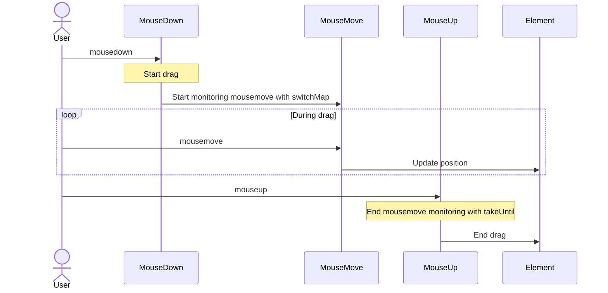

# UI Event Handling Patterns

UI event handling is one of the most frequently encountered challenges in frontend development. Using RxJS allows you to implement complex event handling declaratively and intuitively.

This article explains specific patterns for UI event handling needed in practical work, such as clicks, scrolls, drag & drop, and keyboard input.

## What You'll Learn in This Article

- Click event control (throttle, debounce, distinct)
- Efficient scroll event handling
- Drag & drop implementation
- Keyboard input and autocomplete
- Multi-touch support
- Combining composite events

> [!TIP] Prerequisites
> This article assumes knowledge from [Chapter 4: Operators](../operators/index.md). Understanding `debounceTime`, `throttleTime`, and `distinctUntilChanged` is especially important.

## Click Event Handling

### Problem: Excessive Processing from Rapid Clicking

When a button is clicked repeatedly, processing executes multiple times, causing performance issues and bugs.

### Solution 1: Control with throttleTime

Process only the first click within a certain period.

```typescript
import { fromEvent, throttleTime } from 'rxjs';
const button = document.createElement('button');
button.id = 'submit-button';
button.innerText = 'submit';
document.body.appendChild(button);

if (button) {
  fromEvent(button, 'click').pipe(
    throttleTime(1000) // Process only once per second
  ).subscribe(() => {
    console.log('Execute submission process');
    submitForm();
  });
}

function submitForm(): void {
  console.log('Submitting form...');
  // API call, etc.
}
```

#### Execution Flow

```
User clicks:        ●    ●●●        ●  ●●
                    |    |          |  |
throttleTime(1000): ●              ●
                    |              |
                Process        Process
```

> [!NOTE] throttleTime Characteristics
> - Processes the **first event** and ignores subsequent events for a certain period
> - Suitable when real-time responsiveness is important (scroll, resize, etc.)

### Solution 2: Control with debounceTime

Process a certain time after the event stops.

```typescript
import { fromEvent, debounceTime } from 'rxjs';
// Traditional approach (commented for reference)
// const searchInput = document.querySelector<HTMLInputElement>('#search');

// Self-contained: creates input dynamically
const searchInput = document.createElement('input');
searchInput.id = 'search';
searchInput.type = 'text';
searchInput.placeholder = 'Enter search keywords...';
searchInput.style.padding = '8px';
searchInput.style.margin = '10px';
searchInput.style.width = '300px';
document.body.appendChild(searchInput);

fromEvent(searchInput, 'input').pipe(
  debounceTime(300) // Wait 300ms after input stops
).subscribe((event) => {
  const value = (event.target as HTMLInputElement).value;
  console.log('Execute search:', value);
  performSearch(value);
});

function performSearch(query: string): void {
  console.log('Searching...', query);
  // Search API call
}
```

#### Execution Flow

```
User input:       ●●●●●     ●●        ●●●●
                      |            |      |
debounceTime(300):   300ms       300ms  300ms wait
                      |            |      |
                   Process      Process  Process
```

> [!NOTE] debounceTime Characteristics
> - Waits a certain time from the **last event** before processing
> - Suitable for search, autocomplete, real-time validation

### throttleTime vs debounceTime Usage

| Use Case | Operator to Use | Reason |
|-----|-------------------|------|
| **Search input** | `debounceTime` | Want to search after input stops |
| **Autocomplete** | `debounceTime` | Display candidates after input stops |
| **Scroll events** | `throttleTime` | Want periodic processing during scroll |
| **Window resize** | `throttleTime` or `debounceTime` | Depends on requirements |
| **Prevent button spam** | `throttleTime` or `exhaustMap` | Process first click immediately |

### Solution 3: Eliminate Duplicates with distinctUntilChanged

Compare with the previous value and skip processing if the same value continues.

```typescript
import { fromEvent, map, debounceTime, distinctUntilChanged } from 'rxjs';
const searchInput = document.createElement('input');
searchInput.id = 'search';
searchInput.type = 'text';
searchInput.placeholder = 'Enter search keywords...';
searchInput.style.padding = '8px';
searchInput.style.margin = '10px';
searchInput.style.width = '300px';
document.body.appendChild(searchInput);

fromEvent(searchInput, 'input').pipe(
  map(event => (event.target as HTMLInputElement).value.trim()),
  debounceTime(300),
  distinctUntilChanged() // Ignore if same as previous value
).subscribe(query => {
  console.log('Execute search:', query);
  performSearch(query);
});
```

#### Execution Example

```typescript
// User input: "RxJS" → Backspace → "RxJS"
// Without distinctUntilChanged: Search executes 2 times
// With distinctUntilChanged: Search executes only 1 time (2nd is skipped as same value)
```

> [!TIP] Best Practice
> For implementing search and autocomplete, it's recommended to use these three together:
> 1. `debounceTime()` - Wait for input to stop
> 2. `distinctUntilChanged()` - Eliminate duplicates
> 3. `switchMap()` - Cancel old requests

## Scroll Event Handling

### Problem: Excessive Scroll Event Firing

Scroll events fire very frequently, so processing them as-is causes performance issues.

### Solution: Throttle with throttleTime

```typescript
import { fromEvent, throttleTime, map } from 'rxjs';
const scrollContainer = document.createElement('div');
scrollContainer.id = 'scroll-container';
scrollContainer.style.width = '400px';
scrollContainer.style.height = '300px';
scrollContainer.style.overflow = 'auto';
scrollContainer.style.border = '1px solid #ccc';
scrollContainer.style.margin = '10px';
scrollContainer.style.padding = '10px';

// Add content to make it scrollable
scrollContainer.innerHTML = Array.from({ length: 100 }, (_, i) =>
  `<p>Item ${i + 1}</p>`
).join('');

document.body.appendChild(scrollContainer);

fromEvent(scrollContainer, 'scroll').pipe(
  throttleTime(100), // Process only once per 100ms
  map(() => ({
    scrollTop: scrollContainer.scrollTop,
    scrollHeight: scrollContainer.scrollHeight,
    clientHeight: scrollContainer.clientHeight
  }))
).subscribe(({ scrollTop, scrollHeight, clientHeight }) => {
  // Calculate scroll position
  const scrollPercentage = (scrollTop / (scrollHeight - clientHeight)) * 100;
  console.log(`Scroll position: ${scrollPercentage.toFixed(1)}%`);

  // Infinite scroll: Load next page when scrolled 90% or more
  if (scrollPercentage > 90) {
    console.log('Loading next page...');
    loadMoreItems();
  }
});

function loadMoreItems(): void {
  console.log('Fetch additional data');
}
```

### Practical Example: Detecting Scroll Direction

```typescript
import { fromEvent, BehaviorSubject, throttleTime, map, pairwise, distinctUntilChanged } from 'rxjs';
type ScrollDirection = 'up' | 'down' | 'none';

const scrollDirection$ = new BehaviorSubject<ScrollDirection>('none');

// Create header element dynamically
const header = document.createElement('div');
header.id = 'header';
header.innerText = 'Header (show/hide on scroll)';
header.style.position = 'fixed';
header.style.top = '0';
header.style.left = '0';
header.style.width = '100%';
header.style.padding = '20px';
header.style.background = '#333';
header.style.color = '#fff';
header.style.transition = 'transform 0.3s';
document.body.appendChild(header);

// Add scroll content
const scrollContent = document.createElement('div');
scrollContent.style.marginTop = '80px';
scrollContent.innerHTML = Array.from({ length: 100 }, (_, i) =>
  `<p>Content ${i + 1}</p>`
).join('');
document.body.appendChild(scrollContent);

fromEvent(window, 'scroll').pipe(
  throttleTime(100),
  map(() => window.scrollY),
  pairwise(), // Get previous and current values as pairs
  map(([prev, curr]) => {
    if (curr > prev) return 'down';
    if (curr < prev) return 'up';
    return 'none';
  }),
  distinctUntilChanged() // Notify only when direction changes
).subscribe(direction => {
  scrollDirection$.next(direction);
  console.log('Scroll direction:', direction);

  // Toggle header visibility
  if (direction === 'down') {
    header.style.transform = 'translateY(-100%)';
  } else if (direction === 'up') {
    header.style.transform = 'translateY(0)';
  }
});
```

> [!TIP] Utilizing pairwise
> `pairwise()` is a useful operator that can get previous and current values as pairs. It can be used for scroll direction, increase/decrease determination, difference calculation, etc.

## Drag & Drop Implementation

### Problem: Complex Combination of Mouse Events

Drag & drop is a complex combination of mousedown → mousemove → mouseup events.

### Solution: Combine Multiple Observables

```typescript
import { fromEvent, merge, map, switchMap, takeUntil, tap } from 'rxjs';
interface Position {
  x: number;
  y: number;
}

const draggableElement = document.createElement('div');
draggableElement.id = 'draggable';
draggableElement.innerText = 'Drag me';
draggableElement.style.position = 'absolute';
draggableElement.style.left = '100px';
draggableElement.style.top = '100px';
draggableElement.style.width = '150px';
draggableElement.style.height = '150px';
draggableElement.style.padding = '20px';
draggableElement.style.background = '#4CAF50';
draggableElement.style.color = '#fff';
draggableElement.style.cursor = 'move';
draggableElement.style.userSelect = 'none';
draggableElement.style.display = 'flex';
draggableElement.style.alignItems = 'center';
draggableElement.style.justifyContent = 'center';
document.body.appendChild(draggableElement);

const mouseDown$ = fromEvent<MouseEvent>(draggableElement, 'mousedown');
const mouseMove$ = fromEvent<MouseEvent>(document, 'mousemove');
const mouseUp$ = fromEvent<MouseEvent>(document, 'mouseup');

// Get element position at drag start
let initialX = 0;
let initialY = 0;

mouseDown$.pipe(
  tap((event: MouseEvent) => {
    event.preventDefault();
    // Record current element position
    const rect = draggableElement.getBoundingClientRect();
    initialX = rect.left;
    initialY = rect.top;

    // Difference from mouse position at drag start
    initialX = rect.left - event.clientX;
    initialY = rect.top - event.clientY;

    draggableElement.style.opacity = '0.7';
  }),
  switchMap(() =>
    // When mousedown occurs, start monitoring mousemove
    mouseMove$.pipe(
      map((event: MouseEvent): Position => ({
        x: event.clientX + initialX,
        y: event.clientY + initialY
      })),
      // End monitoring on mouseup or mouseleave
      takeUntil(
        merge(
          mouseUp$,
          fromEvent(document, 'mouseleave')
        ).pipe(
          tap(() => {
            draggableElement.style.opacity = '1';
          })
        )
      )
    )
  )
).subscribe((position: Position) => {
  // Move element
  draggableElement.style.left = `${position.x}px`;
  draggableElement.style.top = `${position.y}px`;
});
```

#### Event Flow



> [!IMPORTANT] Key Points for Drag & Drop
> - Start monitoring mousedown → mousemove with `switchMap`
> - End monitoring on mouseup with `takeUntil`
> - Disable default drag behavior with `preventDefault()`
> - Visual feedback with `classList.add/remove`

### Touch Device Support

```typescript
import { fromEvent, merge, map, switchMap, takeUntil, tap } from 'rxjs';
const draggableElement = document.createElement('div');
draggableElement.id = 'draggable';
draggableElement.innerText = 'Drag me\n(Mouse/Touch supported)';
draggableElement.style.position = 'absolute';
draggableElement.style.left = '100px';
draggableElement.style.top = '100px';
draggableElement.style.width = '150px';
draggableElement.style.height = '150px';
draggableElement.style.padding = '20px';
draggableElement.style.background = '#2196F3';
draggableElement.style.color = '#fff';
draggableElement.style.cursor = 'move';
draggableElement.style.userSelect = 'none';
draggableElement.style.display = 'flex';
draggableElement.style.alignItems = 'center';
draggableElement.style.justifyContent = 'center';
draggableElement.style.textAlign = 'center';
draggableElement.style.whiteSpace = 'pre-line';
document.body.appendChild(draggableElement);

// Integrate mouse and touch events
const start$ = merge(
  fromEvent<MouseEvent>(draggableElement, 'mousedown').pipe(
    map(e => ({ x: e.clientX, y: e.clientY, event: e }))
  ),
  fromEvent<TouchEvent>(draggableElement, 'touchstart').pipe(
    map(e => ({
      x: e.touches[0].clientX,
      y: e.touches[0].clientY,
      event: e
    }))
  )
);

const move$ = merge(
  fromEvent<MouseEvent>(document, 'mousemove').pipe(
    map(e => ({ x: e.clientX, y: e.clientY }))
  ),
  fromEvent<TouchEvent>(document, 'touchmove').pipe(
    map(e => ({
      x: e.touches[0].clientX,
      y: e.touches[0].clientY
    }))
  )
);

const end$ = merge(
  fromEvent(document, 'mouseup'),
  fromEvent(document, 'touchend')
);

let initialOffsetX = 0;
let initialOffsetY = 0;

start$.pipe(
  tap(({ x, y, event }) => {
    event.preventDefault();
    const rect = draggableElement.getBoundingClientRect();
    initialOffsetX = rect.left - x;
    initialOffsetY = rect.top - y;
    draggableElement.style.opacity = '0.7';
  }),
  switchMap(() =>
    move$.pipe(
      map(({ x, y }) => ({
        x: x + initialOffsetX,
        y: y + initialOffsetY
      })),
      takeUntil(
        end$.pipe(
          tap(() => {
            draggableElement.style.opacity = '1';
          })
        )
      )
    )
  )
).subscribe(({ x, y }) => {
  draggableElement.style.left = `${x}px`;
  draggableElement.style.top = `${y}px`;
});
```

> [!TIP] Multi-Device Support
> Using `merge` to integrate mouse and touch events allows you to implement drag & drop that works on PC/tablet/smartphone.

## Keyboard Input and Autocomplete

### Problem: Excessive API Calls During Input

When making API calls in response to keyboard input like search boxes, calling on every keystroke causes performance issues.

For example, when a user types "RxJS":
- `R` → API call
- `Rx` → API call
- `RxJ` → API call
- `RxJS` → API call

4 API calls for 4 characters input. This is wasteful and loads the server.

### Solution: debounceTime + switchMap

To efficiently implement autocomplete, combine these three operators:

1. **debounceTime(300)** - Wait 300ms after user stops typing
2. **distinctUntilChanged()** - Ignore if same as previous value (prevent wasteful requests)
3. **switchMap()** - Cancel old requests when new input arrives

With this combination, even if the user types "RxJS" quickly, the API is called only once after input stops.

```typescript
import { fromEvent, of, map, debounceTime, distinctUntilChanged, switchMap, catchError } from 'rxjs';
interface SearchResult {
  id: number;
  title: string;
  description: string;
}

const searchInput = document.createElement('input');
searchInput.id = 'search';
searchInput.type = 'text';
searchInput.placeholder = 'Autocomplete search...';
searchInput.style.padding = '10px';
searchInput.style.margin = '10px';
searchInput.style.width = '400px';
searchInput.style.fontSize = '16px';
document.body.appendChild(searchInput);

const resultsContainer = document.createElement('div');
resultsContainer.id = 'results';
resultsContainer.style.margin = '10px';
resultsContainer.style.padding = '10px';
resultsContainer.style.border = '1px solid #ddd';
resultsContainer.style.width = '400px';
resultsContainer.style.minHeight = '100px';
document.body.appendChild(resultsContainer);

fromEvent(searchInput, 'input').pipe(
  map(event => (event.target as HTMLInputElement).value.trim()),
  debounceTime(300),           // Wait 300ms after input stops
  distinctUntilChanged(),      // Ignore if same as previous value
  switchMap(query => {
    if (query.length < 2) {
      return of([]); // Empty array if less than 2 characters
    }

    console.log('Execute search:', query);
    return searchAPI(query).pipe(
      catchError(err => {
        console.error('Search error:', err);
        return of([]);
      })
    );
  })
).subscribe(results => {
  displayResults(results);
});

// Search API (mock)
function searchAPI(query: string) {
  return of([
    { id: 1, title: `Result 1: ${query}`, description: 'Description 1' },
    { id: 2, title: `Result 2: ${query}`, description: 'Description 2' },
    { id: 3, title: `Result 3: ${query}`, description: 'Description 3' }
  ]);
}

function displayResults(results: SearchResult[]): void {
  if (results.length === 0) {
    resultsContainer.innerHTML = '<p>No results found</p>';
    return;
  }

  resultsContainer.innerHTML = results
    .map(
      r => `
      <div class="result-item" style="padding: 10px; border-bottom: 1px solid #eee;">
        <h3 style="margin: 0 0 5px 0;">${r.title}</h3>
        <p style="margin: 0; color: #666;">${r.description}</p>
      </div>
    `
    )
    .join('');
}
```

> [!IMPORTANT] Importance of switchMap
> Without using `switchMap` and using `mergeMap` instead, old requests continue to execute. As a result, slow request results are displayed later, causing unnatural UI problems.
>
> - ❌ **mergeMap**: "Rx" (slow) → "RxJS" (fast) → "RxJS" result → "Rx" result (overwritten with old result)
> - ✅ **switchMap**: "Rx" (cancelled) → "RxJS" (executed) → Only "RxJS" result displayed

### Practical Example: Keyboard Shortcuts

```typescript
import { fromEvent, filter, map } from 'rxjs';
// Ctrl+S to save
fromEvent<KeyboardEvent>(document, 'keydown').pipe(
  filter(event => event.ctrlKey && event.key === 's'),
  map(event => {
    event.preventDefault();
    return event;
  })
).subscribe(() => {
  console.log('Execute save process');
  saveDocument();
});

// Ctrl+K to show command palette
fromEvent<KeyboardEvent>(document, 'keydown').pipe(
  filter(event => event.ctrlKey && event.key === 'k'),
  map(event => {
    event.preventDefault();
    return event;
  })
).subscribe(() => {
  console.log('Show command palette');
  showCommandPalette();
});

function saveDocument(): void {
  console.log('Saving document...');
}

function showCommandPalette(): void {
  console.log('Show command palette');
}
```

## Multi-Touch Support

### Problem: Pinch Zoom and Multi-Touch Gestures

Want to implement pinch zoom and multi-touch gestures on tablets and smartphones.

### Solution: Monitor touch Events

```typescript
import { fromEvent, map, pairwise } from 'rxjs';
const imageElement = document.createElement('img');
imageElement.id = 'zoomable-image';
imageElement.src = 'data:image/svg+xml,%3Csvg xmlns="http://www.w3.org/2000/svg" width="300" height="300"%3E%3Crect width="300" height="300" fill="%234CAF50"/%3E%3Ctext x="50%25" y="50%25" text-anchor="middle" dy=".3em" fill="white" font-size="20"%3EPinch Zoom%3C/text%3E%3C/svg%3E';
imageElement.style.width = '300px';
imageElement.style.height = '300px';
imageElement.style.margin = '20px';
imageElement.style.touchAction = 'none';
imageElement.style.userSelect = 'none';
imageElement.style.transition = 'transform 0.1s';
document.body.appendChild(imageElement);

let initialDistance = 0;
let currentScale = 1;

fromEvent<TouchEvent>(imageElement, 'touchstart').pipe(
  map(event => {
    if (event.touches.length === 2) {
      // Calculate distance between two points
      const touch1 = event.touches[0];
      const touch2 = event.touches[1];
      return getDistance(touch1, touch2);
    }
    return 0;
  })
).subscribe(distance => {
  initialDistance = distance;
});

fromEvent<TouchEvent>(imageElement, 'touchmove').pipe(
  map(event => {
    event.preventDefault();
    if (event.touches.length === 2) {
      const touch1 = event.touches[0];
      const touch2 = event.touches[1];
      return getDistance(touch1, touch2);
    }
    return 0;
  }),
  pairwise()
).subscribe(([prev, curr]) => {
  if (initialDistance > 0 && curr > 0) {
    // Change scale according to pinch amount
    const scaleDelta = curr / initialDistance;
    const newScale = currentScale * scaleDelta;

    // Limit scale range (0.5x to 3x)
    const clampedScale = Math.max(0.5, Math.min(3, newScale));

    imageElement.style.transform = `scale(${clampedScale})`;
  }
});

fromEvent<TouchEvent>(imageElement, 'touchend').subscribe(() => {
  // Record current scale
  const transform = imageElement.style.transform;
  const match = transform.match(/scale\(([^)]+)\)/);
  if (match) {
    currentScale = parseFloat(match[1]);
  }
});

// Calculate distance between two points
function getDistance(touch1: Touch, touch2: Touch): number {
  const dx = touch2.clientX - touch1.clientX;
  const dy = touch2.clientY - touch1.clientY;
  return Math.sqrt(dx * dx + dy * dy);
}
```

## Event Cleanup

### Problem: Prevent Memory Leaks

Not properly unsubscribing from event listeners causes memory leaks.

### Solution: Cleanup with takeUntil

```typescript
import { fromEvent, Subject, throttleTime, takeUntil } from 'rxjs';
class ScrollTracker {
  private destroy$ = new Subject<void>();

  init(): void {
    fromEvent(window, 'scroll').pipe(
      throttleTime(100),
      takeUntil(this.destroy$) // Auto-release on component destruction
    ).subscribe(() => {
      console.log('Scroll position:', window.scrollY);
    });

    fromEvent(window, 'resize').pipe(
      throttleTime(100),
      takeUntil(this.destroy$)
    ).subscribe(() => {
      console.log('Window size:', window.innerWidth, window.innerHeight);
    });
  }

  destroy(): void {
    this.destroy$.next();
    this.destroy$.complete();
    console.log('Unsubscribe all event listeners');
  }
}

// Usage example
const tracker = new ScrollTracker();
tracker.init();

// On page transition or component destruction
// tracker.destroy();
```

> [!IMPORTANT] Memory Leak Prevention
> - **Apply `takeUntil` to all event subscriptions**
> - **Fire `destroy$` on component destruction**
> - **Pay special attention to global events (window, document)**
> - **Don't forget `unsubscribe()` when explicitly managing Subscription**

## Practical UI Component Example

### Infinite Scroll Implementation

```typescript
import { fromEvent, of, throttleTime, map, filter, exhaustMap, catchError } from 'rxjs';
interface Item {
  id: number;
  title: string;
  content: string;
}

class InfiniteScroll {
  private page = 1;
  private loading = false;
  private hasMore = true;

  init(container: HTMLElement, itemsContainer: HTMLElement): void {
    fromEvent(container, 'scroll').pipe(
      throttleTime(200),
      map(() => {
        const scrollTop = container.scrollTop;
        const scrollHeight = container.scrollHeight;
        const clientHeight = container.clientHeight;
        return (scrollTop + clientHeight) / scrollHeight;
      }),
      filter(ratio => ratio > 0.9 && !this.loading && this.hasMore),
      exhaustMap(() => {
        this.loading = true;
        console.log(`Loading page ${this.page}...`);

        return this.loadMoreItems(this.page).pipe(
          catchError(err => {
            console.error('Loading error:', err);
            return of([]);
          })
        );
      })
    ).subscribe(items => {
      this.loading = false;

      if (items.length === 0) {
        this.hasMore = false;
        console.log('All items loaded');
        return;
      }

      this.page++;
      this.appendItems(itemsContainer, items);
    });
  }

  private loadMoreItems(page: number) {
    // Simulate API call
    return of(
      Array.from({ length: 10 }, (_, i) => ({
        id: (page - 1) * 10 + i + 1,
        title: `Item ${(page - 1) * 10 + i + 1}`,
        content: `This is the content of item ${(page - 1) * 10 + i + 1}`
      }))
    );
  }

  private appendItems(container: HTMLElement, items: Item[]): void {
    const html = items
      .map(
        item => `
        <div class="item">
          <h3>${item.title}</h3>
          <p>${item.content}</p>
        </div>
      `
      )
      .join('');

    container.insertAdjacentHTML('beforeend', html);
  }
}

// Usage example
const scrollContainer = document.createElement('div');
scrollContainer.id = 'scroll-container';
scrollContainer.style.width = '500px';
scrollContainer.style.height = '400px';
scrollContainer.style.overflow = 'auto';
scrollContainer.style.border = '2px solid #333';
scrollContainer.style.margin = '10px';
scrollContainer.style.padding = '10px';
document.body.appendChild(scrollContainer);

const itemsContainer = document.createElement('div');
itemsContainer.id = 'items';
scrollContainer.appendChild(itemsContainer);

// Add initial items
itemsContainer.innerHTML = Array.from({ length: 10 }, (_, i) => `
  <div class="item" style="padding: 15px; border-bottom: 1px solid #eee;">
    <h3 style="margin: 0 0 5px 0;">Item ${i + 1}</h3>
    <p style="margin: 0; color: #666;">This is the content of item ${i + 1}</p>
  </div>
`).join('');

const infiniteScroll = new InfiniteScroll();
infiniteScroll.init(scrollContainer, itemsContainer);
```

> [!TIP] Utilizing exhaustMap
> Using `exhaustMap` allows you to ignore new requests until the previous request completes. This prevents duplicate requests from rapid scrolling.

## Test Code

Example test for UI event handling.

```typescript
import { debounceTime, map } from 'rxjs';
import { TestScheduler } from 'rxjs/testing';

describe('UI Event Handling', () => {
  let testScheduler: TestScheduler;

  beforeEach(() => {
    testScheduler = new TestScheduler((actual, expected) => {
      expect(actual).toEqual(expected);
    });
  });

  it('debounceTime should delay events', () => {
    testScheduler.run(({ cold, expectObservable }) => {
      const input$ = cold('a-b-c----|', {
        a: 'A',
        b: 'B',
        c: 'C'
      });

      const result$ = input$.pipe(debounceTime(20, testScheduler));

      expectObservable(result$).toBe('-----c----|', { c: 'C' });
    });
  });

  it('should handle search input with debounce', () => {
    testScheduler.run(({ cold, expectObservable }) => {
      const input$ = cold('a-bc---d--|', {
        a: 'R',
        b: 'Rx',
        c: 'RxJ',
        d: 'RxJS'
      });

      const result$ = input$.pipe(
        debounceTime(20, testScheduler),
        map(query => `Search: ${query}`)
      );

      expectObservable(result$).toBe('------c---(d|)', {
        c: 'Search: RxJ',
        d: 'Search: RxJS'
      });
    });
  });
});
```

## Summary

Mastering UI event handling patterns allows you to provide interactive and comfortable user experiences.

> [!IMPORTANT] Key Points
> - **throttleTime**: Process only once per period (scroll, resize)
> - **debounceTime**: Process after event stops (search, autocomplete)
> - **distinctUntilChanged**: Eliminate duplicates (ignore same values)
> - **switchMap**: Complex event chains (drag & drop)
> - **takeUntil**: Reliable cleanup (prevent memory leaks)

> [!TIP] Best Practices
> - **Performance**: Prevent excessive processing with throttle/debounce
> - **Usability**: Set appropriate delay times (300ms, etc.)
> - **Accessibility**: Support keyboard operations too
> - **Multi-device**: Support both touch and mouse
> - **Cleanup**: Reliably release memory with `takeUntil`

## Next Steps

After mastering UI event handling patterns, proceed to the following patterns:

- [Form Handling](./form-handling.md) - Real-time validation, multiple field coordination
- [API Calls](./api-calls.md) - Integration of UI events and API calls
- [Real-time Data Processing](./real-time-data.md) - WebSocket, SSE
- [Caching Strategies](./caching-strategies.md) - Caching event data

## Related Sections

- [Chapter 4: Filtering Operators](../operators/filtering/) - Details on debounceTime, throttleTime
- [Chapter 4: Transformation Operators](../operators/transformation/) - Details on switchMap, exhaustMap
- [Chapter 2: Observable](../observables/what-is-observable.md) - Basics of fromEvent

## Reference Resources

- [RxJS Official: fromEvent](https://rxjs.dev/api/index/function/fromEvent) - Details on fromEvent()
- [MDN: Touch events](https://developer.mozilla.org/en-US/docs/Web/API/Touch_events) - How to use touch events
- [Learn RxJS: debounceTime](https://www.learnrxjs.io/learn-rxjs/operators/filtering/debouncetime) - Practical examples of debounceTime
