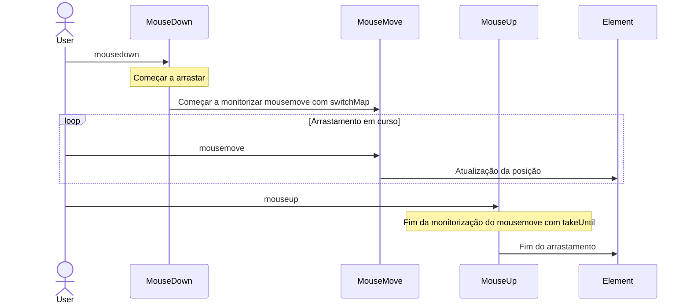
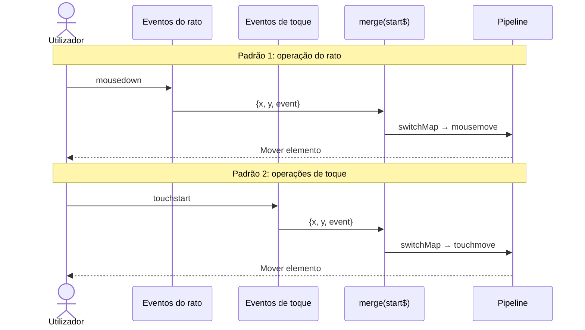

# Padrão de processamento de eventos da interface do usuário

O tratamento de eventos de interface do usuário é um dos desafios mais frequentes no desenvolvimento de front-end, e o RxJS permite implementar o tratamento de eventos complexos de forma declarativa e intuitiva.

Este artigo descreve padrões específicos de tratamento de eventos de UI que são necessários na prática, como clique, rolagem, arrastar e soltar e entrada de teclado.

## O que você aprenderá neste artigo.

- Controle de eventos de clique (acelerador, debounce, distinct)
- Manuseio eficiente de eventos de rolagem
- Implementação de arrastar e soltar
- Entrada de teclado e preenchimento automático
- Suporte multitoque
- Combinação de eventos compostos

```
Cliques do usuário: ●    ●●●        ●  ●●
                    |    |          |  |
throttleTime(1000): ●              ●
                    |              |
                   Execução do processamento      Execução do processamento
```

> Este artigo pressupõe o conhecimento do [Capítulo 4: Operadores](../operators/index.md) e pressupõe o conhecimento do seguinte. Em particular, é importante compreender os conceitos de `debounceTime`, `throttleTime` e `distinctUntilChanged`.

## Manipulação de eventos de clique.

### Problema: execução excessiva de processamento devido a uma série de cliques.

Cliques consecutivos em um botão podem resultar em processamento repetido, causando problemas de desempenho e bugs.

### Solução 1: controle com throttleTime

Processe somente o primeiro clique em um determinado período de tempo.


```typescript
import { fromEvent, throttleTime } from 'rxjs';
const button = document.createElement('button');
button.id = 'submit-button';
button.innerText = 'submit';
document.body.appendChild(button);

if (button) {
  fromEvent(button, 'click').pipe(
    throttleTime(1000) // 1Em um segundo.1Processado apenas uma vez
  ).subscribe(() => {
    console.log('Execução do processo de transmissão');
    submitForm();
  });
}

function submitForm(): void {
  console.log('Durante a transmissão do formulário...');
  // APIChamadas, etc.
}
```

#### Fluxo de execução

```
Cliques do usuário: ●    ●●●        ●  ●●
                    |    |          |  |
throttleTime(1000): ●              ●
                    |              |
                   Execução do processamento      Execução do processamento
```

> [!NOTE] Características de throttleTime
> - Processa o **primeiro evento** e ignora os eventos subsequentes por um período de tempo
> - Adequado quando o tempo real é importante (rolagem, redimensionamento, etc.)

### Solução 2: controle com debounceTime

Processar eventos após um determinado período de tempo depois que eles pararem.


```typescript
import { fromEvent, debounceTime } from 'rxjs';
// Traditional approach (commented for reference)
// const searchInput = document.querySelector<HTMLInputElement>('#search');

// Self-contained: creates input dynamically
const searchInput = document.createElement('input');
searchInput.id = 'search';
searchInput.type = 'text';
searchInput.placeholder = 'Inserção de palavras-chave de pesquisa...';
searchInput.style.padding = '8px';
searchInput.style.margin = '10px';
searchInput.style.width = '300px';
document.body.appendChild(searchInput);

fromEvent(searchInput, 'input').pipe(
  debounceTime(300) // Após a interrupção da entrada300msAguardar
).subscribe((event) => {
  const value = (event.target as HTMLInputElement).value;
  console.log('Execução da pesquisa:', value);
  performSearch(value);
});

function performSearch(query: string): void {
  console.log('Pesquisa em andamento...', query);
  // PesquisandoAPIRecuperar
}
```

#### Fluxo de execução

```
Entrada do usuário:  ●●●●●     ●●        ●●●●
                      |            |      |
debounceTime(300):   300ms       300ms  300ms Em espera
                      |            |      |
                     Processamento         Processamento   Execução do processamento
```

> [!NOTE] Características de debounceTime
> - Aguarde um determinado tempo após o **último evento** antes de processar
> - Adequado para pesquisa, preenchimento automático e validação em tempo real

### Como usar o throttleTime vs. debounceTime

| Caso de uso | Operador recomendado | Motivo |
|-----|-------------------|------|
| **Entrada de pesquisa** | `debounceTime` | Pesquisar após a parada da entrada |
| **Autocompletar** | `debounceTime` | Exibir candidatos após a parada da entrada |
| **Eventos de rolagem** | `throttleTime` | Processar periodicamente durante a rolagem |
| **Redimensionamento de janela** | `throttleTime` ou `debounceTime` | Depende dos requisitos |
| **Prevenção de cliques repetidos em botão** | `throttleTime` ou `exhaustMap` | Processar o primeiro clique imediatamente |

### Solução 3: deduplicação com distinctUntilChanged

Compare com o valor anterior e ignore o processamento se o mesmo valor for consecutivo.


```typescript
import { fromEvent, map, debounceTime, distinctUntilChanged } from 'rxjs';
const searchInput = document.createElement('input');
searchInput.id = 'search';
searchInput.type = 'text';
searchInput.placeholder = 'Inserção de palavras-chave de pesquisa...';
searchInput.style.padding = '8px';
searchInput.style.margin = '10px';
searchInput.style.width = '300px';
document.body.appendChild(searchInput);

fromEvent(searchInput, 'input').pipe(
  map(event => (event.target as HTMLInputElement).value.trim()),
  debounceTime(300),
  distinctUntilChanged() // Ignorado se o valor for o mesmo da última vez
).subscribe(query => {
  console.log('Execução da pesquisa:', query);
  performSearch(query);
});
```

#### Exemplo de execução

```typescript
// Entrada do usuário: "RxJS" → Backspace → "RxJS"
// distinctUntilChangedNenhum: 2Executar pesquisa uma vez
// distinctUntilChangedSim, se o valor for o mesmo que o anterior.: 1Executar a pesquisa apenas uma vez (mesmo valor, pular a segunda pesquisa)2A segunda busca é ignorada)
```

> [!TIP] ベストプラクティス

> Nas implementações de pesquisa e autocompletar, é recomendável usar os três conjuntos a seguir.
> 1. `debounceTime()` - espera pela parada da entrada.
> 2. `distinctUntilChanged()` - desduplicação
> 3. `switchMap()` - cancelar solicitações antigas

## Tratamento de eventos de rolagem

### Problema: disparo excessivo de eventos de rolagem

Os eventos de rolagem são disparados com muita frequência e podem causar problemas de desempenho se forem tratados como estão.

### Solução: reduza a frequência com o throttleTime.

```typescript
import { fromEvent, throttleTime, map } from 'rxjs';
const scrollContainer = document.createElement('div');
scrollContainer.id = 'scroll-container';
scrollContainer.style.width = '400px';
scrollContainer.style.height = '300px';
scrollContainer.style.overflow = 'auto';
scrollContainer.style.border = '1px solid #ccc';
scrollContainer.style.margin = '10px';
scrollContainer.style.padding = '10px';

// Add content to make it scrollable
scrollContainer.innerHTML = Array.from({ length: 100 }, (_, i) =>
  `<p>Item ${i + 1}</p>`
).join('');

document.body.appendChild(scrollContainer);

fromEvent(scrollContainer, 'scroll').pipe(
  throttleTime(100), // 100mspara1Processado apenas uma vez
  map(() => ({
    scrollTop: scrollContainer.scrollTop,
    scrollHeight: scrollContainer.scrollHeight,
    clientHeight: scrollContainer.clientHeight
  }))
).subscribe(({ scrollTop, scrollHeight, clientHeight }) => {
  // Cálculo da posição de rolagem
  const scrollPercentage = (scrollTop / (scrollHeight - clientHeight)) * 100;
  console.log(`Posição de rolagem: ${scrollPercentage.toFixed(1)}%`);

  // Rolagem infinita: 90%Carregar a próxima página depois de rolar mais de
  if (scrollPercentage > 90) {
    console.log('Carregamento da próxima página...');
    loadMoreItems();
  }
});

function loadMoreItems(): void {
  console.log('Aquisição de dados adicionais');
}
```

### Exemplo prático: detecção da direção da rolagem

```typescript
import { fromEvent, BehaviorSubject, throttleTime, map, pairwise, distinctUntilChanged } from 'rxjs';
type ScrollDirection = 'up' | 'down' | 'none';

const scrollDirection$ = new BehaviorSubject<ScrollDirection>('none');

// Create header element dynamically
const header = document.createElement('div');
header.id = 'header';
header.innerText = 'Cabeçalho (rolar para mostrar)/(oculto)';
header.style.position = 'fixed';
header.style.top = '0';
header.style.left = '0';
header.style.width = '100%';
header.style.padding = '20px';
header.style.background = '#333';
header.style.color = '#fff';
header.style.transition = 'transform 0.3s';
document.body.appendChild(header);

// Add scroll content
const scrollContent = document.createElement('div');
scrollContent.style.marginTop = '80px';
scrollContent.innerHTML = Array.from({ length: 100 }, (_, i) =>
  `<p>Conteúdo ${i + 1}</p>`
).join('');
document.body.appendChild(scrollContent);

fromEvent(window, 'scroll').pipe(
  throttleTime(100),
  map(() => window.scrollY),
  pairwise(), // Obter valores anteriores e atuais em pares
  map(([prev, curr]) => {
    if (curr > prev) return 'down';
    if (curr < prev) return 'up';
    return 'none';
  }),
  distinctUntilChanged() // Notificação somente quando a direção muda
).subscribe(direction => {
  scrollDirection$.next(direction);
  console.log('Direção de rolagem:', direction);

  // Mostra o cabeçalho/Alternar entre oculto e visível
  if (direction === 'down') {
    header.style.transform = 'translateY(-100%)';
  } else if (direction === 'up') {
    header.style.transform = 'translateY(0)';
  }
});
```

```typescript
import { fromEvent, debounceTime } from 'rxjs';
// Traditional approach (commented for reference)
// const searchInput = document.querySelector<HTMLInputElement>('#search');

// Self-contained: creates input dynamically
const searchInput = document.createElement('input');
searchInput.id = 'search';
searchInput.type = 'text';
searchInput.placeholder = 'Inserção de palavras-chave de pesquisa...';
searchInput.style.padding = '8px';
searchInput.style.margin = '10px';
searchInput.style.width = '300px';
document.body.appendChild(searchInput);

fromEvent(searchInput, 'input').pipe(
  debounceTime(300) // Após a interrupção da entrada300msAguardar
).subscribe((event) => {
  const value = (event.target as HTMLInputElement).value;
  console.log('Execução da pesquisa:', value);
  performSearch(value);
});

function performSearch(query: string): void {
  console.log('Pesquisa em andamento...', query);
  // PesquisandoAPIRecuperar
}
```

> `pairwise()` é um operador conveniente que permite obter os valores anteriores e atuais em pares. Ele pode ser usado para determinar a direção da rolagem, aumentar/diminuir valores e calcular diferenças.

## Implementação de arrastar e soltar

### Problema: combinações complexas de eventos do mouse

Arrastar e soltar é uma combinação complexa de eventos mousedown → mousemove → mouseup.

### Solução: combinar vários Observable.


```typescript
import { fromEvent, merge, map, switchMap, takeUntil, tap } from 'rxjs';
interface Position {
  x: number;
  y: number;
}

const draggableElement = document.createElement('div');
draggableElement.id = 'draggable';
draggableElement.innerText = 'Arrastar.';
draggableElement.style.position = 'absolute';
draggableElement.style.left = '100px';
draggableElement.style.top = '100px';
draggableElement.style.width = '150px';
draggableElement.style.height = '150px';
draggableElement.style.padding = '20px';
draggableElement.style.background = '#4CAF50';
draggableElement.style.color = '#fff';
draggableElement.style.cursor = 'move';
draggableElement.style.userSelect = 'none';
draggableElement.style.display = 'flex';
draggableElement.style.alignItems = 'center';
draggableElement.style.justifyContent = 'center';
document.body.appendChild(draggableElement);

const mouseDown$ = fromEvent<MouseEvent>(draggableElement, 'mousedown');
const mouseMove$ = fromEvent<MouseEvent>(document, 'mousemove');
const mouseUp$ = fromEvent<MouseEvent>(document, 'mouseup');

// Obtém a posição do elemento no início do arrasto
let initialX = 0;
let initialY = 0;

mouseDown$.pipe(
  tap((event: MouseEvent) => {
    event.preventDefault();
    // Registra a posição atual do elemento
    const rect = draggableElement.getBoundingClientRect();
    initialX = rect.left;
    initialY = rect.top;

    // Diferença da posição do mouse no início do arrasto
    initialX = rect.left - event.clientX;
    initialY = rect.top - event.clientY;

    draggableElement.style.opacity = '0.7';
  }),
  switchMap(() =>
    // mousedownQuando,mousemoveComeça a monitorar o
    mouseMove$.pipe(
      map((event: MouseEvent): Position => ({
        x: event.clientX + initialX,
        y: event.clientY + initialY
      })),
      // mouseupoumouseleavepara encerrar o monitoramento
      takeUntil(
        merge(
          mouseUp$,
          fromEvent(document, 'mouseleave')
        ).pipe(
          tap(() => {
            draggableElement.style.opacity = '1';
          })
        )
      )
    )
  )
).subscribe((position: Position) => {
  // Mover elemento
  draggableElement.style.left = `${position.x}px`;
  draggableElement.style.top = `${position.y}px`;
});
```

#### Fluxo de eventos


```mermaid
sequenceDiagram
    actor User
    participant MouseDown
    participant MouseMove
    participant MouseUp
    participant Element

    User->>MouseDown: mousedown
    Note over MouseDown: Começar a arrastar
    MouseDown->>MouseMove: Começar a monitorizar mousemove com switchMap

    loop Arrastamento em curso
        User->>MouseMove: mousemove
        MouseMove->>Element: Atualização da posição
    end

    User->>MouseUp: mouseup
    Note over MouseUp: Fim da monitorização do mousemove com takeUntil
    MouseUp->>Element: Fim do arrastamento
```

> [!IMPORTANT] Pontos importantes para arrastar e largar
> - Iniciar a monitorização de mousedown → mousemove com `switchMap`
> - Terminar a monitorização ao mouseup com `takeUntil`
> - Desativar o comportamento de arrastamento predefinido com `preventDefault()`
> - Feedback visual com `classList.add/remove`

### Suporte para dispositivos tácteis

```typescript
import { fromEvent, merge, map, switchMap, takeUntil, tap } from 'rxjs';
const draggableElement = document.createElement('div');
draggableElement.id = 'draggable';
draggableElement.innerText = 'Arrastar.\n(Suporte para rato e toque)';
draggableElement.style.position = 'absolute';
draggableElement.style.left = '100px';
draggableElement.style.top = '100px';
draggableElement.style.width = '150px';
draggableElement.style.height = '150px';
draggableElement.style.padding = '20px';
draggableElement.style.background = '#2196F3';
draggableElement.style.color = '#fff';
draggableElement.style.cursor = 'move';
draggableElement.style.userSelect = 'none';
draggableElement.style.display = 'flex';
draggableElement.style.alignItems = 'center';
draggableElement.style.justifyContent = 'center';
draggableElement.style.textAlign = 'center';
draggableElement.style.whiteSpace = 'pre-line';
document.body.appendChild(draggableElement);

// Integração de eventos de rato e de toque
const start$ = merge(
  fromEvent<MouseEvent>(draggableElement, 'mousedown').pipe(
    map(e => ({ x: e.clientX, y: e.clientY, event: e }))
  ),
  fromEvent<TouchEvent>(draggableElement, 'touchstart').pipe(
    map(e => ({
      x: e.touches[0].clientX,
      y: e.touches[0].clientY,
      event: e
    }))
  )
);

const move$ = merge(
  fromEvent<MouseEvent>(document, 'mousemove').pipe(
    map(e => ({ x: e.clientX, y: e.clientY }))
  ),
  fromEvent<TouchEvent>(document, 'touchmove').pipe(
    map(e => ({
      x: e.touches[0].clientX,
      y: e.touches[0].clientY
    }))
  )
);

const end$ = merge(
  fromEvent(document, 'mouseup'),
  fromEvent(document, 'touchend')
);

let initialOffsetX = 0;
let initialOffsetY = 0;

start$.pipe(
  tap(({ x, y, event }) => {
    event.preventDefault();
    const rect = draggableElement.getBoundingClientRect();
    initialOffsetX = rect.left - x;
    initialOffsetY = rect.top - y;
    draggableElement.style.opacity = '0.7';
  }),
  switchMap(() =>
    move$.pipe(
      map(({ x, y }) => ({
        x: x + initialOffsetX,
        y: y + initialOffsetY
      })),
      takeUntil(
        end$.pipe(
          tap(() => {
            draggableElement.style.opacity = '1';
          })
        )
      )
    )
  )
).subscribe(({ x, y }) => {
  draggableElement.style.left = `${x}px`;
  draggableElement.style.top = `${y}px`;
});
```

> [!TIP] Suporte para vários dispositivos
> Ao utilizar `merge` para integrar eventos de rato e toque, pode implementar arrastar e largar que funciona em todos os PCs/tablets/smartphones.

#### Comparação de fluxos de eventos


```mermaid
sequenceDiagram
    actor User as Utilizador
    participant Mouse as Eventos do rato
    participant Touch as Eventos de toque
    participant Merge as merge(start$)
    participant Pipeline as Pipeline

    Note over User,Pipeline: Padrão 1: operação do rato
    User->>Mouse: mousedown
    Mouse->>Merge: {x, y, event}
    Merge->>Pipeline: switchMap → mousemove
    Pipeline-->>User: Mover elemento

    Note over User,Pipeline: Padrão 2: operações de toque
    User->>Touch: touchstart
    Touch->>Merge: {x, y, event}
    Merge->>Pipeline: switchMap → touchmove
    Pipeline-->>User: Mover elemento
```

Este diagrama de sequência mostra como os eventos de rato e de toque são integrados no mesmo pipeline e funcionam da mesma forma em ambos os dispositivos.

## Entrada de teclado e preenchimento automático

### Problema: chamadas excessivas à API durante a escrita

Quando as chamadas à API são efectuadas em resposta à introdução do teclado, por exemplo, caixas de pesquisa, chamá-las sempre pode ser um problema de desempenho.

Por exemplo, se um utilizador escrever "RxJS":
- `R` → chamada API
- `Rx` → chamada API
- `RxJ` → chamada API
- `RxJS` → chamada API

4 caracteres, a API será chamada quatro vezes. Isto é um desperdício e sobrecarrega o servidor.

### Solução: debounceTime + switchMap

Para implementar o preenchimento automático de forma eficiente, combine os três operadores seguintes:

1. **debounceTime(300)** - espera 300ms depois de o utilizador parar de introduzir dados
2. **distinctUntilChanged()** - ignora se o valor é o mesmo da última vez (evita pedidos desnecessários)
3. **switchMap()** - cancela o pedido antigo se for recebida uma nova entrada

Com esta combinação, a API é chamada apenas uma vez depois de o utilizador parar de introduzir dados, mesmo que o utilizador introduza rapidamente "RxJS".

```typescript
import { fromEvent, of, map, debounceTime, distinctUntilChanged, switchMap, catchError } from 'rxjs';
interface SearchResult {
  id: number;
  title: string;
  description: string;
}

const searchInput = document.createElement('input');
searchInput.id = 'search';
searchInput.type = 'text';
searchInput.placeholder = 'Pesquisa de preenchimento automático...';
searchInput.style.padding = '10px';
searchInput.style.margin = '10px';
searchInput.style.width = '400px';
searchInput.style.fontSize = '16px';
document.body.appendChild(searchInput);

const resultsContainer = document.createElement('div');
resultsContainer.id = 'results';
resultsContainer.style.margin = '10px';
resultsContainer.style.padding = '10px';
resultsContainer.style.border = '1px solid #ddd';
resultsContainer.style.width = '400px';
resultsContainer.style.minHeight = '100px';
document.body.appendChild(resultsContainer);

fromEvent(searchInput, 'input').pipe(
  map(event => (event.target as HTMLInputElement).value.trim()),
  debounceTime(300),           // Espera 300 ms após a paragem da introdução
  distinctUntilChanged(),      // Ignorado se o valor for o mesmo da última vez
  switchMap(query => {
    if (query.length < 2) {
      return of([]); // Matriz vazia se tiver menos de 2 caracteres
    }

    console.log('Execução da pesquisa:', query);
    return searchAPI(query).pipe(
      catchError(err => {
        console.error('Erro de pesquisa:', err);
        return of([]);
      })
    );
  })
).subscribe(results => {
  displayResults(results);
});

// API de pesquisa (simulação)
function searchAPI(query: string) {
  return of([
    { id: 1, title: `Resultado 1: ${query}`, description: 'Descrição 1' },
    { id: 2, title: `Resultado 2: ${query}`, description: 'Descrição 2' },
    { id: 3, title: `Resultado 3: ${query}`, description: 'Descrição 3' }
  ]);
}

function displayResults(results: SearchResult[]): void {
  if (results.length === 0) {
    resultsContainer.innerHTML = '<p>Nenhum resultado encontrado</p>';
    return;
  }

  resultsContainer.innerHTML = results
    .map(
      r => `
      <div class="result-item" style="padding: 10px; border-bottom: 1px solid #eee;">
        <h3 style="margin: 0 0 5px 0;">${r.title}</h3>
        <p style="margin: 0; color: #666;">${r.description}</p>
      </div>
    `
    )
    .join('');
}
```

#### Explicação pormenorizada do funcionamento

Este é um exemplo concreto para ilustrar o funcionamento de cada passo deste código.

**Cronologia de um utilizador que escreve rapidamente "RxJS":**

```
Tempo | Evento                | Processamento do pipeline
------|------------------------|---------------------------
0ms   | Entrada 'R'            | debounceTime início da espera
50ms  | Entrada 'Rx'           | Espera anterior cancelada, nova espera iniciada
100ms | Entrada 'RxJ'          | Espera anterior cancelada, nova espera iniciada
150ms | Entrada 'RxJS'         | Espera anterior cancelada, nova espera iniciada
450ms | (300 ms decorridos)    | distinctUntilChanged → switchMap → chamada API
```

#### Papel de cada operador

1. **debounceTime(300)**
   - Continua a aguardar enquanto os eventos de entrada continuam
   - Descarrega os valores após terem decorrido 300 ms desde que a entrada foi interrompida
   - Resultado: não ocorre nenhuma chamada API durante a digitação rápida

2. **distinctUntilChanged()**
   - Compara o valor com o valor imediatamente anterior e ignora-o se o valor for o mesmo
   - Exemplo: Se for introduzido "abc" → (apagar) → "abc", o segundo "abc" não é processado
   - Resultado: evita chamadas desnecessárias à API

3. **switchMap()**
   - Quando chega uma nova consulta de pesquisa, o pedido antigo que está a ser executado é cancelado
   - Exemplo: se chegar uma pesquisa por "RxJS" enquanto se pesquisa por "Rx", o pedido de "Rx" é cancelado
   - Resultado: apenas os resultados mais recentes da pesquisa são sempre apresentados

> [!IMPORTANT] Importância do switchMap
> Se utilizar `mergeMap` em vez de `switchMap`, os pedidos mais antigos continuarão a ser executados tal como estão. Como resultado, os resultados dos pedidos mais lentos são apresentados mais tarde, o que leva a problemas com uma IU não natural.
>
> - ❌ **mergeMap**: 'Rx' (lento) → 'RxJS' (rápido) → resultados 'RxJS' → resultados 'Rx' (substituídos por resultados antigos)
> - ✅ **switchMap**: "Rx" (cancelado) → "RxJS" (executado) → apenas os resultados "RxJS" são apresentados

#### Exemplo de execução

```typescript
// Entrada do utilizador: "R" → "Rx" → "RxJ" → "RxJS" (intervalos de 50ms)
//
// Saída (consola):
// (450ms depois)
// Execução da pesquisa: RxJS
//
// Chamada à API: apenas uma vez (4 caracteres introduzidos, mas apenas uma vez!)
```

### Exemplo prático: atalho de teclado

```typescript
import { fromEvent, filter, map } from 'rxjs';
// Ctrl+S para guardar
fromEvent<KeyboardEvent>(document, 'keydown').pipe(
  filter(event => event.ctrlKey && event.key === 's'),
  map(event => {
    event.preventDefault();
    return event;
  })
).subscribe(() => {
  console.log('Processo de guardar executado');
  saveDocument();
});

// Ctrl+K para mostrar a paleta de comandos
fromEvent<KeyboardEvent>(document, 'keydown').pipe(
  filter(event => event.ctrlKey && event.key === 'k'),
  map(event => {
    event.preventDefault();
    return event;
  })
).subscribe(() => {
  console.log('Apresentação da paleta de comandos');
  showCommandPalette();
});

function saveDocument(): void {
  console.log('A guardar documento...');
}

function showCommandPalette(): void {
  console.log('Apresentação da paleta de comandos');
}
```

### Combinações múltiplas de teclas

```typescript
import { fromEvent, buffer, debounceTime, map, filter } from 'rxjs';
// Escape duplo para fechar o modal
const keydown$ = fromEvent<KeyboardEvent>(document, 'keydown');

keydown$.pipe(
  filter(event => event.key === 'Escape'),
  buffer(keydown$.pipe(debounceTime(300))), // Consolidar entradas contínuas dentro de 300 ms
  filter(events => events.length >= 2), // Premir duas ou mais vezes
  map(() => true)
).subscribe(() => {
  console.log('Fechar modal com duplo Escape');
  closeAllModals();
});

function closeAllModals(): void {
  console.log('Fechar todos os modais');
}
```

> [!TIP] Melhores práticas de atalhos de teclado
> - Impedir o comportamento predefinido com `preventDefault()`
> - Utilizar `event.ctrlKey`, `event.shiftKey`, `event.altKey` para determinar as teclas modificadoras
> - Processar apenas determinadas teclas com `filter`
> - Dar prioridade aos atalhos de fácil utilização (por exemplo, Ctrl+S)

## Suporte multi-toque

### Problema: gestos de pinch-zoom e multi-toque

Queremos implementar o zoom de pinça e os gestos multi-toque em tablets e smartphones.

### Solução: monitorização de eventos de toque

```typescript
import { fromEvent, map, pairwise } from 'rxjs';
const imageElement = document.createElement('img');
imageElement.id = 'zoomable-image';
imageElement.src = 'data:image/svg+xml,%3Csvg xmlns="http://www.w3.org/2000/svg" width="300" height="300"%3E%3Crect width="300" height="300" fill="%234CAF50"/%3E%3Ctext x="50%25" y="50%25" text-anchor="middle" dy=".3em" fill="white" font-size="20"%3EPinçar o zoom%3C/text%3E%3C/svg%3E';
imageElement.style.width = '300px';
imageElement.style.height = '300px';
imageElement.style.margin = '20px';
imageElement.style.touchAction = 'none';
imageElement.style.userSelect = 'none';
imageElement.style.transition = 'transform 0.1s';
document.body.appendChild(imageElement);

let initialDistance = 0;
let currentScale = 1;

fromEvent<TouchEvent>(imageElement, 'touchstart').pipe(
  map(event => {
    if (event.touches.length === 2) {
      // Calcular a distância entre os dois pontos
      const touch1 = event.touches[0];
      const touch2 = event.touches[1];
      return getDistance(touch1, touch2);
    }
    return 0;
  })
).subscribe(distance => {
  initialDistance = distance;
});

fromEvent<TouchEvent>(imageElement, 'touchmove').pipe(
  map(event => {
    event.preventDefault();
    if (event.touches.length === 2) {
      const touch1 = event.touches[0];
      const touch2 = event.touches[1];
      return getDistance(touch1, touch2);
    }
    return 0;
  }),
  pairwise()
).subscribe(([prev, curr]) => {
  if (initialDistance > 0 && curr > 0) {
    // Mudar a escala em função da quantidade de pinça
    const scaleDelta = curr / initialDistance;
    const newScale = currentScale * scaleDelta;

    // Limitar a escala (0.5x ~ 3x)
    const clampedScale = Math.max(0.5, Math.min(3, newScale));

    imageElement.style.transform = `scale(${clampedScale})`;
  }
});

fromEvent<TouchEvent>(imageElement, 'touchend').subscribe(() => {
  // Registar a escala atual
  const transform = imageElement.style.transform;
  const match = transform.match(/scale\(([^)]+)\)/);
  if (match) {
    currentScale = parseFloat(match[1]);
  }
});

// Calcular a distância entre dois pontos
function getDistance(touch1: Touch, touch2: Touch): number {
  const dx = touch2.clientX - touch1.clientX;
  const dy = touch2.clientY - touch1.clientY;
  return Math.sqrt(dx * dx + dy * dy);
}
```

> [!NOTE] Pontos de implementação para o zoom de pinça
> - Determinar o toque de dois dedos com `touches.length === 2`
> - Registar a distância inicial com `touchstart`
> - Calcular a distância atual com `touchmove` e atualizar a escala
> - Calcular a diferença da última vez com `pairwise()`
> - Limitar o alcance da escala para melhorar a usabilidade

## Padrões de eventos compostos

### Exemplo prático: deteção de pressão longa

```typescript
import { fromEvent, race, timer, switchMap, takeUntil, tap } from 'rxjs';
const button = document.createElement('button');
button.id = 'long-press-button';
button.innerText = 'Pressão longa.';
button.style.padding = '15px 30px';
button.style.margin = '10px';
button.style.fontSize = '16px';
button.style.cursor = 'pointer';
document.body.appendChild(button);

const mouseDown$ = fromEvent(button, 'mousedown');
const mouseUp$ = fromEvent(document, 'mouseup');

mouseDown$.pipe(
  switchMap(() =>
    // Esperar 500ms ou correr para obter um mouseup
    race(
      timer(500).pipe(
        tap(() => console.log('Deteção de pressão longa!'))
      ),
      mouseUp$.pipe(
        tap(() => console.log('Clique normal'))
      )
    ).pipe(
      takeUntil(mouseUp$)
    )
  )
).subscribe(() => {
  console.log('Evento concluído');
});
```

### Exemplo prático: deteção de duplo clique

```typescript
import { fromEvent, buffer, debounceTime, map, filter } from 'rxjs';
const element = document.createElement('div');
element.id = 'double-click-target';
element.innerText = 'Duplo clique!';
element.style.padding = '40px';
element.style.margin = '10px';
element.style.background = '#FF9800';
element.style.color = '#fff';
element.style.cursor = 'pointer';
element.style.userSelect = 'none';
element.style.display = 'inline-block';
document.body.appendChild(element);

const click$ = fromEvent(element, 'click');

click$.pipe(
  buffer(click$.pipe(debounceTime(250))), // Resumir os cliques num intervalo de 250 ms
  map(clicks => clicks.length),
  filter(count => count === 2) // Apenas duplo clique
).subscribe(() => {
  console.log('Deteção de duplo clique!');
  handleDoubleClick();
});

function handleDoubleClick(): void {
  console.log('Processamento de duplo clique');
}
```

### Exemplo prático: visualização do atraso de passagem do rato

```typescript
import { fromEvent, timer, switchMap, takeUntil, map } from 'rxjs';
// Traditional approach (commented for reference)
// const tooltip = document.querySelector<HTMLElement>('#tooltip');
// const target = document.querySelector<HTMLElement>('#hover-target');

// Self-contained: creates tooltip and target dynamically
const target = document.createElement('div');
target.id = 'hover-target';
target.innerText = 'Passar o rato.';
target.style.padding = '20px';
target.style.margin = '10px';
target.style.background = '#9C27B0';
target.style.color = '#fff';
target.style.display = 'inline-block';
target.style.cursor = 'pointer';
target.style.userSelect = 'none';
document.body.appendChild(target);

const tooltip = document.createElement('div');
tooltip.id = 'tooltip';
tooltip.innerText = 'Sugestão de ferramenta';
tooltip.style.position = 'absolute';
tooltip.style.padding = '10px';
tooltip.style.background = '#333';
tooltip.style.color = '#fff';
tooltip.style.borderRadius = '4px';
tooltip.style.display = 'none';
tooltip.style.pointerEvents = 'none';
tooltip.style.marginTop = '50px';
tooltip.style.marginLeft = '10px';
document.body.appendChild(tooltip);

const mouseEnter$ = fromEvent(target, 'mouseenter');
const mouseLeave$ = fromEvent(target, 'mouseleave');

mouseEnter$.pipe(
  switchMap(() =>
    // Aguardar 500 ms antes de apresentar a dica de ferramenta
    timer(500).pipe(
      map(() => true),
      takeUntil(mouseLeave$) // Cancelar quando o rato se afasta
    )
  )
).subscribe(() => {
  tooltip.style.display = 'block';
  console.log('Dica de ferramenta exibida');
});

mouseLeave$.subscribe(() => {
  tooltip.style.display = 'none';
  console.log('Tooltip oculto');
});
```

## Limpeza do evento

### Problema: evitar vazamentos de memória

A falha em cancelar corretamente a inscrição de ouvintes de eventos pode causar vazamentos de memória.

### Solução: limpar com takeUntil.

Cliques do usuário: ●    ●●●        ●  ●●
                    |    |          |  |
throttleTime(1000): ●              ●
                    |              |
                   Execução do processamento      Execução do processamento


```typescript
import { fromEvent, debounceTime } from 'rxjs';
// Traditional approach (commented for reference)
// const searchInput = document.querySelector<HTMLInputElement>('#search');

// Self-contained: creates input dynamically
const searchInput = document.createElement('input');
searchInput.id = 'search';
searchInput.type = 'text';
searchInput.placeholder = 'Inserção de palavras-chave de pesquisa...';
searchInput.style.padding = '8px';
searchInput.style.margin = '10px';
searchInput.style.width = '300px';
document.body.appendChild(searchInput);

fromEvent(searchInput, 'input').pipe(
  debounceTime(300) // Após a interrupção da entrada300msAguardar
).subscribe((event) => {
  const value = (event.target as HTMLInputElement).value;
  console.log('Execução da pesquisa:', value);
  performSearch(value);
});

function performSearch(query: string): void {
  console.log('Pesquisa em andamento...', query);
  // PesquisandoAPIRecuperar
}
```

> - **Aplicar o `takeUntil` a todas as assinaturas de eventos**
> - **Dispare `destroy$` na destruição do componente**
> - **Os eventos globais (window, document) precisam de cuidados especiais**
> - **Não se esqueça de `unsubscribe()` quando estiver gerenciando subscrições explicitamente**

## Exemplos práticos de componentes da interface do usuário

### Implementação de rolagem infinita

Cliques do usuário: ●    ●●●        ●  ●●
                    |    |          |  |
throttleTime(1000): ●              ●
                    |              |
                   Execução do processamento      Execução do processamento

> [!TIP] exhaustMapの活用

> O exhaustMap pode ser usado para ignorar novas solicitações até que a solicitação anterior seja concluída. Isso evita solicitações duplicadas devido a uma sequência de rolagem.

## Código de teste.

Exemplo de teste para manipulação de eventos da interface do usuário.

Cliques do usuário: ●    ●●●        ●  ●●
                    |    |          |  |
throttleTime(1000): ●              ●
                    |              |
                   Execução do processamento      Execução do processamento

## Resumo.

O domínio dos padrões de manipulação de eventos da interface do usuário pode proporcionar uma experiência de usuário interativa e agradável.


```typescript
import { fromEvent, debounceTime } from 'rxjs';
// Traditional approach (commented for reference)
// const searchInput = document.querySelector<HTMLInputElement>('#search');

// Self-contained: creates input dynamically
const searchInput = document.createElement('input');
searchInput.id = 'search';
searchInput.type = 'text';
searchInput.placeholder = 'Inserção de palavras-chave de pesquisa...';
searchInput.style.padding = '8px';
searchInput.style.margin = '10px';
searchInput.style.width = '300px';
document.body.appendChild(searchInput);

fromEvent(searchInput, 'input').pipe(
  debounceTime(300) // Após a interrupção da entrada300msAguardar
).subscribe((event) => {
  const value = (event.target as HTMLInputElement).value;
  console.log('Execução da pesquisa:', value);
  performSearch(value);
});

function performSearch(query: string): void {
  console.log('Pesquisa em andamento...', query);
  // PesquisandoAPIRecuperar
}
```

> - **throttleTime**: processado apenas uma vez em um determinado período de tempo (rolagem, redimensionamento)
> - **debounceTime**: processado após a interrupção do evento (pesquisa, autocompletar)
> - **distinctUntilChanged**: deduplicação (ignorar valores idênticos)
> - **switchMap**: cadeia de eventos complexa (arrastar e soltar)
> - **takeUntil**: limpeza confiável (evita vazamentos de memória)


```typescript
import { fromEvent, debounceTime } from 'rxjs';
// Traditional approach (commented for reference)
// const searchInput = document.querySelector<HTMLInputElement>('#search');

// Self-contained: creates input dynamically
const searchInput = document.createElement('input');
searchInput.id = 'search';
searchInput.type = 'text';
searchInput.placeholder = 'Inserção de palavras-chave de pesquisa...';
searchInput.style.padding = '8px';
searchInput.style.margin = '10px';
searchInput.style.width = '300px';
document.body.appendChild(searchInput);

fromEvent(searchInput, 'input').pipe(
  debounceTime(300) // Após a interrupção da entrada300msAguardar
).subscribe((event) => {
  const value = (event.target as HTMLInputElement).value;
  console.log('Execução da pesquisa:', value);
  performSearch(value);
});

function performSearch(query: string): void {
  console.log('Pesquisa em andamento...', query);
  // PesquisandoAPIRecuperar
}
```

> - **Desempenho**: aceleração/debounce para evitar o processamento excessivo
> - **Usabilidade**: defina tempos de atraso apropriados (por exemplo, 300 ms)
> - **Acessibilidade**: suporte à operação do teclado
> - **Multidispositivo**: suporte para toque e mouse
> - **Limpeza**: o takeUntil garante a liberação da memória

## Próximas etapas.

Depois de dominar o padrão de tratamento de eventos da interface do usuário, você poderá passar para os padrões a seguir.

- [form-handling](./form-handling.md) - validação em tempo real, integração de vários campos.
- [Chamadas de API](./api-calls.md) - integração de eventos da interface do usuário e chamadas de API
- processamento de dados em tempo real](./real-time-data.md)) - WebSocket, SSE.
- [estratégias de cache](./caching-strategies.md) - cache de dados de eventos

## Seções relacionadas.

- [Capítulo 4: Operadores de filtragem](../operators/filtering/) - debounceTime, throttleTime detalhes.
- [Capítulo 4: Operadores de transformação](../operators/transformation/) - mais sobre switchMap, exhaustMap
- Capítulo 2: Observable](../observables/what-is-observable.md)) - noções básicas de fromEvent

## Recursos de referência

- [RxJS official: fromEvent](https://rxjs.dev/api/index/function/fromEvent) - mais sobre fromEvent()
- [MDN: Touch events](https://developer.mozilla.org/ja/docs/Web/API/Touch_events) - Como usar eventos de toque.
- [Learn RxJS: debounceTime](https://www.learnrxjs.io/learn-rxjs/operators/filtering/debouncetime) - Exemplos práticos de debounceTime
